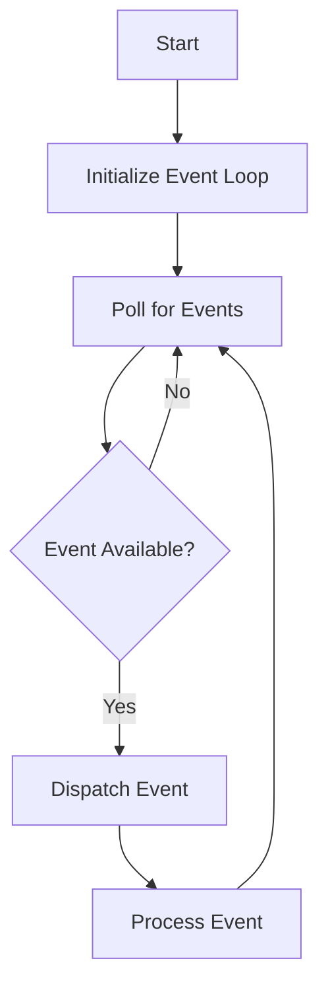

## 9.13. Implementing Event Loops

### Introduction

In the realm of systems programming, handling asynchronous events efficiently is crucial for building responsive and high-performance applications. Event loops are at the heart of this process, enabling programs to manage multiple tasks concurrently without the need for multithreading. In this section, we will delve into the concept of event loops, their significance in Rust, and how they are utilized in async runtimes like Tokio. We will also provide practical examples of building a simple event loop, discuss integration with OS-level event notifications, and highlight best practices and potential pitfalls.

### What is an Event Loop?

An event loop is a programming construct that waits for and dispatches events or messages in a program. It is a core component of asynchronous programming, allowing a program to handle I/O operations, timers, and other events without blocking the main execution thread. The event loop continuously checks for new events and processes them, enabling the program to remain responsive.

In Rust, event loops are particularly important due to the language's focus on safety and concurrency. By leveraging event loops, Rust programs can efficiently manage asynchronous tasks, making them ideal for network servers, GUI applications, and other systems that require high concurrency.

### Significance of Event Loops in Rust

Rust's ownership model and type system provide a strong foundation for building safe and efficient concurrent applications. Event loops complement these features by enabling non-blocking I/O operations and task scheduling. This is especially important in systems programming, where performance and resource management are critical.

Event loops in Rust are often used in conjunction with async runtimes like Tokio, which provide a framework for writing asynchronous code. Tokio's event loop is built on top of Rust's async/await syntax, allowing developers to write asynchronous code that is both readable and efficient.

### Building a Simple Event Loop

To understand how event loops work in Rust, let's build a simple event loop from scratch. This example will demonstrate the basic principles of event loop implementation, including event polling and dispatching.

```rust
use std::collections::VecDeque;
use std::thread;
use std::time::Duration;

// Define a simple event type
enum Event {
    Timer(u64),
    Message(String),
}

// A basic event loop implementation
struct EventLoop {
    events: VecDeque<Event>,
}

impl EventLoop {
    fn new() -> Self {
        EventLoop {
            events: VecDeque::new(),
        }
    }

    fn add_event(&mut self, event: Event) {
        self.events.push_back(event);
    }

    fn run(&mut self) {
        while let Some(event) = self.events.pop_front() {
            match event {
                Event::Timer(duration) => {
                    println!("Timer event: waiting for {} seconds", duration);
                    thread::sleep(Duration::from_secs(duration));
                }
                Event::Message(msg) => {
                    println!("Message event: {}", msg);
                }
            }
        }
    }
}

fn main() {
    let mut event_loop = EventLoop::new();
    event_loop.add_event(Event::Timer(2));
    event_loop.add_event(Event::Message("Hello, World!".to_string()));
    event_loop.run();
}
```

In this example, we define a simple `Event` enum with two variants: `Timer` and `Message`. The `EventLoop` struct maintains a queue of events and processes them in the `run` method. This basic implementation demonstrates the core concept of an event loop: polling for events and dispatching them based on their type.

### Event Loops in Async Runtimes: Tokio

Tokio is a popular async runtime in Rust that provides a powerful event loop for managing asynchronous tasks. It leverages Rust's async/await syntax to enable non-blocking I/O operations and task scheduling. Let's explore how Tokio's event loop works and how it can be used to build efficient asynchronous applications.

#### Tokio's Event Loop Architecture

Tokio's event loop is built on top of the `mio` library, which provides a low-level abstraction over OS-level event notifications. This allows Tokio to efficiently manage I/O operations and timers without blocking the main execution thread. The event loop continuously polls for new events and dispatches them to the appropriate tasks.

#### Using Tokio's Event Loop

To use Tokio's event loop, you need to define asynchronous tasks using the `async` keyword and execute them using the `tokio::main` macro. Here's an example of a simple asynchronous application using Tokio:

```rust
use tokio::time::{sleep, Duration};

#[tokio::main]
async fn main() {
    let task1 = async {
        println!("Task 1: Waiting for 2 seconds");
        sleep(Duration::from_secs(2)).await;
        println!("Task 1: Done");
    };

    let task2 = async {
        println!("Task 2: Waiting for 1 second");
        sleep(Duration::from_secs(1)).await;
        println!("Task 2: Done");
    };

    tokio::join!(task1, task2);
}
```

In this example, we define two asynchronous tasks using the `async` keyword. The `tokio::join!` macro is used to execute both tasks concurrently. Tokio's event loop manages the execution of these tasks, ensuring that they run efficiently without blocking the main thread.

### Integration with OS-Level Event Notifications

Event loops in Rust often integrate with OS-level event notification systems to efficiently manage I/O operations. This integration allows the event loop to receive notifications when I/O operations are ready to be processed, reducing the need for busy-waiting and improving performance.

#### Using `mio` for OS-Level Integration

The `mio` library provides a low-level abstraction over OS-level event notifications, making it a popular choice for building event loops in Rust. Here's an example of using `mio` to create an event loop that listens for I/O events:

```rust
use mio::{Events, Poll, Token, Interest};
use mio::net::TcpListener;
use std::io;

const SERVER: Token = Token(0);

fn main() -> io::Result<()> {
    let mut poll = Poll::new()?;
    let mut events = Events::with_capacity(128);

    let addr = "127.0.0.1:8080".parse().unwrap();
    let mut listener = TcpListener::bind(addr)?;

    poll.registry().register(&mut listener, SERVER, Interest::READABLE)?;

    loop {
        poll.poll(&mut events, None)?;

        for event in events.iter() {
            match event.token() {
                SERVER => {
                    let (mut stream, addr) = listener.accept()?;
                    println!("Accepted connection from {}", addr);
                    // Handle the connection
                }
                _ => unreachable!(),
            }
        }
    }
}
```

In this example, we use `mio` to create a `Poll` instance that listens for I/O events on a TCP listener. The event loop continuously polls for new events and processes them as they arrive. This integration with OS-level notifications allows the event loop to efficiently manage I/O operations without blocking.

### Best Practices and Potential Pitfalls

When implementing event loops in Rust, there are several best practices and potential pitfalls to consider:

- **Avoid Blocking Operations**: Ensure that all operations within the event loop are non-blocking to maintain responsiveness. Use asynchronous I/O and timers to avoid blocking the main thread.
- **Efficient Event Handling**: Design your event loop to handle events efficiently, minimizing the time spent processing each event. This may involve using data structures like priority queues or hash maps to manage events.
- **Error Handling**: Implement robust error handling within the event loop to gracefully handle unexpected conditions. This may involve using Rust's `Result` and `Option` types to manage errors.
- **Resource Management**: Carefully manage resources within the event loop to avoid memory leaks and resource exhaustion. Use Rust's ownership model to ensure that resources are properly cleaned up.
- **Concurrency Considerations**: Be mindful of concurrency issues when designing your event loop. Use synchronization primitives like `Mutex` and `RwLock` to manage shared state safely.

### Try It Yourself

To deepen your understanding of event loops in Rust, try modifying the examples provided in this section. Experiment with adding new event types, integrating with different I/O sources, or using different async runtimes like `async-std`. By experimenting with these concepts, you'll gain a deeper understanding of how event loops work and how they can be used to build efficient asynchronous applications.

### Visualizing Event Loop Architecture

To better understand the architecture of an event loop, let's visualize the flow of events and tasks within an event loop using a Mermaid.js diagram:



This diagram illustrates the basic flow of an event loop, where events are continuously polled and dispatched for processing. The loop repeats until there are no more events to process.

### Conclusion

Implementing event loops in Rust is a powerful technique for managing asynchronous events efficiently. By leveraging Rust's async/await syntax and integrating with async runtimes like Tokio, developers can build responsive and high-performance applications. Understanding the principles of event loops and their integration with OS-level event notifications is essential for mastering asynchronous programming in Rust.

### References and Further Reading

- [Tokio Documentation](https://tokio.rs/docs/)
- [Mio Documentation](https://docs.rs/mio/)
- [Rust Async Book](https://rust-lang.github.io/async-book/)
- [Asynchronous Programming in Rust](https://rust-lang.github.io/async-book/01_getting_started/01_chapter.html)

### Key Takeaways

- Event loops are essential for managing asynchronous events in Rust.
- Tokio provides a powerful event loop for building asynchronous applications.
- Integrating with OS-level event notifications improves performance.
- Follow best practices to avoid common pitfalls in event loop implementation.

## Quiz Time!



### What is the primary purpose of an event loop in Rust?

- [x] To handle asynchronous events efficiently
- [ ] To manage memory allocation
- [ ] To compile Rust code
- [ ] To provide a graphical user interface

> **Explanation:** Event loops are used to handle asynchronous events efficiently, allowing programs to manage multiple tasks concurrently without blocking the main execution thread.

### Which library does Tokio use for low-level event notifications?

- [x] mio
- [ ] hyper
- [ ] serde
- [ ] rayon

> **Explanation:** Tokio uses the `mio` library for low-level event notifications, providing an abstraction over OS-level event notifications.

### What is the role of the `tokio::main` macro?

- [x] To execute asynchronous tasks using Tokio's event loop
- [ ] To define a new Rust module
- [ ] To compile Rust code
- [ ] To manage memory allocation

> **Explanation:** The `tokio::main` macro is used to execute asynchronous tasks using Tokio's event loop, enabling non-blocking I/O operations and task scheduling.

### What is a potential pitfall when implementing event loops?

- [x] Blocking operations within the event loop
- [ ] Using too many threads
- [ ] Compiling Rust code
- [ ] Writing to a file

> **Explanation:** Blocking operations within the event loop can hinder responsiveness and should be avoided. Use asynchronous I/O and timers to prevent blocking the main thread.

### How can you integrate event loops with OS-level event notifications?

- [x] By using libraries like `mio`
- [ ] By using the `std` library
- [ ] By writing custom assembly code
- [ ] By using the `serde` library

> **Explanation:** Libraries like `mio` provide a low-level abstraction over OS-level event notifications, allowing event loops to efficiently manage I/O operations.

### What is the significance of non-blocking I/O in event loops?

- [x] It allows the program to remain responsive
- [ ] It increases memory usage
- [ ] It slows down the program
- [ ] It compiles the code faster

> **Explanation:** Non-blocking I/O allows the program to remain responsive by enabling the event loop to handle multiple tasks concurrently without blocking the main execution thread.

### Which of the following is a best practice for event loops?

- [x] Implement robust error handling
- [ ] Use blocking operations
- [ ] Avoid using async/await syntax
- [ ] Ignore resource management

> **Explanation:** Implementing robust error handling is a best practice for event loops, ensuring that unexpected conditions are handled gracefully.

### What is the purpose of the `tokio::join!` macro?

- [x] To execute multiple asynchronous tasks concurrently
- [ ] To define a new Rust module
- [ ] To compile Rust code
- [ ] To manage memory allocation

> **Explanation:** The `tokio::join!` macro is used to execute multiple asynchronous tasks concurrently, allowing them to run efficiently without blocking the main thread.

### Which of the following is a key takeaway from implementing event loops in Rust?

- [x] Event loops are essential for managing asynchronous events
- [ ] Event loops are used for memory allocation
- [ ] Event loops compile Rust code
- [ ] Event loops provide a graphical user interface

> **Explanation:** Event loops are essential for managing asynchronous events in Rust, enabling programs to handle multiple tasks concurrently without blocking the main execution thread.

### True or False: Event loops in Rust can only be used with the Tokio runtime.

- [ ] True
- [x] False

> **Explanation:** Event loops in Rust can be implemented using various async runtimes, not just Tokio. Other runtimes like `async-std` can also be used to build asynchronous applications.



Remember, mastering event loops in Rust is just the beginning of your journey into asynchronous programming. Keep experimenting, stay curious, and enjoy the process of building efficient and responsive applications!
