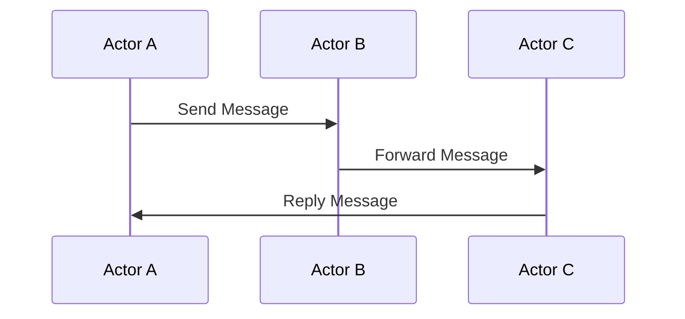

## 9.14. The Actor Model in Rust

Concurrency is a cornerstone of modern software development, and the Actor Model is a powerful paradigm for managing concurrent entities. In Rust, the Actor Model can be effectively implemented to manage state and behavior through message passing, leveraging Rust's unique features like ownership and borrowing to ensure safety and efficiency.

### Understanding the Actor Model

The Actor Model is a conceptual model that treats "actors" as the fundamental units of computation. Each actor can:

- **Receive messages**: Actors communicate with each other exclusively through message passing.
- **Process messages**: Upon receiving a message, an actor can perform computations, create new actors, or send messages to other actors.
- **Maintain state**: Each actor can maintain its own private state, which is not directly accessible by other actors.

#### Benefits of the Actor Model

- **Isolation**: Actors encapsulate state, reducing the risk of shared state concurrency issues.
- **Scalability**: The model naturally supports distributed systems and can scale horizontally.
- **Fault Tolerance**: Actors can be supervised and restarted independently, improving system reliability.

### Rust's Ownership Model and Actor Isolation

Rust's ownership model complements the Actor Model by ensuring that data races and memory safety issues are minimized. The ownership model enforces strict rules about how data is accessed and modified, which aligns well with the isolation principle of actors.

- **Ownership**: Each actor owns its state, preventing other actors from directly accessing or modifying it.
- **Borrowing**: Rust's borrowing rules ensure that data is accessed safely, even when shared between actors.
- **Lifetimes**: Rust's lifetime annotations help manage the scope and validity of references, crucial for managing actor lifecycles.

### Implementing the Actor Model in Rust

To implement the Actor Model in Rust, we can use libraries like Actix and Riker, which provide robust frameworks for building actor-based systems.

#### Using Actix

[Actix](https://actix.rs/) is a powerful actor framework for Rust that provides a comprehensive set of tools for building concurrent applications.

**Example: Basic Actor in Actix**

```rust
use actix::prelude::*;

// Define a message
struct Ping;

// Implement the Message trait for Ping
impl Message for Ping {
    type Result = ();
}

// Define an actor
struct MyActor;

// Implement the Actor trait for MyActor
impl Actor for MyActor {
    type Context = Context<Self>;
}

// Implement a handler for the Ping message
impl Handler<Ping> for MyActor {
    type Result = ();

    fn handle(&mut self, _msg: Ping, _ctx: &mut Context<Self>) {
        println!("Ping received!");
    }
}

fn main() {
    // Create a system
    let system = System::new();

    // Start the actor
    let addr = MyActor.start();

    // Send a message to the actor
    addr.do_send(Ping);

    // Run the system
    system.run().unwrap();
}
```

**Explanation:**

- **Actor Definition**: `MyActor` is defined as an actor by implementing the `Actor` trait.
- **Message Handling**: The `Ping` message is handled by implementing the `Handler` trait for `MyActor`.
- **System Execution**: The actor is started, and a `Ping` message is sent to it.

#### Message Handling and Actor Supervision

In the Actor Model, message handling is crucial for defining actor behavior. Actix provides a robust mechanism for handling messages through the `Handler` trait. Additionally, actors can be supervised to ensure fault tolerance.

**Supervision Example**

```rust
use actix::prelude::*;

// Define a supervisor actor
struct Supervisor;

// Implement the Actor trait for Supervisor
impl Actor for Supervisor {
    type Context = Context<Self>;
}

// Implement the Supervised trait for MyActor
impl Supervised for MyActor {
    fn restarting(&mut self, _ctx: &mut Context<MyActor>) {
        println!("MyActor is restarting");
    }
}

fn main() {
    let system = System::new();

    // Start the supervisor
    let _supervisor = Supervisor.start();

    system.run().unwrap();
}
```

**Explanation:**

- **Supervised Trait**: The `Supervised` trait allows defining behavior when an actor is restarted.
- **Restarting Logic**: Custom logic can be implemented in the `restarting` method to handle actor restarts.

### Use Cases for the Actor Model in Rust

The Actor Model is well-suited for various applications, including:

- **Distributed Systems**: Actors can be distributed across multiple nodes, making them ideal for distributed computing.
- **Real-Time Applications**: The model's message-driven nature is perfect for real-time systems like chat applications and online gaming.
- **Fault-Tolerant Systems**: With built-in supervision, actors can recover from failures gracefully.

### Exploring Riker

[Riker](https://riker.rs/) is another actor framework for Rust, offering a lightweight and flexible approach to building actor-based systems.

**Example: Basic Actor in Riker**

```rust
use riker::actors::*;

// Define a message
#[derive(Clone, Debug)]
struct Ping;

// Define an actor
struct MyActor;

// Implement the Actor trait for MyActor
impl Actor for MyActor {
    type Msg = Ping;

    fn recv(&mut self, _ctx: &Context<Self::Msg>, _msg: Self::Msg, _sender: Sender) {
        println!("Ping received!");
    }
}

fn main() {
    // Create an actor system
    let sys = ActorSystem::new().unwrap();

    // Start the actor
    let props = Props::new(Box::new(MyActor));
    let actor = sys.actor_of(props, "my-actor").unwrap();

    // Send a message to the actor
    actor.tell(Ping, None);
}
```

**Explanation:**

- **Actor System**: Riker uses an `ActorSystem` to manage actors.
- **Message Passing**: Messages are sent using the `tell` method.

### Design Considerations

When implementing the Actor Model in Rust, consider the following:

- **Concurrency**: Ensure that actors are designed to handle concurrent message processing efficiently.
- **Fault Tolerance**: Implement supervision strategies to handle actor failures.
- **Scalability**: Design actors to be stateless or partition state to scale horizontally.

### Rust Unique Features

Rust's unique features, such as ownership and borrowing, enhance the Actor Model by providing safety guarantees that are not present in other languages. These features help prevent common concurrency issues like data races and memory leaks.

### Differences and Similarities

The Actor Model in Rust shares similarities with implementations in other languages, such as Erlang and Akka (Scala). However, Rust's strict compile-time checks and memory safety features provide additional guarantees that make it a compelling choice for building reliable concurrent systems.

### Visualizing the Actor Model

To better understand the Actor Model, let's visualize the interaction between actors and message passing.



**Diagram Explanation:**

- **Actors**: Represented as participants in the sequence diagram.
- **Message Passing**: Illustrated by arrows showing the flow of messages between actors.

### Try It Yourself

Experiment with the provided code examples by:

- **Modifying Messages**: Create new message types and handlers.
- **Adding Supervision**: Implement custom supervision strategies.
- **Scaling Actors**: Deploy multiple actors and observe their interactions.

### References and Links

- [Actix Documentation](https://actix.rs/)
- [Riker Documentation](https://riker.rs/)
- [Rust Programming Language](https://www.rust-lang.org/)

### Knowledge Check

- **What are the key benefits of the Actor Model?**
- **How does Rust's ownership model complement actor isolation?**
- **What are some use cases for the Actor Model in Rust?**

### Embrace the Journey

Remember, the Actor Model is just one of many concurrency paradigms available in Rust. As you explore and experiment, you'll discover new ways to leverage Rust's powerful features to build efficient and reliable systems. Keep learning, stay curious, and enjoy the journey!

## Quiz Time!



### What is the primary communication method between actors in the Actor Model?

- [x] Message passing
- [ ] Shared memory
- [ ] Direct function calls
- [ ] Global variables

> **Explanation:** In the Actor Model, actors communicate exclusively through message passing, ensuring isolation and concurrency safety.

### Which Rust feature helps prevent data races in the Actor Model?

- [x] Ownership
- [ ] Garbage collection
- [ ] Dynamic typing
- [ ] Reflection

> **Explanation:** Rust's ownership model enforces strict rules on data access, preventing data races and ensuring memory safety.

### What is the role of the `Supervised` trait in Actix?

- [x] To define behavior when an actor is restarted
- [ ] To send messages between actors
- [ ] To manage actor state
- [ ] To create new actors

> **Explanation:** The `Supervised` trait allows defining custom logic for actor restarts, enhancing fault tolerance.

### Which library is known for providing a lightweight actor framework in Rust?

- [x] Riker
- [ ] Tokio
- [ ] Rayon
- [ ] Diesel

> **Explanation:** Riker is a lightweight actor framework for Rust, offering flexibility and simplicity for building actor-based systems.

### What is a common use case for the Actor Model in Rust?

- [x] Real-time applications
- [ ] Static website hosting
- [ ] Single-threaded applications
- [ ] File compression

> **Explanation:** The Actor Model is well-suited for real-time applications due to its message-driven nature and concurrency support.

### How do actors in Rust typically handle state?

- [x] By encapsulating state within the actor
- [ ] By sharing state with other actors
- [ ] By using global variables
- [ ] By storing state in a database

> **Explanation:** Actors encapsulate their state, ensuring isolation and preventing direct access by other actors.

### What is the primary benefit of using message passing in the Actor Model?

- [x] Isolation and concurrency safety
- [ ] Faster execution
- [ ] Reduced memory usage
- [ ] Simplified code

> **Explanation:** Message passing ensures that actors are isolated and can safely operate concurrently without shared state issues.

### Which Rust feature is crucial for managing actor lifecycles?

- [x] Lifetimes
- [ ] Macros
- [ ] Traits
- [ ] Enums

> **Explanation:** Lifetimes help manage the scope and validity of references, crucial for managing actor lifecycles and ensuring safety.

### True or False: The Actor Model in Rust can be used for distributed systems.

- [x] True
- [ ] False

> **Explanation:** The Actor Model is well-suited for distributed systems, as actors can be distributed across multiple nodes and communicate via message passing.

### What is a key design consideration when implementing the Actor Model in Rust?

- [x] Efficient message handling
- [ ] Using global variables
- [ ] Avoiding message passing
- [ ] Directly accessing actor state

> **Explanation:** Efficient message handling is crucial for ensuring that actors can process messages quickly and maintain system performance.


