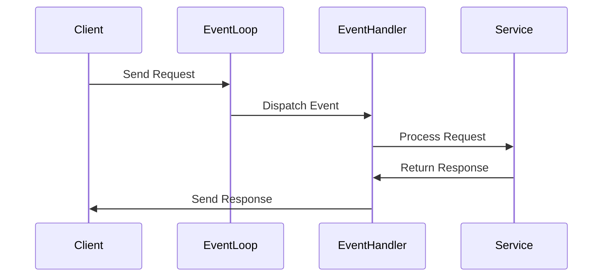

## 9.16. The Reactor Pattern

As we delve into the world of concurrency and parallelism in Rust, one of the pivotal patterns that emerges is the Reactor Pattern. This pattern is instrumental in handling I/O readiness events efficiently, making it a cornerstone of asynchronous programming. In this section, we will define the Reactor Pattern, explore its implementation in Rust through libraries like Tokio, and provide examples of non-blocking I/O. We will also discuss event registration and handling mechanisms, highlighting the benefits of this pattern in high-performance network servers.

### Understanding the Reactor Pattern

The Reactor Pattern is a design pattern used in event-driven programming to handle service requests delivered concurrently to an application. It demultiplexes and dispatches service requests that are delivered to an application from one or more clients. The pattern is particularly useful in scenarios where multiple I/O operations need to be managed simultaneously without blocking the execution of the program.

#### Key Participants

- **Event Demultiplexer**: Waits for events on a set of event sources and delivers them to the appropriate handlers.
- **Event Handlers**: Define the actions to be taken when an event occurs.
- **Synchronous Event De-multiplexer**: Blocks waiting for events to occur on a set of event sources.
- **Concrete Event Handlers**: Implement the specific behavior for handling events.

### The Role of the Reactor Pattern in Asynchronous Programming

In asynchronous programming, the Reactor Pattern plays a crucial role by allowing a single-threaded application to handle multiple I/O operations concurrently. This is achieved by using non-blocking I/O operations and an event loop that listens for events and dispatches them to the appropriate handlers.

#### Benefits of the Reactor Pattern

- **Efficiency**: By avoiding blocking operations, the Reactor Pattern allows applications to handle many connections simultaneously with minimal resource usage.
- **Scalability**: The pattern is well-suited for high-performance network servers that need to manage thousands of connections.
- **Responsiveness**: Applications remain responsive as they do not block on I/O operations.

### Implementing the Reactor Pattern in Rust with Tokio

Tokio is a popular asynchronous runtime for Rust that implements the Reactor Pattern. It provides a platform for writing non-blocking I/O code with a focus on performance and scalability.

#### How Tokio Implements the Reactor Pattern

Tokio uses an event loop to manage I/O readiness events. It provides abstractions for asynchronous I/O, timers, and task scheduling, allowing developers to write efficient, non-blocking applications.

```rust
use tokio::net::TcpListener;
use tokio::prelude::*;

#[tokio::main]
async fn main() -> Result<(), Box<dyn std::error::Error>> {
    // Bind a TCP listener to a local address
    let listener = TcpListener::bind("127.0.0.1:8080").await?;

    loop {
        // Accept an incoming connection
        let (mut socket, _) = listener.accept().await?;

        // Spawn a new task to handle the connection
        tokio::spawn(async move {
            let mut buf = [0; 1024];

            // Read data from the socket
            match socket.read(&mut buf).await {
                Ok(n) if n == 0 => return, // Connection closed
                Ok(n) => {
                    // Echo the data back to the client
                    if let Err(e) = socket.write_all(&buf[0..n]).await {
                        eprintln!("failed to write to socket; err = {:?}", e);
                    }
                }
                Err(e) => {
                    eprintln!("failed to read from socket; err = {:?}", e);
                }
            }
        });
    }
}
```

In this example, we use Tokio's `TcpListener` to accept incoming connections. Each connection is handled in a separate task, allowing the server to manage multiple connections concurrently without blocking.

### Non-blocking I/O with the Reactor Pattern

Non-blocking I/O is a key feature of the Reactor Pattern, enabling applications to perform I/O operations without waiting for them to complete. This is achieved by using an event loop that listens for readiness events and dispatches them to the appropriate handlers.

#### Event Registration and Handling

In the Reactor Pattern, events are registered with an event demultiplexer, which waits for events to occur and dispatches them to the appropriate handlers.

```rust
use mio::{Events, Interest, Poll, Token};
use mio::net::TcpListener;
use std::io;

const SERVER: Token = Token(0);

fn main() -> io::Result<()> {
    // Create a poll instance
    let mut poll = Poll::new()?;
    let mut events = Events::with_capacity(128);

    // Bind a TCP listener to a local address
    let mut listener = TcpListener::bind("127.0.0.1:8080")?;

    // Register the listener with the poll instance
    poll.registry().register(&mut listener, SERVER, Interest::READABLE)?;

    loop {
        // Poll for events
        poll.poll(&mut events, None)?;

        for event in events.iter() {
            match event.token() {
                SERVER => {
                    // Accept a new connection
                    let (mut connection, _address) = listener.accept()?;
                    println!("New connection from {:?}", _address);
                }
                _ => unreachable!(),
            }
        }
    }
}
```

In this example, we use the `mio` crate to implement a simple Reactor Pattern. The `Poll` instance acts as the event demultiplexer, and we register the `TcpListener` with it. The event loop waits for readiness events and handles them accordingly.

### Benefits in High-Performance Network Servers

The Reactor Pattern is particularly beneficial in high-performance network servers, where it allows the server to handle many connections simultaneously without blocking. This leads to improved scalability and responsiveness.

#### Key Advantages

- **Reduced Resource Usage**: By avoiding blocking operations, the Reactor Pattern reduces the number of threads required to handle connections, leading to lower resource usage.
- **Improved Throughput**: Non-blocking I/O operations allow the server to handle more requests per second, improving throughput.
- **Enhanced Scalability**: The pattern allows servers to scale to handle thousands of connections, making it ideal for high-performance applications.

### Rust's Unique Features in the Reactor Pattern

Rust's ownership model and type system provide unique advantages when implementing the Reactor Pattern. The language's emphasis on safety and concurrency ensures that applications are both efficient and reliable.

#### Key Features

- **Ownership and Borrowing**: Rust's ownership model prevents data races and ensures safe access to shared resources.
- **Zero-cost Abstractions**: Rust's abstractions have minimal runtime overhead, making it ideal for high-performance applications.
- **Fearless Concurrency**: Rust's type system ensures that concurrent code is safe and free from data races.

### Differences and Similarities with Other Patterns

The Reactor Pattern is often compared to the Proactor Pattern, another design pattern used in asynchronous programming. While both patterns are used to handle I/O operations, they differ in their approach.

#### Key Differences

- **Reactor Pattern**: Uses an event loop to listen for readiness events and dispatches them to handlers.
- **Proactor Pattern**: Uses asynchronous operations that notify the application when they are complete.

### Try It Yourself

To deepen your understanding of the Reactor Pattern, try modifying the code examples provided. Experiment with different event sources and handlers, and observe how the pattern handles multiple connections concurrently.

### Visualizing the Reactor Pattern

To better understand the flow of the Reactor Pattern, let's visualize it using a sequence diagram.



This diagram illustrates the flow of events in the Reactor Pattern. The client sends a request to the event loop, which dispatches the event to the appropriate handler. The handler processes the request and returns a response to the client.

### Knowledge Check

Before we wrap up, let's test your understanding of the Reactor Pattern with a few questions.

1. What is the primary role of the Reactor Pattern in asynchronous programming?
2. How does Tokio implement the Reactor Pattern in Rust?
3. What are the benefits of using the Reactor Pattern in high-performance network servers?
4. How does Rust's ownership model enhance the implementation of the Reactor Pattern?

### Summary

In this section, we explored the Reactor Pattern, a key design pattern in asynchronous programming. We discussed its implementation in Rust using libraries like Tokio and provided examples of non-blocking I/O. We also highlighted the benefits of the pattern in high-performance network servers and discussed Rust's unique features that enhance its implementation.

Remember, mastering the Reactor Pattern is just the beginning. As you continue your journey in Rust programming, you'll discover even more powerful patterns and techniques. Keep experimenting, stay curious, and enjoy the journey!

## Quiz Time!



### What is the primary role of the Reactor Pattern in asynchronous programming?

- [x] To handle I/O readiness events efficiently
- [ ] To manage memory allocation
- [ ] To optimize CPU usage
- [ ] To simplify error handling

> **Explanation:** The Reactor Pattern is used to handle I/O readiness events efficiently, allowing applications to manage multiple I/O operations concurrently.

### How does Tokio implement the Reactor Pattern in Rust?

- [x] By using an event loop to manage I/O readiness events
- [ ] By using synchronous I/O operations
- [ ] By blocking on I/O operations
- [ ] By using a single-threaded model

> **Explanation:** Tokio uses an event loop to manage I/O readiness events, allowing for non-blocking I/O operations.

### What are the benefits of using the Reactor Pattern in high-performance network servers?

- [x] Reduced resource usage and improved throughput
- [ ] Increased memory usage
- [ ] Simplified error handling
- [ ] Reduced code complexity

> **Explanation:** The Reactor Pattern reduces resource usage and improves throughput by avoiding blocking operations and allowing servers to handle many connections simultaneously.

### How does Rust's ownership model enhance the implementation of the Reactor Pattern?

- [x] By preventing data races and ensuring safe access to shared resources
- [ ] By simplifying memory allocation
- [ ] By reducing code complexity
- [ ] By optimizing CPU usage

> **Explanation:** Rust's ownership model prevents data races and ensures safe access to shared resources, enhancing the implementation of the Reactor Pattern.

### What is the difference between the Reactor Pattern and the Proactor Pattern?

- [x] The Reactor Pattern uses an event loop, while the Proactor Pattern uses asynchronous operations
- [ ] The Reactor Pattern is synchronous, while the Proactor Pattern is asynchronous
- [ ] The Reactor Pattern is used for CPU-bound tasks, while the Proactor Pattern is used for I/O-bound tasks
- [ ] The Reactor Pattern is simpler to implement than the Proactor Pattern

> **Explanation:** The Reactor Pattern uses an event loop to listen for readiness events, while the Proactor Pattern uses asynchronous operations that notify the application when they are complete.

### What is the role of the event demultiplexer in the Reactor Pattern?

- [x] To wait for events on a set of event sources and deliver them to the appropriate handlers
- [ ] To manage memory allocation
- [ ] To optimize CPU usage
- [ ] To simplify error handling

> **Explanation:** The event demultiplexer waits for events on a set of event sources and delivers them to the appropriate handlers.

### What is the primary advantage of non-blocking I/O in the Reactor Pattern?

- [x] It allows applications to perform I/O operations without waiting for them to complete
- [ ] It simplifies error handling
- [ ] It reduces code complexity
- [ ] It optimizes CPU usage

> **Explanation:** Non-blocking I/O allows applications to perform I/O operations without waiting for them to complete, improving efficiency and responsiveness.

### How does the Reactor Pattern improve scalability in network servers?

- [x] By allowing servers to handle many connections simultaneously without blocking
- [ ] By reducing memory usage
- [ ] By simplifying error handling
- [ ] By optimizing CPU usage

> **Explanation:** The Reactor Pattern improves scalability by allowing servers to handle many connections simultaneously without blocking, making it ideal for high-performance applications.

### What is the role of event handlers in the Reactor Pattern?

- [x] To define the actions to be taken when an event occurs
- [ ] To manage memory allocation
- [ ] To optimize CPU usage
- [ ] To simplify error handling

> **Explanation:** Event handlers define the actions to be taken when an event occurs, processing the event and returning a response.

### True or False: The Reactor Pattern is only useful for network servers.

- [ ] True
- [x] False

> **Explanation:** While the Reactor Pattern is particularly beneficial for network servers, it can be used in any application that requires efficient handling of multiple I/O operations.


