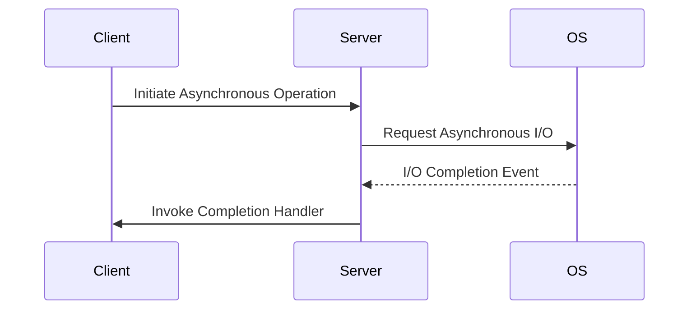

## 9.17. The Proactor Pattern

### Introduction

In the realm of systems programming, handling asynchronous operations efficiently is crucial for building high-performance applications. The Proactor pattern is a powerful design pattern that facilitates asynchronous operations driven by completion events. This pattern is particularly useful in environments where non-blocking I/O operations are essential. In this section, we will delve into the Proactor pattern, explore its implementation in Rust, and compare it with the Reactor pattern. We will also provide practical examples and discuss scenarios where the Proactor pattern is advantageous.

### Understanding the Proactor Pattern

The Proactor pattern is an architectural pattern used to handle asynchronous operations. Unlike the Reactor pattern, which waits for events to occur and then dispatches them to the appropriate handlers, the Proactor pattern is driven by the completion of asynchronous operations. In the Proactor pattern, the application initiates an asynchronous operation and specifies a completion handler. Once the operation is complete, the completion handler is invoked.

#### Key Differences from the Reactor Pattern

- **Event Source**: In the Reactor pattern, the event source is typically a set of file descriptors or sockets that are monitored for readiness. In contrast, the Proactor pattern focuses on the completion of asynchronous operations.
- **Event Handling**: The Reactor pattern requires the application to handle events as they occur, while the Proactor pattern allows the application to specify completion handlers that are invoked once the operation is complete.
- **Concurrency Model**: The Proactor pattern often leverages OS-level asynchronous APIs, such as IOCP (I/O Completion Ports) on Windows, to efficiently manage concurrency.

### Implementation Considerations in Rust

Implementing the Proactor pattern in Rust involves leveraging its powerful concurrency features and integrating with OS-level asynchronous APIs. Rust's ownership model and type system ensure memory safety and prevent data races, making it an excellent choice for implementing asynchronous patterns.

#### Key Considerations

1. **Asynchronous APIs**: Rust provides several libraries, such as Tokio and async-std, that facilitate asynchronous programming. These libraries offer abstractions over OS-level asynchronous APIs, making it easier to implement the Proactor pattern.

2. **Completion Handlers**: In Rust, completion handlers can be implemented using closures or async functions. These handlers are invoked once the asynchronous operation is complete.

3. **Concurrency**: Rust's async/await syntax simplifies writing asynchronous code. The `Future` trait in Rust represents a value that may not be available yet, allowing for non-blocking operations.

4. **Error Handling**: Rust's robust error handling mechanisms, such as the `Result` and `Option` types, are essential for managing errors in asynchronous operations.

### Practical Example: Implementing a Proactor-like Approach in Rust

Let's explore a practical example of implementing a Proactor-like approach in Rust using the Tokio library. In this example, we will create an asynchronous TCP server that handles client connections using completion handlers.

```rust
use tokio::net::{TcpListener, TcpStream};
use tokio::io::{AsyncReadExt, AsyncWriteExt};
use std::sync::Arc;

async fn handle_client(mut socket: TcpStream) {
    let mut buf = vec![0; 1024];

    // Read data from the socket
    match socket.read(&mut buf).await {
        Ok(n) if n == 0 => return, // Connection closed
        Ok(n) => {
            // Echo the data back to the client
            if socket.write_all(&buf[0..n]).await.is_err() {
                eprintln!("Failed to write to socket");
            }
        }
        Err(e) => eprintln!("Failed to read from socket: {:?}", e),
    }
}

#[tokio::main]
async fn main() -> Result<(), Box<dyn std::error::Error>> {
    let listener = TcpListener::bind("127.0.0.1:8080").await?;
    println!("Server running on 127.0.0.1:8080");

    loop {
        let (socket, _) = listener.accept().await?;
        tokio::spawn(handle_client(socket));
    }
}
```

#### Explanation

- **TcpListener**: We use `TcpListener` to listen for incoming TCP connections.
- **AsyncReadExt and AsyncWriteExt**: These traits provide asynchronous read and write operations.
- **tokio::spawn**: We use `tokio::spawn` to spawn a new task for each client connection, allowing the server to handle multiple connections concurrently.

### Scenarios Where the Proactor Pattern is Advantageous

The Proactor pattern is particularly advantageous in scenarios where:

- **High Concurrency**: Applications require handling a large number of concurrent connections or operations.
- **Non-blocking I/O**: Non-blocking I/O operations are essential for performance, such as in network servers or file I/O.
- **OS-Level Integration**: The application needs to leverage OS-level asynchronous APIs for optimal performance.

### Integration with OS-Level Asynchronous APIs

Rust's ecosystem provides excellent support for integrating with OS-level asynchronous APIs. Libraries like Tokio and async-std abstract away the complexities of dealing with low-level APIs, allowing developers to focus on building efficient asynchronous applications.

#### Example: Using Tokio with OS-Level APIs

Tokio provides a runtime for asynchronous applications, allowing seamless integration with OS-level APIs. Here's an example of using Tokio to perform asynchronous file I/O:

```rust
use tokio::fs::File;
use tokio::io::{self, AsyncReadExt, AsyncWriteExt};

#[tokio::main]
async fn main() -> io::Result<()> {
    let mut file = File::open("example.txt").await?;
    let mut contents = vec![];

    // Asynchronously read the file contents
    file.read_to_end(&mut contents).await?;
    println!("File contents: {:?}", String::from_utf8_lossy(&contents));

    // Asynchronously write to a file
    let mut file = File::create("output.txt").await?;
    file.write_all(b"Hello, Tokio!").await?;

    Ok(())
}
```

### Visualizing the Proactor Pattern

To better understand the Proactor pattern, let's visualize the flow of asynchronous operations using a sequence diagram.



#### Diagram Explanation

- **Initiate Asynchronous Operation**: The client initiates an asynchronous operation by sending a request to the server.
- **Request Asynchronous I/O**: The server requests the OS to perform the asynchronous I/O operation.
- **I/O Completion Event**: Once the operation is complete, the OS sends a completion event to the server.
- **Invoke Completion Handler**: The server invokes the completion handler to process the result of the operation.

### Knowledge Check

Before we conclude, let's reinforce our understanding of the Proactor pattern with a few questions:

- What are the key differences between the Proactor and Reactor patterns?
- How does Rust's async/await syntax facilitate the implementation of the Proactor pattern?
- In what scenarios is the Proactor pattern particularly advantageous?

### Summary

The Proactor pattern is a powerful tool for handling asynchronous operations driven by completion events. In Rust, implementing the Proactor pattern is facilitated by its robust concurrency features and integration with OS-level asynchronous APIs. By leveraging libraries like Tokio, developers can build high-performance applications that efficiently manage non-blocking I/O operations. As you continue your journey in mastering Rust, remember to experiment with different asynchronous patterns and explore their applications in real-world scenarios.

## Quiz Time!



### What is the primary focus of the Proactor pattern?

- [x] Completion of asynchronous operations
- [ ] Monitoring file descriptors for readiness
- [ ] Handling synchronous operations
- [ ] Managing thread pools

> **Explanation:** The Proactor pattern focuses on the completion of asynchronous operations, unlike the Reactor pattern, which monitors file descriptors for readiness.

### Which Rust library is commonly used for implementing asynchronous operations?

- [x] Tokio
- [ ] Diesel
- [ ] Serde
- [ ] Rocket

> **Explanation:** Tokio is a popular Rust library for implementing asynchronous operations, providing abstractions over OS-level APIs.

### How does Rust's async/await syntax benefit asynchronous programming?

- [x] Simplifies writing non-blocking code
- [ ] Increases memory usage
- [ ] Requires more boilerplate code
- [ ] Only supports synchronous operations

> **Explanation:** Rust's async/await syntax simplifies writing non-blocking code by allowing developers to write asynchronous code in a synchronous style.

### What is a key advantage of the Proactor pattern?

- [x] Efficient handling of non-blocking I/O
- [ ] Simplified synchronous operations
- [ ] Reduced concurrency
- [ ] Increased blocking operations

> **Explanation:** The Proactor pattern is advantageous for efficiently handling non-blocking I/O operations, making it suitable for high-concurrency applications.

### In the Proactor pattern, what triggers the invocation of completion handlers?

- [x] Completion of asynchronous operations
- [ ] Arrival of new events
- [ ] Initialization of the server
- [ ] Creation of new threads

> **Explanation:** Completion handlers in the Proactor pattern are triggered by the completion of asynchronous operations.

### Which of the following is a key difference between the Proactor and Reactor patterns?

- [x] Event source and handling
- [ ] Use of synchronous operations
- [ ] Requirement for thread pools
- [ ] Focus on blocking I/O

> **Explanation:** The key difference lies in the event source and handling; the Proactor pattern focuses on completion events, while the Reactor pattern monitors readiness events.

### What role does the OS play in the Proactor pattern?

- [x] Provides completion events for asynchronous operations
- [ ] Manages synchronous operations
- [ ] Handles thread scheduling
- [ ] Monitors file descriptors for readiness

> **Explanation:** In the Proactor pattern, the OS provides completion events for asynchronous operations, allowing the application to handle them efficiently.

### Which Rust feature ensures memory safety in asynchronous operations?

- [x] Ownership and borrowing
- [ ] Global variables
- [ ] Manual memory management
- [ ] Unchecked pointers

> **Explanation:** Rust's ownership and borrowing model ensures memory safety, preventing data races in asynchronous operations.

### Can the Proactor pattern be used for synchronous operations?

- [ ] True
- [x] False

> **Explanation:** The Proactor pattern is designed for asynchronous operations, focusing on completion events rather than synchronous operations.

### What is a common use case for the Proactor pattern?

- [x] High-concurrency network servers
- [ ] Single-threaded applications
- [ ] CPU-bound computations
- [ ] Static file serving

> **Explanation:** The Proactor pattern is commonly used in high-concurrency network servers where non-blocking I/O is essential.



Remember, mastering the Proactor pattern in Rust is just one step in your journey towards building efficient, high-performance applications. Keep experimenting, stay curious, and enjoy the process of learning and growing as a Rust developer!
