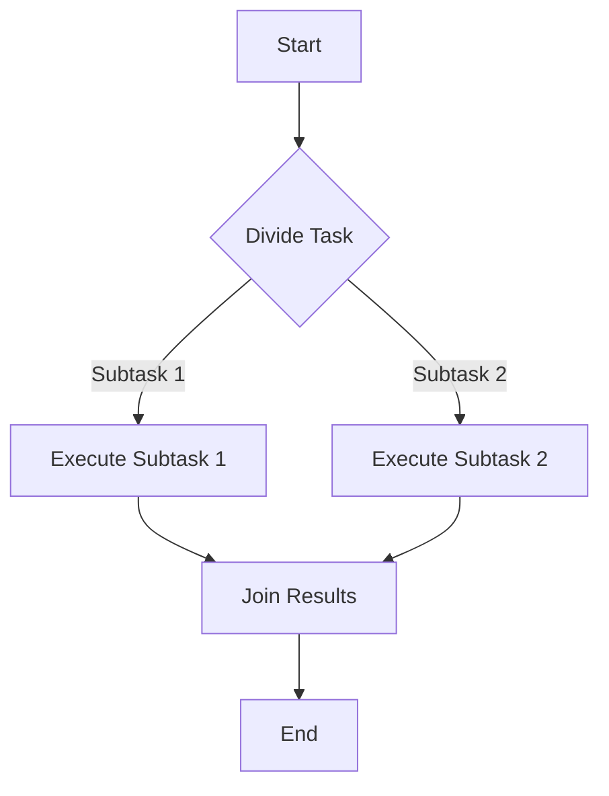

## 9.18. The Fork-Join Pattern

### Introduction

The Fork-Join pattern is a powerful concurrency model used to parallelize tasks by recursively splitting them into smaller subtasks, processing them in parallel, and then combining the results. This pattern is particularly effective for divide-and-conquer algorithms, where a problem is divided into subproblems of the same type, solved independently, and then combined to form a solution to the original problem.

In Rust, the Fork-Join pattern is efficiently implemented using the Rayon library, which provides a simple and ergonomic way to achieve data parallelism. This section will explore the Fork-Join model, demonstrate how Rayon implements Fork-Join concurrency, and provide examples of divide-and-conquer algorithms. We will also discuss performance considerations, overhead, and best practices for recursive parallelism.

### Understanding the Fork-Join Model

The Fork-Join model is based on the idea of recursively dividing a task into smaller subtasks (forking), processing these subtasks in parallel, and then combining their results (joining). This model is particularly suitable for problems that can be broken down into independent subproblems, such as sorting algorithms, matrix multiplications, and more.

#### Key Participants

- **Fork**: The process of dividing a task into smaller subtasks.
- **Join**: The process of combining the results of subtasks to form the final result.
- **Worker Threads**: Threads that execute the subtasks in parallel.

#### Applicability

The Fork-Join pattern is applicable in scenarios where:

- The problem can be divided into independent subproblems.
- The subproblems can be solved concurrently.
- The results of the subproblems can be combined to form the solution to the original problem.

### Implementing Fork-Join with Rayon

Rayon is a data parallelism library for Rust that makes it easy to convert sequential computations into parallel computations. It provides a high-level API for parallel iterators and tasks, allowing developers to leverage the Fork-Join pattern with minimal effort.

#### Using Rayon for Fork-Join Concurrency

Rayon provides the `join` function, which is the core of its Fork-Join implementation. The `join` function takes two closures and executes them in parallel, returning their results. This function is particularly useful for implementing divide-and-conquer algorithms.

```rust
use rayon::prelude::*;

fn main() {
    let result = rayon::join(
        || compute_subtask_1(),
        || compute_subtask_2(),
    );

    println!("Results: {:?}", result);
}

fn compute_subtask_1() -> i32 {
    // Simulate some computation
    42
}

fn compute_subtask_2() -> i32 {
    // Simulate some computation
    24
}
```

In this example, `compute_subtask_1` and `compute_subtask_2` are executed in parallel, and their results are returned as a tuple.

#### Example: Parallel Merge Sort

Merge sort is a classic example of a divide-and-conquer algorithm that can benefit from the Fork-Join pattern. Let's implement a parallel version of merge sort using Rayon.

```rust
use rayon::prelude::*;

fn parallel_merge_sort<T: Ord + Send>(arr: &mut [T]) {
    let len = arr.len();
    if len <= 1 {
        return;
    }

    let mid = len / 2;
    let (left, right) = arr.split_at_mut(mid);

    rayon::join(
        || parallel_merge_sort(left),
        || parallel_merge_sort(right),
    );

    merge(left, right);
}

fn merge<T: Ord + Send>(left: &mut [T], right: &mut [T]) {
    let mut result = Vec::with_capacity(left.len() + right.len());
    let mut left_iter = left.iter().peekable();
    let mut right_iter = right.iter().peekable();

    while let (Some(&l), Some(&r)) = (left_iter.peek(), right_iter.peek()) {
        if l <= r {
            result.push(left_iter.next().unwrap().clone());
        } else {
            result.push(right_iter.next().unwrap().clone());
        }
    }

    result.extend(left_iter);
    result.extend(right_iter);

    left.iter_mut().chain(right.iter_mut()).zip(result).for_each(|(dest, src)| *dest = src);
}

fn main() {
    let mut data = vec![5, 3, 8, 6, 2, 7, 4, 1];
    parallel_merge_sort(&mut data);
    println!("Sorted: {:?}", data);
}
```

In this implementation, the array is recursively divided into two halves, which are sorted in parallel using `rayon::join`. The `merge` function then combines the sorted halves.

### Performance Considerations and Overhead

While the Fork-Join pattern can significantly improve performance by leveraging parallelism, it is important to consider the overhead associated with task creation and synchronization. Here are some key points to consider:

- **Task Granularity**: Ensure that the tasks are large enough to justify the overhead of parallel execution. Too fine-grained tasks can lead to excessive overhead and reduced performance.
- **Load Balancing**: Rayon automatically balances the load across worker threads, but it is important to ensure that tasks are evenly distributed to avoid bottlenecks.
- **Synchronization Overhead**: Minimize synchronization between tasks to reduce overhead and improve performance.

### Best Practices for Recursive Parallelism

When implementing recursive parallelism using the Fork-Join pattern, consider the following best practices:

- **Base Case Optimization**: Optimize the base case of the recursion to minimize overhead. For example, switch to a sequential algorithm for small input sizes.
- **Avoid Excessive Recursion**: Limit the depth of recursion to prevent stack overflow and excessive overhead.
- **Use Efficient Data Structures**: Choose data structures that support efficient parallel operations, such as slices and vectors in Rust.

### Visualizing the Fork-Join Pattern

To better understand the Fork-Join pattern, let's visualize the process using a flowchart.



This flowchart illustrates the process of dividing a task into subtasks, executing them in parallel, and joining their results.

### Try It Yourself

Experiment with the parallel merge sort implementation by modifying the input data or changing the sorting algorithm. Try implementing other divide-and-conquer algorithms, such as quicksort or matrix multiplication, using the Fork-Join pattern.

### Further Reading

For more information on the Fork-Join pattern and Rayon, consider the following resources:

- [Rayon Documentation](https://docs.rs/rayon/latest/rayon/)
- [Rust Book: Concurrency](https://doc.rust-lang.org/book/ch16-00-concurrency.html)
- [Divide and Conquer Algorithms](https://en.wikipedia.org/wiki/Divide-and-conquer_algorithm)

### Summary

The Fork-Join pattern is a powerful tool for parallelizing tasks in Rust, particularly when combined with the Rayon library. By understanding the Fork-Join model and implementing it effectively, you can leverage parallelism to improve the performance of divide-and-conquer algorithms. Remember to consider task granularity, load balancing, and synchronization overhead when using this pattern.

## Quiz Time!



### What is the main purpose of the Fork-Join pattern?

- [x] To parallelize tasks by recursively splitting them into subtasks and combining results.
- [ ] To execute tasks sequentially in a single thread.
- [ ] To handle asynchronous I/O operations.
- [ ] To manage memory allocation in Rust.

> **Explanation:** The Fork-Join pattern is used to parallelize tasks by dividing them into smaller subtasks, processing them in parallel, and then combining the results.

### Which Rust library is commonly used to implement the Fork-Join pattern?

- [x] Rayon
- [ ] Tokio
- [ ] Hyper
- [ ] Actix

> **Explanation:** Rayon is a data parallelism library in Rust that provides an easy way to implement the Fork-Join pattern.

### What function does Rayon provide for Fork-Join concurrency?

- [x] `join`
- [ ] `async`
- [ ] `spawn`
- [ ] `await`

> **Explanation:** Rayon provides the `join` function to execute two closures in parallel, which is the core of its Fork-Join implementation.

### In the Fork-Join pattern, what is the process of combining results called?

- [x] Join
- [ ] Fork
- [ ] Split
- [ ] Merge

> **Explanation:** The process of combining the results of subtasks in the Fork-Join pattern is called "Join."

### What is a key consideration when using the Fork-Join pattern?

- [x] Task granularity
- [ ] Memory allocation
- [ ] Network latency
- [ ] File I/O

> **Explanation:** Task granularity is important to ensure that tasks are large enough to justify the overhead of parallel execution.

### Which algorithm is a classic example of using the Fork-Join pattern?

- [x] Merge sort
- [ ] Bubble sort
- [ ] Linear search
- [ ] Binary search

> **Explanation:** Merge sort is a classic example of a divide-and-conquer algorithm that can benefit from the Fork-Join pattern.

### What should be minimized to improve performance in the Fork-Join pattern?

- [x] Synchronization overhead
- [ ] Task size
- [ ] Memory usage
- [ ] Network bandwidth

> **Explanation:** Minimizing synchronization overhead can improve performance when using the Fork-Join pattern.

### What is a best practice for recursive parallelism?

- [x] Base case optimization
- [ ] Use global variables
- [ ] Avoid using functions
- [ ] Increase recursion depth

> **Explanation:** Base case optimization helps minimize overhead in recursive parallelism.

### What does the `join` function in Rayon do?

- [x] Executes two closures in parallel and returns their results.
- [ ] Executes a closure asynchronously.
- [ ] Spawns a new thread for each closure.
- [ ] Combines two closures into one.

> **Explanation:** The `join` function in Rayon executes two closures in parallel and returns their results as a tuple.

### True or False: The Fork-Join pattern is only applicable to sorting algorithms.

- [ ] True
- [x] False

> **Explanation:** The Fork-Join pattern is applicable to any problem that can be divided into independent subproblems, not just sorting algorithms.



Remember, this is just the beginning. As you progress, you'll build more complex and interactive applications using the Fork-Join pattern. Keep experimenting, stay curious, and enjoy the journey!
