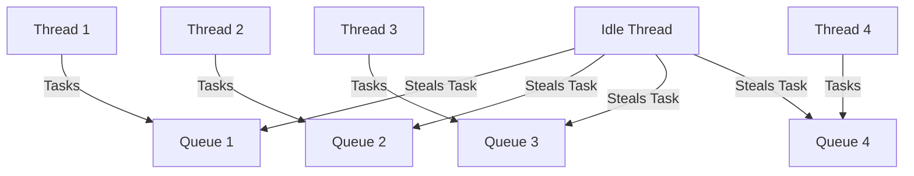

## 9.19. Work Stealing and Task Scheduling Patterns

Concurrency and parallelism are essential for modern software development, enabling applications to perform multiple tasks simultaneously, thereby improving performance and responsiveness. In Rust, work-stealing and task scheduling patterns are crucial for efficiently distributing tasks across threads. This section delves into the intricacies of work-stealing schedulers, their benefits, and how they are implemented in Rust using libraries like Rayon and Tokio.

### Understanding Work Stealing

**Work stealing** is a scheduling strategy used in parallel computing to efficiently distribute tasks across multiple threads. In a work-stealing scheduler, each thread maintains its own queue of tasks. When a thread finishes its tasks and becomes idle, it can "steal" tasks from the queues of other threads. This approach helps balance the workload dynamically and minimizes idle time, leading to better resource utilization.

#### Benefits of Work Stealing

1. **Load Balancing**: Work stealing automatically balances the workload among threads, reducing the chances of some threads being overburdened while others remain idle.
2. **Scalability**: It scales well with the number of threads, making it suitable for systems with varying numbers of processors.
3. **Improved Throughput**: By keeping all threads busy, work stealing can improve the overall throughput of the system.
4. **Reduced Latency**: Tasks are completed more quickly as idle threads can assist in processing pending tasks.

### Work Stealing in Rust: Rayon and Tokio

Rust provides powerful libraries like Rayon and Tokio that utilize work-stealing schedulers to manage concurrency and parallelism efficiently.

#### Rayon

Rayon is a data parallelism library in Rust that makes it easy to convert sequential computations into parallel ones. It uses a work-stealing scheduler to distribute tasks across threads, ensuring efficient execution.

##### Key Features of Rayon

- **Parallel Iterators**: Rayon provides parallel iterators that allow you to perform operations like `map`, `filter`, and `reduce` in parallel.
- **Ease of Use**: Rayon abstracts the complexity of thread management, allowing developers to focus on the logic of their applications.
- **Automatic Load Balancing**: The work-stealing scheduler in Rayon automatically balances the workload among threads.

##### Example: Parallel Iteration with Rayon

```rust
use rayon::prelude::*;

fn main() {
    let numbers: Vec<i32> = (1..100).collect();
    let sum: i32 = numbers.par_iter().map(|&x| x * 2).sum();
    println!("Sum of doubled numbers: {}", sum);
}
```

In this example, the `par_iter` method converts the iterator into a parallel iterator, and the work-stealing scheduler distributes the `map` and `sum` operations across available threads.

#### Tokio

Tokio is an asynchronous runtime for Rust, designed for writing scalable network applications. It uses a work-stealing scheduler to manage tasks efficiently, especially in I/O-bound applications.

##### Key Features of Tokio

- **Asynchronous I/O**: Tokio provides asynchronous I/O operations, allowing applications to handle many connections concurrently.
- **Task Scheduling**: Tokio's work-stealing scheduler efficiently manages tasks, ensuring that all available threads are utilized.
- **Scalability**: Tokio is designed to scale with the number of available processors, making it suitable for high-performance applications.

##### Example: Asynchronous Task Scheduling with Tokio

```rust
use tokio::task;

#[tokio::main]
async fn main() {
    let task1 = task::spawn(async {
        // Simulate some work
        println!("Task 1 is running");
    });

    let task2 = task::spawn(async {
        // Simulate some work
        println!("Task 2 is running");
    });

    let _ = tokio::join!(task1, task2);
}
```

In this example, Tokio's work-stealing scheduler manages the execution of `task1` and `task2`, ensuring that both tasks are executed efficiently.

### Impact on Latency and Throughput

Work-stealing schedulers significantly impact the latency and throughput of applications:

- **Reduced Latency**: By dynamically balancing the workload, work-stealing reduces the time tasks spend waiting in queues, leading to lower latency.
- **Increased Throughput**: Keeping all threads busy ensures that more tasks are completed in a given time frame, increasing throughput.

### Designing Work-Stealing Systems

When designing systems that utilize work-stealing schedulers, consider the following:

1. **Task Granularity**: Ensure that tasks are neither too small (causing overhead) nor too large (leading to imbalanced workloads).
2. **Thread Count**: Choose an appropriate number of threads based on the system's capabilities and the nature of the workload.
3. **Task Dependencies**: Minimize dependencies between tasks to allow for maximum parallelism.
4. **Resource Contention**: Be mindful of shared resources that could become bottlenecks when accessed by multiple threads.

### Visualizing Work Stealing

To better understand how work stealing operates, let's visualize the process using a flowchart.



**Figure 1**: This diagram illustrates how an idle thread can steal tasks from other threads' queues, ensuring balanced workload distribution.

### Try It Yourself

Experiment with the provided code examples by:

- Modifying the range of numbers in the Rayon example to see how it affects performance.
- Adding more tasks in the Tokio example to observe how the scheduler manages them.

### References and Further Reading

- [Rayon Documentation](https://docs.rs/rayon/latest/rayon/)
- [Tokio Documentation](https://docs.rs/tokio/latest/tokio/)
- [Concurrency in Rust](https://doc.rust-lang.org/book/ch16-00-concurrency.html)

### Knowledge Check

- What is work stealing, and how does it benefit task scheduling?
- How do Rayon and Tokio utilize work-stealing schedulers?
- What are the key considerations when designing a work-stealing system?

### Embrace the Journey

Remember, mastering concurrency and parallelism in Rust is a journey. As you explore work-stealing and task scheduling patterns, you'll gain insights into building efficient and scalable applications. Keep experimenting, stay curious, and enjoy the process!

## Quiz Time!



### What is the primary benefit of work stealing in task scheduling?

- [x] Load balancing across threads
- [ ] Reducing memory usage
- [ ] Simplifying code structure
- [ ] Increasing task complexity

> **Explanation:** Work stealing helps balance the workload among threads, ensuring efficient resource utilization.

### Which Rust library provides parallel iterators using a work-stealing scheduler?

- [x] Rayon
- [ ] Tokio
- [ ] Actix
- [ ] Hyper

> **Explanation:** Rayon provides parallel iterators that utilize a work-stealing scheduler for efficient task distribution.

### How does Tokio manage asynchronous tasks efficiently?

- [x] Using a work-stealing scheduler
- [ ] By creating a new thread for each task
- [ ] Through synchronous execution
- [ ] By limiting the number of tasks

> **Explanation:** Tokio uses a work-stealing scheduler to manage asynchronous tasks efficiently, ensuring optimal resource usage.

### What is a key consideration when designing a work-stealing system?

- [x] Task granularity
- [ ] Using only one thread
- [ ] Avoiding parallel execution
- [ ] Increasing task dependencies

> **Explanation:** Task granularity is crucial to ensure tasks are neither too small nor too large, balancing overhead and workload distribution.

### Which of the following is NOT a benefit of work stealing?

- [ ] Improved throughput
- [ ] Reduced latency
- [x] Increased memory usage
- [ ] Scalability

> **Explanation:** Work stealing does not inherently increase memory usage; it focuses on balancing workloads and improving performance.

### In the context of work stealing, what does an idle thread do?

- [x] Steals tasks from other threads
- [ ] Waits for new tasks to be assigned
- [ ] Terminates itself
- [ ] Increases its priority

> **Explanation:** An idle thread in a work-stealing scheduler will steal tasks from other threads to maintain balanced workloads.

### Which feature of Rayon abstracts the complexity of thread management?

- [x] Parallel iterators
- [ ] Synchronous execution
- [ ] Task dependencies
- [ ] Memory management

> **Explanation:** Parallel iterators in Rayon abstract the complexity of thread management, allowing developers to focus on application logic.

### What is the impact of work stealing on latency?

- [x] It reduces latency by balancing workloads
- [ ] It increases latency due to overhead
- [ ] It has no impact on latency
- [ ] It only affects memory usage

> **Explanation:** Work stealing reduces latency by ensuring tasks are processed efficiently across threads.

### How does work stealing affect throughput?

- [x] It increases throughput by keeping threads busy
- [ ] It decreases throughput due to task stealing overhead
- [ ] It has no effect on throughput
- [ ] It only affects task dependencies

> **Explanation:** By keeping all threads busy, work stealing increases throughput, allowing more tasks to be completed in a given time frame.

### True or False: Work stealing is only beneficial for CPU-bound tasks.

- [ ] True
- [x] False

> **Explanation:** Work stealing is beneficial for both CPU-bound and I/O-bound tasks, as it helps balance workloads across threads.


