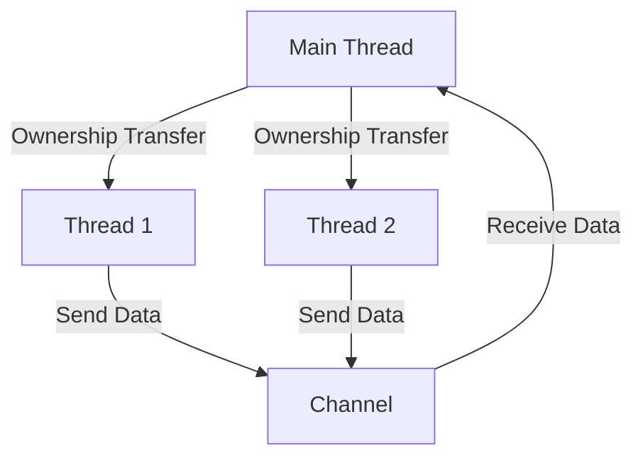

## 9.2. Leveraging Ownership for Safe Concurrency

Concurrency is a powerful tool in modern programming, allowing developers to perform multiple tasks simultaneously, thereby improving the efficiency and responsiveness of applications. However, concurrency also introduces challenges, particularly around data safety and race conditions. Rust, with its unique ownership model, offers a compelling solution to these challenges, enabling developers to write concurrent code that is both safe and efficient.

### Understanding Ownership and Its Role in Concurrency

Rust's ownership model is central to its approach to concurrency. Ownership, borrowing, and lifetimes are the core concepts that ensure memory safety without the need for a garbage collector. In the context of concurrency, these concepts help prevent data races, which occur when two or more threads access shared data simultaneously, and at least one of them is modifying the data.

#### Key Concepts of Ownership

- **Ownership**: Each value in Rust has a single owner. When the owner goes out of scope, the value is dropped, freeing the memory.
- **Borrowing**: Rust allows references to data through borrowing. Borrowing can be either mutable or immutable, but not both simultaneously.
- **Lifetimes**: Lifetimes ensure that references are valid as long as they are used, preventing dangling references.

### Preventing Data Races with Ownership

Data races are a common issue in concurrent programming, leading to unpredictable behavior and bugs. Rust's ownership model prevents data races by enforcing strict rules at compile time:

1. **No Aliasing with Mutation**: Rust ensures that if one thread is modifying data, no other thread can access it. This is achieved through mutable borrowing, where only one mutable reference is allowed at a time.
2. **Ownership Transfer**: Data can be transferred between threads by transferring ownership. Once ownership is transferred, the original owner can no longer access the data, preventing concurrent modifications.

### The `Send` and `Sync` Traits

Rust introduces two key traits, `Send` and `Sync`, to facilitate safe concurrency:

- **`Send` Trait**: Types that implement the `Send` trait can be transferred between threads. Most primitive types in Rust are `Send`, and custom types can be made `Send` by ensuring they do not contain non-`Send` components.
- **`Sync` Trait**: A type is `Sync` if it is safe to access from multiple threads simultaneously. This typically applies to types that are immutable or have internal synchronization.

These traits are automatically implemented by the Rust compiler for types that meet the necessary criteria, ensuring that only safe types are used in concurrent contexts.

### Sharing and Transferring Data Between Threads

Rust provides several mechanisms for safely sharing or transferring data between threads:

1. **Channels**: Channels provide a way to transfer data between threads. They are a safe and efficient way to communicate between threads without sharing memory directly.

    ```rust
    use std::sync::mpsc;
    use std::thread;

    fn main() {
        let (tx, rx) = mpsc::channel();

        thread::spawn(move || {
            let val = String::from("Hello");
            tx.send(val).unwrap();
        });

        let received = rx.recv().unwrap();
        println!("Received: {}", received);
    }
    ```

    In this example, a channel is used to send a `String` from one thread to another. The `send` method transfers ownership of the data, ensuring that only one thread can access it at a time.

2. **Arc (Atomic Reference Counting)**: For cases where data needs to be shared between threads, Rust provides `Arc`, a thread-safe reference-counting pointer.

    ```rust
    use std::sync::Arc;
    use std::thread;

    fn main() {
        let data = Arc::new(vec![1, 2, 3]);

        for _ in 0..3 {
            let data = Arc::clone(&data);
            thread::spawn(move || {
                println!("{:?}", data);
            });
        }
    }
    ```

    `Arc` allows multiple threads to read the data concurrently, but it does not allow mutation. For mutable data, `Mutex` or `RwLock` can be used in conjunction with `Arc`.

### Best Practices for Writing Concurrent Programs in Rust

1. **Minimize Shared State**: Whenever possible, avoid sharing state between threads. Use message passing or ownership transfer to communicate between threads.
2. **Use `Arc` and `Mutex` Wisely**: When shared state is necessary, use `Arc` for immutable data and `Mutex` for mutable data. Be mindful of potential deadlocks when using locks.
3. **Leverage Rust's Type System**: Use Rust's type system to enforce thread safety. The `Send` and `Sync` traits are powerful tools for ensuring that only safe types are used in concurrent contexts.
4. **Avoid Blocking Operations**: In asynchronous code, avoid blocking operations that can stall the entire system. Use non-blocking alternatives or spawn separate threads for blocking tasks.
5. **Test Thoroughly**: Concurrent code can be difficult to test due to its non-deterministic nature. Use Rust's testing framework to write comprehensive tests and consider using tools like `loom` for testing concurrency.

### Visualizing Ownership and Concurrency

To better understand how ownership and concurrency work together in Rust, let's visualize the flow of ownership in a concurrent program:



**Figure 1**: This diagram illustrates how ownership is transferred between threads and how data is communicated using channels.

### Try It Yourself

Experiment with the provided code examples by modifying them to explore different concurrency scenarios. For instance, try adding more threads, using `Mutex` for shared mutable data, or implementing a simple producer-consumer model using channels.

### References and Further Reading

- [Rust Book - Concurrency](https://doc.rust-lang.org/book/ch16-00-concurrency.html)
- [Rust Reference - Ownership](https://doc.rust-lang.org/reference/ownership.html)
- [Rust Reference - Send and Sync](https://doc.rust-lang.org/reference/send-and-sync.html)

### Knowledge Check

- What is the role of the `Send` trait in Rust's concurrency model?
- How does Rust prevent data races at compile time?
- What is the difference between `Arc` and `Mutex`?

### Embrace the Journey

Concurrency in Rust is a journey of understanding and applying the ownership model to ensure safety and efficiency. As you continue to explore Rust's concurrency features, remember that practice and experimentation are key to mastering these concepts. Keep experimenting, stay curious, and enjoy the journey!

## Quiz Time!



### What is the primary purpose of Rust's ownership model in concurrency?

- [x] To prevent data races by enforcing exclusive access to data
- [ ] To allow multiple threads to access data simultaneously
- [ ] To enable garbage collection
- [ ] To simplify memory management

> **Explanation:** Rust's ownership model ensures that data is accessed exclusively, preventing data races and ensuring memory safety.

### Which trait allows a type to be transferred between threads?

- [x] Send
- [ ] Sync
- [ ] Clone
- [ ] Copy

> **Explanation:** The `Send` trait indicates that a type can be safely transferred between threads.

### What is the role of the `Sync` trait?

- [x] It allows a type to be safely accessed from multiple threads simultaneously.
- [ ] It enables a type to be transferred between threads.
- [ ] It provides automatic memory management.
- [ ] It simplifies error handling.

> **Explanation:** The `Sync` trait indicates that a type can be accessed from multiple threads without causing data races.

### How does Rust ensure that only one thread can modify data at a time?

- [x] By allowing only one mutable reference at a time
- [ ] By using garbage collection
- [ ] By locking all data in memory
- [ ] By using a global interpreter lock

> **Explanation:** Rust's borrowing rules allow only one mutable reference to data at a time, preventing concurrent modifications.

### What is the purpose of `Arc` in Rust?

- [x] To provide thread-safe reference counting for shared data
- [ ] To allow mutable access to data from multiple threads
- [ ] To manage memory allocation
- [ ] To simplify error handling

> **Explanation:** `Arc` is used for thread-safe reference counting, allowing multiple threads to read shared data.

### Which of the following is a best practice for writing concurrent programs in Rust?

- [x] Minimize shared state between threads
- [ ] Use global variables for shared data
- [ ] Avoid using channels for communication
- [ ] Use blocking operations in asynchronous code

> **Explanation:** Minimizing shared state reduces the complexity and potential for data races in concurrent programs.

### What is a potential risk when using `Mutex` in Rust?

- [x] Deadlocks
- [ ] Memory leaks
- [ ] Data races
- [ ] Compile-time errors

> **Explanation:** Deadlocks can occur if multiple threads lock resources in an inconsistent order.

### How can you safely share mutable data between threads in Rust?

- [x] Use `Arc<Mutex<T>>`
- [ ] Use `Rc<T>`
- [ ] Use `RefCell<T>`
- [ ] Use `Box<T>`

> **Explanation:** `Arc<Mutex<T>>` allows safe sharing of mutable data between threads by providing both reference counting and locking.

### What is the advantage of using channels for communication between threads?

- [x] They provide a safe way to transfer data without sharing memory directly.
- [ ] They allow direct access to shared memory.
- [ ] They eliminate the need for synchronization.
- [ ] They simplify error handling.

> **Explanation:** Channels allow threads to communicate by transferring data, avoiding the complexities of shared memory.

### True or False: Rust's ownership model eliminates the need for a garbage collector.

- [x] True
- [ ] False

> **Explanation:** Rust's ownership model ensures memory safety without the need for a garbage collector by managing memory at compile time.


