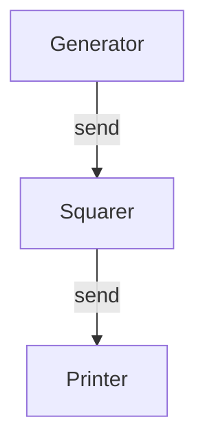

## 9.20. The CSP (Communicating Sequential Processes) Model

Concurrency is a fundamental aspect of modern programming, and Rust offers robust tools to handle it safely and efficiently. One of the models that Rust can leverage for concurrency is the Communicating Sequential Processes (CSP) model. This model provides a framework for structuring concurrent programs through process communication over channels. In this section, we will explore the CSP model, its principles, and how it aligns with Rust's concurrency features.

### Introduction to the CSP Model

The Communicating Sequential Processes (CSP) model was introduced by Tony Hoare in 1978 as a formal language for describing patterns of interaction in concurrent systems. CSP emphasizes the composition of independent processes that communicate through message-passing channels. This model is particularly effective in avoiding shared state and the complexities that come with it, such as race conditions and deadlocks.

#### Key Principles of CSP

1. **Process Isolation**: Each process operates independently and does not share memory with other processes.
2. **Message Passing**: Processes communicate by sending messages through channels, ensuring that data is passed explicitly rather than shared implicitly.
3. **Synchronization**: Communication over channels is synchronized, meaning that a send operation will block until a corresponding receive operation is ready, and vice versa.
4. **Deadlock Avoidance**: By structuring communication through channels, CSP naturally avoids many common sources of deadlock.

### Rust's Channels and CSP

Rust's standard library provides channels as a primary mechanism for message passing between threads, aligning closely with CSP principles. Channels in Rust are used to send data between threads safely and efficiently, leveraging Rust's ownership and type system to prevent data races.

#### Rust Channels: An Overview

Rust channels come in two flavors: **synchronous** and **asynchronous**. 

- **Synchronous Channels**: These channels block the sender until the receiver is ready to receive the message, ensuring direct synchronization between threads.
- **Asynchronous Channels**: These channels allow the sender to continue executing without waiting for the receiver, using a buffer to store messages temporarily.

Here's a simple example of using Rust's synchronous channels:

```rust
use std::sync::mpsc;
use std::thread;

fn main() {
    // Create a channel
    let (tx, rx) = mpsc::channel();

    // Spawn a new thread
    thread::spawn(move || {
        let val = String::from("Hello from the thread!");
        tx.send(val).unwrap(); // Send a message through the channel
    });

    // Receive the message in the main thread
    let received = rx.recv().unwrap();
    println!("Received: {}", received);
}
```

In this example, we create a channel using `mpsc::channel()`, which returns a transmitter (`tx`) and a receiver (`rx`). The transmitter is moved into a new thread, where it sends a message. The main thread receives the message and prints it.

### CSP-Style Concurrency in Rust

Implementing CSP-style concurrency in Rust involves structuring your program around independent tasks that communicate via channels. This approach can lead to simpler and more maintainable code, as it avoids shared state and the complexities of locking mechanisms.

#### Example: CSP-Style Pipeline

Let's consider a more complex example where we implement a pipeline of processes, each performing a different task and passing data to the next process via channels.

```rust
use std::sync::mpsc;
use std::thread;

fn main() {
    // Create channels for communication between stages
    let (tx1, rx1) = mpsc::channel();
    let (tx2, rx2) = mpsc::channel();

    // First stage: Generate numbers
    let generator = thread::spawn(move || {
        for i in 0..10 {
            tx1.send(i).unwrap();
        }
    });

    // Second stage: Square the numbers
    let squarer = thread::spawn(move || {
        for received in rx1 {
            let squared = received * received;
            tx2.send(squared).unwrap();
        }
    });

    // Third stage: Print the squared numbers
    let printer = thread::spawn(move || {
        for squared in rx2 {
            println!("Squared: {}", squared);
        }
    });

    // Wait for all threads to finish
    generator.join().unwrap();
    squarer.join().unwrap();
    printer.join().unwrap();
}
```

In this example, we have three stages: a generator that produces numbers, a squarer that squares the numbers, and a printer that prints the squared numbers. Each stage communicates with the next via channels, demonstrating a CSP-style pipeline.

### Benefits of CSP in Rust

1. **Simplicity**: CSP reduces the complexity of concurrent programming by avoiding shared state and explicit locking.
2. **Deadlock Avoidance**: By using channels for communication, CSP naturally avoids many common sources of deadlock.
3. **Modularity**: Processes in CSP are independent and can be composed easily, promoting modular and maintainable code.
4. **Safety**: Rust's type system and ownership model ensure that data races are prevented, even in concurrent programs.

### Comparing CSP with Other Concurrency Models

Rust supports various concurrency models, each with its own strengths and trade-offs. Let's compare CSP with two other popular models: the Actor model and Shared Memory.

#### CSP vs. Actor Model

- **CSP**: Focuses on process isolation and communication through channels. It emphasizes synchronization and explicit data passing.
- **Actor Model**: Each actor has its own state and communicates with other actors by sending messages. Actors can process messages asynchronously and maintain their own state.

While both models use message passing, CSP emphasizes synchronization and blocking communication, whereas the Actor model allows for more asynchronous and stateful interactions.

#### CSP vs. Shared Memory

- **CSP**: Avoids shared state by using channels for communication, reducing the risk of data races and deadlocks.
- **Shared Memory**: Threads share access to common data structures, requiring careful synchronization to avoid race conditions.

CSP offers a simpler and safer approach to concurrency by avoiding shared state, whereas shared memory can offer higher performance in certain scenarios but requires more careful management.

### Visualizing CSP in Rust

To better understand how CSP works in Rust, let's visualize the flow of data between processes using a Mermaid.js diagram.



In this diagram, we see a simple pipeline where data flows from the Generator to the Squarer and finally to the Printer, with each stage communicating via channels.

### Try It Yourself

Experiment with the CSP model in Rust by modifying the pipeline example. Try adding more stages, such as filtering numbers or performing additional calculations. Observe how the CSP model simplifies the addition of new processes and communication channels.

### Knowledge Check

- Explain the key principles of the CSP model.
- Describe how Rust's channels align with CSP concepts.
- Compare CSP with the Actor model and Shared Memory.
- Implement a simple CSP-style pipeline in Rust.

### Summary

The CSP model offers a powerful framework for structuring concurrent programs in Rust. By leveraging channels for communication, CSP provides simplicity, safety, and deadlock avoidance. Rust's channels align closely with CSP principles, making it an excellent choice for implementing CSP-style concurrency. As you continue your journey with Rust, consider exploring CSP and other concurrency models to find the best fit for your applications.

Remember, this is just the beginning. As you progress, you'll build more complex and interactive concurrent programs. Keep experimenting, stay curious, and enjoy the journey!

## Quiz Time!



### What is the primary communication mechanism in the CSP model?

- [x] Message passing through channels
- [ ] Shared memory
- [ ] Global variables
- [ ] Direct function calls

> **Explanation:** CSP relies on message passing through channels for communication between processes, avoiding shared memory.

### How do Rust's channels align with CSP principles?

- [x] They provide message passing and synchronization.
- [ ] They allow direct memory access between threads.
- [ ] They use global state for communication.
- [ ] They rely on asynchronous callbacks.

> **Explanation:** Rust's channels align with CSP by providing message passing and synchronization, avoiding shared state.

### What is a key benefit of using CSP in Rust?

- [x] Deadlock avoidance
- [ ] Increased memory usage
- [ ] Complex locking mechanisms
- [ ] Direct access to shared state

> **Explanation:** CSP naturally avoids deadlocks by using channels for communication, eliminating the need for complex locking.

### In CSP, how do processes communicate?

- [x] Through message-passing channels
- [ ] By sharing global variables
- [ ] By modifying shared memory
- [ ] Through direct function calls

> **Explanation:** Processes in CSP communicate through message-passing channels, ensuring isolation and synchronization.

### Which concurrency model emphasizes process isolation and communication through channels?

- [x] CSP
- [ ] Actor Model
- [ ] Shared Memory
- [ ] Event Loop

> **Explanation:** CSP emphasizes process isolation and communication through channels, avoiding shared state.

### What is a primary difference between CSP and the Actor model?

- [x] CSP uses blocking communication, while the Actor model allows asynchronous messaging.
- [ ] CSP relies on shared memory, while the Actor model uses channels.
- [ ] CSP is stateful, while the Actor model is stateless.
- [ ] CSP requires global variables, while the Actor model avoids them.

> **Explanation:** CSP uses blocking communication, while the Actor model allows asynchronous messaging and stateful interactions.

### How does CSP help in avoiding deadlocks?

- [x] By using synchronized message passing
- [ ] By allowing direct memory access
- [ ] By relying on global state
- [ ] By using complex locking mechanisms

> **Explanation:** CSP avoids deadlocks by using synchronized message passing, eliminating the need for complex locking.

### What is a common use case for CSP in Rust?

- [x] Structuring concurrent pipelines
- [ ] Accessing shared memory
- [ ] Implementing global state management
- [ ] Direct function calls between threads

> **Explanation:** CSP is commonly used for structuring concurrent pipelines, where processes communicate through channels.

### Which of the following is NOT a characteristic of CSP?

- [ ] Process isolation
- [x] Shared memory access
- [ ] Message passing
- [ ] Synchronization

> **Explanation:** CSP avoids shared memory access, relying on message passing and synchronization for communication.

### True or False: CSP in Rust requires explicit locking mechanisms for synchronization.

- [ ] True
- [x] False

> **Explanation:** CSP in Rust does not require explicit locking mechanisms, as synchronization is achieved through message-passing channels.


