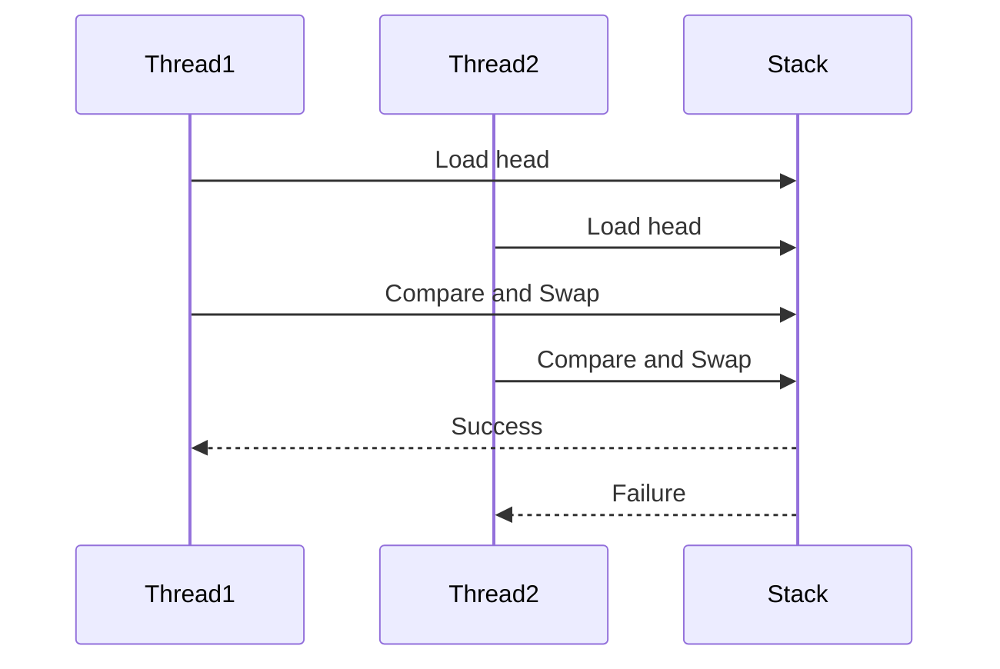

## 9.21. Lock-Free and Wait-Free Programming Patterns

Concurrency is a cornerstone of modern software development, enabling applications to perform multiple operations simultaneously. In Rust, a systems programming language known for its emphasis on safety and performance, concurrency is achieved through a variety of patterns and techniques. Among these, lock-free and wait-free programming patterns stand out as advanced methods for achieving high-performance concurrency without the pitfalls of traditional locking mechanisms.

### Understanding Lock-Free and Wait-Free Concepts

**Lock-Free Programming**: In lock-free programming, multiple threads can operate on shared data without the need for mutual exclusion locks. This approach ensures that at least one thread makes progress in a finite number of steps, thus avoiding deadlocks and reducing contention.

**Wait-Free Programming**: Wait-free programming takes this concept further by guaranteeing that every thread will complete its operation in a bounded number of steps, regardless of the actions of other threads. This provides the strongest progress guarantee and is particularly useful in real-time systems where predictability is crucial.

### Atomic Operations and Memory Ordering

At the heart of lock-free and wait-free programming are atomic operations and memory ordering. Atomic operations are indivisible actions that ensure data consistency without locks. Rust provides atomic types in its standard library, such as `AtomicBool`, `AtomicIsize`, and `AtomicUsize`, which support operations like `load`, `store`, `swap`, and `compare_and_swap`.

**Memory Ordering**: Memory ordering defines the visibility of memory operations across threads. Rust supports several memory orderings, including `Relaxed`, `Acquire`, `Release`, `AcqRel`, and `SeqCst`. These orderings control the synchronization between threads and are crucial for ensuring the correctness of lock-free algorithms.

### Example: Lock-Free Stack in Rust

Let's explore a lock-free stack implementation in Rust using atomic operations. This example demonstrates how to manage a stack without locks, ensuring thread safety and high performance.

```rust
use std::sync::atomic::{AtomicPtr, Ordering};
use std::ptr;

struct Node<T> {
    value: T,
    next: *mut Node<T>,
}

pub struct LockFreeStack<T> {
    head: AtomicPtr<Node<T>>,
}

impl<T> LockFreeStack<T> {
    pub fn new() -> Self {
        LockFreeStack {
            head: AtomicPtr::new(ptr::null_mut()),
        }
    }

    pub fn push(&self, value: T) {
        let new_node = Box::into_raw(Box::new(Node {
            value,
            next: ptr::null_mut(),
        }));

        loop {
            let head = self.head.load(Ordering::Acquire);
            unsafe { (*new_node).next = head; }

            if self.head.compare_and_swap(head, new_node, Ordering::Release) == head {
                break;
            }
        }
    }

    pub fn pop(&self) -> Option<T> {
        loop {
            let head = self.head.load(Ordering::Acquire);
            if head.is_null() {
                return None;
            }

            let next = unsafe { (*head).next };
            if self.head.compare_and_swap(head, next, Ordering::Release) == head {
                unsafe {
                    let value = ptr::read(&(*head).value);
                    Box::from_raw(head); // Deallocate the node
                    return Some(value);
                }
            }
        }
    }
}
```

**Explanation**:
- **AtomicPtr**: Used to manage pointers atomically, ensuring thread-safe operations.
- **compare_and_swap**: An atomic operation that updates the pointer only if it matches the expected value, ensuring consistency.
- **Ordering**: Memory orderings `Acquire` and `Release` are used to ensure proper synchronization between threads.

### Challenges and Pitfalls of Lock-Free Programming

While lock-free programming offers significant performance benefits, it also presents challenges:

1. **Complexity**: Designing lock-free algorithms is inherently complex and error-prone. Developers must carefully manage memory orderings and atomic operations to avoid subtle bugs.

2. **ABA Problem**: In concurrent programming, the ABA problem occurs when a location is read twice, and the value is the same both times, but the value may have changed in between. This can lead to incorrect assumptions about the state of the data.

3. **Memory Management**: Managing memory in lock-free data structures can be challenging, especially when dealing with garbage collection and reclamation of nodes.

### When to Use Lock-Free and Wait-Free Patterns

Lock-free and wait-free patterns are best suited for scenarios where high performance and low latency are critical, such as:

- **Real-Time Systems**: Where predictability and bounded execution times are essential.
- **High-Performance Computing**: Where minimizing contention and maximizing throughput are priorities.
- **Low-Latency Applications**: Such as gaming or financial systems, where delays can have significant impacts.

### Trade-Offs

- **Performance vs. Complexity**: While lock-free and wait-free patterns can improve performance, they also increase the complexity of the codebase.
- **Safety vs. Predictability**: Wait-free patterns offer stronger guarantees but may require more sophisticated algorithms and data structures.

### Rust's Unique Features

Rust's ownership model and type system provide unique advantages for lock-free programming:

- **Ownership and Borrowing**: Rust's ownership model ensures memory safety, reducing the risk of data races and undefined behavior.
- **Type System**: Rust's strong type system helps catch errors at compile time, providing additional safety guarantees.

### Visualizing Lock-Free Programming

To better understand lock-free programming, let's visualize the operations of a lock-free stack using a sequence diagram.



**Diagram Explanation**: This sequence diagram illustrates two threads attempting to push elements onto a lock-free stack. Thread1 successfully updates the head, while Thread2's operation fails due to a concurrent modification.

### Try It Yourself

Experiment with the lock-free stack implementation by modifying the code to add additional operations, such as `peek` or `is_empty`. Consider implementing a lock-free queue or other data structures to deepen your understanding of lock-free programming.

### Further Reading

For more information on lock-free and wait-free programming, consider exploring the following resources:

- [Rust Atomics and Memory Ordering](https://doc.rust-lang.org/nomicon/atomics.html)
- [Concurrency in Rust](https://doc.rust-lang.org/book/ch16-00-concurrency.html)
- [Lock-Free Data Structures](https://en.wikipedia.org/wiki/Non-blocking_algorithm)

### Knowledge Check

Before moving on, let's reinforce our understanding of lock-free and wait-free programming with a few questions.

## Quiz Time!



### What is the main advantage of lock-free programming?

- [x] It avoids deadlocks and reduces contention.
- [ ] It simplifies code complexity.
- [ ] It guarantees all threads make progress.
- [ ] It eliminates the need for atomic operations.

> **Explanation:** Lock-free programming ensures that at least one thread makes progress, avoiding deadlocks and reducing contention.

### What does the `compare_and_swap` operation do?

- [x] It updates a value only if it matches the expected value.
- [ ] It swaps two values unconditionally.
- [ ] It locks a value for exclusive access.
- [ ] It releases a lock on a value.

> **Explanation:** `compare_and_swap` updates a value only if it matches the expected value, ensuring consistency in concurrent operations.

### Which memory ordering provides the strongest synchronization guarantee?

- [x] SeqCst
- [ ] Relaxed
- [ ] Acquire
- [ ] Release

> **Explanation:** `SeqCst` (Sequential Consistency) provides the strongest synchronization guarantee, ensuring a total order of operations.

### What is the ABA problem in concurrent programming?

- [x] A problem where a value changes and then changes back, leading to incorrect assumptions.
- [ ] A problem where two threads access the same value simultaneously.
- [ ] A problem where a value is locked indefinitely.
- [ ] A problem where memory is not properly released.

> **Explanation:** The ABA problem occurs when a value changes and then changes back, leading to incorrect assumptions about the state of the data.

### In which scenarios are wait-free patterns most beneficial?

- [x] Real-time systems
- [x] High-performance computing
- [ ] Low-memory environments
- [ ] Single-threaded applications

> **Explanation:** Wait-free patterns are beneficial in real-time systems and high-performance computing, where predictability and throughput are crucial.

### What is a key challenge of lock-free programming?

- [x] Complexity in designing algorithms
- [ ] Lack of performance benefits
- [ ] Inability to handle multiple threads
- [ ] Requirement for garbage collection

> **Explanation:** Designing lock-free algorithms is complex and requires careful management of atomic operations and memory orderings.

### How does Rust's ownership model benefit lock-free programming?

- [x] It ensures memory safety and reduces data races.
- [ ] It simplifies the implementation of locks.
- [ ] It eliminates the need for atomic operations.
- [ ] It provides automatic garbage collection.

> **Explanation:** Rust's ownership model ensures memory safety, reducing the risk of data races and undefined behavior in lock-free programming.

### What is the main trade-off of using lock-free patterns?

- [x] Performance vs. Complexity
- [ ] Safety vs. Performance
- [ ] Memory usage vs. Speed
- [ ] Simplicity vs. Flexibility

> **Explanation:** The main trade-off of lock-free patterns is between performance and complexity, as they can improve performance but increase code complexity.

### True or False: Wait-free programming guarantees that every thread will complete its operation in a bounded number of steps.

- [x] True
- [ ] False

> **Explanation:** Wait-free programming guarantees that every thread will complete its operation in a bounded number of steps, providing the strongest progress guarantee.

### Which Rust feature helps catch errors at compile time in lock-free programming?

- [x] Strong type system
- [ ] Garbage collection
- [ ] Dynamic typing
- [ ] Automatic memory management

> **Explanation:** Rust's strong type system helps catch errors at compile time, providing additional safety guarantees in lock-free programming.



Remember, mastering lock-free and wait-free programming patterns is a journey. As you continue to explore these advanced concurrency techniques, you'll gain a deeper understanding of how to harness Rust's power for high-performance, concurrent applications. Keep experimenting, stay curious, and enjoy the journey!
