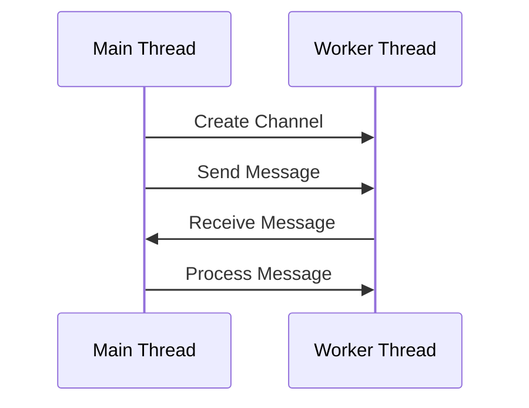

## 9.3. Message Passing with Channels

In the realm of concurrent programming, message passing is a powerful paradigm that facilitates communication between threads or processes. Unlike shared memory concurrency, where threads communicate by reading and writing to shared variables, message passing involves sending messages between threads, thereby promoting safer and more manageable concurrency. Rust, with its emphasis on safety and performance, provides robust support for message passing through its channel system.

### Introduction to Message Passing

Message passing is a concurrency model where threads or processes communicate by sending messages to each other. This model is particularly advantageous in systems where shared memory access is complex or error-prone. By using message passing, we can avoid many common concurrency issues, such as race conditions and deadlocks, by eliminating the need for shared state.

In Rust, message passing is implemented using channels, which are provided by the `std::sync::mpsc` module. Channels in Rust are inspired by the CSP (Communicating Sequential Processes) model, which emphasizes communication over shared state. This approach aligns perfectly with Rust's philosophy of safety and concurrency.

### Understanding Rust's `std::sync::mpsc` Channels

Rust's `std::sync::mpsc` module provides a multi-producer, single-consumer (MPSC) channel system. This means that multiple threads can send messages to a single receiving thread. The channel system in Rust consists of two main components: the sender and the receiver.

- **Sender**: The sender is responsible for sending messages into the channel. Multiple senders can be cloned from a single sender, allowing multiple threads to send messages concurrently.
- **Receiver**: The receiver is responsible for receiving messages from the channel. It is typically owned by a single thread that processes the incoming messages.

#### Creating and Using Channels

Let's start by creating a simple channel and using it to send and receive messages between threads.

```rust
use std::sync::mpsc;
use std::thread;
use std::time::Duration;

fn main() {
    // Create a channel
    let (tx, rx) = mpsc::channel();

    // Spawn a new thread
    thread::spawn(move || {
        let message = String::from("Hello from the thread!");
        // Send a message through the channel
        tx.send(message).unwrap();
    });

    // Receive the message in the main thread
    let received = rx.recv().unwrap();
    println!("Received: {}", received);
}
```

**Explanation:**

- We create a channel using `mpsc::channel()`, which returns a tuple containing the sender (`tx`) and the receiver (`rx`).
- We spawn a new thread using `thread::spawn`, moving the sender into the thread.
- Inside the thread, we send a message using `tx.send()`.
- In the main thread, we receive the message using `rx.recv()`, which blocks until a message is available.

### Synchronous vs. Asynchronous Channels

Rust's standard library provides synchronous channels, where the `recv` method blocks until a message is available. However, Rust also supports asynchronous channels through external crates like `async-channel` or `tokio::sync::mpsc`, which are useful in asynchronous programming contexts.

#### Synchronous Channels

Synchronous channels are straightforward and easy to use. They are suitable for scenarios where blocking is acceptable or desired.

```rust
use std::sync::mpsc;
use std::thread;

fn main() {
    let (tx, rx) = mpsc::channel();

    thread::spawn(move || {
        for i in 1..5 {
            tx.send(i).unwrap();
            println!("Sent: {}", i);
        }
    });

    for received in rx {
        println!("Received: {}", received);
    }
}
```

**Explanation:**

- The sender sends multiple messages in a loop.
- The receiver iterates over the channel, receiving messages as they arrive.

#### Asynchronous Channels

For non-blocking communication, asynchronous channels are preferred. These channels allow for more complex concurrency patterns without blocking threads.

```rust
use async_channel;
use async_std::task;

fn main() {
    task::block_on(async {
        let (tx, rx) = async_channel::unbounded();

        task::spawn(async move {
            for i in 1..5 {
                tx.send(i).await.unwrap();
                println!("Sent: {}", i);
            }
        });

        while let Ok(received) = rx.recv().await {
            println!("Received: {}", received);
        }
    });
}
```

**Explanation:**

- We use `async_channel::unbounded()` to create an asynchronous channel.
- The sender and receiver operations are performed asynchronously using `await`.

### Advantages of Message Passing

Message passing offers several advantages over shared memory concurrency:

1. **Safety**: By avoiding shared state, message passing reduces the risk of race conditions and data corruption.
2. **Modularity**: Threads communicate through well-defined interfaces, promoting modular and maintainable code.
3. **Scalability**: Message passing systems can scale more easily, as communication is decoupled from computation.
4. **Flexibility**: Channels can be used to implement various concurrency patterns, such as pipelines and work queues.

### Visualizing Message Passing with Channels

To better understand how message passing works, let's visualize the flow of messages between threads using a sequence diagram.



**Diagram Explanation:**

- The main thread creates a channel and sends a message to the worker thread.
- The worker thread receives and processes the message, demonstrating the flow of communication.

### Practical Scenarios for Message Passing

Message passing is particularly useful in the following scenarios:

- **Producer-Consumer Patterns**: Where multiple producers send data to a single consumer for processing.
- **Task Distribution**: Distributing tasks among worker threads, each processing tasks independently.
- **Event Handling**: Handling events in a non-blocking manner, where events are sent as messages to an event loop.
- **Data Pipelines**: Implementing data processing pipelines, where data flows through a series of processing stages.

### Try It Yourself

Experiment with the provided code examples by modifying the message content, adding more threads, or using asynchronous channels. Try implementing a simple producer-consumer pattern or a task distribution system using channels.

### Conclusion

Message passing with channels in Rust provides a powerful and safe way to handle concurrency. By embracing communication over shared state, we can build robust and scalable concurrent systems. As you continue your journey with Rust, remember to explore the rich ecosystem of libraries and tools that enhance Rust's concurrency capabilities.

## Quiz Time!



### What is the primary advantage of message passing over shared memory concurrency?

- [x] Reduces the risk of race conditions
- [ ] Increases memory usage
- [ ] Requires more complex code
- [ ] Decreases performance

> **Explanation:** Message passing reduces the risk of race conditions by avoiding shared state.


### Which Rust module provides the standard channel system?

- [x] `std::sync::mpsc`
- [ ] `std::thread`
- [ ] `std::sync::Arc`
- [ ] `std::sync::Mutex`

> **Explanation:** The `std::sync::mpsc` module provides the standard channel system in Rust.


### What does MPSC stand for in Rust's channel system?

- [x] Multi-Producer, Single-Consumer
- [ ] Multi-Consumer, Single-Producer
- [ ] Multi-Producer, Multi-Consumer
- [ ] Single-Producer, Single-Consumer

> **Explanation:** MPSC stands for Multi-Producer, Single-Consumer, meaning multiple threads can send messages to a single receiving thread.


### How do you create a channel in Rust?

- [x] `let (tx, rx) = mpsc::channel();`
- [ ] `let (tx, rx) = mpsc::create();`
- [ ] `let (tx, rx) = mpsc::new();`
- [ ] `let (tx, rx) = mpsc::make();`

> **Explanation:** A channel is created using `mpsc::channel()` in Rust.


### What method is used to send a message through a channel?

- [x] `send`
- [ ] `push`
- [ ] `emit`
- [ ] `transmit`

> **Explanation:** The `send` method is used to send a message through a channel.


### What method is used to receive a message from a channel synchronously?

- [x] `recv`
- [ ] `receive`
- [ ] `get`
- [ ] `fetch`

> **Explanation:** The `recv` method is used to receive a message from a channel synchronously.


### What is a key benefit of using asynchronous channels?

- [x] Non-blocking communication
- [ ] Increased memory usage
- [ ] Simplified code
- [ ] Reduced thread count

> **Explanation:** Asynchronous channels allow for non-blocking communication, which is beneficial in many concurrent programming scenarios.


### Which crate provides asynchronous channels in Rust?

- [x] `async-channel`
- [ ] `tokio-channel`
- [ ] `futures-channel`
- [ ] `mio-channel`

> **Explanation:** The `async-channel` crate provides asynchronous channels in Rust.


### In Rust, what does the `recv` method do when no message is available?

- [x] Blocks until a message is available
- [ ] Returns `None`
- [ ] Panics
- [ ] Returns an error

> **Explanation:** The `recv` method blocks until a message is available.


### True or False: Message passing in Rust can help avoid deadlocks.

- [x] True
- [ ] False

> **Explanation:** Message passing can help avoid deadlocks by eliminating the need for shared state and complex locking mechanisms.



Remember, this is just the beginning. As you progress, you'll build more complex and interactive systems using Rust's concurrency features. Keep experimenting, stay curious, and enjoy the journey!
