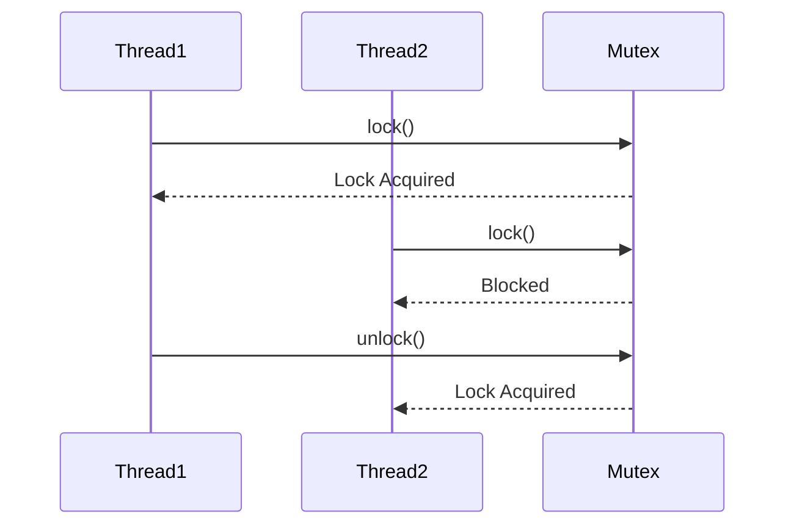
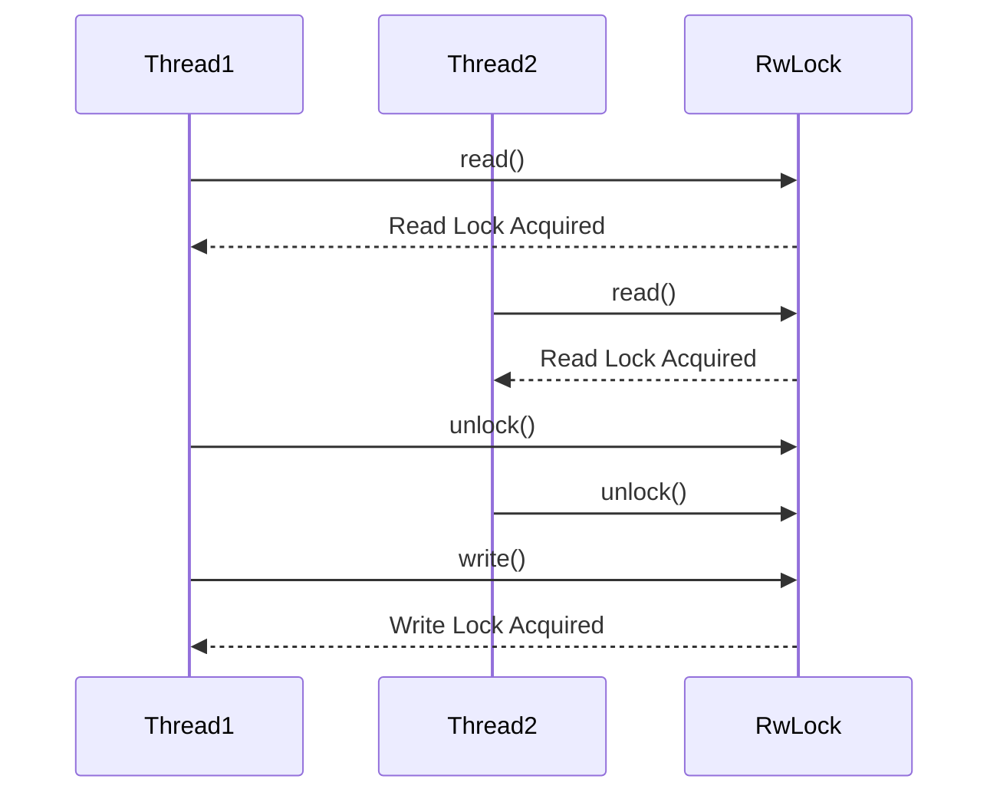

## 9.4. Shared Memory with `Mutex` and `RwLock`

Concurrency in Rust is a powerful feature that allows developers to write efficient and safe programs. However, when multiple threads need to access shared data, synchronization becomes crucial to prevent data races and ensure thread safety. In this section, we will explore how Rust's `Mutex` and `RwLock` primitives can be used to safely share mutable data between threads.

### Understanding the Need for Synchronization

When multiple threads access shared data, especially when at least one of them modifies the data, synchronization is necessary to prevent data races. A data race occurs when two or more threads access shared data concurrently, and at least one of the accesses is a write. This can lead to unpredictable behavior and bugs that are difficult to reproduce and fix.

Rust's ownership model provides compile-time guarantees to prevent data races, but when it comes to shared mutable state, we need to use synchronization primitives to ensure that only one thread can access the data at a time.

### Introducing `Mutex` and `RwLock`

Rust provides two primary synchronization primitives for managing shared mutable state: `Mutex` and `RwLock`.

#### `Mutex`

A `Mutex` (short for mutual exclusion) is a synchronization primitive that ensures that only one thread can access the data it guards at a time. When a thread wants to access the data, it must first acquire the lock. If another thread holds the lock, the requesting thread will block until the lock becomes available.

```rust
use std::sync::{Arc, Mutex};
use std::thread;

fn main() {
    let data = Arc::new(Mutex::new(0));

    let mut handles = vec![];

    for _ in 0..10 {
        let data = Arc::clone(&data);
        let handle = thread::spawn(move || {
            let mut num = data.lock().unwrap();
            *num += 1;
        });
        handles.push(handle);
    }

    for handle in handles {
        handle.join().unwrap();
    }

    println!("Result: {}", *data.lock().unwrap());
}
```

**Explanation:**

- **Arc**: We use `Arc` (Atomic Reference Counting) to share ownership of the `Mutex` across threads.
- **Mutex**: The `Mutex` guards the shared data, ensuring only one thread can access it at a time.
- **lock()**: The `lock()` method is used to acquire the lock. It returns a `MutexGuard`, which allows access to the data.
- **unwrap()**: We use `unwrap()` to handle the possibility of a poisoned lock, which occurs if a thread panics while holding the lock.

#### `RwLock`

An `RwLock` (Read-Write Lock) allows multiple readers or one writer at a time. This is useful when the data is read more often than it is written, as it allows for greater concurrency.

```rust
use std::sync::{Arc, RwLock};
use std::thread;

fn main() {
    let data = Arc::new(RwLock::new(0));

    let mut handles = vec![];

    for _ in 0..10 {
        let data = Arc::clone(&data);
        let handle = thread::spawn(move || {
            let mut num = data.write().unwrap();
            *num += 1;
        });
        handles.push(handle);
    }

    for handle in handles {
        handle.join().unwrap();
    }

    println!("Result: {}", *data.read().unwrap());
}
```

**Explanation:**

- **write()**: Acquires a write lock, allowing exclusive access to the data.
- **read()**: Acquires a read lock, allowing shared access to the data.

### Differences Between `Mutex` and `RwLock`

- **Concurrency**: `Mutex` allows only one thread to access the data at a time, while `RwLock` allows multiple readers or one writer.
- **Performance**: `RwLock` can be more performant in scenarios with frequent reads and infrequent writes, as it allows multiple threads to read concurrently.

### Avoiding Deadlocks

Deadlocks occur when two or more threads are blocked forever, each waiting for the other to release a lock. To avoid deadlocks:

1. **Lock Ordering**: Always acquire locks in a consistent order across threads.
2. **Timeouts**: Use timeouts to avoid waiting indefinitely for a lock.
3. **Try Locks**: Use `try_lock()` or `try_write()` to attempt to acquire a lock without blocking.

### Best Practices for Using Locks Efficiently

- **Minimize Lock Scope**: Hold locks for the shortest time possible to reduce contention.
- **Prefer `RwLock` for Read-Heavy Workloads**: Use `RwLock` when reads significantly outnumber writes.
- **Avoid Blocking Operations While Holding a Lock**: Do not perform operations that can block for a long time while holding a lock.
- **Use `Arc` for Shared Ownership**: Use `Arc` to share ownership of the lock across threads safely.

### Visualizing Locking Mechanisms

To better understand how `Mutex` and `RwLock` work, let's visualize their behavior using Mermaid.js diagrams.



**Diagram Explanation**: This sequence diagram shows how `Mutex` ensures mutual exclusion by blocking `Thread2` until `Thread1` releases the lock.



**Diagram Explanation**: This sequence diagram illustrates how `RwLock` allows multiple readers but only one writer.

### Try It Yourself

Experiment with the code examples provided:

- Modify the number of threads to see how it affects performance.
- Try using `try_lock()` and `try_write()` to handle lock acquisition failures gracefully.
- Implement a scenario where a deadlock might occur and then resolve it using lock ordering.

### References and Further Reading

- [Rust Documentation on Mutex](https://doc.rust-lang.org/std/sync/struct.Mutex.html)
- [Rust Documentation on RwLock](https://doc.rust-lang.org/std/sync/struct.RwLock.html)
- [The Rust Programming Language Book](https://doc.rust-lang.org/book/)

### Knowledge Check

- What is the primary purpose of using `Mutex` and `RwLock` in Rust?
- How does `RwLock` differ from `Mutex` in terms of concurrency?
- What are some strategies to avoid deadlocks when using locks?
- Why is it important to minimize the scope of a lock?

### Embrace the Journey

Remember, mastering concurrency in Rust is a journey. As you continue to explore and experiment with `Mutex` and `RwLock`, you'll gain a deeper understanding of how to write safe and efficient concurrent programs. Keep experimenting, stay curious, and enjoy the journey!

## Quiz Time!



### What is the primary purpose of using `Mutex` in Rust?

- [x] To ensure mutual exclusion when accessing shared data
- [ ] To allow multiple threads to read data concurrently
- [ ] To improve the performance of single-threaded applications
- [ ] To manage memory allocation

> **Explanation:** `Mutex` is used to ensure that only one thread can access shared data at a time, preventing data races.

### How does `RwLock` differ from `Mutex` in terms of concurrency?

- [x] `RwLock` allows multiple readers or one writer
- [ ] `RwLock` allows only one reader or one writer
- [ ] `RwLock` allows multiple writers
- [ ] `RwLock` does not provide any concurrency control

> **Explanation:** `RwLock` allows multiple threads to read concurrently but only one thread to write at a time.

### What is a common strategy to avoid deadlocks when using locks?

- [x] Lock ordering
- [ ] Using more locks
- [ ] Ignoring lock acquisition order
- [ ] Increasing the number of threads

> **Explanation:** Lock ordering involves acquiring locks in a consistent order across threads to prevent deadlocks.

### Why is it important to minimize the scope of a lock?

- [x] To reduce contention and improve performance
- [ ] To increase the complexity of the code
- [ ] To ensure locks are held longer
- [ ] To make debugging easier

> **Explanation:** Minimizing lock scope reduces contention and improves performance by allowing other threads to access the lock sooner.

### Which method is used to acquire a read lock with `RwLock`?

- [x] `read()`
- [ ] `write()`
- [ ] `lock()`
- [ ] `try_lock()`

> **Explanation:** The `read()` method is used to acquire a read lock with `RwLock`.

### What happens if a thread panics while holding a `Mutex` lock?

- [x] The lock becomes poisoned
- [ ] The lock is automatically released
- [ ] The lock remains unaffected
- [ ] The program crashes

> **Explanation:** If a thread panics while holding a `Mutex` lock, the lock becomes poisoned, indicating potential data corruption.

### How can you handle a poisoned lock in Rust?

- [x] By using `unwrap()` or handling the error
- [ ] By ignoring the error
- [ ] By restarting the program
- [ ] By using a different lock

> **Explanation:** You can handle a poisoned lock by using `unwrap()` or handling the error to decide how to proceed.

### What is a potential downside of using `RwLock`?

- [x] It can lead to writer starvation
- [ ] It does not allow concurrent reads
- [ ] It is slower than `Mutex` for write-heavy workloads
- [ ] It cannot be used in multi-threaded programs

> **Explanation:** `RwLock` can lead to writer starvation if there are many readers, as writers have to wait for all readers to release the lock.

### Which Rust feature helps in sharing ownership of a `Mutex` across threads?

- [x] `Arc`
- [ ] `Rc`
- [ ] `Box`
- [ ] `Cell`

> **Explanation:** `Arc` (Atomic Reference Counting) is used to share ownership of a `Mutex` across threads safely.

### True or False: `Mutex` and `RwLock` are the only synchronization primitives available in Rust.

- [ ] True
- [x] False

> **Explanation:** Rust provides other synchronization primitives like `Condvar`, `Barrier`, and atomic types for different concurrency needs.


