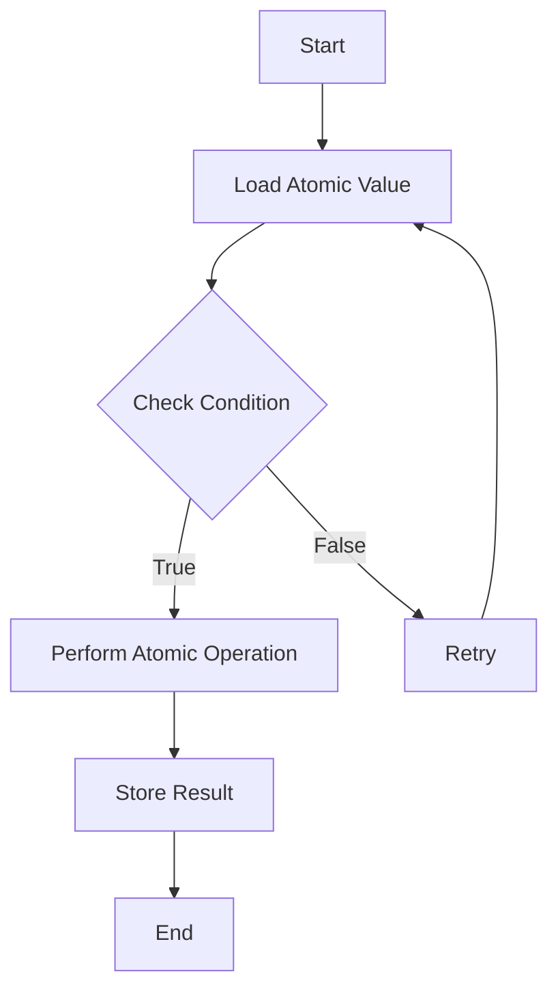

## 9.5. Atomics and Low-Level Concurrency

In the realm of systems programming, concurrency is a critical aspect that allows programs to perform multiple operations simultaneously. Rust, with its emphasis on safety and performance, provides robust tools for managing concurrency. In this section, we delve into the world of atomics and low-level concurrency in Rust, exploring how atomic operations can be used to achieve fine-grained control over multi-threaded applications.

### Understanding Atomic Types

Atomic types are fundamental building blocks for concurrent programming. They allow for lock-free, thread-safe operations on shared data. In Rust, atomic types are provided by the `std::sync::atomic` module, which includes types like `AtomicBool`, `AtomicIsize`, `AtomicUsize`, and others. These types are designed to be accessed and modified atomically, meaning that their operations are indivisible and cannot be interrupted by other threads.

#### Purpose of Atomic Types

The primary purpose of atomic types is to enable safe manipulation of shared data without the need for locks. This is particularly useful in scenarios where locking mechanisms might introduce unacceptable performance overhead or where fine-grained control over concurrency is required.

Atomic operations are typically used for:

- **Synchronization**: Ensuring that multiple threads can safely read and write shared data.
- **Lock-free Programming**: Implementing algorithms that do not require locks, thereby avoiding potential deadlocks and reducing contention.
- **Performance Optimization**: Minimizing the overhead associated with traditional locking mechanisms.

### Using Atomic Primitives

Rust provides several atomic primitives that can be used to perform atomic operations. Let's explore some of the most commonly used atomic types and their operations.

#### AtomicBool

`AtomicBool` is an atomic version of the boolean type. It provides methods for atomic operations such as `load`, `store`, `swap`, and `compare_and_swap`.

```rust
use std::sync::atomic::{AtomicBool, Ordering};

fn main() {
    let flag = AtomicBool::new(false);

    // Atomically set the flag to true
    flag.store(true, Ordering::SeqCst);

    // Atomically load the value of the flag
    let value = flag.load(Ordering::SeqCst);
    println!("Flag value: {}", value);

    // Atomically swap the value of the flag
    let old_value = flag.swap(false, Ordering::SeqCst);
    println!("Old flag value: {}", old_value);
}
```

#### AtomicUsize

`AtomicUsize` is an atomic version of the `usize` type. It is often used for counters or indices that need to be updated atomically.

```rust
use std::sync::atomic::{AtomicUsize, Ordering};

fn main() {
    let counter = AtomicUsize::new(0);

    // Atomically increment the counter
    counter.fetch_add(1, Ordering::SeqCst);

    // Atomically load the value of the counter
    let value = counter.load(Ordering::SeqCst);
    println!("Counter value: {}", value);

    // Atomically compare and swap the counter value
    let old_value = counter.compare_and_swap(1, 2, Ordering::SeqCst);
    println!("Old counter value: {}", old_value);
}
```

### Lock-Free Programming Techniques

Lock-free programming is a technique that allows multiple threads to operate on shared data without using locks. This can lead to significant performance improvements, especially in high-contention scenarios. Let's explore some lock-free programming techniques using atomic operations.

#### Compare-and-Swap (CAS)

The compare-and-swap (CAS) operation is a fundamental building block for lock-free programming. It allows a thread to update a variable only if it has not been modified by another thread since it was last read.

```rust
use std::sync::atomic::{AtomicUsize, Ordering};
use std::thread;

fn main() {
    let counter = AtomicUsize::new(0);

    let handles: Vec<_> = (0..10).map(|_| {
        let counter = &counter;
        thread::spawn(move || {
            for _ in 0..1000 {
                let mut current = counter.load(Ordering::Relaxed);
                loop {
                    let new = current + 1;
                    match counter.compare_exchange_weak(current, new, Ordering::SeqCst, Ordering::Relaxed) {
                        Ok(_) => break,
                        Err(x) => current = x,
                    }
                }
            }
        })
    }).collect();

    for handle in handles {
        handle.join().unwrap();
    }

    println!("Final counter value: {}", counter.load(Ordering::SeqCst));
}
```

In this example, multiple threads increment a shared counter using the CAS operation. The `compare_exchange_weak` method attempts to update the counter, and if it fails (because another thread has modified the counter), it retries until it succeeds.

### Memory Ordering and Its Importance

Memory ordering is a crucial concept in concurrent programming. It defines the order in which operations on shared data are visible to different threads. Rust provides several memory ordering options, each with different guarantees:

- **Relaxed**: No ordering guarantees. Operations can be reordered freely.
- **Acquire**: Ensures that subsequent operations are not reordered before the acquire.
- **Release**: Ensures that previous operations are not reordered after the release.
- **AcquireRelease**: Combines the guarantees of acquire and release.
- **SeqCst**: Provides the strongest ordering guarantees, ensuring a total order of operations.

Choosing the right memory ordering is essential for ensuring the correctness and performance of concurrent programs.

### When to Use Atomics Over Higher-Level Synchronization

While atomic operations provide fine-grained control over concurrency, they are not always the best choice. Here are some guidelines for when to use atomics:

- **Use Atomics**: When you need fine-grained control over shared data and can ensure correctness with atomic operations alone. Atomics are ideal for implementing lock-free data structures and algorithms.
- **Use Higher-Level Synchronization**: When the complexity of using atomics outweighs the performance benefits. Higher-level synchronization primitives like `Mutex` and `RwLock` are easier to use and less error-prone.

### Visualizing Atomic Operations

To better understand atomic operations and memory ordering, let's visualize the process using a flowchart.



This flowchart represents a typical atomic operation, where a value is loaded, a condition is checked, and an atomic operation is performed if the condition is met. If the condition is not met, the operation is retried.

### Try It Yourself

Experiment with the code examples provided in this section. Try modifying the memory ordering or the number of threads to see how it affects the program's behavior. This hands-on approach will help solidify your understanding of atomics and low-level concurrency in Rust.

### Key Takeaways

- Atomic types in Rust provide lock-free, thread-safe operations on shared data.
- Atomic operations are useful for synchronization, lock-free programming, and performance optimization.
- Memory ordering is crucial for ensuring the correctness of concurrent programs.
- Use atomics when you need fine-grained control, but consider higher-level synchronization for simpler use cases.

### References and Further Reading

- [Rust Atomics and Memory Ordering](https://doc.rust-lang.org/std/sync/atomic/index.html)
- [The Rust Programming Language Book](https://doc.rust-lang.org/book/)
- [Rust Concurrency Patterns](https://rust-unofficial.github.io/patterns/)

## Quiz Time!



### What is the primary purpose of atomic types in Rust?

- [x] To enable safe manipulation of shared data without locks
- [ ] To provide high-level synchronization primitives
- [ ] To replace all traditional locking mechanisms
- [ ] To simplify concurrent programming

> **Explanation:** Atomic types allow for lock-free, thread-safe operations on shared data, enabling safe manipulation without locks.

### Which atomic type is commonly used for counters or indices?

- [ ] AtomicBool
- [x] AtomicUsize
- [ ] AtomicIsize
- [ ] AtomicPtr

> **Explanation:** `AtomicUsize` is often used for counters or indices that need to be updated atomically.

### What is the compare-and-swap (CAS) operation used for?

- [x] To update a variable only if it has not been modified by another thread
- [ ] To lock a variable for exclusive access
- [ ] To swap two variables atomically
- [ ] To release a lock on a variable

> **Explanation:** CAS allows a thread to update a variable only if it has not been modified by another thread since it was last read.

### Which memory ordering option provides the strongest guarantees?

- [ ] Relaxed
- [ ] Acquire
- [ ] Release
- [x] SeqCst

> **Explanation:** `SeqCst` provides the strongest ordering guarantees, ensuring a total order of operations.

### When should you use higher-level synchronization primitives over atomics?

- [x] When the complexity of using atomics outweighs the performance benefits
- [ ] When you need fine-grained control over shared data
- [ ] When implementing lock-free data structures
- [ ] When performance is not a concern

> **Explanation:** Higher-level synchronization primitives are easier to use and less error-prone, making them preferable when the complexity of using atomics is too high.

### What does the `compare_exchange_weak` method do?

- [x] Attempts to update a variable and retries if it fails
- [ ] Locks a variable for exclusive access
- [ ] Swaps two variables atomically
- [ ] Releases a lock on a variable

> **Explanation:** `compare_exchange_weak` attempts to update a variable and retries if it fails due to concurrent modifications.

### What is the benefit of lock-free programming?

- [x] Avoids potential deadlocks and reduces contention
- [ ] Simplifies concurrent programming
- [ ] Provides high-level synchronization primitives
- [ ] Ensures a total order of operations

> **Explanation:** Lock-free programming avoids potential deadlocks and reduces contention, leading to performance improvements.

### Which atomic type is used for atomic operations on boolean values?

- [x] AtomicBool
- [ ] AtomicUsize
- [ ] AtomicIsize
- [ ] AtomicPtr

> **Explanation:** `AtomicBool` is used for atomic operations on boolean values.

### What is the role of memory ordering in concurrent programming?

- [x] Defines the order in which operations on shared data are visible to different threads
- [ ] Simplifies concurrent programming
- [ ] Provides high-level synchronization primitives
- [ ] Ensures lock-free operations

> **Explanation:** Memory ordering defines the order in which operations on shared data are visible to different threads, ensuring correctness.

### True or False: Atomics should always be used over higher-level synchronization primitives.

- [ ] True
- [x] False

> **Explanation:** Atomics should be used when fine-grained control is needed, but higher-level synchronization primitives are often easier to use and less error-prone.



Remember, mastering atomics and low-level concurrency is a journey. Keep experimenting, stay curious, and enjoy the process of learning and applying these powerful tools in Rust!
