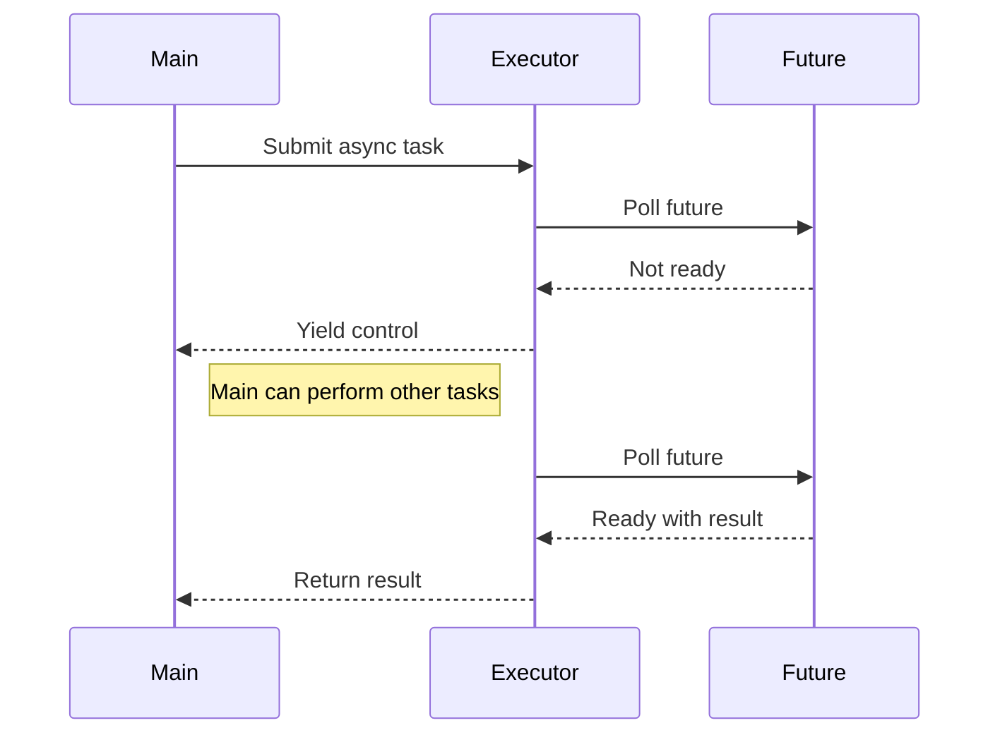

## 9.6. Asynchronous Programming with `async`/`await`

Asynchronous programming is a paradigm that allows a program to perform tasks without waiting for other tasks to complete. This is particularly useful in I/O-bound and high-level structured network code, where waiting for data can lead to inefficiencies. Rust's `async`/`await` syntax provides a powerful way to write asynchronous code that is both efficient and easy to understand.

### Introduction to Asynchronous Programming

Asynchronous programming enables a program to initiate a task and continue executing other tasks while waiting for the initial task to complete. This is achieved by using non-blocking operations, which allow the program to remain responsive and efficient.

In traditional synchronous programming, tasks are executed sequentially, meaning each task must complete before the next one begins. This can lead to inefficiencies, especially when tasks involve waiting for I/O operations, such as reading from a file or fetching data from a network.

Asynchronous programming addresses these inefficiencies by allowing tasks to be executed concurrently, without blocking the execution of other tasks. This is particularly beneficial in scenarios where tasks spend a significant amount of time waiting for external resources.

### `async` Functions and `await` in Rust

Rust's `async`/`await` syntax provides a way to write asynchronous code that is both efficient and easy to understand. The `async` keyword is used to define an asynchronous function, while the `await` keyword is used to pause the execution of an asynchronous function until a particular operation is complete.

#### `async` Functions

An `async` function in Rust is defined using the `async` keyword before the `fn` keyword. This indicates that the function is asynchronous and returns a `Future`. A `Future` is a value that represents a computation that may not have completed yet.

```rust
async fn fetch_data() -> Result<String, reqwest::Error> {
    let response = reqwest::get("https://api.example.com/data").await?;
    let data = response.text().await?;
    Ok(data)
}
```

In the example above, the `fetch_data` function is asynchronous and returns a `Future` that resolves to a `Result<String, reqwest::Error>`. The `await` keyword is used to pause the execution of the function until the `reqwest::get` operation is complete.

#### The `await` Keyword

The `await` keyword is used to pause the execution of an asynchronous function until a particular operation is complete. It can only be used inside an `async` function.

```rust
async fn process_data() {
    let data = fetch_data().await.unwrap();
    println!("Data: {}", data);
}
```

In the `process_data` function, the `await` keyword is used to pause the execution until the `fetch_data` function completes. Once the `fetch_data` function completes, the `process_data` function resumes execution.

### Futures and Executors

In Rust, asynchronous operations are represented by `Future` objects. A `Future` is a value that represents a computation that may not have completed yet. When a `Future` is awaited, the current task is paused, and control is returned to the executor.

#### Futures

A `Future` is an abstraction that represents a value that will be available at some point in the future. In Rust, a `Future` is a trait that defines a single method, `poll`, which is used to check whether the future is complete.

```rust
use std::future::Future;
use std::pin::Pin;
use std::task::{Context, Poll};

struct MyFuture;

impl Future for MyFuture {
    type Output = i32;

    fn poll(self: Pin<&mut Self>, _cx: &mut Context<'_>) -> Poll<Self::Output> {
        Poll::Ready(42)
    }
}
```

In the example above, the `MyFuture` struct implements the `Future` trait. The `poll` method returns `Poll::Ready(42)`, indicating that the future is complete and the value `42` is available.

#### Executors

Executors are responsible for running asynchronous tasks to completion. They manage the scheduling and execution of `Future` objects. In Rust, the most popular executor is [Tokio](https://tokio.rs/), which provides a runtime for executing asynchronous tasks.

```rust
use tokio::runtime::Runtime;

fn main() {
    let rt = Runtime::new().unwrap();
    rt.block_on(async {
        let data = fetch_data().await.unwrap();
        println!("Data: {}", data);
    });
}
```

In the example above, a `Runtime` is created using `tokio::runtime::Runtime::new()`. The `block_on` method is used to run the asynchronous block to completion.

### Writing Asynchronous Code in Rust

Writing asynchronous code in Rust involves defining `async` functions, using the `await` keyword, and running the code using an executor. Let's explore a more comprehensive example.

#### Example: Fetching Data from Multiple URLs

Suppose we want to fetch data from multiple URLs concurrently. We can achieve this using Rust's `async`/`await` syntax.

```rust
use reqwest;
use tokio;

async fn fetch_url(url: &str) -> Result<String, reqwest::Error> {
    let response = reqwest::get(url).await?;
    let body = response.text().await?;
    Ok(body)
}

#[tokio::main]
async fn main() {
    let urls = vec![
        "https://api.example.com/data1",
        "https://api.example.com/data2",
        "https://api.example.com/data3",
    ];

    let futures = urls.iter().map(|&url| fetch_url(url));

    let results: Vec<_> = futures::future::join_all(futures).await;

    for result in results {
        match result {
            Ok(data) => println!("Fetched data: {}", data),
            Err(e) => eprintln!("Error fetching data: {}", e),
        }
    }
}
```

In this example, we define an `async` function `fetch_url` that fetches data from a given URL. In the `main` function, we create a vector of URLs and use `futures::future::join_all` to run the `fetch_url` function concurrently for each URL. The results are collected into a vector, and we iterate over the results to print the fetched data.

### Benefits and Use Cases of Async Programming in Rust

Asynchronous programming in Rust offers several benefits, including:

- **Non-blocking I/O**: Asynchronous programming allows for non-blocking I/O operations, which can improve the responsiveness and efficiency of applications.
- **Concurrency**: Asynchronous programming enables concurrent execution of tasks, allowing applications to perform multiple operations simultaneously.
- **Resource Efficiency**: By avoiding blocking operations, asynchronous programming can lead to more efficient use of system resources.

#### Use Cases

Asynchronous programming is particularly useful in scenarios where tasks involve waiting for I/O operations, such as:

- **Network Applications**: Asynchronous programming is ideal for network applications, where tasks often involve waiting for data from remote servers.
- **File I/O**: Asynchronous programming can improve the performance of applications that perform file I/O operations.
- **User Interfaces**: Asynchronous programming can be used to keep user interfaces responsive by performing long-running tasks in the background.

### Visualizing Asynchronous Programming

To better understand how asynchronous programming works in Rust, let's visualize the flow of an asynchronous program using a sequence diagram.



**Diagram Description**: This sequence diagram illustrates the flow of an asynchronous program in Rust. The `Main` function submits an asynchronous task to the `Executor`, which polls the `Future`. If the `Future` is not ready, control is yielded back to the `Main` function, allowing it to perform other tasks. Once the `Future` is ready, the result is returned to the `Main` function.

### External Frameworks: Tokio

[Tokio](https://tokio.rs/) is a popular asynchronous runtime for Rust. It provides a set of tools for building asynchronous applications, including an executor, timers, and I/O utilities. Tokio is widely used in the Rust ecosystem and is the foundation for many asynchronous libraries.

#### Using Tokio

To use Tokio in your Rust project, add the following dependency to your `Cargo.toml` file:

```toml
[dependencies]
tokio = { version = "1", features = ["full"] }
```

Tokio provides a `#[tokio::main]` attribute macro that can be used to define the entry point of an asynchronous application. This macro sets up the Tokio runtime and runs the asynchronous `main` function.

```rust
#[tokio::main]
async fn main() {
    // Your asynchronous code here
}
```

### Try It Yourself

To get hands-on experience with asynchronous programming in Rust, try modifying the code examples provided in this section. Experiment with different URLs, error handling strategies, and concurrency patterns. Consider implementing additional features, such as retry logic or timeout handling.

### Key Takeaways

- Asynchronous programming allows for non-blocking operations, improving the responsiveness and efficiency of applications.
- Rust's `async`/`await` syntax provides a powerful way to write asynchronous code.
- Futures represent computations that may not have completed yet, and executors are responsible for running asynchronous tasks.
- Tokio is a popular asynchronous runtime for Rust, providing tools for building asynchronous applications.

### References and Links

- [Tokio](https://tokio.rs/)
- [Rust Async Book](https://rust-lang.github.io/async-book/)
- [Rust Documentation on Async/Await](https://doc.rust-lang.org/std/async/index.html)

## Quiz Time!



### What is the primary benefit of asynchronous programming?

- [x] Non-blocking operations
- [ ] Increased memory usage
- [ ] Synchronous execution
- [ ] Reduced code complexity

> **Explanation:** Asynchronous programming allows for non-blocking operations, which can improve the responsiveness and efficiency of applications.

### What does the `async` keyword do in Rust?

- [x] Defines an asynchronous function
- [ ] Blocks the current thread
- [ ] Executes a function immediately
- [ ] Returns a synchronous result

> **Explanation:** The `async` keyword is used to define an asynchronous function in Rust, which returns a `Future`.

### What is a `Future` in Rust?

- [x] A value representing a computation that may not have completed yet
- [ ] A synchronous function
- [ ] A blocking operation
- [ ] A data structure for storing results

> **Explanation:** A `Future` is an abstraction that represents a value that will be available at some point in the future.

### What is the role of an executor in Rust?

- [x] Runs asynchronous tasks to completion
- [ ] Blocks the main thread
- [ ] Executes synchronous functions
- [ ] Manages memory allocation

> **Explanation:** Executors are responsible for running asynchronous tasks to completion, managing the scheduling and execution of `Future` objects.

### Which of the following is a popular asynchronous runtime for Rust?

- [x] Tokio
- [ ] Node.js
- [ ] Django
- [ ] Flask

> **Explanation:** Tokio is a popular asynchronous runtime for Rust, providing tools for building asynchronous applications.

### What does the `await` keyword do in Rust?

- [x] Pauses the execution of an asynchronous function until a particular operation is complete
- [ ] Blocks the current thread
- [ ] Executes a function immediately
- [ ] Returns a synchronous result

> **Explanation:** The `await` keyword is used to pause the execution of an asynchronous function until a particular operation is complete.

### How can you define an asynchronous entry point in a Rust application using Tokio?

- [x] Use the `#[tokio::main]` attribute macro
- [ ] Use the `#[async::main]` attribute macro
- [ ] Use the `#[main::async]` attribute macro
- [ ] Use the `#[tokio::entry]` attribute macro

> **Explanation:** The `#[tokio::main]` attribute macro is used to define the entry point of an asynchronous application in Rust using Tokio.

### What is the purpose of the `futures::future::join_all` function?

- [x] Runs multiple futures concurrently and collects their results
- [ ] Blocks the current thread until all futures are complete
- [ ] Executes a single future immediately
- [ ] Returns a synchronous result

> **Explanation:** The `futures::future::join_all` function is used to run multiple futures concurrently and collect their results.

### What is the primary use case for asynchronous programming?

- [x] I/O-bound operations
- [ ] CPU-bound operations
- [ ] Memory-bound operations
- [ ] Synchronous execution

> **Explanation:** Asynchronous programming is particularly useful in scenarios where tasks involve waiting for I/O operations.

### True or False: Asynchronous programming in Rust can improve the responsiveness and efficiency of applications.

- [x] True
- [ ] False

> **Explanation:** Asynchronous programming allows for non-blocking operations, which can improve the responsiveness and efficiency of applications.



Remember, this is just the beginning. As you progress, you'll build more complex and interactive applications. Keep experimenting, stay curious, and enjoy the journey!
