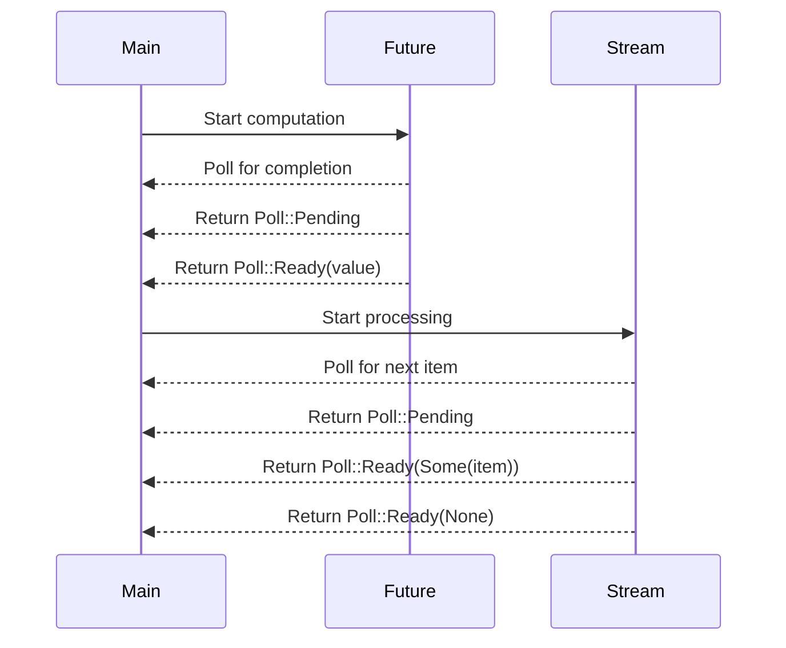

## 9.7. Futures and Streams

### Introduction

In the realm of Rust programming, understanding futures and streams is crucial for mastering asynchronous computation and event handling. These abstractions allow developers to write non-blocking code, which is essential for building high-performance applications. In this section, we will delve into the concepts of futures and streams, explore the `Future` and `Stream` traits, and provide practical examples to illustrate their usage.

### What Are Futures?

Futures in Rust represent a value that may not be available yet. They are a way to express a computation that will complete at some point in the future. This concept is particularly useful in asynchronous programming, where operations such as network requests or file I/O can take an indeterminate amount of time to complete.

#### The `Future` Trait

The `Future` trait is the cornerstone of asynchronous programming in Rust. It defines a computation that can be polled to determine if it is complete. Here is a simplified version of the `Future` trait:

```rust
use std::pin::Pin;
use std::task::{Context, Poll};

pub trait Future {
    type Output;

    fn poll(self: Pin<&mut Self>, cx: &mut Context<'_>) -> Poll<Self::Output>;
}
```

- **`Output`**: The type of value that the future will eventually produce.
- **`poll`**: A method that attempts to resolve the future to a final value. It returns `Poll::Pending` if the future is not ready yet, or `Poll::Ready(value)` if it has completed with a value.

### Understanding Streams

While futures represent a single asynchronous computation, streams handle sequences of asynchronous events. A stream can be thought of as an asynchronous iterator, producing a series of values over time.

#### The `Stream` Trait

The `Stream` trait is similar to the `Future` trait but is designed for handling multiple values. Here is a simplified version of the `Stream` trait:

```rust
use std::pin::Pin;
use std::task::{Context, Poll};

pub trait Stream {
    type Item;

    fn poll_next(self: Pin<&mut Self>, cx: &mut Context<'_>) -> Poll<Option<Self::Item>>;
}
```

- **`Item`**: The type of values that the stream will produce.
- **`poll_next`**: A method that attempts to resolve the next item in the stream. It returns `Poll::Pending` if no item is ready yet, `Poll::Ready(Some(item))` if an item is available, or `Poll::Ready(None)` if the stream is exhausted.

### Composing Futures

One of the powerful features of futures is their ability to be composed. This allows developers to build complex asynchronous workflows by chaining together multiple futures.

#### Example: Chaining Futures

Let's consider a simple example where we chain two futures together using the `then` combinator:

```rust
use futures::future::{self, FutureExt};

async fn fetch_data() -> Result<String, &'static str> {
    // Simulate a network request
    Ok("data".to_string())
}

async fn process_data(data: String) -> Result<String, &'static str> {
    // Simulate data processing
    Ok(format!("processed {}", data))
}

async fn main() {
    let result = fetch_data()
        .then(|data| async {
            match data {
                Ok(data) => process_data(data).await,
                Err(e) => Err(e),
            }
        })
        .await;

    match result {
        Ok(processed_data) => println!("Success: {}", processed_data),
        Err(e) => println!("Error: {}", e),
    }
}
```

In this example, `fetch_data` and `process_data` are asynchronous functions that return futures. We use the `then` combinator to chain them together, ensuring that `process_data` is only called after `fetch_data` completes successfully.

### Processing Streams

Streams can be processed in a similar manner to futures, allowing developers to handle sequences of asynchronous events.

#### Example: Processing a Stream

Let's look at an example where we process a stream of integers:

```rust
use futures::stream::{self, StreamExt};

async fn main() {
    let stream = stream::iter(vec![1, 2, 3, 4, 5]);

    let sum = stream
        .fold(0, |acc, x| async move { acc + x })
        .await;

    println!("Sum: {}", sum);
}
```

In this example, we create a stream of integers using `stream::iter`. We then use the `fold` combinator to accumulate the sum of the integers in the stream.

### Error Handling in Async Operations

Error handling is a critical aspect of asynchronous programming. Rust provides robust mechanisms for handling errors in futures and streams.

#### Example: Handling Errors in Futures

Let's modify our previous example to include error handling:

```rust
use futures::future::{self, FutureExt};

async fn fetch_data() -> Result<String, &'static str> {
    // Simulate a network request that may fail
    Err("network error")
}

async fn process_data(data: String) -> Result<String, &'static str> {
    // Simulate data processing
    Ok(format!("processed {}", data))
}

async fn main() {
    let result = fetch_data()
        .then(|data| async {
            match data {
                Ok(data) => process_data(data).await,
                Err(e) => Err(e),
            }
        })
        .await;

    match result {
        Ok(processed_data) => println!("Success: {}", processed_data),
        Err(e) => println!("Error: {}", e),
    }
}
```

In this example, `fetch_data` may fail, returning an error. We handle this error by propagating it through the chain of futures.

### Cancellation in Async Operations

Cancellation is another important concept in asynchronous programming. Rust futures can be cancelled by simply dropping them. This is useful when you want to abort an operation that is no longer needed.

#### Example: Cancelling a Future

Consider the following example where we cancel a future:

```rust
use futures::future::{self, FutureExt};
use std::time::Duration;
use tokio::time::sleep;

async fn long_running_task() {
    sleep(Duration::from_secs(10)).await;
    println!("Task completed");
}

async fn main() {
    let task = long_running_task();

    // Cancel the task after 5 seconds
    tokio::select! {
        _ = task => {},
        _ = sleep(Duration::from_secs(5)) => {
            println!("Task cancelled");
        }
    }
}
```

In this example, we use `tokio::select!` to wait for either the task to complete or a timeout of 5 seconds. If the timeout occurs first, the task is cancelled.

### Visualizing Futures and Streams

To better understand the flow of futures and streams, let's visualize the process using a sequence diagram.



This diagram illustrates the interaction between the main program, futures, and streams. The main program starts a computation or processing, and then repeatedly polls the future or stream for completion or the next item.

### Try It Yourself

Now that we've covered the basics of futures and streams, it's time to experiment with the concepts. Try modifying the code examples to:

- Add error handling to the stream processing example.
- Chain additional futures together to create a more complex workflow.
- Implement a stream that produces values based on a condition.

### Further Reading

For more information on futures and streams in Rust, consider exploring the following resources:

- [Rust Async Book](https://rust-lang.github.io/async-book/)
- [Tokio Documentation](https://docs.rs/tokio/)
- [Futures Crate Documentation](https://docs.rs/futures/)

### Summary

In this section, we've explored the concepts of futures and streams in Rust, understanding their role in asynchronous computation and event handling. We've discussed the `Future` and `Stream` traits, provided examples of composing futures and processing streams, and explained error handling and cancellation in async operations. By mastering these concepts, you can write efficient, non-blocking code in Rust.

## Quiz Time!



### What is a future in Rust?

- [x] A representation of a value that may not be available yet
- [ ] A synchronous computation
- [ ] A blocking operation
- [ ] A data structure for storing values

> **Explanation:** A future in Rust represents a value that may not be available yet, allowing for asynchronous computation.

### What does the `poll` method in the `Future` trait return?

- [x] `Poll::Pending` or `Poll::Ready(value)`
- [ ] `Option::Some(value)` or `Option::None`
- [ ] `Result::Ok(value)` or `Result::Err(error)`
- [ ] `Async::Ready(value)` or `Async::NotReady`

> **Explanation:** The `poll` method returns `Poll::Pending` if the future is not ready yet, or `Poll::Ready(value)` if it has completed.

### How can you cancel a future in Rust?

- [x] By dropping it
- [ ] By calling a cancel method
- [ ] By setting a flag
- [ ] By using a timeout

> **Explanation:** In Rust, a future can be cancelled by simply dropping it.

### What is a stream in Rust?

- [x] An asynchronous iterator
- [ ] A synchronous iterator
- [ ] A blocking operation
- [ ] A data structure for storing values

> **Explanation:** A stream in Rust is an asynchronous iterator, producing a series of values over time.

### What does the `poll_next` method in the `Stream` trait return?

- [x] `Poll::Pending`, `Poll::Ready(Some(item))`, or `Poll::Ready(None)`
- [ ] `Option::Some(item)` or `Option::None`
- [ ] `Result::Ok(item)` or `Result::Err(error)`
- [ ] `Async::Ready(item)` or `Async::NotReady`

> **Explanation:** The `poll_next` method returns `Poll::Pending` if no item is ready yet, `Poll::Ready(Some(item))` if an item is available, or `Poll::Ready(None)` if the stream is exhausted.

### How do you handle errors in futures?

- [x] By propagating them through the chain of futures
- [ ] By ignoring them
- [ ] By using a global error handler
- [ ] By logging them

> **Explanation:** Errors in futures can be handled by propagating them through the chain of futures.

### What is the purpose of the `then` combinator?

- [x] To chain futures together
- [ ] To cancel a future
- [ ] To handle errors
- [ ] To create a new future

> **Explanation:** The `then` combinator is used to chain futures together, allowing for sequential execution.

### How can you process a stream of integers in Rust?

- [x] By using combinators like `fold`
- [ ] By using a for loop
- [ ] By using a while loop
- [ ] By using a map function

> **Explanation:** Streams can be processed using combinators like `fold` to accumulate values.

### What is the role of the `Context` parameter in the `poll` method?

- [x] To provide a way to wake up the task when the future is ready
- [ ] To store the result of the computation
- [ ] To handle errors
- [ ] To manage memory

> **Explanation:** The `Context` parameter provides a way to wake up the task when the future is ready.

### True or False: Futures and streams are blocking operations.

- [ ] True
- [x] False

> **Explanation:** Futures and streams are non-blocking operations, allowing for asynchronous computation and event handling.



Remember, this is just the beginning. As you progress, you'll build more complex and interactive applications using futures and streams. Keep experimenting, stay curious, and enjoy the journey!
