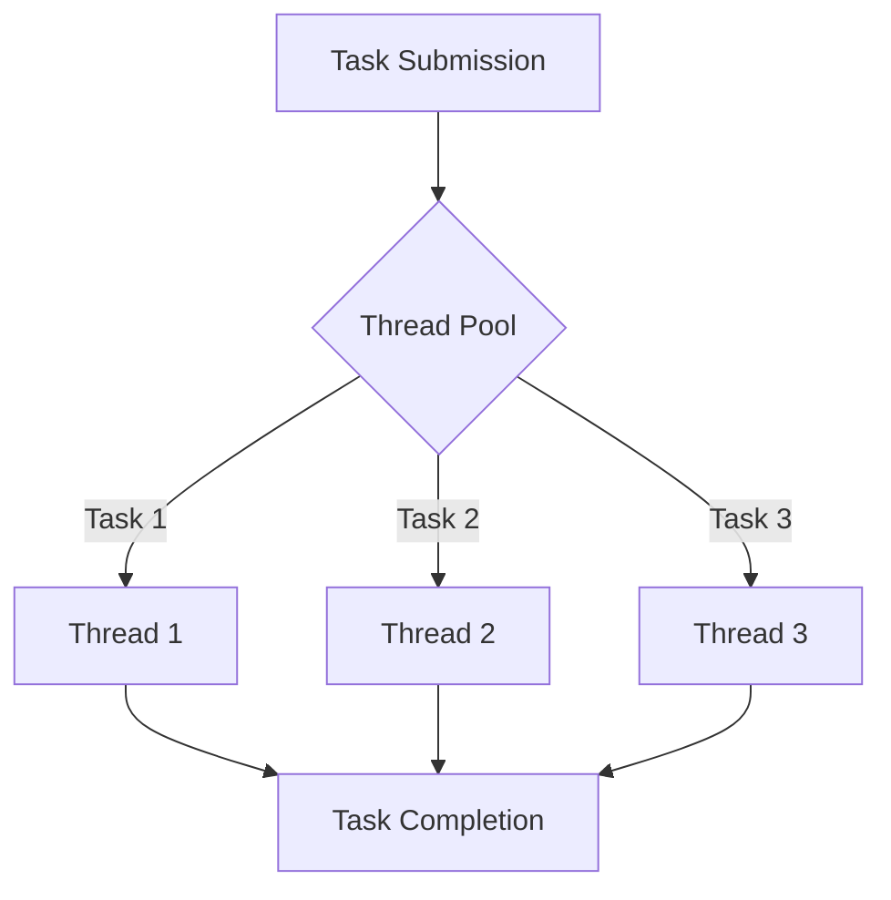

## 9.8. Task and Thread Pools

Concurrency and parallelism are crucial for building high-performance applications, and Rust offers powerful tools to manage these efficiently. In this section, we will delve into the concept of task and thread pools, exploring how they can be used to manage concurrent workloads effectively in Rust applications. We will also discuss the benefits of using task and thread pools, provide examples using popular libraries like `rayon` and `tokio`, and highlight best practices for scalability and performance.

### Understanding Task and Thread Pools

#### What Are Task and Thread Pools?

A **thread pool** is a collection of pre-instantiated, idle threads that stand ready to be given work. When a task is submitted to the pool, it is assigned to one of the available threads, which executes the task and then returns to the pool to await more work. This approach reduces the overhead of creating and destroying threads for each task, which can be costly in terms of performance.

A **task pool**, on the other hand, is a higher-level abstraction that manages tasks rather than threads directly. Tasks are units of work that can be executed concurrently, and the task pool schedules these tasks on available threads. This abstraction allows for more flexible and efficient management of concurrent workloads.

#### Benefits of Using Task and Thread Pools

- **Reduced Overhead**: By reusing threads, thread pools minimize the cost associated with thread creation and destruction.
- **Improved Resource Utilization**: Thread pools can manage the number of concurrent threads, preventing resource exhaustion and ensuring that system resources are used efficiently.
- **Scalability**: Task and thread pools can scale with the workload, dynamically adjusting the number of active threads to match the demand.
- **Simplified Concurrency Management**: By abstracting the details of thread management, task and thread pools allow developers to focus on the logic of their applications rather than the intricacies of concurrency.

### Implementing Thread Pools with Rayon

[Rayon](https://github.com/rayon-rs/rayon) is a data parallelism library for Rust that makes it easy to convert sequential computations into parallel ones. It provides a simple and efficient way to utilize thread pools for parallel processing.

#### Example: Parallel Iteration with Rayon

Let's consider a simple example where we use Rayon to perform parallel iteration over a collection.

```rust
use rayon::prelude::*;

fn main() {
    let numbers: Vec<i32> = (1..=100).collect();
    
    // Use Rayon to perform parallel iteration
    let sum: i32 = numbers.par_iter().map(|&x| x * 2).sum();
    
    println!("Sum of doubled numbers: {}", sum);
}
```

In this example, `par_iter()` is used to create a parallel iterator, which automatically distributes the workload across multiple threads in the pool. The `map` function applies a transformation to each element, and `sum` aggregates the results.

#### Key Features of Rayon

- **Automatic Load Balancing**: Rayon automatically balances the workload across available threads, ensuring efficient utilization of resources.
- **Ease of Use**: With its simple API, Rayon allows developers to parallelize code with minimal changes.
- **Scalability**: Rayon can scale to utilize all available CPU cores, making it suitable for compute-intensive tasks.

### Managing Asynchronous Tasks with Tokio

[Tokio](https://tokio.rs/) is an asynchronous runtime for Rust that provides a powerful framework for building scalable network applications. It includes a thread pool for executing asynchronous tasks.

#### Example: Asynchronous Task Execution with Tokio

Here's an example demonstrating how to use Tokio's thread pool to execute asynchronous tasks.

```rust
use tokio::task;

#[tokio::main]
async fn main() {
    let task1 = task::spawn(async {
        // Simulate some work
        println!("Task 1 is running");
    });

    let task2 = task::spawn(async {
        // Simulate some work
        println!("Task 2 is running");
    });

    // Wait for both tasks to complete
    let _ = tokio::join!(task1, task2);
}
```

In this example, `task::spawn` is used to create asynchronous tasks that run concurrently. The `tokio::join!` macro waits for both tasks to complete.

#### Key Features of Tokio

- **Concurrency**: Tokio's thread pool efficiently manages concurrent tasks, allowing for high throughput.
- **Asynchronous I/O**: Tokio provides a rich set of tools for asynchronous I/O, making it ideal for network applications.
- **Scalability**: Tokio can handle thousands of concurrent connections, making it suitable for high-performance applications.

### Balancing Workloads and Avoiding Contention

When using task and thread pools, it's important to balance workloads effectively to avoid contention and ensure optimal performance.

#### Strategies for Balancing Workloads

- **Divide and Conquer**: Break tasks into smaller, independent units that can be executed concurrently.
- **Load Balancing**: Use algorithms that distribute tasks evenly across available threads to prevent bottlenecks.
- **Prioritization**: Assign priorities to tasks to ensure that critical tasks are executed promptly.

#### Avoiding Contention

Contention occurs when multiple threads compete for the same resources, leading to performance degradation. To avoid contention:

- **Minimize Shared State**: Reduce the amount of shared state between tasks to minimize locking and synchronization overhead.
- **Use Lock-Free Data Structures**: Where possible, use lock-free data structures to reduce contention and improve performance.
- **Optimize Synchronization**: Use efficient synchronization primitives, such as `Mutex` and `RwLock`, to manage access to shared resources.

### Best Practices for Scalability and Performance

To achieve scalability and performance with task and thread pools, consider the following best practices:

- **Tune Thread Pool Size**: Adjust the size of the thread pool based on the workload and available system resources. A pool that is too small may lead to underutilization, while a pool that is too large may cause contention.
- **Monitor Performance**: Use profiling tools to monitor the performance of your application and identify bottlenecks.
- **Optimize Task Granularity**: Choose an appropriate level of granularity for tasks. Tasks that are too fine-grained may incur overhead, while tasks that are too coarse-grained may lead to underutilization.
- **Leverage Rust's Ownership Model**: Use Rust's ownership model to manage resources safely and efficiently, reducing the risk of data races and other concurrency issues.

### Visualizing Task and Thread Pools

To better understand the operation of task and thread pools, let's visualize the process using a Mermaid.js diagram.



**Diagram Description**: This diagram illustrates the flow of tasks through a thread pool. Tasks are submitted to the pool, which assigns them to available threads. Once a task is completed, the thread returns to the pool to await more work.

### Try It Yourself

Experiment with the examples provided by modifying the code to explore different scenarios. For instance, try changing the size of the input data in the Rayon example or adding more tasks in the Tokio example to observe how the thread pool handles increased workloads.

### External Resources

- [Rayon GitHub Repository](https://github.com/rayon-rs/rayon)
- [Tokio Official Website](https://tokio.rs/)

### Knowledge Check

- What are the main benefits of using task and thread pools?
- How does Rayon help in parallelizing computations in Rust?
- What are some strategies for balancing workloads in a thread pool?
- How can you avoid contention when using thread pools?
- What are some best practices for optimizing performance with task and thread pools?

### Embrace the Journey

Remember, mastering concurrency and parallelism in Rust is a journey. As you continue to explore task and thread pools, you'll gain deeper insights into efficient concurrency management. Keep experimenting, stay curious, and enjoy the process of building high-performance applications with Rust!

## Quiz Time!



### What is a thread pool?

- [x] A collection of pre-instantiated threads ready to execute tasks
- [ ] A single thread that executes multiple tasks sequentially
- [ ] A mechanism for managing memory allocation
- [ ] A tool for debugging concurrent applications

> **Explanation:** A thread pool is a collection of pre-instantiated threads that are ready to execute tasks, reducing the overhead of creating and destroying threads.

### What is the primary benefit of using task pools?

- [x] Simplified concurrency management
- [ ] Increased memory usage
- [ ] Slower task execution
- [ ] Reduced code readability

> **Explanation:** Task pools simplify concurrency management by abstracting the details of thread management, allowing developers to focus on application logic.

### Which library is used for data parallelism in Rust?

- [x] Rayon
- [ ] Tokio
- [ ] Actix
- [ ] Hyper

> **Explanation:** Rayon is a library used for data parallelism in Rust, providing an easy way to parallelize computations.

### How does Tokio handle asynchronous tasks?

- [x] By using a thread pool to execute tasks concurrently
- [ ] By executing tasks sequentially on a single thread
- [ ] By using a global lock to manage task execution
- [ ] By creating a new thread for each task

> **Explanation:** Tokio uses a thread pool to execute asynchronous tasks concurrently, allowing for high throughput and scalability.

### What is a strategy for balancing workloads in a thread pool?

- [x] Divide and conquer
- [ ] Use a single thread for all tasks
- [ ] Increase the number of shared resources
- [ ] Reduce the number of tasks

> **Explanation:** Divide and conquer is a strategy for balancing workloads by breaking tasks into smaller, independent units that can be executed concurrently.

### What is contention in the context of thread pools?

- [x] Competition between threads for the same resources
- [ ] The process of creating new threads
- [ ] The execution of tasks in parallel
- [ ] The allocation of memory for tasks

> **Explanation:** Contention occurs when multiple threads compete for the same resources, leading to performance degradation.

### How can you avoid contention in thread pools?

- [x] Minimize shared state
- [ ] Increase the number of threads
- [ ] Use more locks
- [ ] Reduce task granularity

> **Explanation:** Minimizing shared state between tasks reduces the need for locking and synchronization, helping to avoid contention.

### What is a best practice for optimizing task granularity?

- [x] Choose an appropriate level of granularity for tasks
- [ ] Use the smallest possible tasks
- [ ] Use the largest possible tasks
- [ ] Avoid dividing tasks into smaller units

> **Explanation:** Choosing an appropriate level of granularity for tasks ensures that tasks are neither too fine-grained nor too coarse-grained, optimizing performance.

### What is the role of Rust's ownership model in concurrency?

- [x] It helps manage resources safely and efficiently
- [ ] It increases the risk of data races
- [ ] It complicates thread management
- [ ] It reduces code readability

> **Explanation:** Rust's ownership model helps manage resources safely and efficiently, reducing the risk of data races and other concurrency issues.

### True or False: Task and thread pools can only be used for network applications.

- [ ] True
- [x] False

> **Explanation:** Task and thread pools can be used for a wide range of applications, not just network applications. They are useful for any scenario that requires efficient concurrency management.


