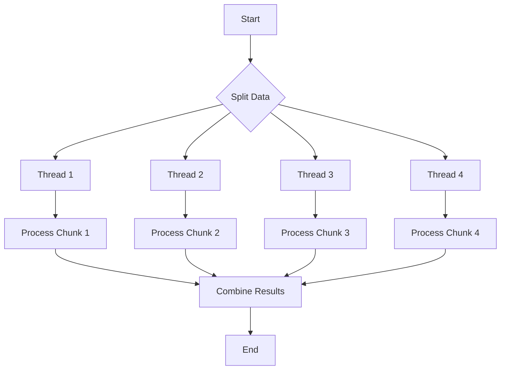

## 9.9. Parallel Iterators with Rayon

In the realm of systems programming, Rust stands out for its focus on safety and concurrency. One of the most powerful tools in Rust's concurrency arsenal is the Rayon library, which simplifies data parallelism through parallel iterators. This section will guide you through the use of Rayon, explaining how to transform serial iterators into parallel ones, and discussing the performance benefits and thread safety considerations that come with it.

### Introduction to Rayon

Rayon is a data parallelism library for Rust that allows you to easily convert sequential computations into parallel ones. It is designed to be ergonomic and efficient, making it a go-to choice for Rust developers looking to leverage multi-core processors without the complexity of manual thread management.

Rayon's primary feature is its ability to work with iterators, a common Rust abstraction for processing sequences of data. By converting standard iterators into parallel iterators, Rayon enables concurrent execution of operations across multiple threads, thus improving performance for data-intensive tasks.

### How Parallel Iterators Work

Parallel iterators in Rayon work by dividing the data into chunks that can be processed independently across multiple threads. This is achieved through a process called "work stealing," where idle threads can take over work from busy threads, ensuring efficient use of resources.

#### Key Concepts

- **Splitting**: The data is split into smaller chunks that can be processed in parallel.
- **Work Stealing**: Threads dynamically balance the workload by stealing tasks from each other.
- **Reduction**: After processing, results from each chunk are combined to produce the final output.

### Converting Serial Iterators to Parallel

Converting a serial iterator to a parallel one in Rayon is straightforward. You simply replace the `.iter()` method with `.par_iter()`, and Rayon takes care of the rest.

#### Example: Summing Numbers

Let's start with a simple example of summing a list of numbers using both serial and parallel iterators.

```rust
// Serial iterator
fn sum_serial(numbers: &[i32]) -> i32 {
    numbers.iter().sum()
}

// Parallel iterator using Rayon
fn sum_parallel(numbers: &[i32]) -> i32 {
    use rayon::prelude::*;
    numbers.par_iter().sum()
}

fn main() {
    let numbers: Vec<i32> = (1..=1000000).collect();
    
    // Serial sum
    let serial_sum = sum_serial(&numbers);
    println!("Serial Sum: {}", serial_sum);
    
    // Parallel sum
    let parallel_sum = sum_parallel(&numbers);
    println!("Parallel Sum: {}", parallel_sum);
}
```

In this example, the parallel version uses `par_iter()` instead of `iter()`, allowing the sum operation to be distributed across multiple threads.

### Performance Considerations

While parallel iterators can significantly boost performance, it's important to consider the overhead of thread management and data splitting. Here are some key points to keep in mind:

- **Data Size**: Parallel iterators are most effective with large datasets where the overhead of parallelization is outweighed by the performance gains.
- **Task Granularity**: Tasks should be sufficiently large to justify the overhead of parallel execution.
- **Thread Safety**: Ensure that operations within the parallel iterator are thread-safe, as they will be executed concurrently.

### Thread Safety with Rayon

Rayon ensures thread safety by enforcing Rust's ownership and borrowing rules. However, developers must still be cautious when working with shared data. Use synchronization primitives like `Mutex` or `RwLock` when necessary, and prefer immutable data structures when possible.

### Use Cases for Rayon

Rayon excels in scenarios where data can be processed independently and in parallel. Some common use cases include:

- **Data Processing**: Transforming or aggregating large datasets.
- **Image Processing**: Applying filters or transformations to images.
- **Scientific Computing**: Performing calculations on large matrices or datasets.
- **Web Servers**: Handling multiple requests concurrently.

### Advanced Features of Rayon

Rayon offers advanced features such as custom parallel iterators and thread pool configuration, allowing developers to fine-tune performance for specific applications.

#### Custom Parallel Iterators

You can create custom parallel iterators by implementing the `ParallelIterator` trait. This allows for specialized behavior and optimizations tailored to your specific use case.

#### Configuring Thread Pools

Rayon allows you to configure the number of threads in its global thread pool, providing control over resource usage and performance.

```rust
use rayon::ThreadPoolBuilder;

fn main() {
    let pool = ThreadPoolBuilder::new().num_threads(8).build().unwrap();
    pool.install(|| {
        // Your parallel code here
    });
}
```

### Visualizing Parallel Iterators

To better understand how parallel iterators work, let's visualize the process using a flowchart.



This diagram illustrates how data is split into chunks, processed in parallel by multiple threads, and then combined to produce the final result.

### Try It Yourself

Experiment with the code examples provided by modifying the dataset size or the operations performed within the parallel iterator. Observe how these changes affect performance and resource usage.

### References and Further Reading

- [Rayon GitHub Repository](https://github.com/rayon-rs/rayon)
- [Rayon Documentation](https://docs.rs/rayon/latest/rayon/)
- [Rust Book: Concurrency](https://doc.rust-lang.org/book/ch16-00-concurrency.html)

### Knowledge Check

Before we wrap up, let's reinforce your understanding with a few questions and exercises.

1. What are the benefits of using parallel iterators over serial iterators?
2. How does Rayon ensure thread safety in parallel iterators?
3. Modify the example code to use a custom thread pool with a different number of threads.

### Embrace the Journey

Remember, mastering parallel iterators with Rayon is just one step in your Rust journey. As you continue to explore Rust's concurrency features, you'll unlock new possibilities for building efficient, high-performance applications. Keep experimenting, stay curious, and enjoy the journey!

## Quiz Time!



### What is the primary purpose of the Rayon library in Rust?

- [x] To simplify data parallelism using parallel iterators
- [ ] To manage memory allocation
- [ ] To handle network communication
- [ ] To provide a GUI framework

> **Explanation:** Rayon is designed to simplify data parallelism by allowing developers to easily convert sequential computations into parallel ones using parallel iterators.

### How do you convert a serial iterator to a parallel iterator in Rayon?

- [x] Replace `.iter()` with `.par_iter()`
- [ ] Replace `.iter()` with `.parallel()`
- [ ] Use `.to_parallel()`
- [ ] Use `.iter_parallel()`

> **Explanation:** In Rayon, you convert a serial iterator to a parallel one by replacing `.iter()` with `.par_iter()`.

### What is "work stealing" in the context of Rayon?

- [x] A method where idle threads take over work from busy threads
- [ ] A technique for managing memory allocation
- [ ] A way to handle network requests
- [ ] A process for optimizing disk I/O

> **Explanation:** Work stealing is a method used in Rayon where idle threads can take over work from busy threads, ensuring efficient use of resources.

### Which of the following is a use case where Rayon excels?

- [x] Image processing
- [ ] GUI development
- [ ] Network communication
- [ ] Database management

> **Explanation:** Rayon excels in scenarios where data can be processed independently and in parallel, such as image processing.

### What should you consider when using parallel iterators for performance?

- [x] Data size and task granularity
- [ ] Network latency
- [ ] Disk space
- [ ] GUI responsiveness

> **Explanation:** When using parallel iterators, it's important to consider data size and task granularity to ensure that the overhead of parallelization is justified by the performance gains.

### How does Rayon handle thread safety?

- [x] By enforcing Rust's ownership and borrowing rules
- [ ] By using global locks
- [ ] By disabling concurrency
- [ ] By using a single thread

> **Explanation:** Rayon handles thread safety by enforcing Rust's ownership and borrowing rules, ensuring that operations within parallel iterators are safe.

### What is a potential downside of using parallel iterators?

- [x] Overhead of thread management
- [ ] Increased memory usage
- [ ] Reduced code readability
- [ ] Slower execution time

> **Explanation:** A potential downside of using parallel iterators is the overhead of thread management, which can outweigh performance gains for small datasets.

### Can you configure the number of threads in Rayon's global thread pool?

- [x] Yes
- [ ] No

> **Explanation:** You can configure the number of threads in Rayon's global thread pool using the `ThreadPoolBuilder`.

### What is the benefit of using immutable data structures with Rayon?

- [x] They are inherently thread-safe
- [ ] They reduce memory usage
- [ ] They improve network performance
- [ ] They simplify GUI development

> **Explanation:** Immutable data structures are inherently thread-safe, making them a good choice when working with Rayon.

### True or False: Rayon can only be used for numerical computations.

- [ ] True
- [x] False

> **Explanation:** False. Rayon can be used for a wide range of tasks that can benefit from parallel processing, not just numerical computations.


