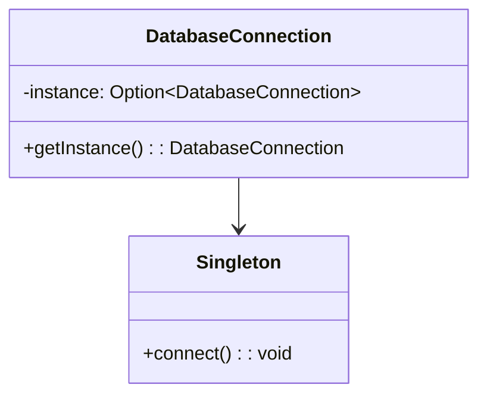

## 1.1 What Are Design Patterns?

In the realm of software engineering, design patterns serve as a cornerstone for creating robust, scalable, and maintainable systems. They provide a proven, reusable solution to common software design problems, offering a template that can be applied in various situations. As expert software engineers and architects, understanding and leveraging design patterns can significantly enhance the quality and efficiency of your Scala projects.

### Introduction to Design Patterns

Design patterns are not about reinventing the wheel; rather, they are about leveraging established solutions to solve recurring problems. They encapsulate best practices and provide a shared language for developers to communicate complex design ideas succinctly. This section will delve into the essence of design patterns, their history, and their importance in the Scala ecosystem.

### The Essence of Design Patterns

Design patterns are essentially blueprints that describe how to solve a particular design problem in a way that is both efficient and effective. They are not specific to any programming language but can be adapted to fit the unique paradigms and features of languages like Scala.

#### Key Characteristics of Design Patterns

1. **Reusability**: Design patterns provide a reusable solution that can be applied to different problems with similar characteristics.
2. **Scalability**: They help in designing systems that can scale efficiently as requirements grow.
3. **Maintainability**: By using design patterns, code becomes more organized and easier to maintain.
4. **Flexibility**: Patterns offer a flexible approach to design, allowing for modifications without significant restructuring.

### Historical Context and Evolution

The concept of design patterns was popularized by the "Gang of Four" (GoF) in their seminal book, "Design Patterns: Elements of Reusable Object-Oriented Software." This book introduced 23 classic design patterns, categorized into creational, structural, and behavioral patterns. Over time, the concept has evolved, with new patterns emerging to address the challenges of modern software development.

### Importance of Design Patterns in Scala

Scala, with its blend of object-oriented and functional programming paradigms, provides a unique landscape for implementing design patterns. The language's features, such as immutability, higher-order functions, and pattern matching, allow for elegant and concise implementations of traditional patterns, as well as the creation of new, Scala-specific patterns.

#### Benefits of Using Design Patterns in Scala

- **Code Clarity**: Patterns provide a clear structure, making the codebase easier to understand.
- **Enhanced Collaboration**: A common vocabulary of patterns facilitates better communication among team members.
- **Reduced Complexity**: Patterns help manage complexity by breaking down large problems into smaller, manageable components.

### Scala Features Relevant to Design Patterns

Scala's rich feature set makes it an ideal language for implementing design patterns. Some of the key features include:

- **Immutability and Persistent Data Structures**: These features promote safer and more predictable code.
- **Pattern Matching**: Allows for concise and expressive handling of data structures.
- **Traits and Mixins**: Enable flexible composition of behavior.
- **Higher-Order Functions**: Facilitate the creation of more abstract and reusable code.

### How to Use This Guide

This guide is structured to provide a comprehensive understanding of design patterns in the context of Scala. Each section will introduce a pattern, explain its intent, and demonstrate its implementation with Scala-specific examples. We encourage you to experiment with the code examples and explore how these patterns can be adapted to your projects.

### Code Examples

Let's explore a simple example to illustrate how design patterns can be implemented in Scala. Consider the Singleton pattern, which ensures a class has only one instance and provides a global point of access to it.

```scala
// Singleton Pattern in Scala
object DatabaseConnection {
  private var instance: Option[DatabaseConnection] = None

  def getInstance: DatabaseConnection = {
    if (instance.isEmpty) {
      instance = Some(new DatabaseConnection)
    }
    instance.get
  }
}

class DatabaseConnection private() {
  def connect(): Unit = {
    println("Connected to the database.")
  }
}

// Usage
val dbConnection = DatabaseConnection.getInstance
dbConnection.connect()
```

In this example, we use an `object` to implement the Singleton pattern, taking advantage of Scala's ability to encapsulate instance management within a companion object.

### Visualizing Design Patterns

To better understand the concept of design patterns, let's visualize the Singleton pattern using a class diagram.



This diagram illustrates the relationship between the `DatabaseConnection` object and the Singleton instance it manages.

### Try It Yourself

Encourage experimentation by modifying the code example above. Try creating a different pattern, such as a Factory pattern, and see how Scala's features can be leveraged to implement it efficiently.

### Knowledge Check

To reinforce your understanding, consider the following questions:

- What are the key characteristics of design patterns?
- How does Scala's feature set enhance the implementation of design patterns?
- Can you think of a scenario where a design pattern might simplify your code?

### Embrace the Journey

As you delve deeper into the world of design patterns, remember that this is just the beginning. Each pattern you learn will add a powerful tool to your software design toolkit. Keep experimenting, stay curious, and enjoy the journey!

### Summary

Design patterns are a fundamental aspect of software engineering, offering reusable solutions to common design problems. In Scala, these patterns can be implemented elegantly, taking advantage of the language's unique features. By understanding and applying design patterns, you can create more robust, scalable, and maintainable software systems.

## Quiz Time!



### What is a primary benefit of using design patterns?

- [x] They provide reusable solutions to common design problems.
- [ ] They eliminate the need for testing.
- [ ] They make code run faster.
- [ ] They replace the need for documentation.

> **Explanation:** Design patterns offer reusable solutions, which help in solving common design problems efficiently.

### Which book popularized the concept of design patterns?

- [x] "Design Patterns: Elements of Reusable Object-Oriented Software"
- [ ] "The Pragmatic Programmer"
- [ ] "Clean Code"
- [ ] "Refactoring"

> **Explanation:** The book "Design Patterns: Elements of Reusable Object-Oriented Software" by the "Gang of Four" introduced and popularized design patterns.

### What Scala feature is particularly useful for implementing design patterns?

- [x] Pattern Matching
- [ ] Global Variables
- [ ] Dynamic Typing
- [ ] Manual Memory Management

> **Explanation:** Pattern matching in Scala allows for concise and expressive handling of data structures, which is useful for implementing design patterns.

### How does immutability benefit design patterns in Scala?

- [x] It promotes safer and more predictable code.
- [ ] It makes code harder to read.
- [ ] It increases the complexity of code.
- [ ] It is not relevant to design patterns.

> **Explanation:** Immutability ensures that data cannot be changed once created, leading to safer and more predictable code, which is beneficial in design patterns.

### What is the intent of the Singleton pattern?

- [x] To ensure a class has only one instance.
- [ ] To create multiple instances of a class.
- [ ] To hide the implementation details of a class.
- [ ] To provide a way to access multiple databases.

> **Explanation:** The Singleton pattern ensures that a class has only one instance and provides a global point of access to it.

### Which Scala feature allows for flexible composition of behavior?

- [x] Traits and Mixins
- [ ] Global Variables
- [ ] Static Methods
- [ ] Dynamic Typing

> **Explanation:** Traits and mixins in Scala enable flexible composition of behavior, making it easier to implement design patterns.

### What is a common use case for the Factory pattern?

- [x] To encapsulate object creation logic.
- [ ] To ensure a class has only one instance.
- [ ] To manage global state.
- [ ] To perform complex mathematical calculations.

> **Explanation:** The Factory pattern is used to encapsulate object creation logic, allowing for more flexible and decoupled code.

### How can design patterns enhance collaboration among developers?

- [x] By providing a common vocabulary for design ideas.
- [ ] By eliminating the need for communication.
- [ ] By making code more complex.
- [ ] By reducing the need for documentation.

> **Explanation:** Design patterns provide a common vocabulary, which facilitates better communication and collaboration among developers.

### What is a key characteristic of design patterns?

- [x] Reusability
- [ ] Complexity
- [ ] Obfuscation
- [ ] Inflexibility

> **Explanation:** Reusability is a key characteristic of design patterns, allowing them to be applied to different problems with similar characteristics.

### True or False: Design patterns are specific to a single programming language.

- [ ] True
- [x] False

> **Explanation:** Design patterns are not specific to any programming language; they can be adapted to fit the unique paradigms and features of different languages.


