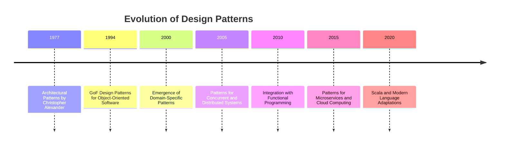

## 1.2 History and Evolution of Design Patterns

Design patterns have become an integral part of software engineering, providing reusable solutions to common problems. Understanding their history and evolution not only enriches our knowledge but also enhances our ability to apply these patterns effectively in modern programming languages like Scala. In this section, we will explore the journey of design patterns from their architectural roots to their current prominence in software development.

### The Architectural Origins

The concept of design patterns originated in the field of architecture, primarily through the work of Christopher Alexander. In the late 1970s, Alexander introduced the idea of a "pattern language" in his book "A Pattern Language: Towns, Buildings, Construction." He proposed that architectural design could be described using a set of patterns, each representing a solution to a recurring problem within a specific context.

#### Key Concepts from Architecture

- **Pattern Language**: A structured method of describing good design practices within a field of expertise.
- **Context**: The environment or situation in which a pattern is applicable.
- **Problem and Solution**: Each pattern addresses a specific problem and provides a proven solution.

### Transition to Software Engineering

The transition of design patterns from architecture to software engineering was marked by the seminal work of the "Gang of Four" (GoF) in their 1994 book "Design Patterns: Elements of Reusable Object-Oriented Software." The authors—Erich Gamma, Richard Helm, Ralph Johnson, and John Vlissides—adapted Alexander's concepts to software development, identifying 23 foundational patterns that addressed common challenges in object-oriented design.

#### The Gang of Four's Contribution

- **Object-Oriented Design**: The GoF patterns were tailored for object-oriented programming languages, emphasizing encapsulation, inheritance, and polymorphism.
- **Catalog of Patterns**: The book provided a catalog of 23 patterns, categorized into creational, structural, and behavioral patterns.
- **Pattern Template**: Each pattern was described using a consistent template, including intent, applicability, structure, participants, and consequences.

### Evolution in Software Development

Since the publication of the GoF book, design patterns have evolved significantly, adapting to new programming paradigms and languages. This evolution has been driven by the need to address challenges in various domains, including concurrent programming, distributed systems, and functional programming.

#### Key Developments in Design Patterns

1. **Expansion Beyond Object-Oriented Design**: While the GoF patterns focused on object-oriented design, subsequent patterns have emerged to address functional programming, reactive systems, and more.

2. **Domain-Specific Patterns**: Patterns have been developed for specific domains, such as enterprise integration patterns and microservices patterns, providing tailored solutions for industry-specific challenges.

3. **Integration with Modern Languages**: Modern programming languages, including Scala, have integrated design patterns into their core features, leveraging language-specific capabilities to enhance pattern implementation.

### Design Patterns in Scala

Scala, with its unique blend of object-oriented and functional programming paradigms, offers a rich environment for applying and evolving design patterns. Scala's features, such as higher-order functions, immutability, and type inference, enable developers to implement patterns in more concise and expressive ways.

#### Scala-Specific Adaptations

- **Functional Patterns**: Scala's support for functional programming allows for the implementation of patterns like monads, functors, and lenses, which are not traditionally part of the GoF catalog.
- **Type Safety and Inference**: Scala's robust type system enhances the implementation of patterns by ensuring type safety and reducing boilerplate code.
- **Concurrency and Asynchronous Programming**: Patterns for managing concurrency, such as the actor model, are seamlessly integrated with Scala's libraries like Akka.

### Visualizing the Evolution of Design Patterns

To better understand the evolution of design patterns, let's visualize their journey from architecture to modern software development using a timeline diagram.

### The Impact of Design Patterns

Design patterns have profoundly impacted software engineering by providing a shared vocabulary for developers, promoting best practices, and facilitating code reuse. They have become a cornerstone of software architecture, enabling developers to build robust, scalable, and maintainable systems.

#### Benefits of Design Patterns

- **Reusability**: Patterns provide proven solutions that can be reused across different projects, reducing development time and effort.
- **Scalability**: By promoting modular design, patterns help in building scalable systems that can grow with changing requirements.
- **Maintainability**: Patterns encourage clean and organized code, making it easier to maintain and extend over time.

### Challenges and Criticisms

Despite their benefits, design patterns have faced criticism and challenges, particularly regarding their applicability in different contexts and the potential for overuse.

#### Common Criticisms

- **Overhead**: Implementing patterns can introduce additional complexity and overhead, especially when used inappropriately.
- **Misuse**: Patterns are sometimes applied without a clear understanding of their intent, leading to inefficient or convoluted designs.
- **Evolution of Languages**: As programming languages evolve, some patterns become less relevant or are replaced by language features.

### The Future of Design Patterns

As software development continues to evolve, so too will design patterns. The future of design patterns lies in their ability to adapt to emerging technologies, such as artificial intelligence, blockchain, and quantum computing, while continuing to provide valuable solutions for traditional challenges.

#### Emerging Trends

- **AI-Driven Patterns**: Patterns that leverage machine learning and artificial intelligence to automate decision-making and optimize performance.
- **Blockchain Patterns**: Solutions for decentralized systems, focusing on security, transparency, and consensus mechanisms.
- **Quantum Computing Patterns**: New paradigms for quantum algorithms and data structures, addressing the unique challenges of quantum computing.

### Conclusion

The history and evolution of design patterns reflect the dynamic nature of software engineering. From their architectural origins to their current role in modern programming languages like Scala, design patterns have consistently provided valuable solutions to complex problems. As we continue to explore new technologies and paradigms, design patterns will remain a vital tool in the software engineer's toolkit.

### References and Further Reading

- [Design Patterns: Elements of Reusable Object-Oriented Software](https://en.wikipedia.org/wiki/Design_Patterns) by Erich Gamma, Richard Helm, Ralph Johnson, and John Vlissides
- [A Pattern Language: Towns, Buildings, Construction](https://en.wikipedia.org/wiki/A_Pattern_Language) by Christopher Alexander
- [Scala Design Patterns](https://www.oreilly.com/library/view/scala-design-patterns/9781788474030/) by Ivan Nikolov

### Knowledge Check

To reinforce your understanding of the history and evolution of design patterns, consider the following questions and exercises.

1. Explain the origins of design patterns in architecture and how they transitioned to software engineering.
2. Describe the contribution of the Gang of Four to the field of design patterns.
3. Discuss the impact of modern programming languages, like Scala, on the implementation of design patterns.
4. Identify and explain at least three criticisms of design patterns.
5. Predict how design patterns might evolve in the context of emerging technologies like AI and blockchain.

### Embrace the Journey

Remember, understanding the history and evolution of design patterns is just the beginning. As you delve deeper into Scala and its rich ecosystem, you'll discover new ways to apply these patterns and create innovative solutions. Keep experimenting, stay curious, and enjoy the journey!

## Quiz Time!



### What was the original field where the concept of design patterns was introduced?

- [x] Architecture
- [ ] Software Engineering
- [ ] Mathematics
- [ ] Biology

> **Explanation:** Design patterns were originally introduced in the field of architecture by Christopher Alexander.

### Who are the authors of the seminal book "Design Patterns: Elements of Reusable Object-Oriented Software"?

- [x] Erich Gamma, Richard Helm, Ralph Johnson, John Vlissides
- [ ] Martin Fowler, Kent Beck, Erich Gamma, John Vlissides
- [ ] Christopher Alexander, Erich Gamma, Martin Fowler, Ralph Johnson
- [ ] Richard Helm, John Vlissides, Kent Beck, Martin Fowler

> **Explanation:** The book was authored by Erich Gamma, Richard Helm, Ralph Johnson, and John Vlissides, known as the Gang of Four.

### What are the three categories of design patterns introduced by the Gang of Four?

- [x] Creational, Structural, Behavioral
- [ ] Functional, Object-Oriented, Procedural
- [ ] Architectural, Structural, Functional
- [ ] Concurrent, Distributed, Reactive

> **Explanation:** The Gang of Four categorized design patterns into Creational, Structural, and Behavioral patterns.

### How has Scala influenced the implementation of design patterns?

- [x] By integrating functional programming paradigms
- [ ] By eliminating the need for design patterns
- [ ] By focusing solely on object-oriented patterns
- [ ] By discouraging the use of patterns

> **Explanation:** Scala's support for functional programming has influenced the way design patterns are implemented, allowing for more expressive and concise solutions.

### Which of the following is a criticism of design patterns?

- [x] They can introduce unnecessary complexity
- [ ] They are always the best solution
- [ ] They are only applicable to object-oriented programming
- [ ] They eliminate the need for testing

> **Explanation:** Design patterns can introduce unnecessary complexity if applied without a clear understanding of their intent.

### What is a potential future trend for design patterns?

- [x] AI-Driven Patterns
- [ ] Elimination of all patterns
- [ ] Exclusive focus on object-oriented patterns
- [ ] Static patterns with no evolution

> **Explanation:** AI-Driven Patterns are an emerging trend, leveraging machine learning and artificial intelligence for automated decision-making.

### What is a key benefit of design patterns?

- [x] Reusability
- [ ] Complexity
- [ ] Inflexibility
- [ ] Obsolescence

> **Explanation:** Design patterns provide reusability, offering proven solutions that can be applied across different projects.

### Which of the following is NOT a category of design patterns introduced by the Gang of Four?

- [x] Functional
- [ ] Creational
- [ ] Structural
- [ ] Behavioral

> **Explanation:** Functional is not one of the original categories introduced by the Gang of Four; they focused on Creational, Structural, and Behavioral patterns.

### True or False: Design patterns have remained static since their introduction by the Gang of Four.

- [ ] True
- [x] False

> **Explanation:** Design patterns have evolved significantly, adapting to new programming paradigms and technologies.

### What is the primary purpose of design patterns in software engineering?

- [x] To provide reusable solutions to common problems
- [ ] To increase code complexity
- [ ] To eliminate the need for documentation
- [ ] To replace all programming languages

> **Explanation:** The primary purpose of design patterns is to provide reusable solutions to common problems, promoting best practices and code reuse.


