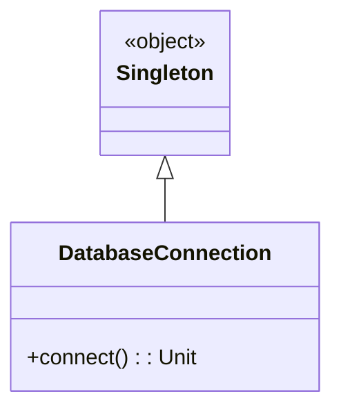
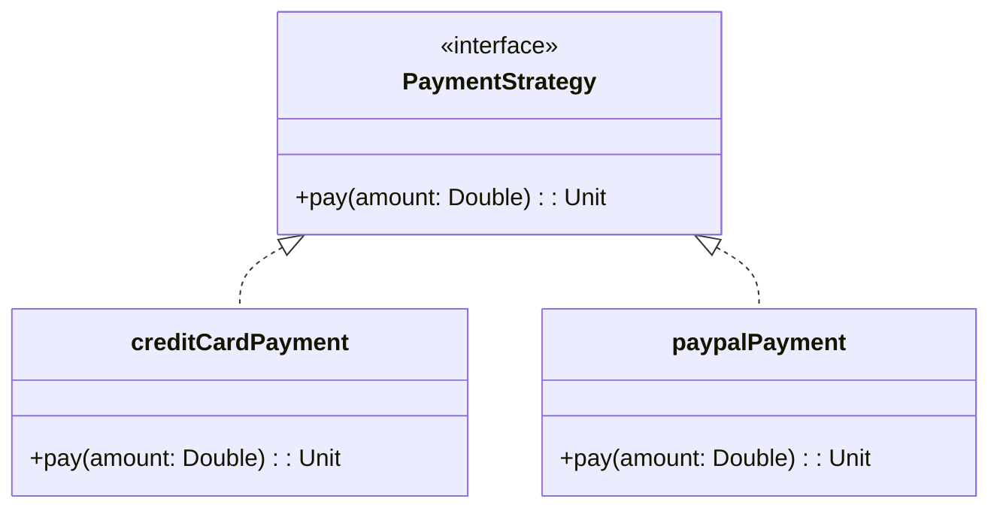

## 1.3 Importance of Design Patterns in Scala

Design patterns play a crucial role in software development by providing reusable solutions to common problems. In Scala, a language that seamlessly integrates object-oriented and functional programming paradigms, design patterns are not only applicable but also highly adaptable. This section delves into the importance of design patterns in Scala, highlighting their role in enhancing code clarity, maintainability, and scalability, while also exploring how Scala's unique features influence the adaptation of these patterns.

### Understanding Design Patterns in Scala

Design patterns are established solutions to recurring design problems in software development. They provide a template for how to solve a problem in a way that is both efficient and reusable. In Scala, design patterns are particularly significant due to the language's hybrid nature, which combines object-oriented and functional programming paradigms. This duality allows Scala developers to leverage the best of both worlds, making design patterns more versatile and powerful.

#### Why Design Patterns Matter

1. **Code Reusability**: Design patterns promote code reuse, allowing developers to apply proven solutions to new problems. This reduces the need to reinvent the wheel and accelerates the development process.

2. **Maintainability**: By providing a clear structure and organization, design patterns make code easier to understand and maintain. This is particularly important in large-scale projects where multiple developers are involved.

3. **Scalability**: Design patterns help in designing systems that can scale efficiently. They provide guidelines for structuring code in a way that can handle increased load without significant refactoring.

4. **Communication**: Design patterns serve as a common language among developers. They facilitate communication and understanding, as developers can refer to patterns by name rather than explaining the entire solution.

5. **Adaptability**: In Scala, design patterns can be adapted to take advantage of the language's unique features, such as immutability, higher-order functions, and pattern matching. This makes them more robust and flexible.

### Adapting Design Patterns to Scala

Scala's unique features allow for the adaptation of traditional design patterns, making them more expressive and concise. Let's explore some of these adaptations and how they enhance the utility of design patterns in Scala.

#### Immutability and Persistent Data Structures

Immutability is a core concept in functional programming and is heavily emphasized in Scala. It ensures that once a data structure is created, it cannot be modified. This leads to safer and more predictable code.

**Example: Singleton Pattern**

In traditional object-oriented programming, the Singleton pattern ensures that a class has only one instance. In Scala, this can be achieved using an `object`, which is inherently a singleton.

```scala
object DatabaseConnection {
  def connect(): Unit = {
    println("Connecting to the database...")
  }
}

// Usage
DatabaseConnection.connect()
```

**Key Takeaway**: By leveraging Scala's `object`, we simplify the Singleton pattern, eliminating the need for explicit synchronization and lazy initialization.

#### Higher-Order Functions and Function Literals

Scala treats functions as first-class citizens, allowing them to be passed as arguments, returned from other functions, and assigned to variables. This feature is instrumental in adapting design patterns.

**Example: Strategy Pattern**

The Strategy pattern defines a family of algorithms, encapsulates each one, and makes them interchangeable. In Scala, this can be elegantly implemented using higher-order functions.

```scala
trait PaymentStrategy {
  def pay(amount: Double): Unit
}

val creditCardPayment: PaymentStrategy = (amount: Double) => println(s"Paying $$amount using Credit Card")
val paypalPayment: PaymentStrategy = (amount: Double) => println(s"Paying $$amount using PayPal")

def processPayment(amount: Double, strategy: PaymentStrategy): Unit = {
  strategy.pay(amount)
}

// Usage
processPayment(100.0, creditCardPayment)
processPayment(200.0, paypalPayment)
```

**Key Takeaway**: Higher-order functions allow for a more concise and flexible implementation of the Strategy pattern, reducing boilerplate code.

#### Pattern Matching and Case Classes

Pattern matching is a powerful feature in Scala that simplifies the implementation of many design patterns. Combined with case classes, it provides a robust mechanism for data deconstruction and manipulation.

**Example: Visitor Pattern**

The Visitor pattern is used to separate an algorithm from the object structure it operates on. In Scala, pattern matching can be used to implement this pattern more succinctly.

```scala
sealed trait Shape
case class Circle(radius: Double) extends Shape
case class Rectangle(width: Double, height: Double) extends Shape

def area(shape: Shape): Double = shape match {
  case Circle(radius) => Math.PI * radius * radius
  case Rectangle(width, height) => width * height
}

// Usage
val circle = Circle(5.0)
val rectangle = Rectangle(4.0, 6.0)

println(s"Area of circle: ${area(circle)}")
println(s"Area of rectangle: ${area(rectangle)}")
```

**Key Takeaway**: Pattern matching provides a clean and expressive way to implement the Visitor pattern, enhancing code readability and maintainability.

### Leveraging Scala's Type System

Scala's strong and expressive type system is another factor that influences the adaptation of design patterns. It allows for more type-safe and robust implementations.

#### Type Classes and Implicits

Type classes provide a way to achieve ad-hoc polymorphism in Scala. They allow us to define generic interfaces that can be implemented for different types without modifying the original types.

**Example: Adapter Pattern**

The Adapter pattern allows incompatible interfaces to work together. In Scala, type classes and implicits can be used to implement this pattern.

```scala
trait JsonSerializable[T] {
  def toJson(value: T): String
}

object JsonSerializable {
  implicit val intSerializable: JsonSerializable[Int] = (value: Int) => value.toString
  implicit val stringSerializable: JsonSerializable[String] = (value: String) => s""""$value""""

  def toJson[T](value: T)(implicit serializer: JsonSerializable[T]): String = {
    serializer.toJson(value)
  }
}

// Usage
println(JsonSerializable.toJson(42))
println(JsonSerializable.toJson("Hello, Scala!"))
```

**Key Takeaway**: Type classes and implicits provide a flexible way to implement the Adapter pattern, allowing for seamless integration of new types.

### Functional Programming Paradigms

Scala's support for functional programming paradigms offers new perspectives on traditional design patterns. By embracing immutability, pure functions, and higher-order functions, we can create more predictable and testable code.

#### Pure Functions and Side Effects

Pure functions are a fundamental concept in functional programming. They ensure that a function's output is determined solely by its input, without any side effects. This predictability is crucial for building reliable systems.

**Example: Command Pattern**

The Command pattern encapsulates a request as an object, allowing for parameterization and queuing of requests. In Scala, we can implement this pattern using pure functions.

```scala
case class Command(action: () => Unit)

def executeCommand(command: Command): Unit = command.action()

// Usage
val printCommand = Command(() => println("Executing command..."))
executeCommand(printCommand)
```

**Key Takeaway**: By using pure functions, we can implement the Command pattern in a way that is both simple and testable.

### Visualizing Design Patterns in Scala

To better understand how design patterns are adapted in Scala, let's visualize the process using diagrams. These diagrams will illustrate the relationships between objects, functions, and data structures in Scala's implementation of design patterns.

#### Visualizing the Singleton Pattern



**Diagram Description**: This class diagram represents the Singleton pattern in Scala using an `object`. The `DatabaseConnection` object is a singleton that provides a `connect` method.

#### Visualizing the Strategy Pattern



**Diagram Description**: This class diagram illustrates the Strategy pattern in Scala. The `PaymentStrategy` interface is implemented by `creditCardPayment` and `paypalPayment`, allowing for interchangeable payment strategies.

### Try It Yourself

To deepen your understanding of design patterns in Scala, try modifying the code examples provided. For instance, you can:

- Implement a new payment strategy in the Strategy pattern example.
- Add a new shape type in the Visitor pattern example and calculate its area.
- Create a new type and implement a `JsonSerializable` instance for it in the Adapter pattern example.

### References and Links

For further reading on design patterns and Scala, consider exploring the following resources:

- [Scala Documentation](https://docs.scala-lang.org/)
- [Design Patterns: Elements of Reusable Object-Oriented Software](https://en.wikipedia.org/wiki/Design_Patterns)
- [Functional Programming in Scala](https://www.manning.com/books/functional-programming-in-scala)

### Knowledge Check

Before moving on, take a moment to reflect on the key concepts covered in this section. Consider how design patterns can enhance your Scala projects and how Scala's features can be leveraged to adapt these patterns effectively.

### Embrace the Journey

Remember, mastering design patterns in Scala is a journey. As you continue to explore and apply these patterns, you'll gain a deeper understanding of both Scala and software architecture. Keep experimenting, stay curious, and enjoy the process!

## Quiz Time!



### What is a key benefit of using design patterns in Scala?

- [x] They enhance code reusability and maintainability.
- [ ] They eliminate the need for testing.
- [ ] They make code run faster.
- [ ] They are only useful for large projects.

> **Explanation:** Design patterns enhance code reusability and maintainability by providing proven solutions to common problems.

### How does Scala's `object` keyword simplify the Singleton pattern?

- [x] It inherently provides a singleton instance.
- [ ] It requires explicit synchronization.
- [ ] It allows multiple instances.
- [ ] It is only used for classes.

> **Explanation:** The `object` keyword in Scala inherently provides a singleton instance, eliminating the need for explicit synchronization.

### What feature of Scala allows functions to be passed as arguments?

- [x] Higher-order functions
- [ ] Pattern matching
- [ ] Case classes
- [ ] Immutability

> **Explanation:** Higher-order functions in Scala allow functions to be passed as arguments, returned from other functions, and assigned to variables.

### Which Scala feature is used to implement the Visitor pattern more succinctly?

- [x] Pattern matching
- [ ] Immutability
- [ ] Type classes
- [ ] Implicits

> **Explanation:** Pattern matching in Scala provides a clean and expressive way to implement the Visitor pattern.

### What is the role of type classes in Scala?

- [x] Achieving ad-hoc polymorphism
- [ ] Managing side effects
- [ ] Enforcing immutability
- [ ] Simplifying recursion

> **Explanation:** Type classes in Scala provide a way to achieve ad-hoc polymorphism by defining generic interfaces for different types.

### How do pure functions contribute to the Command pattern in Scala?

- [x] They ensure predictability and testability.
- [ ] They allow side effects.
- [ ] They require mutable state.
- [ ] They complicate the implementation.

> **Explanation:** Pure functions ensure predictability and testability, making them ideal for implementing the Command pattern in Scala.

### Which Scala feature allows for seamless integration of new types in the Adapter pattern?

- [x] Implicits
- [ ] Pattern matching
- [ ] Case classes
- [ ] Immutability

> **Explanation:** Implicits in Scala allow for seamless integration of new types in the Adapter pattern by providing implicit conversions.

### What is a key advantage of using design patterns in Scala?

- [x] They provide a common language for developers.
- [ ] They eliminate the need for documentation.
- [ ] They are only applicable to functional programming.
- [ ] They reduce code readability.

> **Explanation:** Design patterns provide a common language for developers, facilitating communication and understanding.

### True or False: Design patterns in Scala can only be applied to object-oriented programming.

- [ ] True
- [x] False

> **Explanation:** Design patterns in Scala can be applied to both object-oriented and functional programming paradigms.

### What should you do to deepen your understanding of design patterns in Scala?

- [x] Experiment with modifying code examples.
- [ ] Avoid using design patterns in projects.
- [ ] Focus solely on theoretical knowledge.
- [ ] Ignore Scala's unique features.

> **Explanation:** Experimenting with modifying code examples helps deepen understanding and allows you to see how design patterns can be adapted to different scenarios.


