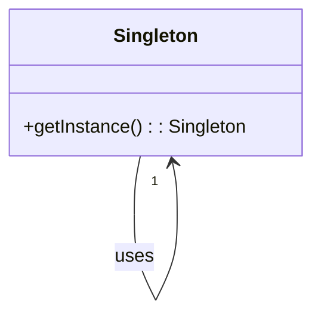
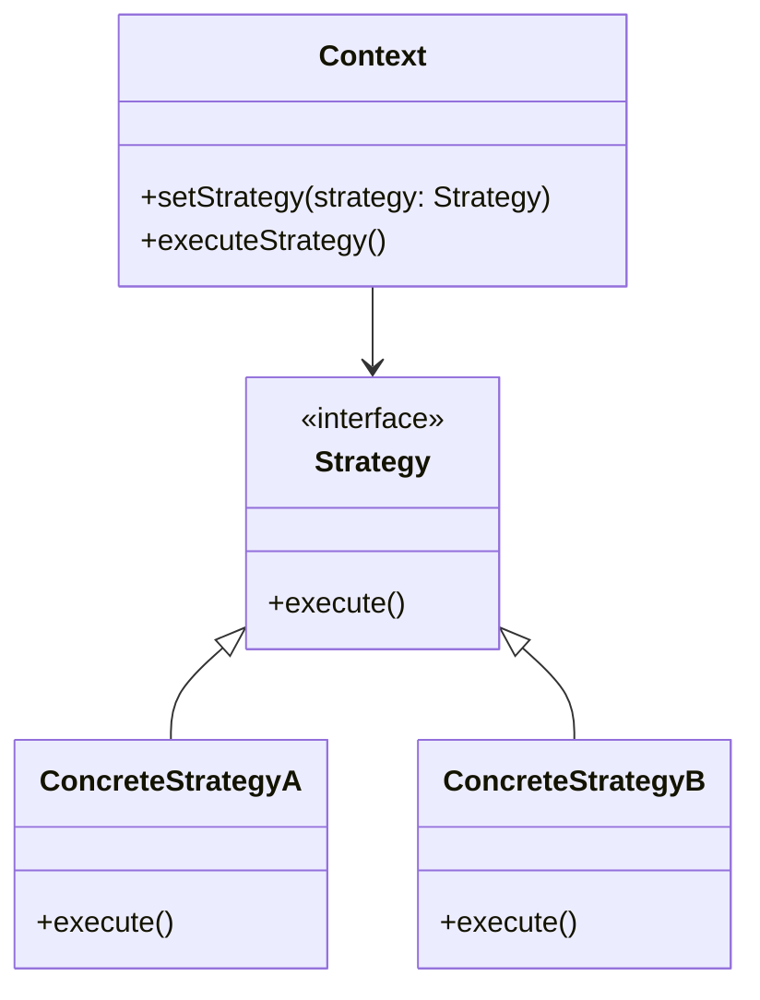

## 1.4 Benefits of Using Design Patterns in Scala

Design patterns are a crucial aspect of software engineering, offering reusable solutions to common problems. In Scala, a language that elegantly combines functional and object-oriented paradigms, design patterns can be particularly powerful. This section will delve into the benefits of using design patterns in Scala, focusing on enhancing code clarity, maintainability, and scalability.

### Enhancing Code Clarity

Code clarity is essential for understanding and maintaining software systems. Design patterns contribute to clarity by providing a common vocabulary for developers. Let's explore how Scala's features enhance this clarity:

#### 1. Consistency and Readability

Design patterns offer a consistent approach to solving problems, making code more readable and understandable. By using well-known patterns, developers can quickly grasp the structure and intent of the code.

**Example: Singleton Pattern in Scala**

Scala's `object` keyword provides a straightforward way to implement the Singleton pattern, ensuring a class has only one instance.

```scala
object DatabaseConnection {
  def connect(): Unit = {
    println("Connecting to the database...")
  }
}

// Usage
DatabaseConnection.connect()
```

In this example, the `DatabaseConnection` object is a Singleton, ensuring only one instance is used throughout the application. This pattern is instantly recognizable, enhancing clarity.

#### 2. Expressive Syntax

Scala's expressive syntax, including pattern matching and higher-order functions, allows for concise and clear implementations of design patterns.

**Example: Strategy Pattern with Higher-Order Functions**

The Strategy pattern defines a family of algorithms, encapsulates each one, and makes them interchangeable. Scala's higher-order functions make this pattern easy to implement.

```scala
trait PaymentStrategy {
  def pay(amount: Double): Unit
}

val creditCardPayment: PaymentStrategy = (amount: Double) => println(s"Paying $$amount using Credit Card.")
val paypalPayment: PaymentStrategy = (amount: Double) => println(s"Paying $$amount using PayPal.")

// Usage
def processPayment(strategy: PaymentStrategy, amount: Double): Unit = {
  strategy.pay(amount)
}

processPayment(creditCardPayment, 100.0)
processPayment(paypalPayment, 200.0)
```

Here, the Strategy pattern is implemented using functions, making the code concise and clear.

### Improving Maintainability

Maintainability is a critical aspect of software development, ensuring that code can be easily modified and extended. Design patterns in Scala contribute to maintainability in several ways:

#### 1. Modular Design

Design patterns promote modular design, allowing developers to isolate changes to specific parts of the codebase. This modularity is crucial for maintaining large systems.

**Example: Observer Pattern with Reactive Streams**

The Observer pattern defines a one-to-many dependency between objects, allowing observers to be notified of changes. Scala's `Akka Streams` provides a powerful way to implement this pattern.

```scala
import akka.actor.ActorSystem
import akka.stream.scaladsl.{Sink, Source}

implicit val system: ActorSystem = ActorSystem("ObserverPattern")

val source = Source(1 to 10)
val sink = Sink.foreach[Int](println)

source.runWith(sink)
```

In this example, `Akka Streams` handles the complexity of the Observer pattern, making the code more maintainable.

#### 2. Encapsulation and Abstraction

Design patterns encourage encapsulation and abstraction, hiding implementation details and exposing only necessary interfaces. This approach simplifies maintenance by reducing the impact of changes.

**Example: Factory Method Pattern**

The Factory Method pattern defines an interface for creating an object but lets subclasses alter the type of objects that will be created.

```scala
trait Product {
  def use(): Unit
}

class ConcreteProductA extends Product {
  def use(): Unit = println("Using Product A")
}

class ConcreteProductB extends Product {
  def use(): Unit = println("Using Product B")
}

trait Creator {
  def createProduct(): Product
}

class ConcreteCreatorA extends Creator {
  def createProduct(): Product = new ConcreteProductA
}

class ConcreteCreatorB extends Creator {
  def createProduct(): Product = new ConcreteProductB
}

// Usage
val creator: Creator = new ConcreteCreatorA
val product = creator.createProduct()
product.use()
```

By encapsulating the creation logic, the Factory Method pattern enhances maintainability.

### Facilitating Scalability

Scalability is the ability of a system to handle growth. Design patterns in Scala facilitate scalability by providing robust architectures that can adapt to increasing demands.

#### 1. Efficient Resource Management

Design patterns help manage resources efficiently, a key factor in scalability. Patterns like Flyweight and Proxy optimize resource usage.

**Example: Flyweight Pattern**

The Flyweight pattern minimizes memory usage by sharing data between similar objects.

```scala
case class TreeType(name: String, color: String, texture: String)

class Tree(val x: Int, val y: Int, val treeType: TreeType)

object TreeFactory {
  private var treeTypes: Map[String, TreeType] = Map()

  def getTreeType(name: String, color: String, texture: String): TreeType = {
    treeTypes.getOrElse(name, {
      val treeType = TreeType(name, color, texture)
      treeTypes += (name -> treeType)
      treeType
    })
  }
}

// Usage
val oakType = TreeFactory.getTreeType("Oak", "Green", "Rough")
val oakTree = new Tree(10, 20, oakType)
```

By sharing `TreeType` instances, the Flyweight pattern reduces memory usage, enhancing scalability.

#### 2. Asynchronous and Concurrent Processing

Scala's support for asynchronous and concurrent processing, combined with design patterns, allows systems to scale effectively.

**Example: Actor Model with Akka**

The Actor model, implemented in Scala with Akka, is a design pattern that facilitates concurrent processing.

```scala
import akka.actor.{Actor, ActorSystem, Props}

class PrintActor extends Actor {
  def receive: Receive = {
    case msg: String => println(msg)
  }
}

val system = ActorSystem("ActorSystem")
val printActor = system.actorOf(Props[PrintActor], "printActor")

// Usage
printActor ! "Hello, Akka!"
```

The Actor model enables scalable concurrent processing, making it ideal for high-demand systems.

### Visualizing Design Patterns in Scala

To further illustrate the benefits of design patterns in Scala, let's visualize some of the patterns we've discussed.

#### Visualizing the Singleton Pattern



**Caption:** The Singleton pattern ensures a class has only one instance, as shown in the diagram.

#### Visualizing the Strategy Pattern



**Caption:** The Strategy pattern allows interchangeable algorithms, enhancing flexibility and clarity.

### References and Further Reading

For more information on design patterns and Scala, consider exploring the following resources:

- [Scala Documentation](https://docs.scala-lang.org/)
- [Akka Documentation](https://doc.akka.io/docs/akka/current/)
- [Design Patterns: Elements of Reusable Object-Oriented Software](https://en.wikipedia.org/wiki/Design_Patterns)

### Knowledge Check

To reinforce your understanding, consider these questions:

- How does the Singleton pattern enhance code clarity?
- What are the benefits of using the Factory Method pattern for maintainability?
- How does the Flyweight pattern contribute to scalability?

### Embrace the Journey

Remember, mastering design patterns in Scala is a journey. As you continue to explore and apply these patterns, you'll find new ways to enhance your code's clarity, maintainability, and scalability. Keep experimenting, stay curious, and enjoy the journey!

## Quiz Time!



### What is a primary benefit of using design patterns in Scala?

- [x] Enhancing code clarity
- [ ] Reducing code length
- [ ] Increasing code complexity
- [ ] Eliminating all bugs

> **Explanation:** Design patterns enhance code clarity by providing a common vocabulary and structure.

### How does the Singleton pattern improve code clarity?

- [x] By ensuring only one instance of a class exists
- [ ] By allowing multiple instances of a class
- [ ] By hiding class methods
- [ ] By increasing class complexity

> **Explanation:** The Singleton pattern ensures only one instance of a class exists, making its usage clear.

### Which Scala feature aids in implementing the Strategy pattern?

- [x] Higher-order functions
- [ ] Mutable variables
- [ ] Null references
- [ ] Global state

> **Explanation:** Higher-order functions allow for concise implementation of the Strategy pattern.

### What is a key advantage of the Factory Method pattern?

- [x] Encapsulation of object creation
- [ ] Direct access to object fields
- [ ] Use of global variables
- [ ] Increased code redundancy

> **Explanation:** The Factory Method pattern encapsulates object creation, enhancing maintainability.

### How does the Flyweight pattern contribute to scalability?

- [x] By sharing common data between objects
- [ ] By duplicating objects
- [ ] By increasing memory usage
- [ ] By using global variables

> **Explanation:** The Flyweight pattern shares common data between objects, reducing memory usage.

### What is the role of Akka in Scala's concurrency model?

- [x] Facilitating actor-based concurrency
- [ ] Managing global state
- [ ] Increasing thread count
- [ ] Reducing code readability

> **Explanation:** Akka facilitates actor-based concurrency, enabling scalable concurrent processing.

### How does the Observer pattern enhance maintainability?

- [x] By defining dependencies between objects
- [ ] By increasing code length
- [ ] By using global variables
- [ ] By hiding object interactions

> **Explanation:** The Observer pattern defines dependencies between objects, simplifying maintenance.

### Which pattern is ideal for managing asynchronous data streams in Scala?

- [x] Observer pattern with Akka Streams
- [ ] Singleton pattern
- [ ] Factory Method pattern
- [ ] Flyweight pattern

> **Explanation:** The Observer pattern with Akka Streams is ideal for managing asynchronous data streams.

### What is a benefit of using design patterns for scalability?

- [x] Efficient resource management
- [ ] Increased code complexity
- [ ] Use of global state
- [ ] Direct access to object fields

> **Explanation:** Design patterns facilitate efficient resource management, aiding scalability.

### True or False: Design patterns in Scala only benefit small projects.

- [ ] True
- [x] False

> **Explanation:** Design patterns benefit projects of all sizes by enhancing clarity, maintainability, and scalability.


