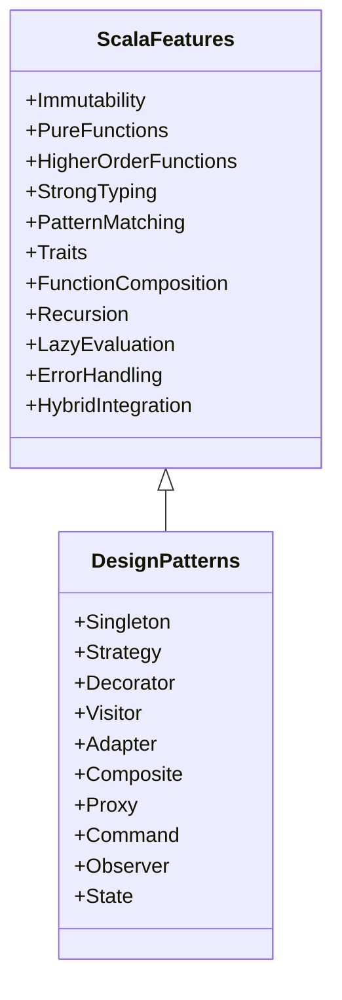

## 1.5 Overview of Scala Features Relevant to Design Patterns

Scala is a powerful language that elegantly combines object-oriented and functional programming paradigms. This unique blend makes it particularly well-suited for implementing design patterns, which are reusable solutions to common problems in software design. In this section, we will explore Scala's specific features that facilitate the implementation of design patterns, enhancing code clarity, maintainability, and scalability.

### Introduction to Scala's Unique Features

Scala's design philosophy is centered around providing a concise and expressive syntax while maintaining type safety and performance. This is achieved through a combination of features that support both functional and object-oriented programming. Let's delve into these features and understand how they contribute to the effective use of design patterns.

### 1. Immutability and Persistent Data Structures

Immutability is a cornerstone of functional programming, and Scala embraces it wholeheartedly. Immutable data structures ensure that once an object is created, it cannot be modified. This leads to safer and more predictable code, as it eliminates side effects and makes concurrent programming easier.

#### Code Example: Immutable Collections

```scala
val immutableList = List(1, 2, 3, 4, 5)
// Attempting to modify will result in a new list
val newList = immutableList.map(_ * 2)
println(newList) // Output: List(2, 4, 6, 8, 10)
```

#### Benefits for Design Patterns

Immutability simplifies the implementation of patterns like Singleton and Flyweight, where shared state must be managed carefully. It also aids in the creation of thread-safe designs without the need for complex synchronization.

### 2. Pure Functions and Side Effects

Pure functions are functions where the output is determined solely by the input values, without observable side effects. Scala encourages the use of pure functions, which leads to more modular and testable code.

#### Code Example: Pure Function

```scala
def add(a: Int, b: Int): Int = a + b
```

#### Benefits for Design Patterns

Pure functions are fundamental in patterns like Strategy and Command, where behavior is encapsulated and can be passed around as first-class entities.

### 3. Higher-Order Functions and Function Literals

Scala treats functions as first-class citizens, allowing them to be passed as arguments, returned from other functions, and assigned to variables. Higher-order functions are those that take other functions as parameters or return them as results.

#### Code Example: Higher-Order Function

```scala
def applyFunction(f: Int => Int, x: Int): Int = f(x)

val increment: Int => Int = _ + 1
println(applyFunction(increment, 5)) // Output: 6
```

#### Benefits for Design Patterns

Higher-order functions enable patterns like Decorator and Chain of Responsibility, where behavior can be dynamically composed and extended.

### 4. Strong Typing and Type Inference

Scala's type system is both expressive and safe, allowing developers to write robust code with fewer errors. Type inference reduces boilerplate code, making the language more concise.

#### Code Example: Type Inference

```scala
val number = 42 // Scala infers this as Int
```

#### Benefits for Design Patterns

A strong type system supports patterns like Factory and Builder, ensuring that objects are constructed correctly and consistently.

### 5. Pattern Matching and Case Classes

Pattern matching is a powerful feature in Scala that allows for concise and readable code. It is often used in conjunction with case classes, which are a special type of class that automatically provides implementations for methods like `equals` and `hashCode`.

#### Code Example: Pattern Matching

```scala
sealed trait Animal
case class Dog(name: String) extends Animal
case class Cat(name: String) extends Animal

def greet(animal: Animal): String = animal match {
  case Dog(name) => s"Woof! Hello, $name!"
  case Cat(name) => s"Meow! Hello, $name!"
}

println(greet(Dog("Buddy"))) // Output: Woof! Hello, Buddy!
```

#### Benefits for Design Patterns

Pattern matching simplifies the implementation of patterns like Visitor and Interpreter, where operations are performed on elements of an object structure.

### 6. Traits and Mixins

Traits in Scala are similar to interfaces in Java but can also contain concrete methods and fields. They provide a way to compose behavior and achieve code reuse.

#### Code Example: Traits

```scala
trait Greeter {
  def greet(name: String): String = s"Hello, $name!"
}

class Person(name: String) extends Greeter {
  def introduce(): String = greet(name)
}

val person = new Person("Alice")
println(person.introduce()) // Output: Hello, Alice!
```

#### Benefits for Design Patterns

Traits are instrumental in implementing patterns like Adapter and Decorator, where behavior needs to be extended or modified.

### 7. Function Composition and Currying

Function composition allows combining simple functions to build more complex ones. Currying transforms a function with multiple arguments into a series of functions that each take a single argument.

#### Code Example: Function Composition

```scala
val addOne: Int => Int = _ + 1
val multiplyByTwo: Int => Int = _ * 2

val addThenMultiply = addOne andThen multiplyByTwo
println(addThenMultiply(3)) // Output: 8
```

#### Benefits for Design Patterns

Function composition and currying are useful in patterns like Strategy and Template Method, where operations can be defined and combined flexibly.

### 8. Recursion and Tail Call Optimization

Recursion is a common technique in functional programming, and Scala supports it with tail call optimization, allowing recursive functions to execute efficiently without stack overflow.

#### Code Example: Tail Recursive Function

```scala
def factorial(n: Int, acc: Int = 1): Int = {
  if (n <= 1) acc
  else factorial(n - 1, n * acc)
}

println(factorial(5)) // Output: 120
```

#### Benefits for Design Patterns

Recursion is essential in patterns like Composite and Interpreter, where hierarchical structures are processed.

### 9. Lazy Evaluation and Streams

Scala supports lazy evaluation, which defers computation until the result is actually needed. This is particularly useful for working with large data sets or infinite sequences.

#### Code Example: Lazy Evaluation

```scala
lazy val lazyValue = {
  println("Computing lazy value")
  42
}

println(lazyValue) // Output: Computing lazy value 42
```

#### Benefits for Design Patterns

Lazy evaluation is beneficial in patterns like Proxy and Flyweight, where resource-intensive operations can be deferred.

### 10. Error Handling in Functional Programming

Scala provides several constructs for handling errors in a functional way, such as `Option`, `Either`, and `Try`. These constructs allow for safe and expressive error handling without exceptions.

#### Code Example: Error Handling with `Try`

```scala
import scala.util.{Try, Success, Failure}

def divide(a: Int, b: Int): Try[Int] = Try(a / b)

val result = divide(10, 0) match {
  case Success(value) => s"Result: $value"
  case Failure(exception) => s"Error: ${exception.getMessage}"
}

println(result) // Output: Error: / by zero
```

#### Benefits for Design Patterns

Functional error handling is crucial in patterns like Command and Strategy, where operations may fail and need to be handled gracefully.

### 11. Integrating Functional and Object-Oriented Concepts

Scala's ability to integrate functional and object-oriented concepts allows for flexible and powerful design patterns. This integration enables the creation of hybrid systems that leverage the strengths of both paradigms.

#### Code Example: Hybrid Approach

```scala
trait Animal {
  def speak(): String
}

class Dog extends Animal {
  def speak(): String = "Woof!"
}

val animals: List[Animal] = List(new Dog, new Dog)
val sounds = animals.map(_.speak())
println(sounds) // Output: List(Woof!, Woof!)
```

#### Benefits for Design Patterns

The integration of paradigms supports patterns like Observer and State, where both state and behavior need to be managed.

### Visualizing Scala's Features

To better understand how Scala's features contribute to design patterns, let's visualize the relationships between these features and common design patterns using a class diagram.



### Conclusion

Scala's unique features provide a robust foundation for implementing design patterns. By leveraging immutability, pure functions, higher-order functions, and other powerful constructs, developers can create elegant and efficient solutions to common software design problems. As you continue exploring Scala, remember to experiment with these features and apply them to your design patterns for optimal results.

### Try It Yourself

Experiment with the code examples provided in this section. Try modifying them to see how Scala's features can be used in different contexts. For instance, create a new design pattern using traits and higher-order functions, or explore how lazy evaluation can optimize a resource-intensive operation.

### Quiz Time!



### What is the primary benefit of immutability in Scala?

- [x] It ensures thread safety and predictability.
- [ ] It allows for dynamic typing.
- [ ] It increases the verbosity of code.
- [ ] It enables runtime polymorphism.

> **Explanation:** Immutability ensures that once an object is created, it cannot be changed, leading to thread safety and predictability in concurrent programming.

### How does Scala's type inference benefit developers?

- [x] It reduces boilerplate code.
- [ ] It eliminates the need for type annotations entirely.
- [ ] It makes the code less readable.
- [ ] It allows for dynamic typing.

> **Explanation:** Scala's type inference reduces the need for explicit type annotations, making the code more concise while maintaining type safety.

### Which Scala feature allows functions to be passed as arguments?

- [x] Higher-order functions
- [ ] Pattern matching
- [ ] Traits
- [ ] Immutability

> **Explanation:** Higher-order functions are functions that take other functions as parameters or return them as results, allowing for flexible and reusable code.

### What is a key advantage of using pattern matching in Scala?

- [x] It provides a concise and readable way to handle different cases.
- [ ] It allows for dynamic typing.
- [ ] It increases the complexity of code.
- [ ] It eliminates the need for functions.

> **Explanation:** Pattern matching provides a clear and concise syntax for handling different cases, making the code more readable and maintainable.

### How does lazy evaluation benefit resource-intensive operations?

- [x] It defers computation until the result is needed, saving resources.
- [ ] It increases the speed of computation.
- [ ] It requires more memory.
- [ ] It eliminates the need for functions.

> **Explanation:** Lazy evaluation defers computation until the result is actually needed, which can save resources and improve performance in resource-intensive operations.

### What is the role of traits in Scala?

- [x] They provide a way to compose behavior and achieve code reuse.
- [ ] They allow for dynamic typing.
- [ ] They increase the verbosity of code.
- [ ] They enable runtime polymorphism.

> **Explanation:** Traits in Scala are used to compose behavior and achieve code reuse, similar to interfaces in Java but with additional capabilities.

### Which feature is essential for implementing the Composite pattern?

- [x] Recursion
- [ ] Immutability
- [ ] Traits
- [ ] Lazy evaluation

> **Explanation:** Recursion is essential for implementing the Composite pattern, as it allows for processing hierarchical structures.

### What is a benefit of using pure functions in design patterns?

- [x] They lead to more modular and testable code.
- [ ] They allow for dynamic typing.
- [ ] They increase the complexity of code.
- [ ] They eliminate the need for functions.

> **Explanation:** Pure functions, which have no side effects and return the same output for the same input, lead to more modular and testable code.

### How does Scala's strong typing support design patterns?

- [x] It ensures that objects are constructed correctly and consistently.
- [ ] It allows for dynamic typing.
- [ ] It increases the verbosity of code.
- [ ] It enables runtime polymorphism.

> **Explanation:** Scala's strong typing ensures that objects are constructed correctly and consistently, supporting patterns like Factory and Builder.

### True or False: Scala's ability to integrate functional and object-oriented concepts allows for flexible and powerful design patterns.

- [x] True
- [ ] False

> **Explanation:** Scala's integration of functional and object-oriented concepts allows developers to leverage the strengths of both paradigms, leading to flexible and powerful design patterns.



Remember, this is just the beginning. As you progress, you'll build more complex and interactive applications using Scala's rich feature set. Keep experimenting, stay curious, and enjoy the journey!
