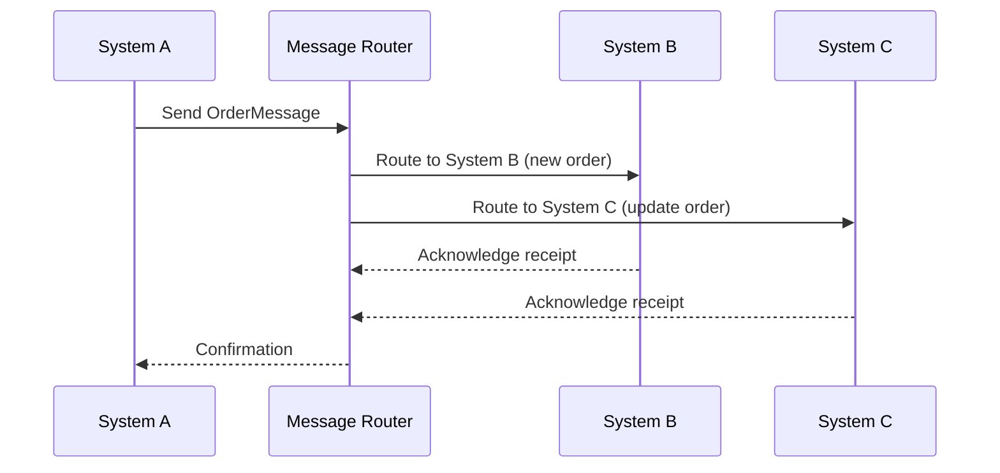

## 10.1 Introduction to Enterprise Integration Patterns

Enterprise integration is a critical aspect of modern software development, especially in environments where multiple systems need to communicate and work together seamlessly. This section will delve into the challenges of enterprise integration, the importance of messaging and integration patterns, and how Scala can be leveraged to implement these patterns effectively.

### Understanding the Challenges of Enterprise Integration

Enterprise integration involves connecting disparate systems, applications, and services within an organization to ensure that data and processes are seamlessly shared and coordinated. This integration is essential for maintaining operational efficiency, ensuring data consistency, and enabling real-time decision-making. However, achieving effective integration comes with its own set of challenges:

1. **Heterogeneous Systems**: Organizations often have a mix of legacy systems, modern applications, and third-party services. These systems may use different technologies, data formats, and protocols, making integration complex.

2. **Data Consistency and Integrity**: Ensuring that data remains consistent and accurate across all integrated systems is a significant challenge. This requires robust data synchronization and conflict resolution mechanisms.

3. **Scalability**: As organizations grow, their integration needs become more complex. The integration architecture must be scalable to handle increased data volumes and transaction loads.

4. **Security**: Integrating systems often involves sharing sensitive data across different platforms. Ensuring secure data transmission and access control is crucial to prevent unauthorized access and data breaches.

5. **Reliability and Fault Tolerance**: Integration solutions must be reliable and capable of handling failures gracefully. This includes implementing retry mechanisms, failover strategies, and ensuring message delivery guarantees.

6. **Performance**: Integration solutions must be optimized for performance to ensure that data is processed and transmitted efficiently without causing bottlenecks.

### Importance of Messaging and Integration Patterns

Messaging and integration patterns provide a structured approach to solving common integration challenges. These patterns are reusable solutions that can be applied to various integration scenarios, ensuring that systems can communicate effectively and efficiently. Here are some key reasons why messaging and integration patterns are important:

- **Decoupling**: Messaging patterns help decouple systems, allowing them to communicate without being tightly integrated. This makes it easier to modify or replace individual components without affecting the entire system.

- **Asynchronous Communication**: Many messaging patterns support asynchronous communication, enabling systems to send and receive messages without waiting for immediate responses. This improves system responsiveness and scalability.

- **Reliability**: Patterns such as guaranteed delivery and message persistence ensure that messages are not lost, even in the event of system failures.

- **Scalability**: Integration patterns can be designed to handle varying loads, making it easier to scale systems horizontally or vertically as needed.

- **Flexibility**: Patterns provide flexibility in how systems interact, allowing for different communication styles (e.g., request/reply, publish/subscribe) and data formats.

- **Standardization**: Using established patterns helps standardize integration approaches, making it easier to maintain and extend integration solutions over time.

### Key Enterprise Integration Patterns

Let's explore some of the key enterprise integration patterns and how they can be implemented in Scala:

#### 1. Message Channel

**Intent**: Establish a communication path between systems to send and receive messages.

**Applicability**: Use when systems need to exchange messages over a reliable channel.

**Scala Implementation**: In Scala, message channels can be implemented using libraries like Akka, which provides robust support for message-based communication.

```scala
import akka.actor.{Actor, ActorSystem, Props}

// Define a simple message
case class Message(content: String)

// Define an actor that processes messages
class MessageProcessor extends Actor {
  def receive: Receive = {
    case Message(content) =>
      println(s"Processing message: $content")
  }
}

// Create an actor system and a message processor actor
val system = ActorSystem("MessageSystem")
val processor = system.actorOf(Props[MessageProcessor], "processor")

// Send a message to the processor
processor ! Message("Hello, Scala!")
```

#### 2. Message Router

**Intent**: Route messages to different destinations based on specific criteria.

**Applicability**: Use when messages need to be directed to different systems or components based on their content or attributes.

**Scala Implementation**: Implement message routing logic using pattern matching and Akka actors.

```scala
import akka.actor.{Actor, ActorSystem, Props}

// Define messages
case class OrderMessage(orderId: Int, orderType: String)

// Define an actor that routes messages
class OrderRouter extends Actor {
  def receive: Receive = {
    case OrderMessage(orderId, "new") =>
      println(s"Routing new order: $orderId")
    case OrderMessage(orderId, "update") =>
      println(s"Routing update for order: $orderId")
    case _ =>
      println("Unknown order type")
  }
}

// Create an actor system and an order router actor
val system = ActorSystem("OrderSystem")
val router = system.actorOf(Props[OrderRouter], "router")

// Send messages to the router
router ! OrderMessage(1, "new")
router ! OrderMessage(2, "update")
```

#### 3. Message Translator

**Intent**: Convert messages from one format to another to facilitate communication between systems with different data formats.

**Applicability**: Use when systems need to exchange messages in different formats.

**Scala Implementation**: Implement message translation using case classes and pattern matching.

```scala
// Define a message in one format
case class XmlMessage(content: String)

// Define a message in another format
case class JsonMessage(content: String)

// Define a translator function
def translate(message: XmlMessage): JsonMessage = {
  // Simulate translation logic
  JsonMessage(s"Translated: ${message.content}")
}

// Example usage
val xmlMessage = XmlMessage("<order><id>1</id></order>")
val jsonMessage = translate(xmlMessage)
println(jsonMessage.content)
```

#### 4. Message Filter

**Intent**: Filter messages based on specific criteria, allowing only certain messages to pass through.

**Applicability**: Use when only specific messages should be processed or forwarded.

**Scala Implementation**: Implement message filtering using higher-order functions and collections.

```scala
// Define a message
case class LogMessage(level: String, content: String)

// Define a filter function
def filterMessages(messages: List[LogMessage], level: String): List[LogMessage] = {
  messages.filter(_.level == level)
}

// Example usage
val messages = List(
  LogMessage("INFO", "This is an info message"),
  LogMessage("ERROR", "This is an error message"),
  LogMessage("DEBUG", "This is a debug message")
)

val errorMessages = filterMessages(messages, "ERROR")
errorMessages.foreach(msg => println(msg.content))
```

### Visualizing Enterprise Integration Patterns

To better understand how these patterns work together, let's visualize a simple integration scenario using a sequence diagram. This diagram illustrates the flow of messages between different components in an enterprise integration architecture.



### Try It Yourself

Experiment with the provided code examples by modifying the message content, adding new message types, or implementing additional patterns such as the **Aggregator** or **Splitter**. This hands-on approach will deepen your understanding of enterprise integration patterns in Scala.

### Knowledge Check

Before we wrap up, let's reinforce your understanding with a few questions:

- What are some common challenges in enterprise integration?
- How do messaging patterns help decouple systems?
- What is the purpose of a message router?
- How can Scala's pattern matching be used in message translation?

### Conclusion

Enterprise integration patterns are essential tools for building robust, scalable, and maintainable integration solutions. By leveraging Scala's powerful features, such as Akka actors and pattern matching, you can implement these patterns effectively and address the challenges of enterprise integration.

Remember, this is just the beginning. As you progress, you'll encounter more complex integration scenarios and patterns. Keep experimenting, stay curious, and enjoy the journey!

## Quiz Time!



### What is a primary challenge of enterprise integration?

- [x] Heterogeneous systems
- [ ] Lack of programming languages
- [ ] Excessive hardware resources
- [ ] Overabundance of developers

> **Explanation:** Enterprise integration often involves connecting different systems that use various technologies, which is a significant challenge.

### Which pattern helps in decoupling systems?

- [x] Messaging patterns
- [ ] Singleton pattern
- [ ] Factory pattern
- [ ] Observer pattern

> **Explanation:** Messaging patterns allow systems to communicate without being tightly integrated, facilitating decoupling.

### What is the role of a message router?

- [x] Direct messages to different destinations based on criteria
- [ ] Translate messages from one format to another
- [ ] Filter messages based on specific criteria
- [ ] Store messages for future processing

> **Explanation:** A message router directs messages to different systems or components based on their content or attributes.

### How can Scala's pattern matching be utilized in integration patterns?

- [x] For message routing and translation
- [ ] For database transactions
- [ ] For user authentication
- [ ] For UI rendering

> **Explanation:** Scala's pattern matching is useful for implementing logic in message routing and translation.

### What is a benefit of using messaging patterns?

- [x] Asynchronous communication
- [ ] Increased hardware costs
- [ ] Reduced security
- [ ] Synchronous processing

> **Explanation:** Messaging patterns support asynchronous communication, improving system responsiveness and scalability.

### Which Scala library is commonly used for message-based communication?

- [x] Akka
- [ ] Play Framework
- [ ] Spark
- [ ] Cats

> **Explanation:** Akka is a popular library in Scala for building message-based communication systems.

### What does a message translator do?

- [x] Converts messages from one format to another
- [ ] Filters messages based on criteria
- [ ] Routes messages to different destinations
- [ ] Stores messages for later use

> **Explanation:** A message translator converts messages between different formats to facilitate communication between systems.

### What is the purpose of a message filter?

- [x] Allow only certain messages to pass through
- [ ] Convert messages to a different format
- [ ] Route messages to multiple destinations
- [ ] Store messages for future processing

> **Explanation:** A message filter allows only specific messages to pass through based on defined criteria.

### Which pattern ensures message delivery even in case of failures?

- [x] Guaranteed delivery
- [ ] Singleton pattern
- [ ] Factory pattern
- [ ] Observer pattern

> **Explanation:** Guaranteed delivery patterns ensure that messages are not lost, even if there are system failures.

### True or False: Integration patterns are only applicable to modern systems.

- [ ] True
- [x] False

> **Explanation:** Integration patterns are applicable to both legacy and modern systems, helping them communicate effectively.


