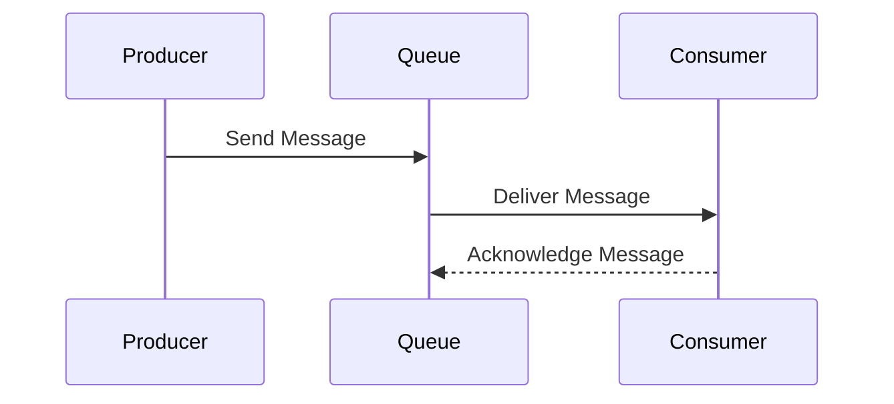

## 10.2 Messaging Systems

In the realm of software engineering, messaging systems play a pivotal role in enabling communication between distributed components. This section delves into the implementation of messaging systems in Scala, focusing on the use of Akka and Java Message Service (JMS) to create robust message channels and endpoints. As expert developers and architects, understanding these systems is crucial for building scalable and resilient enterprise applications.

### Introduction to Messaging Systems

Messaging systems are designed to facilitate communication between different parts of a software system, often across network boundaries. They decouple the sender and receiver, allowing them to operate independently and asynchronously. This decoupling is essential for building scalable, fault-tolerant systems.

#### Key Concepts

- **Message Channels**: These are conduits through which messages are sent and received. They abstract the underlying transport mechanism, providing a uniform interface for message exchange.
- **Message Endpoints**: These are the points at which messages enter or leave the messaging system. They can be producers, consumers, or both.

### Implementing Message Channels with Akka

Akka is a powerful toolkit for building concurrent, distributed, and fault-tolerant applications on the JVM. It provides a robust actor-based model for implementing messaging systems.

#### Akka Actors

Actors are the fundamental unit of computation in Akka. They encapsulate state and behavior, communicating with each other through message passing.

```scala
import akka.actor.{Actor, ActorSystem, Props}

// Define a simple actor
class SimpleActor extends Actor {
  def receive: Receive = {
    case message: String => println(s"Received message: $message")
  }
}

// Create an actor system
val system = ActorSystem("MessagingSystem")

// Create an actor
val simpleActor = system.actorOf(Props[SimpleActor], "simpleActor")

// Send a message to the actor
simpleActor ! "Hello, Akka!"
```

In this example, we define a `SimpleActor` that prints any string message it receives. We then create an actor system and an instance of `SimpleActor`, sending it a message.

#### Designing Message Channels with Akka

Akka provides several constructs for designing message channels, including:

- **Actor Hierarchies**: Organize actors in a tree structure, where parent actors supervise their children.
- **Routers**: Distribute messages across a pool of actors, enabling load balancing.
- **Event Streams**: Publish-subscribe mechanism for broadcasting messages to multiple subscribers.

##### Example: Implementing a Router

```scala
import akka.actor.{Actor, ActorSystem, Props}
import akka.routing.RoundRobinPool

class WorkerActor extends Actor {
  def receive: Receive = {
    case message: String => println(s"Worker received: $message")
  }
}

val system = ActorSystem("RouterSystem")

// Create a router with 5 worker actors
val router = system.actorOf(RoundRobinPool(5).props(Props[WorkerActor]), "router")

// Send messages to the router
router ! "Task 1"
router ! "Task 2"
router ! "Task 3"
```

In this example, we create a router that distributes incoming messages across a pool of `WorkerActor` instances using a round-robin strategy.

### Implementing Message Channels with JMS

Java Message Service (JMS) is a Java API that provides a common interface for messaging systems. It supports both point-to-point and publish-subscribe messaging models.

#### Setting Up JMS

To use JMS in Scala, you'll need a JMS provider, such as Apache ActiveMQ or IBM MQ. Ensure the provider's libraries are included in your project's dependencies.

#### JMS Message Producers and Consumers

JMS defines two primary roles: producers, which send messages, and consumers, which receive them.

##### Example: JMS Producer

```scala
import javax.jms._
import org.apache.activemq.ActiveMQConnectionFactory

val connectionFactory = new ActiveMQConnectionFactory("tcp://localhost:61616")
val connection = connectionFactory.createConnection()
connection.start()

val session = connection.createSession(false, Session.AUTO_ACKNOWLEDGE)
val destination = session.createQueue("exampleQueue")

val producer = session.createProducer(destination)
val message = session.createTextMessage("Hello, JMS!")

producer.send(message)
println("Message sent")

producer.close()
session.close()
connection.close()
```

In this example, we create a JMS connection to an ActiveMQ broker, create a session and a queue, and send a text message to the queue.

##### Example: JMS Consumer

```scala
import javax.jms._
import org.apache.activemq.ActiveMQConnectionFactory

val connectionFactory = new ActiveMQConnectionFactory("tcp://localhost:61616")
val connection = connectionFactory.createConnection()
connection.start()

val session = connection.createSession(false, Session.AUTO_ACKNOWLEDGE)
val destination = session.createQueue("exampleQueue")

val consumer = session.createConsumer(destination)
consumer.setMessageListener(new MessageListener {
  def onMessage(message: Message): Unit = {
    message match {
      case textMessage: TextMessage => println(s"Received: ${textMessage.getText}")
      case _ => println("Received non-text message")
    }
  }
})

println("Waiting for messages...")
// Keep the application running to listen for messages
Thread.sleep(10000)

consumer.close()
session.close()
connection.close()
```

Here, we create a JMS consumer that listens for messages on the same queue. When a message is received, it prints the message content.

### Designing Message Endpoints

Message endpoints are critical components in a messaging system. They are responsible for producing and consuming messages, transforming data, and integrating with other systems.

#### Key Considerations

- **Scalability**: Ensure endpoints can handle varying loads by using techniques such as load balancing and message throttling.
- **Reliability**: Implement mechanisms for message acknowledgment and retry to handle failures.
- **Security**: Secure message channels and endpoints to prevent unauthorized access and data breaches.

#### Example: Akka Message Endpoint

```scala
import akka.actor.{Actor, ActorSystem, Props}

class EndpointActor extends Actor {
  def receive: Receive = {
    case message: String =>
      println(s"Processing message: $message")
      // Simulate message processing
      Thread.sleep(500)
      println("Message processed")
  }
}

val system = ActorSystem("EndpointSystem")
val endpointActor = system.actorOf(Props[EndpointActor], "endpointActor")

// Simulate sending messages to the endpoint
(1 to 5).foreach(i => endpointActor ! s"Message $i")
```

In this example, `EndpointActor` simulates processing messages with a delay, illustrating how an endpoint might handle incoming messages.

### Visualizing Messaging Systems

To better understand the flow of messages in a system, let's visualize a simple messaging architecture using Mermaid.js.



This sequence diagram illustrates a basic messaging flow where a producer sends a message to a queue, which is then delivered to a consumer. The consumer acknowledges receipt of the message.

### Advanced Messaging Patterns

In addition to basic messaging, there are several advanced patterns that can enhance the functionality and reliability of a messaging system.

#### Request-Reply Pattern

This pattern involves a sender sending a request message and waiting for a reply. It is useful for synchronous communication.

```scala
import akka.actor.{Actor, ActorRef, ActorSystem, Props}

class RequestActor(replyTo: ActorRef) extends Actor {
  def receive: Receive = {
    case message: String =>
      println(s"Request received: $message")
      replyTo ! s"Reply to: $message"
  }
}

class ReplyActor extends Actor {
  def receive: Receive = {
    case message: String => println(s"Reply received: $message")
  }
}

val system = ActorSystem("RequestReplySystem")
val replyActor = system.actorOf(Props[ReplyActor], "replyActor")
val requestActor = system.actorOf(Props(new RequestActor(replyActor)), "requestActor")

// Send a request and wait for a reply
requestActor ! "Request 1"
```

In this example, `RequestActor` sends a reply back to `ReplyActor` upon receiving a request.

#### Publish-Subscribe Pattern

This pattern allows multiple consumers to receive messages from a single producer. It is useful for broadcasting messages.

```scala
import akka.actor.{Actor, ActorSystem, Props}
import akka.event.{ActorEventBus, LookupClassification}

class EventBus extends ActorEventBus with LookupClassification {
  type Event = String
  type Classifier = String

  protected def mapSize(): Int = 128

  protected def classify(event: Event): Classifier = event

  protected def publish(event: Event, subscriber: ActorRef): Unit = {
    subscriber ! event
  }
}

class SubscriberActor extends Actor {
  def receive: Receive = {
    case message: String => println(s"Subscriber received: $message")
  }
}

val system = ActorSystem("PubSubSystem")
val eventBus = new EventBus
val subscriber1 = system.actorOf(Props[SubscriberActor], "subscriber1")
val subscriber2 = system.actorOf(Props[SubscriberActor], "subscriber2")

// Subscribe actors to the event bus
eventBus.subscribe(subscriber1, "topic1")
eventBus.subscribe(subscriber2, "topic1")

// Publish a message to the topic
eventBus.publish("topic1", "Broadcast message")
```

In this example, `EventBus` acts as a publish-subscribe mechanism, allowing multiple subscribers to receive broadcast messages.

### Design Considerations

When designing messaging systems, consider the following:

- **Latency**: Minimize message delivery time to ensure timely processing.
- **Throughput**: Optimize the system to handle a high volume of messages.
- **Fault Tolerance**: Implement strategies to recover from failures, such as message persistence and retries.

### Differences and Similarities

Messaging systems can be implemented using various technologies, each with its own strengths and weaknesses. Akka and JMS are two popular choices, each offering unique features.

- **Akka**: Provides a lightweight, actor-based model for building distributed systems. It excels in scenarios requiring high concurrency and low latency.
- **JMS**: Offers a standardized API for messaging across different providers. It is well-suited for enterprise environments with existing JMS infrastructure.

### Try It Yourself

Experiment with the provided code examples by modifying message content, changing the number of actors or consumers, and observing the effects on message flow and processing. Consider implementing additional patterns, such as the **Competing Consumers** pattern, to further enhance your understanding.

### Conclusion

Messaging systems are a cornerstone of modern software architecture, enabling decoupled and scalable communication between components. By leveraging tools like Akka and JMS, Scala developers can build robust messaging solutions that meet the demands of enterprise applications. Remember, this is just the beginning. As you progress, you'll uncover more advanced patterns and techniques to refine your messaging systems. Keep experimenting, stay curious, and enjoy the journey!

## Quiz Time!



### What is the primary role of a message channel in a messaging system?

- [x] To provide a conduit for messages between sender and receiver
- [ ] To store messages for long-term archival
- [ ] To encrypt messages for security
- [ ] To transform messages into different formats

> **Explanation:** Message channels are designed to facilitate the transfer of messages between different components, abstracting the underlying transport mechanism.

### Which Akka construct is used to distribute messages across a pool of actors?

- [ ] Event Streams
- [ ] Actor Hierarchies
- [x] Routers
- [ ] Supervisors

> **Explanation:** Routers in Akka are used to distribute messages across a pool of actors, enabling load balancing and parallel processing.

### What is the primary advantage of using JMS in enterprise environments?

- [ ] It provides a lightweight actor model
- [ ] It supports high concurrency
- [x] It offers a standardized messaging API
- [ ] It is optimized for low latency

> **Explanation:** JMS provides a standardized API for messaging, making it suitable for enterprise environments with existing JMS infrastructure.

### In the Publish-Subscribe pattern, what is the role of the subscriber?

- [ ] To send messages to the producer
- [x] To receive broadcast messages from the producer
- [ ] To transform messages into different formats
- [ ] To store messages for long-term archival

> **Explanation:** Subscribers in the Publish-Subscribe pattern receive broadcast messages from a producer, allowing multiple consumers to process the same message.

### What is a key consideration when designing message endpoints?

- [x] Scalability
- [ ] Color scheme
- [ ] Font size
- [ ] User interface design

> **Explanation:** Scalability is crucial when designing message endpoints to ensure they can handle varying loads and maintain performance.

### Which pattern involves a sender waiting for a reply after sending a request?

- [ ] Publish-Subscribe
- [x] Request-Reply
- [ ] Competing Consumers
- [ ] Event Sourcing

> **Explanation:** The Request-Reply pattern involves a sender sending a request and waiting for a reply, enabling synchronous communication.

### What is a benefit of using Akka for messaging systems?

- [x] High concurrency and low latency
- [ ] Standardized API across providers
- [ ] Long-term message storage
- [ ] Built-in message encryption

> **Explanation:** Akka excels in scenarios requiring high concurrency and low latency, making it suitable for building distributed systems.

### How can message reliability be ensured in a messaging system?

- [x] Implementing message acknowledgment and retry mechanisms
- [ ] Using colorful message formats
- [ ] Storing messages in plain text
- [ ] Limiting the number of messages sent

> **Explanation:** Reliability can be ensured by implementing message acknowledgment and retry mechanisms to handle failures and ensure successful delivery.

### What is the role of an actor in Akka?

- [x] To encapsulate state and behavior, communicating through message passing
- [ ] To store messages for long-term archival
- [ ] To transform messages into different formats
- [ ] To encrypt messages for security

> **Explanation:** Actors in Akka encapsulate state and behavior, communicating with each other through message passing, forming the core of Akka's concurrency model.

### True or False: JMS is optimized for low latency and high concurrency.

- [ ] True
- [x] False

> **Explanation:** JMS is not specifically optimized for low latency and high concurrency; it is a standardized API for messaging, suitable for enterprise environments.


