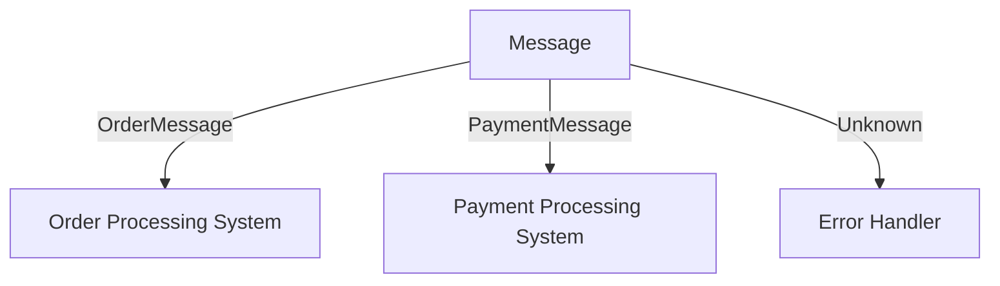
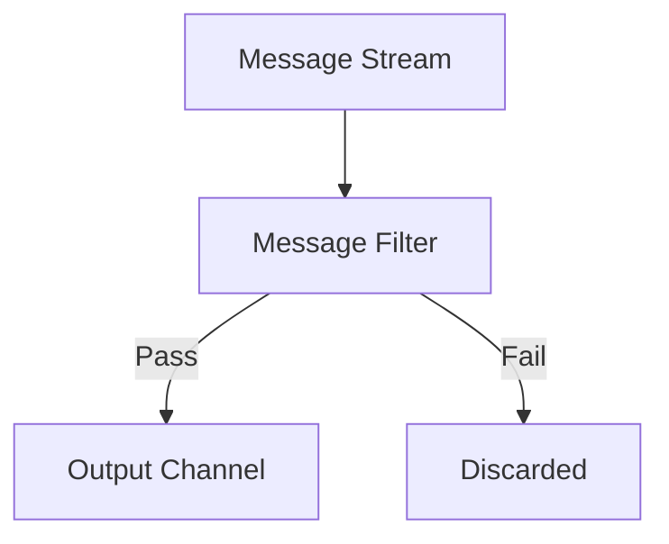
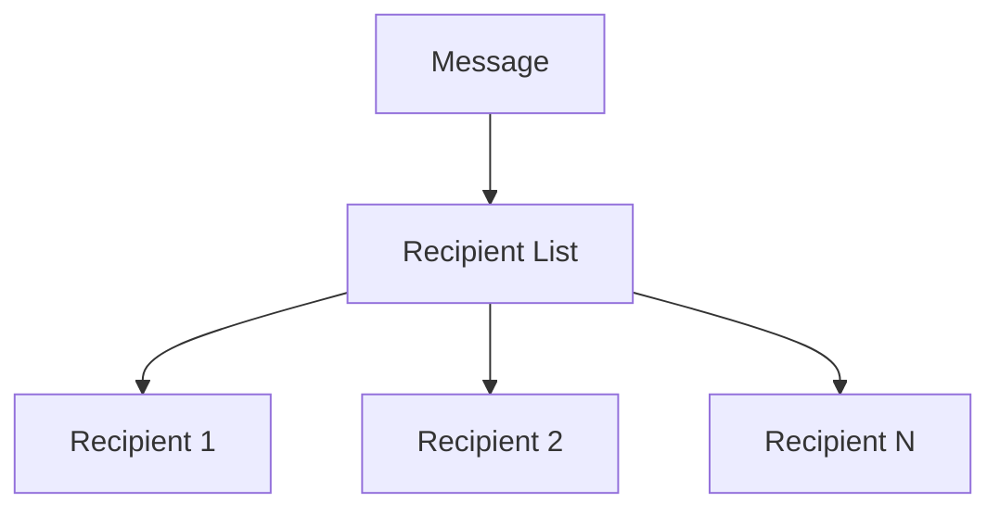
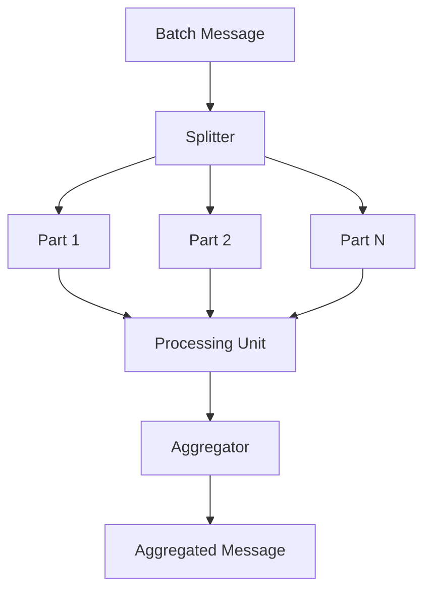

## 10.3 Message Routing Patterns

In the world of enterprise integration, message routing patterns play a crucial role in directing messages between different components of a system. These patterns ensure that messages are delivered to the correct destinations based on specific criteria, thereby enabling seamless communication and data flow. In this section, we will explore some of the most commonly used message routing patterns in Scala: Content-Based Router, Message Filter, Recipient List, and Splitter and Aggregator patterns. We will delve into their intent, applicability, and implementation, providing clear code examples and visual diagrams to aid understanding.

### Content-Based Router

#### Intent

The Content-Based Router pattern is designed to route messages to different destinations based on the content of the message itself. This pattern is particularly useful when messages need to be processed differently depending on their content.

#### Key Participants

- **Message**: The data being routed.
- **Router**: The component that examines the message content and determines the appropriate destination.
- **Destinations**: The possible endpoints to which the message can be routed.

#### Applicability

Use the Content-Based Router pattern when:
- Messages need to be processed differently based on their content.
- You want to decouple message producers from consumers.
- You need to maintain flexibility in routing logic.

#### Sample Code Snippet

Let's implement a Content-Based Router in Scala using pattern matching, a powerful feature of Scala that allows us to match on the content of messages.

```scala
// Define a trait for messages
sealed trait Message
case class OrderMessage(orderId: String, amount: Double) extends Message
case class PaymentMessage(paymentId: String, status: String) extends Message

// Define a router function
def contentBasedRouter(message: Message): Unit = message match {
  case OrderMessage(orderId, amount) =>
    println(s"Routing OrderMessage with ID: $orderId to Order Processing System")
    // Route to Order Processing System
  case PaymentMessage(paymentId, status) =>
    println(s"Routing PaymentMessage with ID: $paymentId to Payment Processing System")
    // Route to Payment Processing System
  case _ =>
    println("Unknown message type")
}

// Example usage
val orderMsg = OrderMessage("123", 250.0)
val paymentMsg = PaymentMessage("abc", "Completed")

contentBasedRouter(orderMsg)
contentBasedRouter(paymentMsg)
```

#### Design Considerations

- **Scalability**: Ensure the router can handle a large volume of messages efficiently.
- **Flexibility**: Design the router to easily accommodate new message types and routing logic.
- **Error Handling**: Implement robust error handling to manage unexpected message types or content.

#### Diagram



*Diagram: Visualizing the Content-Based Router pattern, where messages are routed to different systems based on their content.*

### Message Filter

#### Intent

The Message Filter pattern is used to eliminate unwanted messages from a message stream. This pattern ensures that only relevant messages are passed on for further processing.

#### Key Participants

- **Message**: The data being filtered.
- **Filter**: The component that evaluates messages and determines if they should be passed on.
- **Output Channel**: The destination for messages that pass the filter.

#### Applicability

Use the Message Filter pattern when:
- You need to remove irrelevant or unwanted messages from a stream.
- You want to reduce the load on downstream systems by filtering out unnecessary data.

#### Sample Code Snippet

Here's how you can implement a Message Filter in Scala using a simple predicate function.

```scala
// Define a trait for messages
sealed trait Message
case class LogMessage(level: String, content: String) extends Message

// Define a filter function
def messageFilter(message: Message): Boolean = message match {
  case LogMessage(level, _) if level == "ERROR" => true
  case _ => false
}

// Define a function to process messages
def processMessages(messages: List[Message]): List[Message] = {
  messages.filter(messageFilter)
}

// Example usage
val messages = List(
  LogMessage("INFO", "This is an info message"),
  LogMessage("ERROR", "This is an error message"),
  LogMessage("DEBUG", "This is a debug message")
)

val filteredMessages = processMessages(messages)
println(filteredMessages)
```

#### Design Considerations

- **Performance**: Ensure the filter operates efficiently, especially with high message volumes.
- **Flexibility**: Design filters to be easily configurable or replaceable.
- **Error Handling**: Implement error handling for cases where message evaluation fails.

#### Diagram



*Diagram: Visualizing the Message Filter pattern, where messages are filtered based on specific criteria.*

### Recipient List

#### Intent

The Recipient List pattern is used to route a message to one or more recipients. This pattern is useful when a message needs to be processed by multiple components.

#### Key Participants

- **Message**: The data being routed.
- **Recipient List**: The list of recipients to which the message should be sent.
- **Router**: The component that sends the message to each recipient in the list.

#### Applicability

Use the Recipient List pattern when:
- A message needs to be sent to multiple destinations.
- You want to decouple the sender from the recipients.

#### Sample Code Snippet

Let's implement a Recipient List in Scala using a list of functions representing recipients.

```scala
// Define a trait for messages
sealed trait Message
case class NotificationMessage(content: String) extends Message

// Define recipient functions
def emailRecipient(message: Message): Unit = {
  println(s"Sending email: ${message.asInstanceOf[NotificationMessage].content}")
}

def smsRecipient(message: Message): Unit = {
  println(s"Sending SMS: ${message.asInstanceOf[NotificationMessage].content}")
}

// Define a recipient list function
def recipientList(message: Message, recipients: List[Message => Unit]): Unit = {
  recipients.foreach(recipient => recipient(message))
}

// Example usage
val notificationMsg = NotificationMessage("System update at 10 PM")
val recipients = List(emailRecipient, smsRecipient)

recipientList(notificationMsg, recipients)
```

#### Design Considerations

- **Scalability**: Ensure the router can handle a large number of recipients efficiently.
- **Flexibility**: Design the recipient list to be easily configurable.
- **Error Handling**: Implement error handling for cases where message delivery to a recipient fails.

#### Diagram



*Diagram: Visualizing the Recipient List pattern, where a message is sent to multiple recipients.*

### Splitter and Aggregator Patterns

#### Intent

The Splitter and Aggregator patterns are used to break down a message into smaller parts and then recombine them after processing. The Splitter pattern divides a message into multiple parts, while the Aggregator pattern collects and combines these parts into a single message.

#### Key Participants

- **Message**: The data being split and aggregated.
- **Splitter**: The component that divides the message into parts.
- **Aggregator**: The component that combines the parts into a single message.
- **Processing Units**: The components that process each part.

#### Applicability

Use the Splitter and Aggregator patterns when:
- A message needs to be processed in parts.
- You want to parallelize processing of message parts.

#### Sample Code Snippet

Here's how you can implement the Splitter and Aggregator patterns in Scala.

```scala
// Define a trait for messages
sealed trait Message
case class BatchMessage(parts: List[String]) extends Message
case class PartMessage(content: String) extends Message

// Define a splitter function
def splitter(message: BatchMessage): List[PartMessage] = {
  message.parts.map(PartMessage)
}

// Define a processing function
def processPart(part: PartMessage): String = {
  s"Processed: ${part.content}"
}

// Define an aggregator function
def aggregator(parts: List[String]): BatchMessage = {
  BatchMessage(parts)
}

// Example usage
val batchMsg = BatchMessage(List("Part1", "Part2", "Part3"))
val parts = splitter(batchMsg)
val processedParts = parts.map(processPart)
val aggregatedMsg = aggregator(processedParts)

println(aggregatedMsg)
```

#### Design Considerations

- **Performance**: Ensure the splitter and aggregator operate efficiently, especially with large messages.
- **Flexibility**: Design the splitter and aggregator to be easily configurable.
- **Error Handling**: Implement error handling for cases where message splitting or aggregation fails.

#### Diagram



*Diagram: Visualizing the Splitter and Aggregator patterns, where a message is split into parts, processed, and then aggregated.*

### Try It Yourself

To deepen your understanding of these patterns, try modifying the code examples provided. For instance, add new message types to the Content-Based Router, or implement additional recipient functions for the Recipient List pattern. Experiment with different filtering criteria in the Message Filter pattern, or try processing parts in parallel in the Splitter and Aggregator patterns. Remember, the best way to learn is by doing, so don't hesitate to explore and experiment!

### Knowledge Check

- Explain the purpose of the Content-Based Router pattern.
- Describe a scenario where the Message Filter pattern would be useful.
- How does the Recipient List pattern help in decoupling the sender from recipients?
- What are the main components of the Splitter and Aggregator patterns?
- How can you ensure scalability when implementing message routing patterns?

### Embrace the Journey

Remember, mastering these patterns is just the beginning. As you continue to explore Scala and its powerful features, you'll discover even more ways to enhance your applications and systems. Keep experimenting, stay curious, and enjoy the journey!

## Quiz Time!



### What is the primary purpose of the Content-Based Router pattern?

- [x] To route messages to different destinations based on their content.
- [ ] To filter out unwanted messages from a message stream.
- [ ] To send a message to multiple recipients.
- [ ] To split a message into smaller parts for processing.

> **Explanation:** The Content-Based Router pattern routes messages to different destinations based on their content, allowing for flexible and dynamic message processing.

### In which scenario would you use the Message Filter pattern?

- [x] When you need to remove irrelevant messages from a stream.
- [ ] When you need to route messages based on their content.
- [ ] When you need to send messages to multiple recipients.
- [ ] When you need to aggregate message parts into a single message.

> **Explanation:** The Message Filter pattern is used to remove irrelevant or unwanted messages from a stream, ensuring that only relevant messages are processed.

### How does the Recipient List pattern help in decoupling the sender from recipients?

- [x] By allowing the sender to send messages to multiple recipients without knowing their details.
- [ ] By filtering out unwanted messages.
- [ ] By routing messages based on their content.
- [ ] By splitting messages into smaller parts.

> **Explanation:** The Recipient List pattern allows the sender to send messages to multiple recipients without needing to know their details, thereby decoupling the sender from the recipients.

### What are the main components of the Splitter and Aggregator patterns?

- [x] Splitter, Aggregator, Message, Processing Units
- [ ] Router, Filter, Message, Recipients
- [ ] Message, Filter, Output Channel
- [ ] Message, Router, Destinations

> **Explanation:** The main components of the Splitter and Aggregator patterns are the Splitter, Aggregator, Message, and Processing Units, which work together to split, process, and aggregate messages.

### How can you ensure scalability when implementing message routing patterns?

- [x] By designing the router to handle a large volume of messages efficiently.
- [ ] By using deep inheritance hierarchies.
- [ ] By overusing implicits and type annotations.
- [ ] By ignoring compiler warnings.

> **Explanation:** Ensuring scalability involves designing the router to efficiently handle a large volume of messages, allowing the system to grow and adapt to increased demand.

### What is the role of the Filter in the Message Filter pattern?

- [x] To evaluate messages and determine if they should be passed on.
- [ ] To route messages to different destinations.
- [ ] To send messages to multiple recipients.
- [ ] To split messages into smaller parts.

> **Explanation:** The Filter in the Message Filter pattern evaluates messages and determines if they should be passed on, ensuring only relevant messages are processed.

### Which pattern is useful when a message needs to be processed by multiple components?

- [x] Recipient List
- [ ] Content-Based Router
- [ ] Message Filter
- [ ] Splitter and Aggregator

> **Explanation:** The Recipient List pattern is useful when a message needs to be processed by multiple components, as it allows the message to be sent to multiple recipients.

### What is the purpose of the Aggregator in the Splitter and Aggregator patterns?

- [x] To combine message parts into a single message after processing.
- [ ] To split a message into smaller parts for processing.
- [ ] To filter out unwanted messages.
- [ ] To route messages based on their content.

> **Explanation:** The Aggregator in the Splitter and Aggregator patterns combines message parts into a single message after processing, ensuring that the final message is complete.

### Which pattern would you use to route messages to different destinations based on specific criteria?

- [x] Content-Based Router
- [ ] Message Filter
- [ ] Recipient List
- [ ] Splitter and Aggregator

> **Explanation:** The Content-Based Router pattern is used to route messages to different destinations based on specific criteria, allowing for dynamic message routing.

### True or False: The Splitter pattern is used to combine message parts into a single message.

- [ ] True
- [x] False

> **Explanation:** False. The Splitter pattern is used to divide a message into smaller parts, while the Aggregator pattern combines message parts into a single message.


