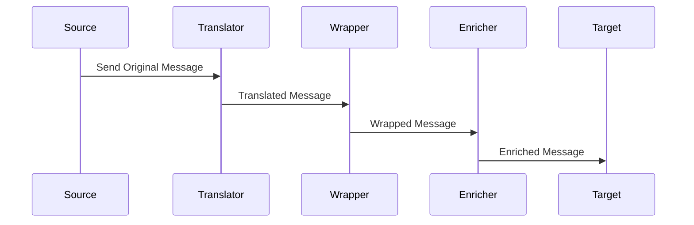

## 10.4 Message Transformation Patterns

In the realm of enterprise integration, message transformation patterns play a pivotal role in ensuring that messages exchanged between different systems are compatible and meaningful. These patterns help in modifying the structure and content of messages to meet the requirements of various systems involved in the communication process. In this section, we will delve into three fundamental message transformation patterns: **Message Translator**, **Envelope Wrapper**, and **Content Enricher**. We will explore their intent, applicability, and how they can be effectively implemented in Scala.

### Message Translator

#### Intent

The **Message Translator** pattern is designed to convert a message from one format to another. This is essential when different systems use different data formats or protocols. By translating messages, systems can communicate seamlessly without needing to understand each other's native formats.

#### Key Participants

- **Source System**: The system that sends the message in its native format.
- **Message Translator**: The component responsible for converting the message to the target format.
- **Target System**: The system that receives the translated message.

#### Applicability

Use the Message Translator pattern when:

- Systems involved in communication use different data formats.
- There is a need to decouple systems from each other's data representation.
- You want to centralize the logic for message format conversion.

#### Sample Code Snippet

Let's consider a scenario where we need to translate messages from JSON format to XML format. We will use Scala's powerful libraries to achieve this transformation.

```scala
import scala.xml.Elem
import play.api.libs.json._

object MessageTranslator {

  // Function to convert JSON to XML
  def jsonToXml(json: JsValue): Elem = {
    json match {
      case JsObject(fields) =>
        <object>
          {fields.map { case (key, value) => <field name={key}>{jsonToXml(value)}</field> }}
        </object>
      case JsArray(values) =>
        <array>
          {values.map(jsonToXml)}
        </array>
      case JsString(value) => <string>{value}</string>
      case JsNumber(value) => <number>{value}</number>
      case JsBoolean(value) => <boolean>{value.toString}</boolean>
      case JsNull => <null/>
    }
  }

  def main(args: Array[String]): Unit = {
    val json = Json.parse("""{"name": "John Doe", "age": 30, "isMember": true}""")
    val xml = jsonToXml(json)
    println(xml)
  }
}
```

In this example, we use the Play Framework's JSON library to parse a JSON string and convert it to an XML representation. The `jsonToXml` function recursively processes the JSON structure and constructs the corresponding XML elements.

#### Design Considerations

- **Performance**: Consider the performance implications of complex transformations, especially for large messages.
- **Scalability**: Ensure that the translator can handle high volumes of messages efficiently.
- **Error Handling**: Implement robust error handling to manage invalid or unexpected message formats.

#### Differences and Similarities

The Message Translator pattern is similar to the Adapter pattern in that both involve converting one interface to another. However, the Message Translator focuses specifically on data format conversion rather than adapting interfaces.

### Envelope Wrapper

#### Intent

The **Envelope Wrapper** pattern involves adding additional data or metadata to a message without altering its core content. This is useful for adding routing information, security credentials, or other context-specific data required by intermediary systems.

#### Key Participants

- **Original Message**: The core message that needs to be transmitted.
- **Envelope Wrapper**: The component that adds additional data to the message.
- **Recipient System**: The system that processes the enveloped message.

#### Applicability

Use the Envelope Wrapper pattern when:

- Additional metadata is required for message routing or processing.
- You need to add security credentials or authentication tokens.
- There is a need to maintain the integrity of the original message content.

#### Sample Code Snippet

Let's implement an Envelope Wrapper that adds routing information to a message.

```scala
case class Message(content: String)

case class Envelope(message: Message, routingInfo: Map[String, String])

object EnvelopeWrapper {

  def wrapMessage(message: Message, routingInfo: Map[String, String]): Envelope = {
    Envelope(message, routingInfo)
  }

  def main(args: Array[String]): Unit = {
    val message = Message("Hello, World!")
    val routingInfo = Map("destination" -> "ServiceA", "priority" -> "high")
    val envelopedMessage = wrapMessage(message, routingInfo)
    println(envelopedMessage)
  }
}
```

In this example, we define a simple `Message` class and an `Envelope` class that contains the message along with routing information. The `wrapMessage` function creates an envelope by combining the message with the specified routing information.

#### Design Considerations

- **Security**: Ensure that sensitive metadata is protected and not exposed to unauthorized parties.
- **Compatibility**: Verify that the recipient system can process the enveloped message correctly.
- **Flexibility**: Design the envelope structure to accommodate various types of metadata.

#### Differences and Similarities

The Envelope Wrapper pattern is analogous to the Decorator pattern, as both involve adding additional functionality to an existing component. However, the Envelope Wrapper specifically targets message metadata rather than behavior.

### Content Enricher

#### Intent

The **Content Enricher** pattern enhances a message with additional information that is not available in the original message. This is often necessary when the receiving system requires more data to process the message effectively.

#### Key Participants

- **Original Message**: The message that needs enrichment.
- **Content Enricher**: The component that adds additional data to the message.
- **Data Source**: The source from which additional data is retrieved.
- **Enriched Message**: The final message containing both original and additional data.

#### Applicability

Use the Content Enricher pattern when:

- The receiving system requires additional data not present in the original message.
- You need to enrich messages with context-specific information.
- There is a need to integrate data from multiple sources.

#### Sample Code Snippet

Let's implement a Content Enricher that adds user details to a message based on a user ID.

```scala
case class User(id: Int, name: String, email: String)

case class OriginalMessage(userId: Int, content: String)

case class EnrichedMessage(user: User, content: String)

object ContentEnricher {

  // Simulated database of users
  val usersDatabase: Map[Int, User] = Map(
    1 -> User(1, "John Doe", "john.doe@example.com"),
    2 -> User(2, "Jane Smith", "jane.smith@example.com")
  )

  def enrichMessage(message: OriginalMessage): Option[EnrichedMessage] = {
    usersDatabase.get(message.userId).map { user =>
      EnrichedMessage(user, message.content)
    }
  }

  def main(args: Array[String]): Unit = {
    val originalMessage = OriginalMessage(1, "Welcome to our service!")
    val enrichedMessage = enrichMessage(originalMessage)
    println(enrichedMessage)
  }
}
```

In this example, we simulate a user database and use it to enrich an `OriginalMessage` with user details. The `enrichMessage` function retrieves the user data based on the user ID and constructs an `EnrichedMessage`.

#### Design Considerations

- **Data Consistency**: Ensure that the additional data is accurate and up-to-date.
- **Performance**: Consider the performance impact of retrieving additional data, especially from external sources.
- **Error Handling**: Implement error handling for cases where the additional data cannot be retrieved.

#### Differences and Similarities

The Content Enricher pattern is similar to the Decorator pattern in that both add additional functionality to an existing component. However, the Content Enricher focuses on augmenting data rather than behavior.

### Visualizing Message Transformation Patterns

To better understand how these patterns interact within a system, let's visualize the flow of messages using a sequence diagram.



This diagram illustrates the sequence of operations involved in transforming a message from its original format to an enriched format ready for the target system.

### Try It Yourself

Experiment with the code examples provided by making the following modifications:

1. **Message Translator**: Extend the `jsonToXml` function to handle additional JSON data types, such as nested objects or arrays.
2. **Envelope Wrapper**: Add more metadata fields to the `Envelope` class and modify the `wrapMessage` function to include these fields.
3. **Content Enricher**: Simulate a more complex data source, such as an external API, to retrieve additional data for enrichment.

### Knowledge Check

- Explain the primary purpose of the Message Translator pattern.
- Describe a scenario where the Envelope Wrapper pattern would be beneficial.
- Discuss the potential challenges of implementing the Content Enricher pattern.

### Summary

In this section, we explored three essential message transformation patterns: Message Translator, Envelope Wrapper, and Content Enricher. Each pattern serves a unique purpose in ensuring seamless communication between disparate systems by transforming, enveloping, or enriching messages. By understanding and implementing these patterns in Scala, you can enhance the interoperability and functionality of your enterprise integration solutions.

## Quiz Time!



### What is the primary purpose of the Message Translator pattern?

- [x] To convert a message from one format to another.
- [ ] To add metadata to a message.
- [ ] To enrich a message with additional data.
- [ ] To compress a message for transmission.

> **Explanation:** The Message Translator pattern is used to convert a message from one format to another, enabling communication between systems with different data formats.

### When should you use the Envelope Wrapper pattern?

- [x] When additional metadata is required for message routing or processing.
- [ ] When converting a message from one format to another.
- [ ] When enriching a message with additional data.
- [ ] When compressing a message for transmission.

> **Explanation:** The Envelope Wrapper pattern is used to add metadata to a message, such as routing information or security credentials, without altering the core content.

### What is the role of the Content Enricher pattern?

- [ ] To convert a message from one format to another.
- [ ] To add metadata to a message.
- [x] To enrich a message with additional data.
- [ ] To compress a message for transmission.

> **Explanation:** The Content Enricher pattern is used to enhance a message with additional information that is not available in the original message.

### Which pattern is similar to the Adapter pattern?

- [x] Message Translator
- [ ] Envelope Wrapper
- [ ] Content Enricher
- [ ] None of the above

> **Explanation:** The Message Translator pattern is similar to the Adapter pattern as both involve converting one interface to another, but the Message Translator focuses on data format conversion.

### What is a key consideration when implementing the Envelope Wrapper pattern?

- [x] Security of metadata
- [ ] Data format conversion
- [ ] Data enrichment
- [ ] Message compression

> **Explanation:** When implementing the Envelope Wrapper pattern, it is crucial to ensure that sensitive metadata is protected and not exposed to unauthorized parties.

### What is a potential challenge of the Content Enricher pattern?

- [ ] Data format conversion
- [x] Data consistency
- [ ] Metadata security
- [ ] Message compression

> **Explanation:** A potential challenge of the Content Enricher pattern is ensuring that the additional data is accurate and up-to-date, maintaining data consistency.

### How does the Envelope Wrapper pattern differ from the Decorator pattern?

- [ ] It focuses on data format conversion.
- [x] It targets message metadata rather than behavior.
- [ ] It enriches a message with additional data.
- [ ] It compresses a message for transmission.

> **Explanation:** The Envelope Wrapper pattern targets message metadata, adding additional data to a message, whereas the Decorator pattern focuses on adding behavior to an object.

### What is a common use case for the Content Enricher pattern?

- [ ] Converting a message from one format to another.
- [ ] Adding metadata to a message.
- [x] Integrating data from multiple sources.
- [ ] Compressing a message for transmission.

> **Explanation:** A common use case for the Content Enricher pattern is integrating data from multiple sources to provide additional context or information to a message.

### Which pattern is used to add routing information to a message?

- [ ] Message Translator
- [x] Envelope Wrapper
- [ ] Content Enricher
- [ ] None of the above

> **Explanation:** The Envelope Wrapper pattern is used to add routing information or other metadata to a message.

### True or False: The Message Translator pattern is used to enrich a message with additional data.

- [ ] True
- [x] False

> **Explanation:** False. The Message Translator pattern is used to convert a message from one format to another, not to enrich it with additional data.



Remember, mastering these patterns will significantly enhance your ability to design robust and flexible enterprise integration solutions in Scala. Keep experimenting, stay curious, and enjoy the journey!
