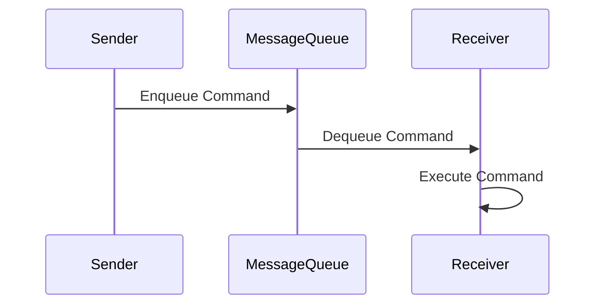
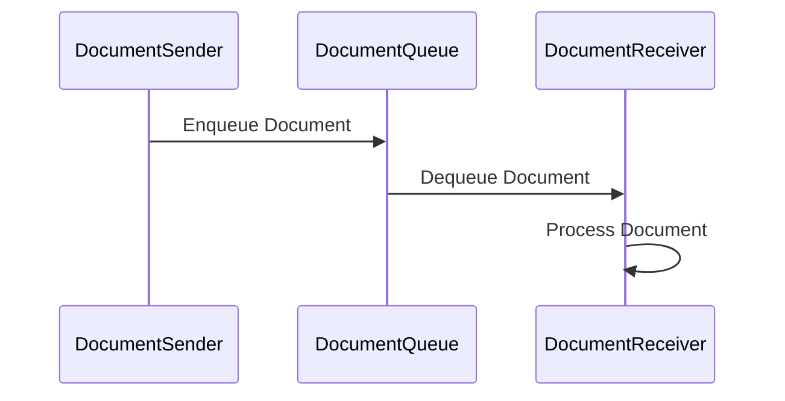
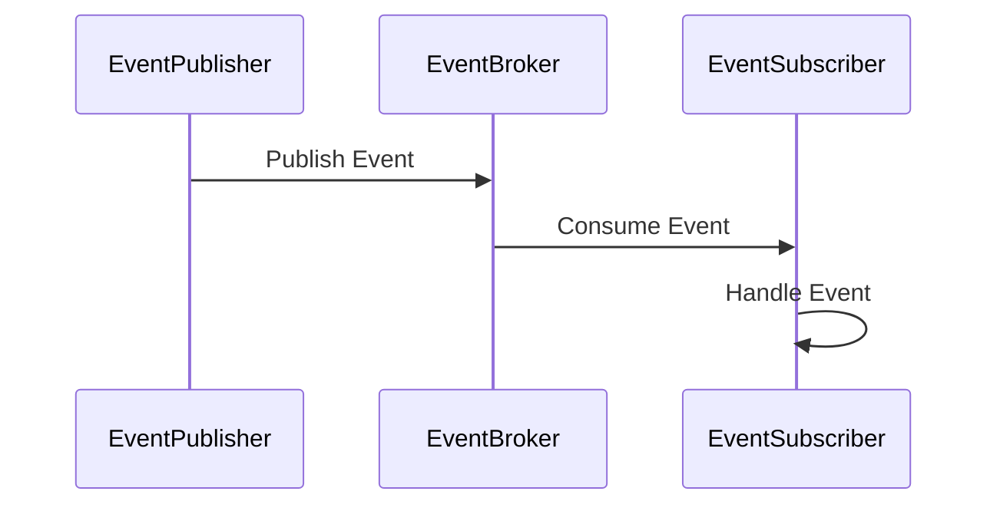

## 10.5 Message Design Patterns

In the realm of enterprise integration, message design patterns play a crucial role in facilitating communication between distributed systems. In this section, we will delve into three fundamental message design patterns: **Command Message**, **Document Message**, and **Event Message**. These patterns are essential for ensuring that systems can communicate effectively, maintain consistency, and remain scalable.

### Command Message

#### Intent
The Command Message pattern is used to encapsulate a request for an action to be performed. It is akin to a command object in object-oriented design, but it is transmitted over a messaging system. This pattern is particularly useful for invoking operations in a distributed system where the sender and receiver are decoupled.

#### Key Participants
- **Sender**: The component that creates and sends the command message.
- **Receiver**: The component that receives and executes the command.
- **Message Queue**: The intermediary that transports the command message from the sender to the receiver.

#### Applicability
Use the Command Message pattern when:
- You need to invoke a method or operation on a remote system.
- The sender and receiver should be decoupled.
- You want to ensure that commands can be queued and executed asynchronously.

#### Sample Code Snippet

```scala
// Define a trait for Command
trait Command {
  def execute(): Unit
}

// Implement a concrete command
case class PrintCommand(message: String) extends Command {
  override def execute(): Unit = println(message)
}

// Sender sends a command message
object Sender {
  def sendCommand(command: Command): Unit = {
    // Simulate sending the command to a message queue
    MessageQueue.enqueue(command)
  }
}

// Receiver processes the command message
object Receiver {
  def processCommands(): Unit = {
    while (true) {
      MessageQueue.dequeue() match {
        case Some(command) => command.execute()
        case None => Thread.sleep(1000) // Wait for new commands
      }
    }
  }
}

// Simulate a simple message queue
object MessageQueue {
  private val queue = scala.collection.mutable.Queue[Command]()

  def enqueue(command: Command): Unit = queue.enqueue(command)

  def dequeue(): Option[Command] = if (queue.nonEmpty) Some(queue.dequeue()) else None
}

// Example usage
object CommandMessageExample extends App {
  val command = PrintCommand("Hello, World!")
  Sender.sendCommand(command)
  Receiver.processCommands()
}
```

#### Design Considerations
- **Idempotency**: Ensure that commands are idempotent, meaning they can be executed multiple times without adverse effects.
- **Error Handling**: Implement robust error handling to manage failures in command execution.
- **Scalability**: Consider the scalability of the message queue and the receiver's ability to process commands.

#### Differences and Similarities
The Command Message pattern is similar to the Command design pattern in object-oriented programming but is adapted for distributed systems. Unlike Document and Event Messages, Command Messages are imperative and request specific actions.

### Document Message

#### Intent
The Document Message pattern is used to transfer data between systems. It encapsulates a data structure that can be processed by the receiver. This pattern is ideal for scenarios where the primary goal is to exchange information rather than invoke actions.

#### Key Participants
- **Sender**: The component that creates and sends the document message.
- **Receiver**: The component that receives and processes the document.
- **Message Queue**: The intermediary that transports the document message.

#### Applicability
Use the Document Message pattern when:
- You need to transfer structured data between systems.
- The focus is on data exchange rather than action invocation.
- You want to decouple data producers and consumers.

#### Sample Code Snippet

```scala
// Define a case class for Document
case class Document(content: Map[String, Any])

// Sender sends a document message
object DocumentSender {
  def sendDocument(document: Document): Unit = {
    // Simulate sending the document to a message queue
    DocumentQueue.enqueue(document)
  }
}

// Receiver processes the document message
object DocumentReceiver {
  def processDocuments(): Unit = {
    while (true) {
      DocumentQueue.dequeue() match {
        case Some(document) => processDocument(document)
        case None => Thread.sleep(1000) // Wait for new documents
      }
    }
  }

  def processDocument(document: Document): Unit = {
    // Process the document content
    println(s"Processing document: ${document.content}")
  }
}

// Simulate a simple document queue
object DocumentQueue {
  private val queue = scala.collection.mutable.Queue[Document]()

  def enqueue(document: Document): Unit = queue.enqueue(document)

  def dequeue(): Option[Document] = if (queue.nonEmpty) Some(queue.dequeue()) else None
}

// Example usage
object DocumentMessageExample extends App {
  val document = Document(Map("title" -> "Scala Guide", "author" -> "Tokenizer Inc."))
  DocumentSender.sendDocument(document)
  DocumentReceiver.processDocuments()
}
```

#### Design Considerations
- **Data Format**: Choose a suitable data format (e.g., JSON, XML) for the document content.
- **Versioning**: Implement versioning strategies to handle changes in document structure.
- **Validation**: Ensure that documents are validated before processing to prevent errors.

#### Differences and Similarities
The Document Message pattern differs from Command and Event Messages in that it focuses on data transfer rather than action invocation or event notification. It is similar to the Data Transfer Object (DTO) pattern but is used in a messaging context.

### Event Message

#### Intent
The Event Message pattern is used to notify interested parties about changes or significant occurrences within a system. It is a key component of event-driven architectures, enabling systems to react to events asynchronously.

#### Key Participants
- **Publisher**: The component that generates and publishes the event message.
- **Subscriber**: The component that subscribes to and processes the event message.
- **Message Broker**: The intermediary that routes event messages from publishers to subscribers.

#### Applicability
Use the Event Message pattern when:
- You need to notify multiple systems about changes or events.
- The systems should be loosely coupled and react asynchronously.
- You want to implement an event-driven architecture.

#### Sample Code Snippet

```scala
// Define a case class for Event
case class Event(eventType: String, data: Map[String, Any])

// Publisher publishes an event message
object EventPublisher {
  def publishEvent(event: Event): Unit = {
    // Simulate publishing the event to a message broker
    EventBroker.publish(event)
  }
}

// Subscriber processes the event message
object EventSubscriber {
  def subscribe(): Unit = {
    while (true) {
      EventBroker.consume() match {
        case Some(event) => handleEvent(event)
        case None => Thread.sleep(1000) // Wait for new events
      }
    }
  }

  def handleEvent(event: Event): Unit = {
    // Handle the event based on its type
    println(s"Handling event: ${event.eventType} with data: ${event.data}")
  }
}

// Simulate a simple event broker
object EventBroker {
  private val queue = scala.collection.mutable.Queue[Event]()

  def publish(event: Event): Unit = queue.enqueue(event)

  def consume(): Option[Event] = if (queue.nonEmpty) Some(queue.dequeue()) else None
}

// Example usage
object EventMessageExample extends App {
  val event = Event("UserRegistered", Map("userId" -> 123, "username" -> "john_doe"))
  EventPublisher.publishEvent(event)
  EventSubscriber.subscribe()
}
```

#### Design Considerations
- **Event Schema**: Define a clear schema for event messages to ensure consistency.
- **Eventual Consistency**: Be aware of the implications of eventual consistency in event-driven systems.
- **Scalability**: Ensure that the message broker can handle high volumes of events.

#### Differences and Similarities
The Event Message pattern is distinct from Command and Document Messages in that it is used for notification rather than action invocation or data transfer. It is similar to the Observer pattern but is adapted for distributed systems.

### Visualizing Message Design Patterns

To better understand the flow and interaction of these message design patterns, let's visualize them using Mermaid.js diagrams.

#### Command Message Flow



#### Document Message Flow



#### Event Message Flow



### Try It Yourself

To deepen your understanding of these message design patterns, try modifying the provided code examples. Here are a few suggestions:

1. **Command Message**: Add a new command type that performs a different action, such as logging to a file.
2. **Document Message**: Change the document structure to include nested data and update the processing logic accordingly.
3. **Event Message**: Implement multiple subscribers that handle different types of events.

### Knowledge Check

To reinforce your understanding, consider the following questions:

- What are the key differences between Command, Document, and Event Messages?
- How can you ensure idempotency in Command Messages?
- What are the benefits of using Document Messages for data transfer?
- How do Event Messages facilitate an event-driven architecture?

### Conclusion

Message design patterns are foundational to building robust, scalable, and decoupled systems. By understanding and applying Command, Document, and Event Messages, you can design systems that communicate effectively across distributed environments. Remember, these patterns are just the beginning. As you continue to explore Scala and enterprise integration, you'll discover even more powerful patterns and techniques.

## Quiz Time!



### What is the primary purpose of a Command Message?

- [x] To encapsulate a request for an action to be performed.
- [ ] To transfer structured data between systems.
- [ ] To notify interested parties about changes or significant occurrences.
- [ ] To store data in a database.

> **Explanation:** A Command Message is used to encapsulate a request for an action to be performed, akin to a command object in object-oriented design.

### Which component is responsible for executing a Command Message?

- [ ] Sender
- [ ] Message Queue
- [x] Receiver
- [ ] Publisher

> **Explanation:** The Receiver is responsible for executing the Command Message once it is dequeued from the Message Queue.

### What is the main focus of a Document Message?

- [ ] Invoking operations in a distributed system.
- [x] Transferring structured data between systems.
- [ ] Notifying systems about events.
- [ ] Executing commands asynchronously.

> **Explanation:** Document Messages focus on transferring structured data between systems, rather than invoking operations or notifying about events.

### In an Event Message pattern, who generates and publishes the event?

- [ ] Subscriber
- [ ] Message Broker
- [x] Publisher
- [ ] Receiver

> **Explanation:** The Publisher is responsible for generating and publishing the event message to the Message Broker.

### What is a key consideration when using Command Messages?

- [x] Ensuring idempotency.
- [ ] Defining a clear schema.
- [ ] Implementing versioning strategies.
- [ ] Handling eventual consistency.

> **Explanation:** Ensuring idempotency is crucial for Command Messages to prevent adverse effects from multiple executions.

### Which message pattern is most suitable for event-driven architectures?

- [ ] Command Message
- [ ] Document Message
- [x] Event Message
- [ ] Data Message

> **Explanation:** Event Messages are most suitable for event-driven architectures as they notify systems about changes or significant occurrences.

### What is a common data format used in Document Messages?

- [ ] Binary
- [x] JSON
- [ ] CSV
- [ ] YAML

> **Explanation:** JSON is a common data format used in Document Messages for its readability and ease of use.

### How can you handle changes in document structure over time?

- [ ] By ignoring changes.
- [ ] By using Command Messages.
- [x] By implementing versioning strategies.
- [ ] By using Event Messages.

> **Explanation:** Implementing versioning strategies helps handle changes in document structure over time.

### What is a similarity between the Event Message pattern and the Observer pattern?

- [x] Both are used for notification.
- [ ] Both are used for data transfer.
- [ ] Both are used for command execution.
- [ ] Both are used for storing data.

> **Explanation:** Both the Event Message pattern and the Observer pattern are used for notification purposes.

### True or False: Command Messages are primarily used for data transfer.

- [ ] True
- [x] False

> **Explanation:** False. Command Messages are primarily used to encapsulate requests for actions to be performed, not for data transfer.


