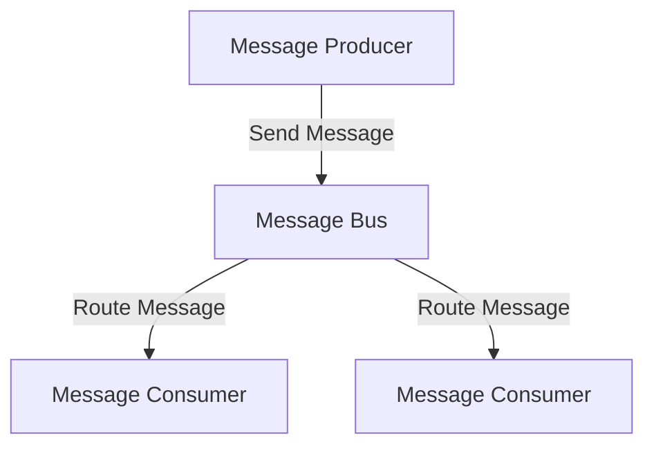
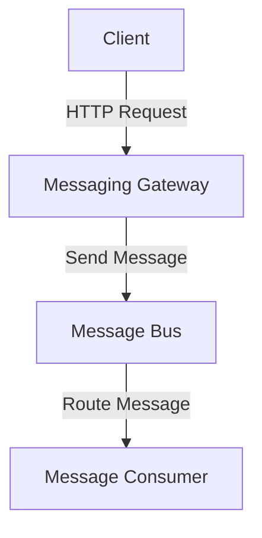
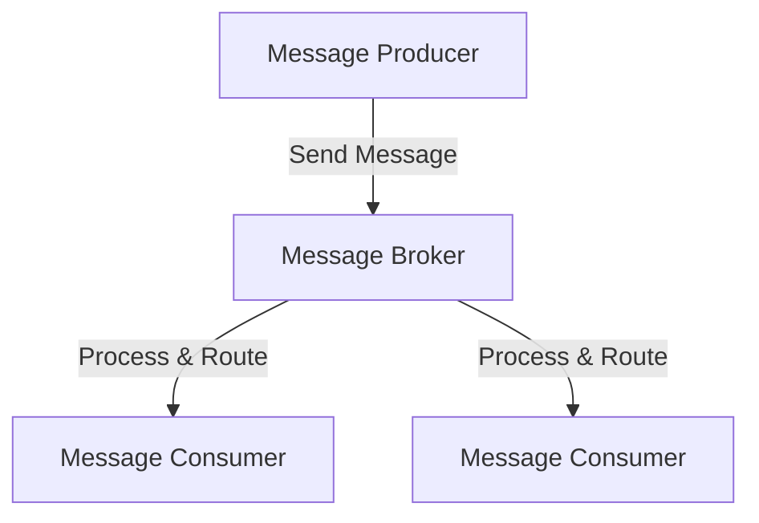

## 10.6 Messaging Infrastructure Patterns

In the realm of enterprise integration, messaging infrastructure patterns play a pivotal role in ensuring seamless communication between disparate systems. These patterns facilitate the exchange of information across different applications and services, enabling them to work together harmoniously. In this section, we will delve into three key messaging infrastructure patterns: **Message Bus**, **Messaging Gateway**, and **Message Broker**. We will explore their intent, key participants, applicability, and provide Scala code examples to illustrate their implementation.

### Message Bus

#### Intent
The Message Bus pattern provides a shared communication infrastructure that allows different systems to exchange messages. It acts as a central hub, enabling decoupled communication between components, thereby promoting scalability and flexibility.

#### Key Participants
- **Message Producer**: The component that sends messages to the bus.
- **Message Consumer**: The component that receives messages from the bus.
- **Message Bus**: The central hub that routes messages between producers and consumers.

#### Applicability
Use the Message Bus pattern when:
- You need to decouple components to allow for independent development and deployment.
- You want to facilitate communication between heterogeneous systems.
- You require a scalable and flexible messaging infrastructure.

#### Sample Code Snippet

Below is a Scala example of a simple message bus implementation using Akka, a popular toolkit for building concurrent and distributed systems in Scala.

```scala
import akka.actor.{Actor, ActorRef, ActorSystem, Props}

// Define a message trait
sealed trait Message
case class SimpleMessage(content: String) extends Message

// Message Producer
class MessageProducer(bus: ActorRef) extends Actor {
  def receive: Receive = {
    case msg: String =>
      println(s"Producing message: $msg")
      bus ! SimpleMessage(msg)
  }
}

// Message Consumer
class MessageConsumer extends Actor {
  def receive: Receive = {
    case SimpleMessage(content) =>
      println(s"Consumed message: $content")
  }
}

// Message Bus
class MessageBus extends Actor {
  private var consumers = List.empty[ActorRef]

  def receive: Receive = {
    case msg: SimpleMessage =>
      consumers.foreach(_ ! msg)
    case RegisterConsumer(consumer) =>
      consumers = consumer :: consumers
  }
}

// Register consumer message
case class RegisterConsumer(consumer: ActorRef)

object MessageBusApp extends App {
  val system = ActorSystem("MessageBusSystem")

  val bus = system.actorOf(Props[MessageBus], "messageBus")
  val consumer = system.actorOf(Props[MessageConsumer], "messageConsumer")
  val producer = system.actorOf(Props(new MessageProducer(bus)), "messageProducer")

  bus ! RegisterConsumer(consumer)
  producer ! "Hello, Message Bus!"
}
```

In this example, the `MessageBus` actor acts as the central hub, routing messages from the `MessageProducer` to the `MessageConsumer`. The `RegisterConsumer` message is used to register consumers with the bus.

#### Design Considerations
- **Scalability**: Ensure the message bus can handle a high volume of messages.
- **Fault Tolerance**: Implement mechanisms to handle failures gracefully.
- **Security**: Secure the message bus to prevent unauthorized access.

#### Differences and Similarities
The Message Bus pattern is similar to the Message Broker pattern, but it typically involves a more direct routing of messages without the additional processing capabilities that brokers often provide.

### Messaging Gateway

#### Intent
The Messaging Gateway pattern provides a single entry point for all messaging operations, abstracting the underlying messaging infrastructure. It simplifies the interaction with messaging systems by providing a consistent interface.

#### Key Participants
- **Messaging Gateway**: The component that provides a unified interface for sending and receiving messages.
- **Message Producer**: The component that interacts with the gateway to send messages.
- **Message Consumer**: The component that interacts with the gateway to receive messages.

#### Applicability
Use the Messaging Gateway pattern when:
- You want to abstract the complexity of the underlying messaging infrastructure.
- You need to provide a consistent interface for messaging operations.
- You aim to decouple the application logic from the messaging system.

#### Sample Code Snippet

Here's an example of a messaging gateway in Scala using Akka HTTP to provide a RESTful interface for messaging operations.

```scala
import akka.actor.{Actor, ActorRef, ActorSystem, Props}
import akka.http.scaladsl.Http
import akka.http.scaladsl.server.Directives._
import akka.stream.ActorMaterializer
import akka.http.scaladsl.model.StatusCodes

// Define messages
sealed trait GatewayMessage
case class SendMessage(content: String) extends GatewayMessage
case object ReceiveMessage extends GatewayMessage

// Messaging Gateway
class MessagingGateway(bus: ActorRef) extends Actor {
  def receive: Receive = {
    case SendMessage(content) =>
      println(s"Gateway sending message: $content")
      bus ! SimpleMessage(content)
    case ReceiveMessage =>
      // Logic to receive messages from the bus
  }
}

object MessagingGatewayApp extends App {
  implicit val system = ActorSystem("MessagingGatewaySystem")
  implicit val materializer = ActorMaterializer()
  implicit val executionContext = system.dispatcher

  val bus = system.actorOf(Props[MessageBus], "messageBus")
  val gateway = system.actorOf(Props(new MessagingGateway(bus)), "messagingGateway")

  val route =
    path("send") {
      post {
        entity(as[String]) { content =>
          gateway ! SendMessage(content)
          complete(StatusCodes.OK)
        }
      }
    } ~
    path("receive") {
      get {
        // Logic to receive messages
        complete(StatusCodes.OK)
      }
    }

  Http().bindAndHandle(route, "localhost", 8080)
  println("Messaging Gateway is running at http://localhost:8080/")
}
```

In this example, the `MessagingGateway` actor acts as the gateway, providing a RESTful interface for sending messages to the `MessageBus`.

#### Design Considerations
- **Abstraction**: Ensure the gateway provides a clear and consistent interface.
- **Performance**: Optimize the gateway to handle high throughput.
- **Security**: Implement authentication and authorization mechanisms.

#### Differences and Similarities
The Messaging Gateway pattern is similar to the Facade pattern in that it provides a simplified interface to a complex subsystem. However, it is specifically tailored for messaging operations.

### Message Broker

#### Intent
The Message Broker pattern acts as an intermediary that processes and routes messages between producers and consumers. It provides additional capabilities such as message transformation, filtering, and aggregation.

#### Key Participants
- **Message Producer**: The component that sends messages to the broker.
- **Message Consumer**: The component that receives messages from the broker.
- **Message Broker**: The intermediary that processes and routes messages.

#### Applicability
Use the Message Broker pattern when:
- You need to perform complex message processing such as transformation or filtering.
- You want to decouple producers and consumers to allow for independent scaling.
- You require reliable message delivery with features like message persistence and retry mechanisms.

#### Sample Code Snippet

Below is an example of a message broker implementation in Scala using Akka Streams for message processing.

```scala
import akka.actor.{ActorSystem, Props}
import akka.stream.ActorMaterializer
import akka.stream.scaladsl.{Sink, Source}

// Define a message broker
class MessageBroker {
  def processMessage(message: String): String = {
    // Perform message transformation
    message.toUpperCase
  }
}

object MessageBrokerApp extends App {
  implicit val system = ActorSystem("MessageBrokerSystem")
  implicit val materializer = ActorMaterializer()

  val broker = new MessageBroker

  val source = Source(List("message1", "message2", "message3"))
  val sink = Sink.foreach[String](msg => println(s"Processed message: $msg"))

  val runnableGraph = source.map(broker.processMessage).to(sink)

  runnableGraph.run()
}
```

In this example, the `MessageBroker` class processes messages by transforming them to uppercase. Akka Streams is used to create a stream processing pipeline.

#### Design Considerations
- **Scalability**: Ensure the broker can handle a large volume of messages.
- **Reliability**: Implement mechanisms for message persistence and retries.
- **Security**: Secure the broker to prevent unauthorized access.

#### Differences and Similarities
The Message Broker pattern is similar to the Message Bus pattern, but it provides additional processing capabilities such as transformation and filtering.

### Visualizing Messaging Infrastructure Patterns

To better understand the relationships and flow of messages in these patterns, let's visualize them using Mermaid.js diagrams.

#### Message Bus Diagram



**Description**: This diagram illustrates the flow of messages from producers to consumers via the Message Bus.

#### Messaging Gateway Diagram



**Description**: This diagram shows how the Messaging Gateway provides a unified interface for sending messages to the Message Bus.

#### Message Broker Diagram



**Description**: This diagram depicts the Message Broker processing and routing messages from producers to consumers.

### Try It Yourself

To deepen your understanding, try modifying the code examples provided. For instance, you can:
- Add additional message consumers to the Message Bus example and observe how messages are routed.
- Implement message filtering in the Message Broker example to only process messages that meet certain criteria.
- Extend the Messaging Gateway example to include message retrieval functionality.

### References and Links

For further reading on messaging infrastructure patterns, consider the following resources:
- [Enterprise Integration Patterns](https://www.enterpriseintegrationpatterns.com/)
- [Akka Documentation](https://doc.akka.io/docs/akka/current/)
- [Scala Documentation](https://docs.scala-lang.org/)

### Knowledge Check

Before moving on, take a moment to reflect on what you've learned. Consider how you might apply these patterns in your own projects. What challenges might you encounter, and how would you address them?

### Embrace the Journey

Remember, mastering messaging infrastructure patterns is a journey. As you continue to explore and experiment, you'll gain a deeper understanding of how to design robust and scalable systems. Keep pushing the boundaries and enjoy the process!

## Quiz Time!



### What is the primary role of a Message Bus in messaging infrastructure?

- [x] To act as a central hub for routing messages between producers and consumers.
- [ ] To transform and filter messages before delivery.
- [ ] To provide a unified interface for messaging operations.
- [ ] To store messages for long-term persistence.

> **Explanation:** The Message Bus acts as a central hub that facilitates the routing of messages between producers and consumers, promoting decoupled communication.

### Which pattern provides a single entry point for all messaging operations?

- [ ] Message Bus
- [x] Messaging Gateway
- [ ] Message Broker
- [ ] Message Queue

> **Explanation:** The Messaging Gateway provides a single entry point for messaging operations, abstracting the underlying messaging infrastructure.

### In the Message Broker pattern, what additional capabilities are provided beyond routing?

- [ ] Message persistence
- [ ] Message transformation and filtering
- [ ] Message aggregation
- [x] All of the above

> **Explanation:** The Message Broker pattern includes capabilities such as message transformation, filtering, aggregation, and persistence.

### Which Scala library is commonly used for building concurrent and distributed systems?

- [ ] Play Framework
- [ ] Slick
- [x] Akka
- [ ] Monix

> **Explanation:** Akka is a popular toolkit in Scala for building concurrent and distributed systems.

### What is a key benefit of using the Messaging Gateway pattern?

- [x] It abstracts the complexity of the underlying messaging infrastructure.
- [ ] It provides message persistence and retry mechanisms.
- [ ] It ensures messages are delivered in order.
- [ ] It reduces the need for message transformation.

> **Explanation:** The Messaging Gateway pattern abstracts the complexity of the messaging infrastructure, providing a consistent interface for messaging operations.

### How does the Message Broker pattern enhance message processing?

- [x] By providing transformation and filtering capabilities.
- [ ] By ensuring messages are delivered in order.
- [ ] By storing messages for long-term persistence.
- [ ] By reducing the number of message consumers.

> **Explanation:** The Message Broker pattern enhances message processing by offering transformation and filtering capabilities.

### Which pattern is similar to the Facade pattern but tailored for messaging operations?

- [ ] Message Bus
- [x] Messaging Gateway
- [ ] Message Broker
- [ ] Message Queue

> **Explanation:** The Messaging Gateway pattern is similar to the Facade pattern, providing a simplified interface specifically for messaging operations.

### What is a common use case for the Message Bus pattern?

- [ ] Storing messages for long-term persistence.
- [x] Decoupling components to allow for independent development and deployment.
- [ ] Providing a unified interface for messaging operations.
- [ ] Ensuring message delivery order.

> **Explanation:** The Message Bus pattern is commonly used to decouple components, allowing for independent development and deployment.

### What is the primary function of a Message Broker?

- [ ] To act as a central hub for routing messages.
- [x] To process and route messages between producers and consumers.
- [ ] To provide a unified interface for messaging operations.
- [ ] To store messages for long-term persistence.

> **Explanation:** The primary function of a Message Broker is to process and route messages between producers and consumers.

### True or False: The Message Bus pattern typically involves complex message processing like transformation and filtering.

- [ ] True
- [x] False

> **Explanation:** The Message Bus pattern typically involves direct routing of messages without complex processing like transformation and filtering.


