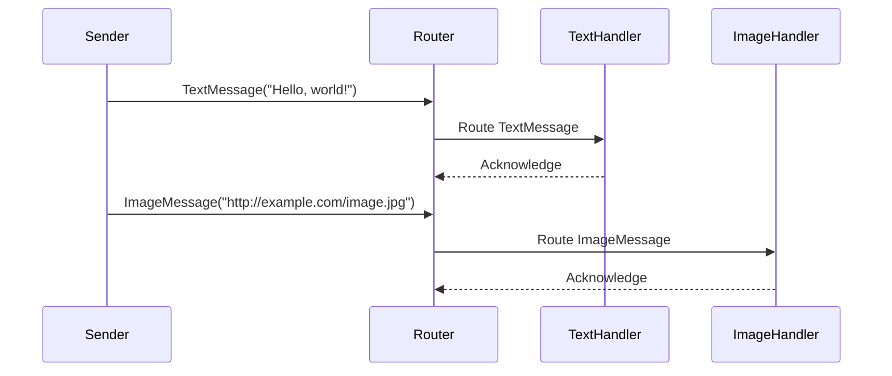

## 10.7 Implementing Integration Patterns in Scala

In the realm of enterprise software development, integration patterns play a crucial role in ensuring that disparate systems can communicate and work together effectively. Scala, with its robust type system, functional programming paradigms, and seamless Java interoperability, offers a powerful platform for implementing these patterns. In this section, we will explore practical examples and best practices for leveraging Scala to implement integration patterns, focusing on how these patterns can be adapted to Scala's unique features.

### Introduction to Integration Patterns

Integration patterns are design patterns that provide solutions for integrating different software systems or components. They address common challenges such as data transformation, message routing, and service orchestration. By using these patterns, developers can create scalable, maintainable, and efficient integration solutions.

#### Key Concepts

- **Message-Based Communication**: Integration patterns often rely on message-based communication, where data is encapsulated in messages that are sent between systems.
- **Loose Coupling**: Systems are designed to be loosely coupled, allowing them to evolve independently.
- **Scalability and Resilience**: Patterns aim to create systems that can scale and recover from failures gracefully.

### Leveraging Scala for Enterprise Integration

Scala's features make it an excellent choice for implementing integration patterns:

- **Functional Programming**: Scala's support for functional programming allows for concise and expressive code, making it easier to implement complex logic.
- **Type Safety**: Scala's strong type system helps catch errors at compile time, reducing runtime issues.
- **Interoperability**: Scala runs on the JVM, allowing seamless integration with Java libraries and frameworks.
- **Concurrency**: Scala's concurrency models, such as Akka, provide powerful tools for building responsive and resilient systems.

### Common Integration Patterns in Scala

Let's delve into some common integration patterns and how they can be implemented in Scala.

#### 1. Message Channel

**Intent**: Establish a communication pathway between two systems or components.

**Implementation in Scala**:

Scala's Akka framework provides excellent support for message channels through its actor model. Actors are lightweight, concurrent entities that communicate via message passing.

```scala
import akka.actor.{Actor, ActorSystem, Props}

// Define a message
case class Message(content: String)

// Define an actor
class MessageChannelActor extends Actor {
  def receive: Receive = {
    case Message(content) => println(s"Received message: $content")
  }
}

// Create an actor system
val system = ActorSystem("MessageChannelSystem")

// Create an actor
val messageChannelActor = system.actorOf(Props[MessageChannelActor], "messageChannelActor")

// Send a message to the actor
messageChannelActor ! Message("Hello, Scala!")
```

**Key Participants**:

- **Actor**: Represents the endpoint of the message channel.
- **Message**: Encapsulates the data being communicated.

**Applicability**:

Use message channels when you need to establish communication between components that should remain decoupled.

#### 2. Message Router

**Intent**: Route messages to different destinations based on specific criteria.

**Implementation in Scala**:

Scala's pattern matching capabilities make it easy to implement message routing logic.

```scala
import akka.actor.{Actor, ActorSystem, Props}

// Define messages
case class TextMessage(content: String)
case class ImageMessage(url: String)

// Define a router actor
class MessageRouterActor extends Actor {
  def receive: Receive = {
    case TextMessage(content) => println(s"Routing text message: $content")
    case ImageMessage(url) => println(s"Routing image message: $url")
  }
}

// Create an actor system
val system = ActorSystem("MessageRouterSystem")

// Create a router actor
val messageRouterActor = system.actorOf(Props[MessageRouterActor], "messageRouterActor")

// Send messages to the router
messageRouterActor ! TextMessage("Hello, world!")
messageRouterActor ! ImageMessage("http://example.com/image.jpg")
```

**Key Participants**:

- **Router Actor**: Determines the destination of each message.
- **Messages**: Different types of messages that need routing.

**Applicability**:

Use message routers when you need to direct messages to different components based on their content or type.

#### 3. Message Translator

**Intent**: Transform a message's data format to match the requirements of the receiving system.

**Implementation in Scala**:

Scala's case classes and pattern matching can be used to transform messages.

```scala
// Define a message
case class LegacyMessage(data: String)

// Define a transformed message
case class NewMessage(content: String)

// Define a translator function
def translateMessage(legacyMessage: LegacyMessage): NewMessage = {
  NewMessage(content = legacyMessage.data.toUpperCase)
}

// Example usage
val legacyMessage = LegacyMessage("hello")
val newMessage = translateMessage(legacyMessage)
println(newMessage) // Output: NewMessage(HELLO)
```

**Key Participants**:

- **Translator Function**: Converts messages from one format to another.
- **Messages**: The original and transformed message formats.

**Applicability**:

Use message translators when integrating systems with different data formats.

### Best Practices for Implementing Integration Patterns in Scala

1. **Use Functional Programming Principles**: Leverage Scala's functional programming features to write concise and maintainable code. Use immutable data structures and pure functions to avoid side effects.

2. **Leverage Akka for Concurrency**: Akka's actor model is well-suited for building concurrent and distributed systems. Use actors to encapsulate state and behavior, and communicate via message passing.

3. **Utilize Scala's Type System**: Take advantage of Scala's strong type system to catch errors at compile time. Use case classes and pattern matching to define and process messages.

4. **Ensure Loose Coupling**: Design systems to be loosely coupled, allowing components to evolve independently. Use interfaces and dependency injection to decouple components.

5. **Monitor and Log**: Implement logging and monitoring to track the flow of messages and detect issues. Use tools like Akka's logging facilities or integrate with external monitoring solutions.

6. **Test Thoroughly**: Write unit tests for individual components and integration tests for the entire system. Use ScalaTest or Specs2 for testing.

### Try It Yourself

To deepen your understanding, try modifying the code examples provided. For instance, add a new message type to the message router example and implement the corresponding routing logic. Experiment with different message formats in the message translator example.

### Visualizing Integration Patterns

Below is a sequence diagram illustrating the flow of messages in a message router pattern:



**Diagram Description**: This sequence diagram shows how a message router processes different types of messages, routing them to the appropriate handlers based on their type.

### References and Further Reading

- [Akka Documentation](https://doc.akka.io/docs/akka/current/index.html): Official documentation for Akka, a toolkit for building concurrent, distributed, and resilient message-driven applications.
- [Scala Documentation](https://docs.scala-lang.org/): Comprehensive guide to Scala programming language features and best practices.
- [Enterprise Integration Patterns](https://www.enterpriseintegrationpatterns.com/): A collection of patterns for designing enterprise integration solutions.

### Knowledge Check

1. Explain the role of message channels in integration patterns.
2. How does Scala's pattern matching facilitate message routing?
3. What are the benefits of using Akka for implementing integration patterns in Scala?
4. Describe how message translators can help integrate systems with different data formats.

### Embrace the Journey

Remember, mastering integration patterns in Scala is a journey. As you progress, you'll build more complex and efficient systems. Keep experimenting, stay curious, and enjoy the journey!

## Quiz Time!



### What is the primary purpose of integration patterns?

- [x] To provide solutions for integrating different software systems or components.
- [ ] To optimize database queries.
- [ ] To enhance user interface design.
- [ ] To improve network security.

> **Explanation:** Integration patterns are designed to address challenges in integrating disparate systems or components, ensuring they can communicate and work together effectively.

### Which Scala feature is particularly useful for implementing message routing?

- [x] Pattern matching
- [ ] Implicit conversions
- [ ] Lazy evaluation
- [ ] Type inference

> **Explanation:** Scala's pattern matching allows for concise and expressive routing logic, making it ideal for implementing message routers.

### What is a key advantage of using Akka for integration patterns?

- [x] It provides a robust model for concurrency and message passing.
- [ ] It simplifies database access.
- [ ] It enhances graphical user interfaces.
- [ ] It improves file I/O operations.

> **Explanation:** Akka's actor model is well-suited for building concurrent and distributed systems, providing a robust framework for message passing and state encapsulation.

### How can message translators help in system integration?

- [x] By converting messages from one format to another.
- [ ] By compressing data for transmission.
- [ ] By encrypting messages for security.
- [ ] By caching messages for performance.

> **Explanation:** Message translators transform the data format of messages to match the requirements of different systems, facilitating integration.

### What is a best practice when implementing integration patterns in Scala?

- [x] Use functional programming principles.
- [ ] Rely heavily on mutable state.
- [ ] Avoid using the type system.
- [ ] Minimize testing efforts.

> **Explanation:** Leveraging functional programming principles, such as immutability and pure functions, leads to more maintainable and reliable integration solutions.

### Which tool is recommended for testing Scala applications?

- [x] ScalaTest
- [ ] JUnit
- [ ] Selenium
- [ ] Postman

> **Explanation:** ScalaTest is a popular testing framework for Scala applications, providing a wide range of testing capabilities.

### What does loose coupling in integration patterns allow?

- [x] Components to evolve independently.
- [ ] Faster database queries.
- [ ] Improved user interface design.
- [ ] Enhanced security protocols.

> **Explanation:** Loose coupling allows components to be developed and modified independently, improving system flexibility and maintainability.

### How can Scala's type system benefit integration pattern implementation?

- [x] By catching errors at compile time.
- [ ] By simplifying network protocols.
- [ ] By enhancing graphical rendering.
- [ ] By reducing memory usage.

> **Explanation:** Scala's strong type system helps identify errors during compilation, reducing runtime issues and improving code reliability.

### What is the role of a message channel in integration patterns?

- [x] To establish a communication pathway between systems.
- [ ] To encrypt data for security.
- [ ] To optimize database access.
- [ ] To manage user sessions.

> **Explanation:** Message channels provide a communication pathway for data exchange between different systems or components.

### True or False: Scala's interoperability with Java is a disadvantage for implementing integration patterns.

- [ ] True
- [x] False

> **Explanation:** Scala's interoperability with Java is an advantage, allowing seamless integration with Java libraries and frameworks, enhancing the implementation of integration patterns.


