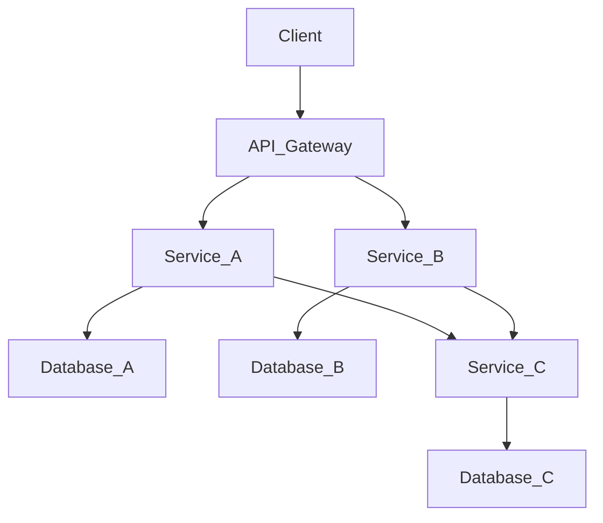

## 11.1 Introduction to Microservices Architecture

Microservices architecture has emerged as a transformative approach to software development, offering a way to build complex applications as a suite of small, independent services. Each service is designed to perform a specific business function and can be developed, deployed, and scaled independently. This architectural style contrasts with traditional monolithic architectures, where all components are tightly coupled and deployed as a single unit.

### Understanding Microservices Architecture

Microservices architecture is based on the principle of designing software systems as a collection of loosely coupled services. Each service is a self-contained unit that encapsulates its own data and logic, and communicates with other services through well-defined APIs. This modular approach allows for greater flexibility, scalability, and resilience in software systems.

#### Key Characteristics of Microservices

1. **Independence**: Each microservice operates independently, allowing teams to develop, deploy, and scale services without affecting others.
2. **Decentralized Data Management**: Microservices often manage their own data, leading to decentralized data storage and management.
3. **Polyglot Programming**: Different services can be written in different programming languages, allowing teams to choose the best tool for each task.
4. **Resilience**: The failure of one service does not necessarily affect the entire system, enhancing overall system resilience.
5. **Scalability**: Services can be scaled independently based on demand, optimizing resource usage.

### Principles of Microservices Architecture

To effectively implement microservices architecture, certain principles should be adhered to:

#### Single Responsibility Principle

Each microservice should have a single responsibility, focusing on a specific business function. This aligns with the Single Responsibility Principle (SRP) from object-oriented design, ensuring that each service is cohesive and manageable.

#### Loose Coupling and High Cohesion

Microservices should be loosely coupled, meaning that changes to one service should not require changes to others. At the same time, they should exhibit high cohesion, with related functionalities grouped together within a service.

#### Continuous Delivery and Deployment

Microservices architecture supports continuous delivery and deployment, allowing for rapid and frequent updates to individual services. This requires robust automation and testing practices to ensure quality and reliability.

#### Decentralized Governance

Microservices encourage decentralized governance, allowing teams to make independent decisions about technology stacks, tools, and processes. This fosters innovation and agility within organizations.

#### API-First Design

APIs are the primary means of communication between microservices. An API-first approach ensures that APIs are well-designed, documented, and consistent, facilitating seamless integration and interaction between services.

### Benefits of Microservices Architecture

Microservices architecture offers several benefits that make it an attractive choice for modern software development:

#### Enhanced Scalability

Microservices can be scaled independently, allowing organizations to allocate resources more efficiently based on demand. This is particularly beneficial for applications with varying workloads, as it enables dynamic scaling of specific services.

#### Improved Flexibility

The modular nature of microservices allows for greater flexibility in development and deployment. Teams can experiment with new technologies, frameworks, and tools without affecting the entire system, enabling faster innovation and adaptation to changing requirements.

#### Increased Resilience

Microservices architecture enhances system resilience by isolating failures to individual services. If one service fails, others can continue to operate, minimizing the impact on the overall system. This is achieved through techniques such as circuit breakers and fallback mechanisms.

#### Faster Time-to-Market

Microservices enable faster development cycles by allowing teams to work on different services concurrently. This parallel development approach reduces bottlenecks and accelerates time-to-market for new features and updates.

#### Easier Maintenance and Updates

With microservices, updates and maintenance can be performed on individual services without affecting the entire system. This reduces the risk of downtime and simplifies the process of rolling out changes.

### Challenges of Microservices Architecture

While microservices offer numerous benefits, they also present certain challenges that must be addressed:

#### Complexity in Management

Managing a large number of microservices can be complex, requiring effective orchestration, monitoring, and logging solutions. Tools like Kubernetes and Docker Swarm can help manage containerized microservices, but they add an additional layer of complexity.

#### Data Consistency

Ensuring data consistency across distributed services can be challenging. Techniques such as eventual consistency, distributed transactions, and event sourcing can help address these challenges, but they require careful design and implementation.

#### Network Latency and Reliability

Microservices rely heavily on network communication, which can introduce latency and reliability issues. Designing robust APIs and implementing caching and load balancing strategies can mitigate these challenges.

#### Security Concerns

With multiple services communicating over the network, security becomes a critical concern. Implementing robust authentication, authorization, and encryption mechanisms is essential to protect data and ensure secure communication between services.

### Implementing Microservices in Scala

Scala is a powerful language that combines functional and object-oriented programming paradigms, making it well-suited for implementing microservices. Its strong type system, concise syntax, and support for concurrent programming provide a solid foundation for building scalable and resilient microservices.

#### Key Scala Features for Microservices

1. **Concurrency Support**: Scala's support for concurrency through actors and futures makes it ideal for building responsive microservices.
2. **Functional Programming**: Scala's functional programming features, such as immutability and higher-order functions, promote clean and maintainable code.
3. **Type Safety**: Scala's strong type system helps catch errors at compile time, reducing runtime issues and improving code reliability.
4. **Interoperability with Java**: Scala's seamless interoperability with Java allows developers to leverage existing Java libraries and frameworks, facilitating integration with other systems.

#### Example: Building a Simple Microservice in Scala

Let's build a simple microservice in Scala using the Akka HTTP framework. This microservice will expose a RESTful API to manage a list of tasks.

```scala
import akka.actor.ActorSystem
import akka.http.scaladsl.Http
import akka.http.scaladsl.model._
import akka.http.scaladsl.server.Directives._
import akka.stream.ActorMaterializer
import scala.io.StdIn

object TaskService {
  def main(args: Array[String]): Unit = {
    implicit val system: ActorSystem = ActorSystem("taskService")
    implicit val materializer: ActorMaterializer = ActorMaterializer()
    implicit val executionContext = system.dispatcher

    var tasks = List("Task 1", "Task 2", "Task 3")

    val route =
      path("tasks") {
        get {
          complete(HttpEntity(ContentTypes.`text/plain(UTF-8)`, tasks.mkString("\n")))
        } ~
        post {
          entity(as[String]) { task =>
            tasks = tasks :+ task
            complete(HttpEntity(ContentTypes.`text/plain(UTF-8)`, s"Task added: $task"))
          }
        }
      }

    val bindingFuture = Http().bindAndHandle(route, "localhost", 8080)

    println(s"Server online at http://localhost:8080/\nPress RETURN to stop...")
    StdIn.readLine()
    bindingFuture
      .flatMap(_.unbind())
      .onComplete(_ => system.terminate())
  }
}
```

In this example, we define a simple RESTful API with two endpoints: one for retrieving the list of tasks and another for adding a new task. The Akka HTTP framework provides a powerful and flexible way to build HTTP-based microservices in Scala.

### Visualizing Microservices Architecture

To better understand the microservices architecture, let's visualize a typical microservices system using a Mermaid.js diagram. This diagram illustrates the interaction between different services and external clients.



In this diagram, the client interacts with an API Gateway, which routes requests to the appropriate services (Service A, Service B, etc.). Each service manages its own database, ensuring data encapsulation and independence.

### Try It Yourself

Experiment with the provided Scala code example by adding new endpoints or modifying the existing ones. For instance, try implementing a DELETE endpoint to remove tasks or a PUT endpoint to update existing tasks. This hands-on approach will help you gain a deeper understanding of building microservices in Scala.

### Knowledge Check

- Explain the key characteristics of microservices architecture.
- Discuss the benefits and challenges of implementing microservices.
- Describe how Scala's features support microservices development.
- Implement a new endpoint in the provided Scala code example.

### Conclusion

Microservices architecture offers a powerful and flexible approach to building modern software systems. By breaking down applications into small, independent services, organizations can achieve greater scalability, flexibility, and resilience. Scala, with its robust features and support for concurrent programming, is an excellent choice for implementing microservices. As you continue your journey in mastering microservices architecture, remember to embrace the principles of independence, loose coupling, and continuous delivery to unlock the full potential of this architectural style.

## Quiz Time!



### What is a key characteristic of microservices architecture?

- [x] Independence of services
- [ ] Centralized data management
- [ ] Monolithic deployment
- [ ] Single programming language for all services

> **Explanation:** Microservices architecture is characterized by the independence of services, allowing them to be developed, deployed, and scaled independently.

### Which principle is essential for microservices architecture?

- [x] Loose coupling
- [ ] Tight coupling
- [ ] Centralized governance
- [ ] Single responsibility for the entire system

> **Explanation:** Loose coupling is essential for microservices, ensuring that changes to one service do not require changes to others.

### What is a benefit of microservices architecture?

- [x] Enhanced scalability
- [ ] Increased complexity
- [ ] Single point of failure
- [ ] Slower time-to-market

> **Explanation:** Microservices architecture enhances scalability by allowing services to be scaled independently based on demand.

### What challenge is associated with microservices architecture?

- [x] Complexity in management
- [ ] Simplified data consistency
- [ ] Reduced network latency
- [ ] Centralized security

> **Explanation:** Managing a large number of microservices can be complex, requiring effective orchestration and monitoring solutions.

### How does Scala support microservices development?

- [x] By providing concurrency support through actors and futures
- [ ] By enforcing centralized data management
- [ ] By limiting programming paradigms
- [ ] By discouraging API-first design

> **Explanation:** Scala supports microservices development with its concurrency features, such as actors and futures, which are ideal for building responsive services.

### What is the role of an API Gateway in microservices architecture?

- [x] Routing requests to the appropriate services
- [ ] Managing data consistency across services
- [ ] Centralizing all service logic
- [ ] Enforcing a single programming language

> **Explanation:** An API Gateway routes client requests to the appropriate microservices, acting as a single entry point to the system.

### Which Scala feature is beneficial for building microservices?

- [x] Strong type system
- [ ] Lack of concurrency support
- [ ] Limited interoperability with Java
- [ ] Absence of functional programming features

> **Explanation:** Scala's strong type system helps catch errors at compile time, improving code reliability in microservices development.

### What is a common challenge in microservices architecture?

- [x] Ensuring data consistency across services
- [ ] Simplifying network communication
- [ ] Reducing the number of services
- [ ] Centralizing all service logic

> **Explanation:** Ensuring data consistency across distributed services is a common challenge in microservices architecture.

### Which tool is commonly used for managing containerized microservices?

- [x] Kubernetes
- [ ] ScalaTest
- [ ] Akka HTTP
- [ ] Play Framework

> **Explanation:** Kubernetes is a popular tool for managing containerized microservices, providing orchestration and scaling capabilities.

### True or False: Microservices architecture requires all services to be written in the same programming language.

- [ ] True
- [x] False

> **Explanation:** Microservices architecture allows for polyglot programming, enabling different services to be written in different programming languages.


