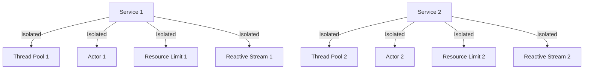

## 11.10 Bulkhead Pattern

In the world of microservices, ensuring the resilience and robustness of your system is paramount. One of the key design patterns that help achieve this is the Bulkhead Pattern. This pattern is inspired by the bulkheads used in ships to prevent water from flooding the entire vessel in case of a breach. Similarly, in software systems, the Bulkhead Pattern isolates different components to prevent a failure in one part from cascading to others. Let's dive deep into understanding how this pattern can be effectively applied in Scala microservices.

### Intent

The primary intent of the Bulkhead Pattern is to isolate different parts of a system to prevent a failure in one component from affecting the entire system. By compartmentalizing resources, we ensure that the failure of one service does not lead to a systemic failure, thereby enhancing the overall resilience of the system.

### Key Participants

1. **Components**: These are the individual parts of the system that are isolated from each other.
2. **Isolation Mechanisms**: Techniques or tools used to achieve isolation, such as thread pools, semaphores, or resource limits.
3. **Fallback Strategies**: Mechanisms to handle failures gracefully, ensuring that the system can continue to operate in a degraded mode.

### Applicability

The Bulkhead Pattern is particularly useful in the following scenarios:

- **Microservices Architecture**: When you have multiple services that need to be isolated to prevent cascading failures.
- **High Availability Systems**: Where uptime is critical, and failures need to be contained.
- **Resource-Constrained Environments**: Where resources need to be allocated judiciously to prevent overloading.

### Sample Code Snippet

Let's explore a simple Scala example to demonstrate the Bulkhead Pattern using Akka, a popular toolkit for building concurrent, distributed, and resilient message-driven applications.

```scala
import akka.actor.{Actor, ActorSystem, Props}
import akka.pattern.CircuitBreaker
import scala.concurrent.duration._
import scala.concurrent.Future
import scala.util.{Failure, Success}

// Define a service actor
class ServiceActor extends Actor {
  def receive: Receive = {
    case "process" => 
      // Simulate a process that might fail
      if (scala.util.Random.nextBoolean()) {
        sender() ! "Success"
      } else {
        throw new RuntimeException("Failure")
      }
  }
}

object BulkheadExample extends App {
  implicit val system: ActorSystem = ActorSystem("BulkheadSystem")
  import system.dispatcher

  // Create a circuit breaker to isolate failures
  val breaker = new CircuitBreaker(
    system.scheduler,
    maxFailures = 5,
    callTimeout = 10.seconds,
    resetTimeout = 1.minute
  )

  // Create a service actor
  val serviceActor = system.actorOf(Props[ServiceActor], "serviceActor")

  // Use the circuit breaker to call the service
  def callService(): Future[String] = {
    breaker.withCircuitBreaker(Future {
      serviceActor ! "process"
      "Processing"
    })
  }

  // Call the service and handle responses
  callService().onComplete {
    case Success(response) => println(s"Service response: $response")
    case Failure(ex) => println(s"Service failed: ${ex.getMessage}")
  }
}
```

In this example, we use Akka's `CircuitBreaker` to isolate failures in the `ServiceActor`. The circuit breaker acts as a bulkhead, preventing failures from affecting other parts of the system.

### Design Considerations

When implementing the Bulkhead Pattern, consider the following:

- **Resource Allocation**: Determine how resources (e.g., threads, memory) are allocated to each component.
- **Isolation Level**: Decide the granularity of isolation. Should it be at the service level, component level, or even at the request level?
- **Fallback Mechanisms**: Implement strategies to handle failures gracefully, such as retries, fallbacks, or default responses.
- **Monitoring and Alerts**: Set up monitoring to detect when a bulkhead is breached and alert the necessary teams.

### Differences and Similarities

The Bulkhead Pattern is often compared to the Circuit Breaker Pattern. While both aim to enhance system resilience, they differ in their approach:

- **Bulkhead Pattern**: Focuses on isolating resources to prevent failure propagation.
- **Circuit Breaker Pattern**: Focuses on stopping operations to prevent failures from overwhelming the system.

Despite these differences, both patterns can be used together to build robust systems.

### Applying Bulkhead Isolation in Scala

To effectively apply the Bulkhead Pattern in Scala, we can leverage various tools and techniques:

1. **Thread Pools**: Use separate thread pools for different services or components to ensure that a failure in one does not affect others.
   
2. **Akka Actors**: Utilize Akka's actor model to isolate state and behavior, ensuring that each actor operates independently.

3. **Resource Limits**: Set limits on resources such as memory or CPU usage for each component to prevent resource exhaustion.

4. **Reactive Streams**: Use backpressure mechanisms in reactive streams to control the flow of data and prevent overloads.

Let's explore these techniques with examples.

#### Thread Pools

Thread pools are a common way to implement bulkhead isolation. By assigning separate thread pools to different components, we ensure that a failure in one does not affect others.

```scala
import java.util.concurrent.{Executors, ExecutorService}

object ThreadPoolBulkheadExample extends App {
  // Create separate thread pools for different components
  val service1Pool: ExecutorService = Executors.newFixedThreadPool(5)
  val service2Pool: ExecutorService = Executors.newFixedThreadPool(5)

  // Simulate a task for service 1
  def service1Task(): Unit = {
    println("Service 1 processing")
    // Simulate a failure
    if (scala.util.Random.nextBoolean()) throw new RuntimeException("Service 1 failure")
  }

  // Simulate a task for service 2
  def service2Task(): Unit = {
    println("Service 2 processing")
    // Simulate a failure
    if (scala.util.Random.nextBoolean()) throw new RuntimeException("Service 2 failure")
  }

  // Submit tasks to the respective thread pools
  service1Pool.submit(new Runnable {
    def run(): Unit = service1Task()
  })

  service2Pool.submit(new Runnable {
    def run(): Unit = service2Task()
  })

  // Shutdown thread pools
  service1Pool.shutdown()
  service2Pool.shutdown()
}
```

In this example, we create separate thread pools for two services, ensuring that a failure in one does not affect the other.

#### Akka Actors

Akka's actor model is inherently designed for isolation. Each actor has its own state and behavior, making it an ideal choice for implementing the Bulkhead Pattern.

```scala
import akka.actor.{Actor, ActorSystem, Props}

class IsolatedActor extends Actor {
  def receive: Receive = {
    case msg: String =>
      println(s"Processing message: $msg")
      // Simulate a failure
      if (scala.util.Random.nextBoolean()) throw new RuntimeException("Actor failure")
  }
}

object AkkaBulkheadExample extends App {
  val system: ActorSystem = ActorSystem("BulkheadSystem")

  // Create isolated actors
  val actor1 = system.actorOf(Props[IsolatedActor], "actor1")
  val actor2 = system.actorOf(Props[IsolatedActor], "actor2")

  // Send messages to actors
  actor1 ! "Message for actor 1"
  actor2 ! "Message for actor 2"
}
```

In this example, we create two isolated actors, each processing messages independently. A failure in one actor does not affect the other.

#### Resource Limits

Setting resource limits is another effective way to implement bulkhead isolation. By capping the resources available to each component, we prevent resource exhaustion and ensure fair allocation.

```scala
import scala.concurrent.{ExecutionContext, Future}
import java.util.concurrent.Executors

object ResourceLimitBulkheadExample extends App {
  // Create execution contexts with limited resources
  implicit val service1Context: ExecutionContext = ExecutionContext.fromExecutor(Executors.newFixedThreadPool(2))
  implicit val service2Context: ExecutionContext = ExecutionContext.fromExecutor(Executors.newFixedThreadPool(2))

  // Simulate a task for service 1
  def service1Task(): Future[Unit] = Future {
    println("Service 1 processing")
    // Simulate a failure
    if (scala.util.Random.nextBoolean()) throw new RuntimeException("Service 1 failure")
  }

  // Simulate a task for service 2
  def service2Task(): Future[Unit] = Future {
    println("Service 2 processing")
    // Simulate a failure
    if (scala.util.Random.nextBoolean()) throw new RuntimeException("Service 2 failure")
  }

  // Execute tasks in their respective contexts
  service1Task()
  service2Task()
}
```

In this example, we create separate execution contexts with limited resources for two services, ensuring that a failure in one does not affect the other.

#### Reactive Streams

Reactive streams provide a powerful mechanism for controlling data flow and preventing overloads. By using backpressure, we can ensure that components are not overwhelmed by data.

```scala
import akka.stream.scaladsl.{Sink, Source}
import akka.actor.ActorSystem
import akka.stream.ActorMaterializer

object ReactiveStreamBulkheadExample extends App {
  implicit val system: ActorSystem = ActorSystem("BulkheadSystem")
  implicit val materializer: ActorMaterializer = ActorMaterializer()

  // Create a source that generates data
  val source = Source(1 to 100)

  // Create a sink that processes data with backpressure
  val sink = Sink.foreach[Int] { elem =>
    println(s"Processing element: $elem")
    // Simulate processing time
    Thread.sleep(100)
  }

  // Run the stream with backpressure
  source.runWith(sink)
}
```

In this example, we use Akka Streams to process data with backpressure, ensuring that the sink is not overwhelmed by the source.

### Visualizing Bulkhead Isolation

To better understand how the Bulkhead Pattern isolates components, let's visualize the concept using a diagram.



**Diagram Description**: This diagram illustrates how different components of Service 1 and Service 2 are isolated using various techniques such as thread pools, actors, resource limits, and reactive streams. Each component operates independently, ensuring that a failure in one does not affect the others.

### Try It Yourself

To solidify your understanding of the Bulkhead Pattern, try modifying the code examples provided:

1. **Experiment with Different Isolation Techniques**: Try combining thread pools with Akka actors or reactive streams to see how they work together.
2. **Simulate Failures**: Introduce failures in different components and observe how the system handles them.
3. **Adjust Resource Limits**: Change the resource limits for different components and see how it affects the system's behavior.

### Knowledge Check

To ensure you've grasped the concepts covered, consider the following questions:

- What is the primary intent of the Bulkhead Pattern?
- How does the Bulkhead Pattern differ from the Circuit Breaker Pattern?
- What are some techniques for implementing bulkhead isolation in Scala?
- How can reactive streams help prevent overloads in a system?

### Summary

The Bulkhead Pattern is a powerful tool for enhancing the resilience and robustness of microservices. By isolating components, we prevent failures from cascading and ensure that the system can continue to operate even in the face of adversity. Whether using thread pools, Akka actors, resource limits, or reactive streams, Scala provides a rich set of tools to implement this pattern effectively. Remember, resilience is not just about preventing failures but also about gracefully handling them when they occur.

### Further Reading

For more information on the Bulkhead Pattern and related concepts, consider exploring the following resources:

- [Akka Documentation](https://doc.akka.io/docs/akka/current/)
- [Reactive Streams](https://www.reactive-streams.org/)
- [Scala Futures and Promises](https://docs.scala-lang.org/overviews/core/futures.html)

## Quiz Time!



### What is the primary intent of the Bulkhead Pattern?

- [x] To isolate components to prevent failure propagation.
- [ ] To enhance performance by parallelizing tasks.
- [ ] To reduce memory usage in a system.
- [ ] To simplify code by reducing dependencies.

> **Explanation:** The Bulkhead Pattern is designed to isolate different parts of a system to prevent a failure in one component from affecting the entire system.

### Which of the following is a key participant in the Bulkhead Pattern?

- [x] Isolation Mechanisms
- [ ] Data Aggregators
- [ ] Load Balancers
- [ ] Cache Managers

> **Explanation:** Isolation mechanisms are crucial in the Bulkhead Pattern as they help achieve the separation of components.

### How does the Bulkhead Pattern differ from the Circuit Breaker Pattern?

- [x] Bulkhead focuses on isolating resources, while Circuit Breaker stops operations to prevent failures from overwhelming the system.
- [ ] Bulkhead is used for performance optimization, while Circuit Breaker is for security.
- [ ] Bulkhead is a hardware pattern, while Circuit Breaker is a software pattern.
- [ ] Bulkhead is used in databases, while Circuit Breaker is used in networking.

> **Explanation:** The Bulkhead Pattern isolates resources to prevent failure propagation, whereas the Circuit Breaker Pattern stops operations to prevent failures from overwhelming the system.

### Which Scala tool is commonly used for implementing the Bulkhead Pattern?

- [x] Akka Actors
- [ ] Slick
- [ ] Play Framework
- [ ] Spark

> **Explanation:** Akka Actors are commonly used in Scala to implement the Bulkhead Pattern due to their inherent isolation properties.

### What is a common technique for implementing bulkhead isolation?

- [x] Using separate thread pools for different components.
- [ ] Using a single thread pool for all components.
- [ ] Disabling logging to improve performance.
- [ ] Combining all services into a monolith.

> **Explanation:** Using separate thread pools for different components is a common technique to ensure that a failure in one does not affect others.

### What role do reactive streams play in the Bulkhead Pattern?

- [x] They provide backpressure mechanisms to control data flow and prevent overloads.
- [ ] They enhance security by encrypting data streams.
- [ ] They improve performance by caching data.
- [ ] They simplify code by reducing the need for error handling.

> **Explanation:** Reactive streams provide backpressure mechanisms that help control data flow and prevent components from being overwhelmed.

### In the context of the Bulkhead Pattern, what is a fallback strategy?

- [x] A mechanism to handle failures gracefully, ensuring the system can continue to operate in a degraded mode.
- [ ] A method to increase system performance during peak loads.
- [ ] A way to reduce memory usage by compressing data.
- [ ] A technique to enhance security by encrypting data.

> **Explanation:** Fallback strategies are mechanisms to handle failures gracefully, ensuring the system can continue to operate in a degraded mode.

### What is a potential benefit of using the Bulkhead Pattern?

- [x] Enhanced system resilience by preventing cascading failures.
- [ ] Increased memory usage by duplicating resources.
- [ ] Simplified code by reducing the number of components.
- [ ] Improved security by encrypting all data.

> **Explanation:** The Bulkhead Pattern enhances system resilience by isolating components, thereby preventing cascading failures.

### Which of the following is NOT a technique for implementing the Bulkhead Pattern?

- [x] Using a single thread pool for all components.
- [ ] Using separate execution contexts for different services.
- [ ] Implementing Akka actors for isolated state and behavior.
- [ ] Setting resource limits for each component.

> **Explanation:** Using a single thread pool for all components does not provide isolation and is not a technique for implementing the Bulkhead Pattern.

### True or False: The Bulkhead Pattern is only applicable in microservices architectures.

- [ ] True
- [x] False

> **Explanation:** While the Bulkhead Pattern is particularly useful in microservices architectures, it can be applied in any system where isolation of components is beneficial to prevent failure propagation.


