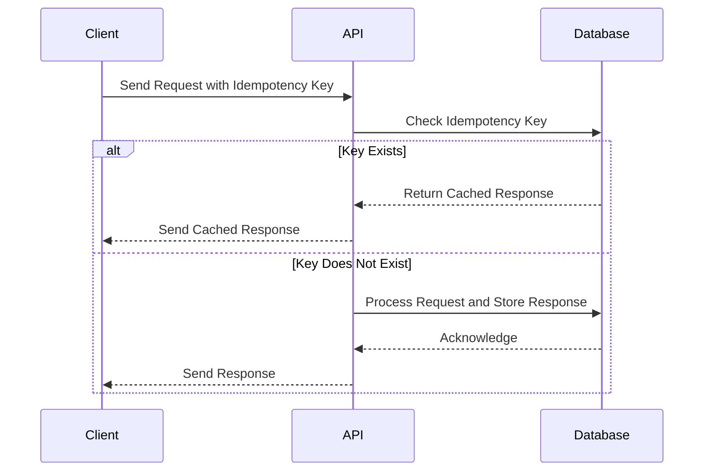

## 11.11 Idempotency Patterns

In the world of distributed systems and microservices, ensuring that operations can be safely retried without unintended side effects is crucial. This is where the concept of idempotency comes into play. In this section, we will explore idempotency patterns, focusing on designing idempotent APIs and operations in Scala, techniques for achieving idempotency, and handling retries and failure scenarios.

### Understanding Idempotency

**Idempotency** is a property of certain operations in programming, particularly in distributed systems, where performing the same operation multiple times has the same effect as performing it once. This is essential for building robust and reliable systems that can handle retries and failures gracefully.

#### Key Characteristics of Idempotent Operations

1. **Repeatability**: An idempotent operation can be applied multiple times without changing the result beyond the initial application.
2. **Side-Effect-Free**: Ideally, idempotent operations should not have side effects, or any side effects should be consistent across multiple invocations.
3. **Deterministic**: The outcome of an idempotent operation should be predictable and consistent.

### Importance of Idempotency in Microservices

In microservices architectures, services often communicate over unreliable networks where messages can be lost, duplicated, or delivered out of order. Idempotency helps mitigate these issues by allowing operations to be retried safely, ensuring consistency and reliability.

#### Use Cases for Idempotency

- **API Requests**: Ensuring that repeated API requests do not cause unintended side effects, such as duplicate transactions.
- **Data Processing**: Guaranteeing that data processing tasks produce the same results, even if executed multiple times.
- **State Transitions**: Managing state transitions in a consistent manner, even in the face of network failures or retries.

### Designing Idempotent APIs and Operations

To design idempotent APIs and operations, we need to consider several strategies and techniques that ensure the idempotency property is maintained.

#### Idempotency Keys

One common approach to achieving idempotency is using **idempotency keys**. An idempotency key is a unique identifier for a request, allowing the server to recognize and ignore duplicate requests.

```scala
case class Request(idempotencyKey: String, data: String)

def processRequest(request: Request): Response = {
  if (isDuplicate(request.idempotencyKey)) {
    // Return cached response for duplicate request
    getCachedResponse(request.idempotencyKey)
  } else {
    // Process the request and store the response
    val response = handleRequest(request.data)
    cacheResponse(request.idempotencyKey, response)
    response
  }
}
```

In this example, we use an `idempotencyKey` to identify duplicate requests. If a request with the same key is received, we return the cached response instead of processing the request again.

#### Safe HTTP Methods

HTTP methods like `GET`, `PUT`, and `DELETE` are inherently idempotent, while `POST` is not. When designing APIs, prefer idempotent methods where possible. For non-idempotent operations, consider using idempotency keys or other techniques to ensure idempotency.

#### State-Based Idempotency

Another approach is to design operations based on the current state of the resource. By checking the current state before performing an operation, we can ensure that the operation is only applied if it results in a state change.

```scala
def updateResource(resourceId: String, newState: State): Response = {
  val currentState = getResourceState(resourceId)
  if (currentState != newState) {
    // Update resource state
    setResourceState(resourceId, newState)
    Response("Resource updated")
  } else {
    Response("No change needed")
  }
}
```

In this example, the resource is only updated if the new state differs from the current state, ensuring idempotency.

### Techniques for Achieving Idempotency in Scala

Scala's rich type system and functional programming features provide powerful tools for implementing idempotency patterns.

#### Using Immutable Data Structures

Immutable data structures are inherently idempotent, as they cannot be modified once created. By leveraging immutability, we can ensure that operations do not have unintended side effects.

```scala
val originalList = List(1, 2, 3)
val updatedList = originalList.map(_ + 1) // Creates a new list, originalList remains unchanged
```

In this example, `originalList` remains unchanged, and `updatedList` is a new list with the incremented values.

#### Functional Composition

Functional composition allows us to build complex operations from smaller, idempotent functions. By composing functions, we can ensure that the overall operation remains idempotent.

```scala
def increment(x: Int): Int = x + 1
def double(x: Int): Int = x * 2

val composedFunction = increment _ andThen double _
val result = composedFunction(3) // Result is 8
```

Here, `composedFunction` is a combination of `increment` and `double`, both of which are idempotent.

#### Monads for Effect Management

Monads like `Option`, `Either`, and `Try` can be used to manage effects and ensure idempotency by encapsulating operations and handling failures gracefully.

```scala
def safeDivide(a: Int, b: Int): Try[Int] = Try(a / b)

val result = safeDivide(10, 2).getOrElse(0) // Result is 5
val failedResult = safeDivide(10, 0).getOrElse(0) // Result is 0, division by zero handled
```

In this example, `safeDivide` uses the `Try` monad to handle division safely, ensuring that the operation is idempotent even in the face of errors.

### Handling Retries and Failure Scenarios

In distributed systems, retries are often necessary to handle transient failures. However, retries can lead to duplicate operations if not managed carefully. Idempotency patterns help mitigate these issues.

#### Retry Strategies

Implementing retry strategies can help manage transient failures while ensuring idempotency. Common strategies include:

- **Exponential Backoff**: Gradually increasing the delay between retries to reduce load on the system.
- **Circuit Breaker**: Temporarily halting retries after a certain number of failures to prevent system overload.

```scala
import scala.concurrent.duration._
import akka.pattern.{CircuitBreaker, CircuitBreakerOpenException}

val breaker = new CircuitBreaker(
  scheduler = system.scheduler,
  maxFailures = 5,
  callTimeout = 10.seconds,
  resetTimeout = 1.minute
)

def callWithRetry[T](operation: => Future[T]): Future[T] = {
  breaker.withCircuitBreaker(operation).recoverWith {
    case _: CircuitBreakerOpenException =>
      // Handle circuit breaker open state
      Future.failed(new Exception("Circuit breaker is open"))
  }
}
```

In this example, we use Akka's `CircuitBreaker` to manage retries and handle failures gracefully.

#### Idempotency in Asynchronous Operations

Asynchronous operations, such as those using `Future` or `Akka Streams`, require careful management to ensure idempotency. By designing operations to be idempotent, we can safely retry them in the event of failures.

```scala
import scala.concurrent.Future
import scala.concurrent.ExecutionContext.Implicits.global

def fetchData(id: String): Future[Data] = {
  Future {
    // Simulate data fetching
    Data(id, "Sample data")
  }
}

val resultFuture = fetchData("123").map { data =>
  // Process data
  data.copy(content = data.content.toUpperCase)
}
```

In this example, `fetchData` is an asynchronous operation that can be retried safely, as it is designed to be idempotent.

### Visualizing Idempotency in Microservices

To better understand how idempotency fits into microservices architectures, let's visualize the flow of an idempotent operation.



In this sequence diagram, the client sends a request with an idempotency key. The API checks if the key exists in the database. If it does, the cached response is returned. If not, the request is processed, and the response is stored for future reference.

### Design Considerations

When implementing idempotency patterns, consider the following:

- **Consistency**: Ensure that operations produce consistent results, even in the face of retries or failures.
- **Scalability**: Design idempotent operations to scale with the system, avoiding bottlenecks or performance issues.
- **Error Handling**: Implement robust error handling to manage failures gracefully and maintain idempotency.

### Differences and Similarities with Other Patterns

Idempotency patterns are often confused with other patterns, such as:

- **Retry Patterns**: While retries focus on handling failures, idempotency ensures that retries do not cause unintended side effects.
- **Caching Patterns**: Both caching and idempotency involve storing responses, but caching focuses on performance, while idempotency ensures consistency.

### Try It Yourself

To solidify your understanding of idempotency patterns, try modifying the code examples provided. Experiment with different retry strategies, implement idempotency keys in your own APIs, and explore how immutability and functional composition can enhance idempotency.

### Conclusion

Idempotency is a critical concept in building reliable and robust microservices. By designing idempotent APIs and operations, leveraging Scala's functional programming features, and implementing effective retry strategies, we can ensure that our systems handle retries and failures gracefully. Remember, this is just the beginning. As you progress, you'll build more complex and resilient systems. Keep experimenting, stay curious, and enjoy the journey!

## Quiz Time!



### What is idempotency in the context of programming?

- [x] An operation that can be applied multiple times without changing the result beyond the initial application.
- [ ] An operation that always produces different results.
- [ ] An operation that is only executed once.
- [ ] An operation that cannot be retried.

> **Explanation:** Idempotency refers to operations that can be repeated without changing the outcome beyond the first application.

### Which HTTP methods are inherently idempotent?

- [x] GET
- [x] PUT
- [x] DELETE
- [ ] POST

> **Explanation:** GET, PUT, and DELETE are idempotent methods, while POST is not inherently idempotent.

### What is an idempotency key used for?

- [x] To identify and ignore duplicate requests.
- [ ] To encrypt data in transit.
- [ ] To authenticate users.
- [ ] To manage session state.

> **Explanation:** An idempotency key is used to recognize and ignore duplicate requests, ensuring idempotency.

### How can immutability help achieve idempotency?

- [x] By ensuring that data structures cannot be modified once created.
- [ ] By allowing data to be changed freely.
- [ ] By making data structures mutable.
- [ ] By increasing the complexity of operations.

> **Explanation:** Immutability ensures that data structures cannot be changed, which helps maintain idempotency.

### What is the purpose of a circuit breaker in retry strategies?

- [x] To temporarily halt retries after a certain number of failures.
- [ ] To increase the frequency of retries.
- [ ] To bypass error handling.
- [ ] To ensure retries are always successful.

> **Explanation:** A circuit breaker temporarily stops retries after a set number of failures to prevent system overload.

### Which Scala feature can be used to manage effects and ensure idempotency?

- [x] Monads like `Option`, `Either`, and `Try`.
- [ ] Mutable variables.
- [ ] Loops and conditionals.
- [ ] Inheritance and polymorphism.

> **Explanation:** Monads like `Option`, `Either`, and `Try` encapsulate operations and handle failures, ensuring idempotency.

### What is a common strategy for handling retries in distributed systems?

- [x] Exponential backoff.
- [ ] Immediate retry.
- [ ] Ignoring failures.
- [ ] Random delays.

> **Explanation:** Exponential backoff gradually increases the delay between retries to reduce system load.

### How does functional composition contribute to idempotency?

- [x] By building complex operations from smaller, idempotent functions.
- [ ] By making operations more complex.
- [ ] By increasing the number of side effects.
- [ ] By reducing the number of functions.

> **Explanation:** Functional composition allows for the creation of complex operations from smaller, idempotent functions, maintaining idempotency.

### What is the role of a database in ensuring idempotency with idempotency keys?

- [x] To store and check idempotency keys for duplicate requests.
- [ ] To execute all requests without checks.
- [ ] To encrypt idempotency keys.
- [ ] To manage user authentication.

> **Explanation:** The database stores and checks idempotency keys to identify and handle duplicate requests.

### True or False: Idempotency patterns are only applicable in microservices architectures.

- [ ] True
- [x] False

> **Explanation:** Idempotency patterns are applicable in various contexts, not just microservices architectures.


