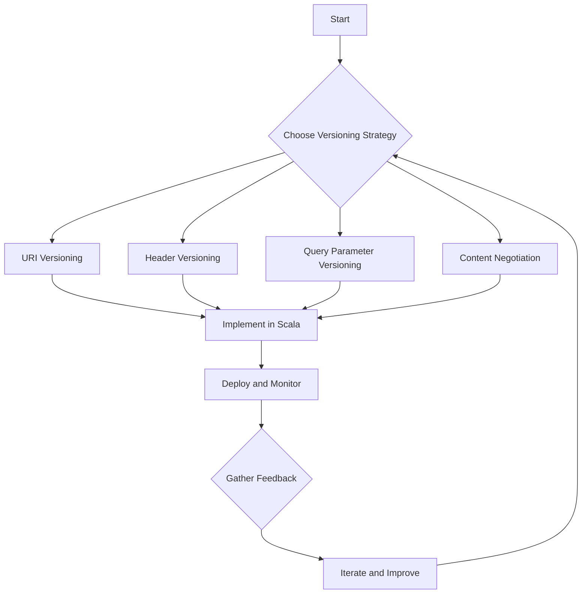

## 11.12 API Versioning Strategies

API versioning is a crucial aspect of software development, especially in microservices architecture, where services evolve independently. In this section, we will delve into various strategies for API versioning, focusing on their implementation in Scala services. We will also discuss best practices for maintaining APIs over time, ensuring backward compatibility, and minimizing disruption to consumers.

### Understanding API Versioning

API versioning is the practice of managing changes to an API in a way that allows clients to continue using the API without interruption. As APIs evolve, new features are added, and existing features may change or be deprecated. Versioning helps manage these changes by providing a structured way to introduce new versions while maintaining support for older ones.

#### Why Version APIs?

- **Backward Compatibility**: Ensures existing clients continue to function without modification.
- **Controlled Evolution**: Allows APIs to evolve and improve over time without breaking existing integrations.
- **Flexibility**: Provides the ability to introduce new features and improvements while maintaining stability.
- **Consumer Trust**: Builds confidence among API consumers by ensuring predictable and stable interfaces.

### Approaches to API Versioning

There are several strategies for versioning APIs, each with its own advantages and trade-offs. The choice of strategy depends on factors such as the nature of the API, the client base, and the rate of change. Let's explore some common approaches.

#### 1. URI Versioning

URI versioning involves embedding the version number directly in the URL path. This is one of the most straightforward and visible ways to version an API.

**Example:**

```scala
GET /api/v1/resource
GET /api/v2/resource
```

**Advantages:**

- **Simplicity**: Easy to implement and understand.
- **Visibility**: The version is clearly visible in the URL, making it easy for clients to identify.

**Disadvantages:**

- **URL Changes**: Requires clients to update URLs when versions change.
- **Potential for Clutter**: Can lead to a proliferation of endpoints if not managed carefully.

#### 2. Header Versioning

Header versioning involves specifying the API version in the HTTP headers. This approach keeps the URL clean and focuses versioning logic in the request headers.

**Example:**

```http
GET /api/resource
Headers: 
  Accept: application/vnd.example.v1+json
```

**Advantages:**

- **Clean URLs**: Keeps the URL structure consistent across versions.
- **Flexibility**: Allows for more granular versioning, such as specifying different versions for different resources.

**Disadvantages:**

- **Hidden Complexity**: Versioning information is not immediately visible in the URL.
- **Client Complexity**: Requires clients to manage headers appropriately.

#### 3. Query Parameter Versioning

In this approach, the version number is included as a query parameter in the request URL.

**Example:**

```scala
GET /api/resource?version=1
```

**Advantages:**

- **Backward Compatibility**: Allows for easy addition of versioning to existing APIs.
- **Flexibility**: Supports dynamic version selection.

**Disadvantages:**

- **URL Complexity**: Can lead to complex URLs with multiple query parameters.
- **Caching Issues**: May complicate caching strategies.

#### 4. Content Negotiation

Content negotiation leverages the `Accept` header to specify the desired version of the API. This approach is similar to header versioning but focuses on content types.

**Example:**

```http
GET /api/resource
Headers: 
  Accept: application/vnd.example+json; version=1
```

**Advantages:**

- **Flexibility**: Supports multiple content types and versions.
- **Clean URLs**: Keeps URLs consistent across versions.

**Disadvantages:**

- **Complexity**: Requires careful management of content types and headers.
- **Client Implementation**: Clients must handle content negotiation logic.

### Implementing Versioning in Scala Services

Scala, with its powerful type system and functional programming capabilities, provides a robust platform for implementing API versioning. Let's explore how to implement some of these strategies in Scala services.

#### URI Versioning in Scala

Implementing URI versioning in Scala can be straightforward, especially when using frameworks like Play Framework or Akka HTTP.

**Example with Play Framework:**

```scala
import play.api.mvc._

class ApiController @Inject()(cc: ControllerComponents) extends AbstractController(cc) {

  def getResourceV1 = Action {
    Ok("Resource version 1")
  }

  def getResourceV2 = Action {
    Ok("Resource version 2")
  }
}

// Routes
GET     /api/v1/resource     controllers.ApiController.getResourceV1
GET     /api/v2/resource     controllers.ApiController.getResourceV2
```

**Key Points:**

- Define separate routes for each version.
- Implement version-specific logic in separate controller methods.

#### Header Versioning in Scala

Header versioning can be implemented by inspecting the request headers and routing requests accordingly.

**Example with Akka HTTP:**

```scala
import akka.http.scaladsl.server.Directives._
import akka.http.scaladsl.model.headers._

val route =
  path("api" / "resource") {
    headerValueByName("Accept") {
      case "application/vnd.example.v1+json" =>
        complete("Resource version 1")
      case "application/vnd.example.v2+json" =>
        complete("Resource version 2")
      case _ =>
        complete(StatusCodes.NotAcceptable, "Unsupported version")
    }
  }
```

**Key Points:**

- Use `headerValueByName` to extract and match the version from headers.
- Provide appropriate responses based on the version.

#### Query Parameter Versioning in Scala

Query parameter versioning involves extracting the version from query parameters and routing requests accordingly.

**Example with Play Framework:**

```scala
import play.api.mvc._

class ApiController @Inject()(cc: ControllerComponents) extends AbstractController(cc) {

  def getResource(version: String) = Action {
    version match {
      case "1" => Ok("Resource version 1")
      case "2" => Ok("Resource version 2")
      case _   => BadRequest("Unsupported version")
    }
  }
}

// Routes
GET     /api/resource     controllers.ApiController.getResource(version: String)
```

**Key Points:**

- Extract the version from query parameters.
- Implement logic to handle different versions.

### Best Practices for Maintaining APIs Over Time

Maintaining APIs over time requires careful planning and adherence to best practices to ensure stability and backward compatibility. Here are some key practices to consider:

#### 1. Semantic Versioning

Adopt semantic versioning to communicate changes clearly. Semantic versioning uses a three-part version number: `MAJOR.MINOR.PATCH`.

- **MAJOR**: Incremented for incompatible changes.
- **MINOR**: Incremented for backward-compatible feature additions.
- **PATCH**: Incremented for backward-compatible bug fixes.

#### 2. Deprecation Policies

Establish clear deprecation policies to manage the lifecycle of API versions. Communicate deprecations well in advance and provide migration guides for consumers.

#### 3. Documentation

Maintain comprehensive and up-to-date documentation for each API version. Include examples, change logs, and migration guides to assist developers in transitioning between versions.

#### 4. Automated Testing

Implement automated tests for each API version to ensure backward compatibility and prevent regressions. Use tools like ScalaTest or Specs2 to write comprehensive test suites.

#### 5. Monitoring and Analytics

Use monitoring and analytics to track API usage and identify deprecated versions still in use. This data can inform decisions about deprecating old versions and supporting new ones.

#### 6. Consumer Feedback

Engage with API consumers to gather feedback on versioning strategies and changes. This feedback can help prioritize features and improvements.

### Visualizing API Versioning Strategies

To better understand the flow and decision-making process involved in API versioning, let's visualize a typical API versioning strategy using a flowchart.



**Diagram Description:**

- **Start**: Begin by choosing an appropriate versioning strategy.
- **Implement in Scala**: Implement the chosen strategy using Scala frameworks.
- **Deploy and Monitor**: Deploy the API and monitor its usage.
- **Gather Feedback**: Collect feedback from consumers and iterate on the strategy.

### Try It Yourself

Experiment with the code examples provided by modifying the versioning logic or adding new versions. Consider implementing a new versioning strategy not covered here, such as using a custom header or a combination of strategies.

### Knowledge Check

- What are the advantages and disadvantages of URI versioning?
- How can header versioning be implemented in Scala using Akka HTTP?
- What are some best practices for maintaining APIs over time?

### Embrace the Journey

Remember, API versioning is a continuous process that requires careful planning and execution. By understanding the different strategies and best practices, you can design APIs that are both flexible and stable, ensuring a positive experience for your consumers. Keep experimenting, stay curious, and enjoy the journey!

### References and Links

- [MDN Web Docs: API Versioning](https://developer.mozilla.org/en-US/docs/Web/API)
- [RESTful API Versioning](https://restfulapi.net/versioning/)
- [Play Framework Documentation](https://www.playframework.com/documentation/latest/Home)
- [Akka HTTP Documentation](https://doc.akka.io/docs/akka-http/current/)

---

## Quiz Time!



### Which versioning strategy involves embedding the version number directly in the URL path?

- [x] URI Versioning
- [ ] Header Versioning
- [ ] Query Parameter Versioning
- [ ] Content Negotiation

> **Explanation:** URI versioning embeds the version number directly in the URL path, making it visible and easy to manage.

### What is a disadvantage of header versioning?

- [ ] Clean URLs
- [x] Hidden Complexity
- [ ] Flexibility
- [ ] Client Simplicity

> **Explanation:** Header versioning can introduce hidden complexity as the version information is not visible in the URL, requiring clients to manage headers appropriately.

### How can query parameter versioning be implemented in Scala?

- [x] By extracting the version from query parameters and routing requests accordingly
- [ ] By embedding the version in the URL path
- [ ] By using the `Accept` header
- [ ] By using a custom header

> **Explanation:** Query parameter versioning involves extracting the version from query parameters, allowing dynamic version selection.

### What is the purpose of semantic versioning?

- [x] To communicate changes clearly using a three-part version number
- [ ] To hide version information from clients
- [ ] To avoid backward compatibility
- [ ] To simplify URL structures

> **Explanation:** Semantic versioning uses a three-part version number to communicate changes clearly, indicating major, minor, and patch updates.

### What should be included in comprehensive API documentation?

- [x] Examples, change logs, and migration guides
- [ ] Only the latest version details
- [ ] Internal implementation details
- [ ] Marketing materials

> **Explanation:** Comprehensive API documentation should include examples, change logs, and migration guides to assist developers in transitioning between versions.

### Which tool can be used for automated testing of Scala APIs?

- [x] ScalaTest
- [ ] Swagger
- [ ] OpenAPI
- [ ] Postman

> **Explanation:** ScalaTest is a tool used for automated testing of Scala applications, ensuring backward compatibility and preventing regressions.

### What is a key benefit of engaging with API consumers?

- [x] Gathering feedback to prioritize features and improvements
- [ ] Reducing the need for documentation
- [ ] Avoiding versioning altogether
- [ ] Simplifying header management

> **Explanation:** Engaging with API consumers helps gather feedback, which can be used to prioritize features and improvements, enhancing the API's usability.

### Which versioning strategy uses the `Accept` header to specify the desired version?

- [ ] URI Versioning
- [ ] Query Parameter Versioning
- [x] Content Negotiation
- [ ] Custom Header Versioning

> **Explanation:** Content negotiation uses the `Accept` header to specify the desired version, allowing for flexible content type and version management.

### What is the role of monitoring and analytics in API versioning?

- [x] To track API usage and identify deprecated versions still in use
- [ ] To eliminate the need for versioning
- [ ] To simplify URL structures
- [ ] To reduce client complexity

> **Explanation:** Monitoring and analytics help track API usage, identify deprecated versions still in use, and inform decisions about deprecating old versions.

### True or False: API versioning is a one-time process that does not require iteration.

- [ ] True
- [x] False

> **Explanation:** API versioning is a continuous process that requires iteration, feedback, and improvement to ensure stability and backward compatibility.


