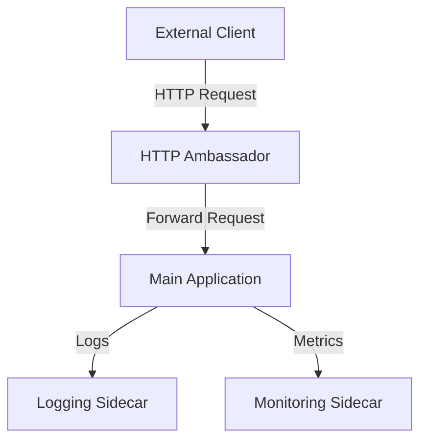

## 11.13 Sidecar and Ambassador Patterns

In the realm of microservices architecture, the Sidecar and Ambassador patterns play pivotal roles in enhancing service communication, observability, and management. These patterns are particularly beneficial in environments like Kubernetes and service meshes, where they help manage the complexity of distributed systems. In this section, we will delve into these patterns, their implementation in Scala, and their practical applications in modern cloud-native environments.

### Understanding the Sidecar Pattern

#### Intent

The Sidecar pattern is a design pattern used to extend and enhance the functionality of a primary application without modifying its code. This pattern involves deploying a secondary container, known as a sidecar, alongside the main application container. The sidecar container can handle cross-cutting concerns such as logging, monitoring, configuration, and network communication.

#### Key Participants

- **Primary Application**: The main service or application that performs the core business logic.
- **Sidecar Container**: A secondary container that runs alongside the primary application, providing additional functionalities.

#### Applicability

The Sidecar pattern is applicable in scenarios where:

- There is a need to offload certain responsibilities from the main application to improve modularity and separation of concerns.
- Cross-cutting concerns such as logging, monitoring, and configuration management need to be handled without altering the main application code.
- There is a requirement to standardize functionalities across multiple services in a microservices architecture.

#### Sample Code Snippet

Let's consider a Scala application where we implement a simple logging sidecar. The sidecar will capture logs from the main application and forward them to a centralized logging service.

```scala
// Main Application
object MainApp extends App {
  println("Main application is running...")
  // Simulate application logic
  Thread.sleep(5000)
  println("Main application completed.")
}

// Sidecar for Logging
object LoggingSidecar extends App {
  println("Logging sidecar is running...")
  // Simulate capturing logs
  Thread.sleep(2000)
  println("Forwarding logs to centralized logging service.")
}
```

In a Kubernetes environment, you would define a Pod that includes both the main application and the logging sidecar as separate containers.

```yaml
apiVersion: v1
kind: Pod
metadata:
  name: myapp-pod
spec:
  containers:
  - name: main-app
    image: myapp:latest
  - name: logging-sidecar
    image: logging-sidecar:latest
```

#### Design Considerations

- **Isolation**: Ensure that the sidecar container is isolated from the main application to prevent any unintended interference.
- **Communication**: Establish a reliable communication mechanism between the main application and the sidecar, such as shared volumes or network communication.
- **Resource Management**: Monitor and manage the resources consumed by the sidecar to prevent it from affecting the performance of the main application.

#### Differences and Similarities

The Sidecar pattern is often compared to the Ambassador pattern. While both patterns involve auxiliary components that enhance the functionality of the main application, the Sidecar pattern focuses on extending the application's capabilities, whereas the Ambassador pattern primarily deals with managing external communication.

### Implementing the Ambassador Pattern

#### Intent

The Ambassador pattern is a design pattern used to manage and route external communication for a service. It involves deploying an ambassador container that acts as an intermediary between the service and external clients. This pattern is particularly useful for handling network-related concerns such as load balancing, authentication, and protocol translation.

#### Key Participants

- **Service**: The main application or service that requires external communication.
- **Ambassador Container**: A proxy container that manages external communication on behalf of the service.

#### Applicability

The Ambassador pattern is applicable in scenarios where:

- There is a need to decouple network-related concerns from the main application.
- Services require protocol translation or load balancing.
- External communication needs to be managed centrally for consistency and security.

#### Sample Code Snippet

Let's implement a simple ambassador pattern in Scala, where the ambassador handles HTTP requests for the main application.

```scala
// Main Application
object MainService extends App {
  println("Main service is running...")
  // Simulate service logic
  Thread.sleep(5000)
  println("Main service completed.")
}

// Ambassador for HTTP Handling
object HttpAmbassador extends App {
  println("HTTP ambassador is running...")
  // Simulate handling HTTP requests
  Thread.sleep(2000)
  println("Routing requests to main service.")
}
```

In a Kubernetes environment, the ambassador pattern can be implemented by defining a Pod with both the main service and the ambassador container.

```yaml
apiVersion: v1
kind: Pod
metadata:
  name: myservice-pod
spec:
  containers:
  - name: main-service
    image: mainservice:latest
  - name: http-ambassador
    image: http-ambassador:latest
```

#### Design Considerations

- **Security**: Ensure that the ambassador container is secure and can handle potential threats from external sources.
- **Scalability**: Design the ambassador to handle varying loads and scale as needed.
- **Protocol Handling**: Implement robust protocol handling to manage different types of external communication.

#### Differences and Similarities

The Ambassador pattern is similar to the Sidecar pattern in that both involve auxiliary components. However, the Ambassador pattern focuses on managing external communication, while the Sidecar pattern enhances the internal capabilities of the main application.

### Use Cases in Kubernetes and Service Mesh Environments

In Kubernetes and service mesh environments, the Sidecar and Ambassador patterns are commonly used to manage the complexity of microservices architectures.

#### Kubernetes

In Kubernetes, the Sidecar pattern is often used to deploy additional functionalities such as logging, monitoring, and service discovery alongside the main application. The Ambassador pattern is used to manage external communication, providing a consistent interface for external clients.

#### Service Mesh

In service mesh environments, the Sidecar pattern is implemented using sidecar proxies, such as Envoy, to handle service-to-service communication, security, and observability. The Ambassador pattern can be used to manage ingress and egress traffic, providing a centralized point for managing external communication.

#### Visualizing the Patterns

Let's visualize the Sidecar and Ambassador patterns in a Kubernetes environment using Mermaid.js diagrams.



**Diagram Description**: This diagram illustrates the Sidecar and Ambassador patterns in a Kubernetes environment. The main application communicates with the logging and monitoring sidecars for internal functionalities, while the HTTP ambassador manages external communication with clients.

### Try It Yourself

Experiment with the Sidecar and Ambassador patterns by modifying the code examples provided. Try adding additional functionalities to the sidecar, such as metrics collection or configuration management. For the ambassador, implement protocol translation or load balancing to enhance the communication capabilities.

### References and Links

- [Kubernetes Documentation](https://kubernetes.io/docs/home/)
- [Service Mesh Patterns](https://istio.io/latest/docs/concepts/what-is-istio/)
- [Envoy Proxy](https://www.envoyproxy.io/)

### Knowledge Check

- What are the main differences between the Sidecar and Ambassador patterns?
- How can the Sidecar pattern enhance the functionality of a primary application?
- In what scenarios would you use the Ambassador pattern?

### Embrace the Journey

Remember, mastering these patterns is just the beginning. As you progress, you'll build more complex and resilient microservices architectures. Keep experimenting, stay curious, and enjoy the journey!

## Quiz Time!



### What is the primary purpose of the Sidecar pattern?

- [x] To extend and enhance the functionality of a primary application without modifying its code.
- [ ] To manage external communication for a service.
- [ ] To handle protocol translation for external clients.
- [ ] To provide a centralized point for managing ingress and egress traffic.

> **Explanation:** The Sidecar pattern is used to extend and enhance the functionality of a primary application without modifying its code, by deploying a secondary container alongside the main application.

### Which of the following is a key participant in the Ambassador pattern?

- [ ] Logging Sidecar
- [x] Ambassador Container
- [ ] Monitoring Sidecar
- [ ] Main Application

> **Explanation:** The Ambassador pattern involves an ambassador container that acts as an intermediary between the service and external clients, managing external communication.

### In which environment are the Sidecar and Ambassador patterns commonly used?

- [ ] Desktop applications
- [ ] Mobile applications
- [x] Kubernetes and service mesh environments
- [ ] Monolithic applications

> **Explanation:** The Sidecar and Ambassador patterns are commonly used in Kubernetes and service mesh environments to manage the complexity of microservices architectures.

### What is a common use case for the Sidecar pattern in Kubernetes?

- [ ] Managing external communication
- [x] Deploying additional functionalities such as logging and monitoring
- [ ] Handling protocol translation
- [ ] Providing a centralized point for managing ingress and egress traffic

> **Explanation:** In Kubernetes, the Sidecar pattern is often used to deploy additional functionalities such as logging, monitoring, and service discovery alongside the main application.

### How does the Ambassador pattern handle external communication?

- [x] By deploying an ambassador container that acts as an intermediary between the service and external clients
- [ ] By extending the functionality of the main application
- [ ] By managing internal service-to-service communication
- [ ] By handling metrics collection and configuration management

> **Explanation:** The Ambassador pattern handles external communication by deploying an ambassador container that acts as an intermediary between the service and external clients.

### What is a key design consideration for the Sidecar pattern?

- [x] Isolation between the sidecar container and the main application
- [ ] Centralized management of ingress and egress traffic
- [ ] Protocol handling for external communication
- [ ] Load balancing for external clients

> **Explanation:** A key design consideration for the Sidecar pattern is ensuring isolation between the sidecar container and the main application to prevent any unintended interference.

### Which pattern is used to manage ingress and egress traffic in a service mesh environment?

- [ ] Sidecar Pattern
- [x] Ambassador Pattern
- [ ] Singleton Pattern
- [ ] Factory Pattern

> **Explanation:** In a service mesh environment, the Ambassador pattern is used to manage ingress and egress traffic, providing a centralized point for managing external communication.

### What is the role of the sidecar proxy in a service mesh?

- [x] To handle service-to-service communication, security, and observability
- [ ] To manage external communication for a service
- [ ] To provide a centralized point for managing ingress and egress traffic
- [ ] To extend the functionality of the main application

> **Explanation:** In a service mesh, the sidecar proxy handles service-to-service communication, security, and observability, enhancing the internal capabilities of the main application.

### True or False: The Sidecar pattern is primarily used for managing external communication.

- [ ] True
- [x] False

> **Explanation:** False. The Sidecar pattern is primarily used to extend and enhance the functionality of a primary application without modifying its code, not for managing external communication.

### Which pattern is often used for protocol translation or load balancing?

- [ ] Sidecar Pattern
- [x] Ambassador Pattern
- [ ] Observer Pattern
- [ ] Decorator Pattern

> **Explanation:** The Ambassador pattern is often used for protocol translation or load balancing, managing external communication for a service.


