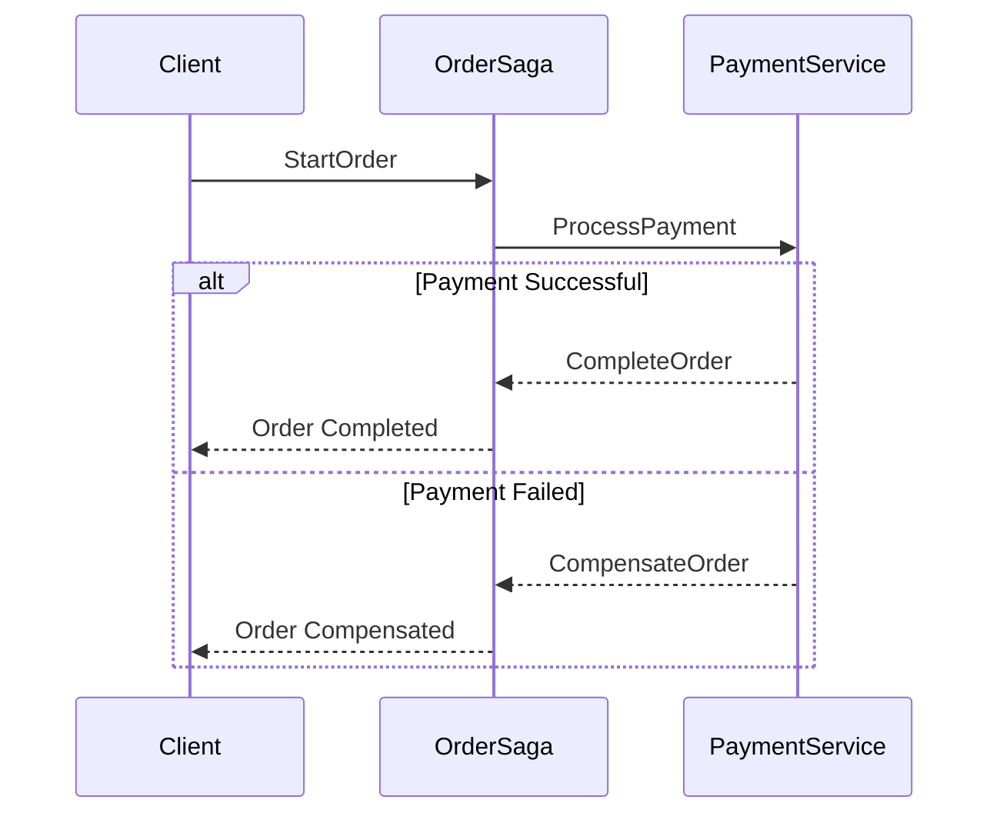

## 11.14 Saga Pattern

In the realm of microservices architecture, managing distributed transactions is a significant challenge. The Saga Pattern emerges as a robust solution to this problem, enabling systems to maintain eventual consistency across multiple services. In this section, we'll delve into the intricacies of the Saga Pattern, explore its implementation using Akka Persistence in Scala, and understand its role in achieving reliable distributed transactions.

### Intent

The Saga Pattern is designed to manage long-lived transactions in a distributed system. It breaks a transaction into a series of smaller, independent transactions, each with its own compensation logic to handle failures. This approach ensures that the system remains consistent even when individual transactions fail, by either completing all transactions successfully or compensating for any failures.

### Key Participants

1. **Saga Coordinator**: Manages the execution of the saga, ensuring that each step is executed in sequence and compensation actions are triggered in case of failures.
2. **Participants**: Individual services or components that perform specific tasks within the saga.
3. **Compensation Logic**: Defined for each participant to undo or mitigate the effects of a transaction if it fails.

### Applicability

The Saga Pattern is particularly useful in scenarios where:

- Transactions span multiple services or databases.
- Strong consistency is not feasible, and eventual consistency is acceptable.
- The system needs to remain operational despite partial failures.

### Implementing Sagas with Akka Persistence

Akka Persistence provides a powerful framework for implementing sagas in Scala. It allows you to persist state changes, ensuring that your system can recover from failures and continue processing transactions.

#### Sample Code Snippet

Let's explore a simple implementation of the Saga Pattern using Akka Persistence. We'll simulate a transaction involving two services: `OrderService` and `PaymentService`.

```scala
import akka.actor.{Actor, ActorLogging, Props}
import akka.persistence.{PersistentActor, RecoveryCompleted}

// Messages
case class StartOrder(orderId: String, amount: Double)
case class CompleteOrder(orderId: String)
case class CompensateOrder(orderId: String)

// Events
case class OrderStarted(orderId: String, amount: Double)
case class OrderCompleted(orderId: String)
case class OrderCompensated(orderId: String)

// OrderSaga Actor
class OrderSaga extends PersistentActor with ActorLogging {
  override def persistenceId: String = "order-saga"

  private var orderState: Option[OrderStarted] = None

  override def receiveRecover: Receive = {
    case event: OrderStarted =>
      orderState = Some(event)
    case _: OrderCompleted =>
      orderState = None
    case _: OrderCompensated =>
      orderState = None
    case RecoveryCompleted =>
      log.info("Recovery completed")
  }

  override def receiveCommand: Receive = {
    case StartOrder(orderId, amount) =>
      persist(OrderStarted(orderId, amount)) { event =>
        orderState = Some(event)
        log.info(s"Order started: $orderId")
        // Simulate payment processing
        context.actorOf(Props[PaymentService]) ! ProcessPayment(orderId, amount)
      }

    case CompleteOrder(orderId) =>
      persist(OrderCompleted(orderId)) { _ =>
        orderState = None
        log.info(s"Order completed: $orderId")
      }

    case CompensateOrder(orderId) =>
      persist(OrderCompensated(orderId)) { _ =>
        orderState = None
        log.info(s"Order compensated: $orderId")
      }
  }
}

// PaymentService Actor
class PaymentService extends Actor with ActorLogging {
  override def receive: Receive = {
    case ProcessPayment(orderId, amount) =>
      // Simulate payment logic
      if (amount > 1000) {
        sender() ! CompensateOrder(orderId)
      } else {
        sender() ! CompleteOrder(orderId)
      }
  }
}
```

In this example, the `OrderSaga` actor manages the transaction, while the `PaymentService` actor simulates a payment process. If the payment amount exceeds a certain threshold, the order is compensated.

#### Design Considerations

- **State Persistence**: Use Akka Persistence to ensure that the saga's state is durable. This allows the system to recover from failures and resume processing.
- **Compensation Logic**: Define clear compensation actions for each participant to handle failures gracefully.
- **Concurrency**: Manage concurrent sagas carefully to avoid conflicts and ensure consistency.

#### Differences and Similarities

The Saga Pattern is often compared to the traditional two-phase commit protocol. However, unlike two-phase commit, sagas do not lock resources, making them more suitable for distributed systems where availability and partition tolerance are prioritized over strong consistency.

### Visualizing the Saga Pattern

To better understand the flow of a saga, let's visualize the process using a sequence diagram.



This diagram illustrates the interactions between the client, `OrderSaga`, and `PaymentService`. It shows how the saga handles both successful and failed transactions.

### Try It Yourself

Experiment with the provided code by modifying the payment threshold or adding additional services to the saga. Consider implementing a more complex scenario with multiple participants and compensation actions.

### Knowledge Check

- Explain the role of the Saga Coordinator in the Saga Pattern.
- How does Akka Persistence aid in implementing sagas in Scala?
- What are the key differences between the Saga Pattern and two-phase commit?

### Embrace the Journey

Remember, mastering the Saga Pattern is just one step in building resilient distributed systems. As you continue to explore Scala and Akka, you'll discover more patterns and techniques to enhance your applications. Keep experimenting, stay curious, and enjoy the journey!

## Quiz Time!



### What is the primary intent of the Saga Pattern?

- [x] To manage distributed transactions with eventual consistency.
- [ ] To ensure strong consistency across distributed systems.
- [ ] To lock resources during transactions.
- [ ] To simplify single-node transaction management.

> **Explanation:** The Saga Pattern is designed to manage distributed transactions by breaking them into smaller, independent transactions, ensuring eventual consistency.

### Which component in the Saga Pattern manages the execution of the saga?

- [x] Saga Coordinator
- [ ] Saga Participant
- [ ] Compensation Logic
- [ ] Transaction Manager

> **Explanation:** The Saga Coordinator is responsible for managing the execution of the saga, ensuring each step is executed in sequence and compensation actions are triggered in case of failures.

### How does Akka Persistence assist in implementing the Saga Pattern?

- [x] By persisting state changes for recovery.
- [ ] By locking resources during transactions.
- [ ] By simplifying compensation logic.
- [ ] By providing strong consistency guarantees.

> **Explanation:** Akka Persistence helps by persisting state changes, allowing the system to recover from failures and continue processing transactions.

### What is a key difference between the Saga Pattern and two-phase commit?

- [x] Sagas do not lock resources.
- [ ] Sagas ensure strong consistency.
- [ ] Two-phase commit is more suitable for distributed systems.
- [ ] Sagas require more resources.

> **Explanation:** Unlike two-phase commit, sagas do not lock resources, making them more suitable for distributed systems where availability and partition tolerance are prioritized.

### In the provided code example, what happens if the payment amount exceeds the threshold?

- [x] The order is compensated.
- [ ] The order is completed.
- [ ] The transaction is retried.
- [ ] The system throws an error.

> **Explanation:** If the payment amount exceeds the threshold, the `PaymentService` actor sends a `CompensateOrder` message to the `OrderSaga`, which then compensates the order.

### What is the role of compensation logic in the Saga Pattern?

- [x] To undo or mitigate the effects of a failed transaction.
- [ ] To ensure transactions are completed successfully.
- [ ] To lock resources during transactions.
- [ ] To simplify transaction management.

> **Explanation:** Compensation logic is defined for each participant to undo or mitigate the effects of a transaction if it fails, ensuring the system remains consistent.

### Which Scala feature is crucial for managing state in the Saga Pattern?

- [x] Akka Persistence
- [ ] Scala Futures
- [ ] Implicit Conversions
- [ ] Pattern Matching

> **Explanation:** Akka Persistence is crucial for managing state in the Saga Pattern, as it allows for the persistence of state changes and recovery from failures.

### What is eventual consistency in the context of the Saga Pattern?

- [x] The system will become consistent over time after all transactions are processed.
- [ ] The system is always consistent.
- [ ] The system is never consistent.
- [ ] The system requires manual intervention to be consistent.

> **Explanation:** Eventual consistency means that the system will become consistent over time after all transactions are processed, even if some transactions fail and require compensation.

### Can the Saga Pattern be used for single-node transactions?

- [ ] Yes
- [x] No

> **Explanation:** The Saga Pattern is designed for managing distributed transactions across multiple services, not for single-node transactions.

### True or False: The Saga Pattern is only applicable in microservices architectures.

- [x] True
- [ ] False

> **Explanation:** The Saga Pattern is particularly useful in microservices architectures where transactions span multiple services or databases.


