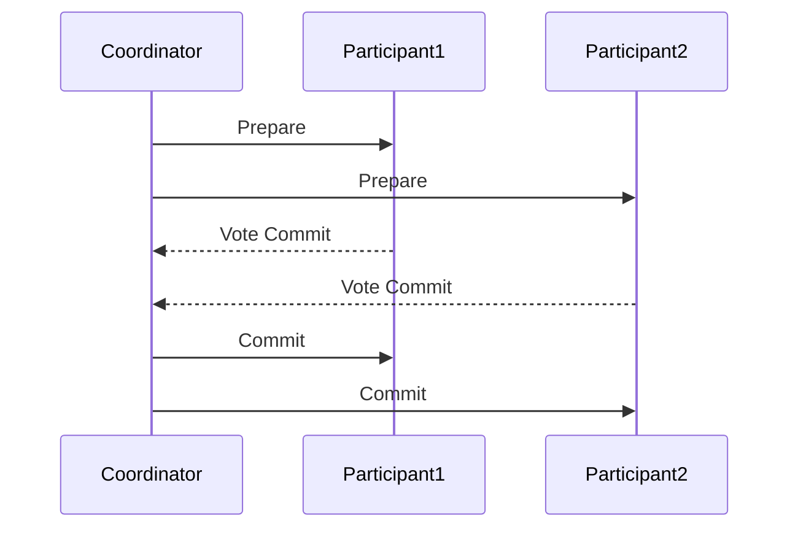
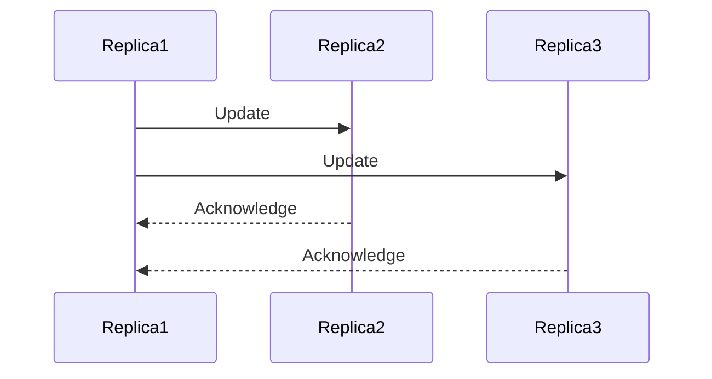

## 11.15 Microservices Transaction Patterns

In the realm of microservices, managing transactions across distributed systems is a complex yet crucial task. Unlike monolithic architectures, where transactions can be managed within a single database, microservices often involve multiple databases and services, each with its own data store. This section delves into the intricacies of microservices transaction patterns, focusing on two-phase commit (2PC) and eventual consistency, while providing best practices for maintaining transactional integrity.

### Understanding Transactions in Distributed Systems

**Transactions** are sequences of operations performed as a single logical unit of work. In distributed systems, achieving atomicity, consistency, isolation, and durability (ACID properties) becomes challenging due to the distributed nature of data and services. Let's explore the key concepts:

- **Atomicity**: Ensures that all parts of a transaction are completed successfully or none at all.
- **Consistency**: Guarantees that a transaction brings the system from one valid state to another.
- **Isolation**: Ensures that transactions do not interfere with each other.
- **Durability**: Guarantees that once a transaction is committed, it remains so, even in the event of a system failure.

In microservices, achieving these properties requires careful design and the use of specific patterns to manage transactions across services.

### Two-Phase Commit (2PC)

#### Intent

The two-phase commit protocol is a distributed algorithm that ensures all participants in a transaction agree on its outcome (commit or abort). It is designed to maintain atomicity across distributed systems.

#### Key Participants

- **Coordinator**: Manages the transaction and coordinates between participants.
- **Participants**: Services or databases involved in the transaction.

#### Applicability

Use 2PC when you need strong consistency and atomicity across distributed services, and when the overhead of coordination is acceptable.

#### How 2PC Works

1. **Prepare Phase**: The coordinator asks all participants to prepare for the transaction. Each participant performs the necessary operations and responds with a vote (commit or abort).
2. **Commit Phase**: If all participants vote to commit, the coordinator sends a commit message. If any participant votes to abort, the coordinator sends an abort message.

```scala
// Scala example of a simplified two-phase commit coordinator
class TwoPhaseCommitCoordinator(participants: List[Participant]) {

  def startTransaction(): Unit = {
    val votes = participants.map(_.prepare())
    if (votes.forall(_ == Vote.Commit)) {
      participants.foreach(_.commit())
    } else {
      participants.foreach(_.abort())
    }
  }
}

trait Participant {
  def prepare(): Vote
  def commit(): Unit
  def abort(): Unit
}

sealed trait Vote
object Vote {
  case object Commit extends Vote
  case object Abort extends Vote
}
```

#### Design Considerations

- **Network Latency**: 2PC can be slow due to network delays.
- **Failure Handling**: If the coordinator fails, participants may remain in an uncertain state.
- **Scalability**: 2PC may not scale well with a large number of participants.

#### Differences and Similarities

2PC is often compared to eventual consistency patterns. While 2PC provides strong consistency, eventual consistency allows for temporary inconsistencies but offers better performance and availability.

### Eventual Consistency

#### Intent

Eventual consistency is a consistency model used in distributed systems to achieve high availability and partition tolerance. It allows for temporary inconsistencies, with the guarantee that all replicas will eventually converge to the same state.

#### Key Participants

- **Replicas**: Multiple copies of data across different nodes or services.
- **Coordinator**: Optional, used to manage the propagation of updates.

#### Applicability

Use eventual consistency when high availability and partition tolerance are prioritized over immediate consistency.

#### How Eventual Consistency Works

1. **Update Propagation**: Updates are propagated asynchronously to all replicas.
2. **Conflict Resolution**: Conflicts are resolved using strategies like last-write-wins or application-specific logic.

```scala
// Scala example of eventual consistency using Akka actors
import akka.actor.{Actor, ActorSystem, Props}

case class Update(key: String, value: String)
case class Get(key: String)

class Replica extends Actor {
  private var data: Map[String, String] = Map.empty

  def receive: Receive = {
    case Update(key, value) =>
      data += (key -> value)
      // Propagate update to other replicas
    case Get(key) =>
      sender() ! data.get(key)
  }
}

val system = ActorSystem("EventualConsistencySystem")
val replica1 = system.actorOf(Props[Replica], "replica1")
val replica2 = system.actorOf(Props[Replica], "replica2")

replica1 ! Update("key1", "value1")
replica2 ! Get("key1")
```

#### Design Considerations

- **Consistency Guarantees**: Eventual consistency does not guarantee immediate consistency.
- **Conflict Resolution**: Requires careful planning to handle conflicts.
- **Use Cases**: Suitable for systems where availability is more critical than consistency, such as social media feeds or shopping carts.

#### Differences and Similarities

Eventual consistency contrasts with 2PC by prioritizing availability and partition tolerance over strong consistency. It is often used in systems where data can be temporarily inconsistent without significant impact.

### Best Practices for Transactional Integrity

1. **Choose the Right Consistency Model**: Assess the trade-offs between strong consistency and eventual consistency based on your application's requirements.
2. **Design for Failure**: Implement robust failure handling and recovery mechanisms.
3. **Optimize for Latency**: Minimize network latency and optimize communication between services.
4. **Use Idempotency**: Design operations to be idempotent to handle retries gracefully.
5. **Implement Monitoring and Logging**: Track transaction states and failures for debugging and analysis.

### Visualizing Microservices Transaction Patterns

Below is a visual representation of the two-phase commit process using Mermaid.js:



And here is a diagram for eventual consistency:



### Try It Yourself

Experiment with the provided code examples by modifying the number of participants in the 2PC example or changing the conflict resolution strategy in the eventual consistency example. Observe how these changes affect the behavior and performance of the system.

### Knowledge Check

- How does two-phase commit ensure atomicity in distributed transactions?
- What are the trade-offs between strong consistency and eventual consistency?
- How can idempotency improve the reliability of distributed transactions?

### Embrace the Journey

Remember, mastering microservices transaction patterns is a journey. As you progress, you'll build more resilient and scalable systems. Keep experimenting, stay curious, and enjoy the journey!

## Quiz Time!



### What is the primary goal of the two-phase commit protocol?

- [x] To ensure atomicity across distributed systems
- [ ] To improve system availability
- [ ] To enhance data consistency
- [ ] To reduce network latency

> **Explanation:** The two-phase commit protocol is designed to ensure atomicity, meaning all parts of a transaction are completed successfully or none at all, across distributed systems.

### In the context of eventual consistency, what does "eventual" mean?

- [x] All replicas will eventually converge to the same state
- [ ] Data is immediately consistent across all nodes
- [ ] Conflicts are resolved instantly
- [ ] Updates are propagated synchronously

> **Explanation:** "Eventual" refers to the guarantee that all replicas will eventually converge to the same state, though temporary inconsistencies may occur.

### Which of the following is a key participant in the two-phase commit protocol?

- [x] Coordinator
- [ ] Replica
- [ ] Observer
- [ ] Client

> **Explanation:** The coordinator is a key participant in the two-phase commit protocol, managing the transaction and coordinating between participants.

### What is a common conflict resolution strategy used in eventual consistency?

- [x] Last-write-wins
- [ ] First-write-wins
- [ ] Majority-vote
- [ ] Random-selection

> **Explanation:** Last-write-wins is a common conflict resolution strategy used in eventual consistency to resolve conflicts when updates occur.

### Which pattern prioritizes availability and partition tolerance over strong consistency?

- [x] Eventual Consistency
- [ ] Two-Phase Commit
- [ ] Strong Consistency
- [ ] Synchronous Replication

> **Explanation:** Eventual consistency prioritizes availability and partition tolerance, allowing for temporary inconsistencies.

### What is a potential drawback of the two-phase commit protocol?

- [x] It can be slow due to network delays
- [ ] It lacks atomicity
- [ ] It does not handle failures
- [ ] It is not suitable for distributed systems

> **Explanation:** The two-phase commit protocol can be slow due to network delays, as it requires coordination between multiple participants.

### How can idempotency improve distributed transactions?

- [x] By allowing operations to be retried without adverse effects
- [ ] By ensuring immediate consistency
- [ ] By reducing network latency
- [ ] By increasing transaction complexity

> **Explanation:** Idempotency allows operations to be retried without adverse effects, improving the reliability of distributed transactions.

### What is a key advantage of eventual consistency?

- [x] High availability
- [ ] Immediate consistency
- [ ] Strong atomicity
- [ ] Reduced complexity

> **Explanation:** Eventual consistency offers high availability, allowing systems to remain operational even when some nodes are temporarily inconsistent.

### Which of the following is NOT a best practice for transactional integrity?

- [ ] Choose the right consistency model
- [ ] Design for failure
- [ ] Optimize for latency
- [x] Ignore network latency

> **Explanation:** Ignoring network latency is not a best practice. Instead, optimizing for latency is crucial for maintaining transactional integrity.

### True or False: Two-phase commit is suitable for systems requiring high availability.

- [ ] True
- [x] False

> **Explanation:** Two-phase commit is not ideal for systems requiring high availability due to its coordination overhead and potential for slow performance.


