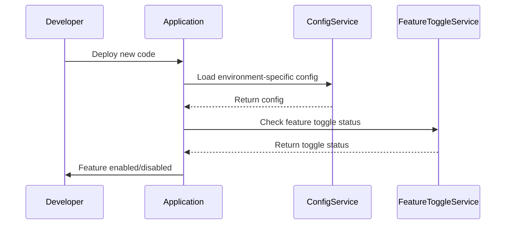

## 11.16 Feature Toggles and Configuration Management

In the dynamic world of software development, especially within microservices architecture, the ability to manage features and configurations efficiently is crucial. Feature toggles and configuration management are two powerful techniques that enable developers to control the behavior of applications without deploying new code. This section delves into the implementation of feature toggles in Scala, managing configurations across different environments, and best practices for toggling features in microservices.

### Understanding Feature Toggles

Feature toggles, also known as feature flags, are a software development technique that allows developers to enable or disable features in a system without deploying new code. This approach provides flexibility in managing features, facilitating continuous integration and deployment, A/B testing, and canary releases.

#### Key Benefits of Feature Toggles

1. **Decoupled Deployment and Release**: Feature toggles allow teams to deploy code without releasing it to users, enabling safer and more controlled rollouts.
2. **Experimentation and A/B Testing**: Teams can test different versions of a feature with real users to gather insights and make data-driven decisions.
3. **Risk Mitigation**: By toggling features on and off, teams can quickly respond to issues without rolling back deployments.
4. **Continuous Delivery**: Feature toggles support continuous delivery by allowing incomplete features to be merged into the main codebase without affecting end-users.

### Implementing Feature Toggles in Scala

Scala, with its functional programming capabilities, offers several ways to implement feature toggles. Let's explore a few approaches.

#### Simple Feature Toggle Implementation

A basic implementation of feature toggles can be achieved using configuration files. Here's an example using a Scala case class to represent the configuration:

```scala
case class FeatureToggleConfig(featureX: Boolean, featureY: Boolean)

object FeatureToggle {
  private val config = FeatureToggleConfig(featureX = true, featureY = false)

  def isFeatureXEnabled: Boolean = config.featureX
  def isFeatureYEnabled: Boolean = config.featureY
}

object Application extends App {
  if (FeatureToggle.isFeatureXEnabled) {
    println("Feature X is enabled")
  } else {
    println("Feature X is disabled")
  }
}
```

In this example, the `FeatureToggleConfig` case class holds the toggle states, and the `FeatureToggle` object provides methods to check if a feature is enabled.

#### Using a Feature Toggle Library

For more advanced use cases, consider using a library like [Unleash](https://www.getunleash.io/) or [FF4J](https://github.com/ff4j/ff4j). These libraries offer more sophisticated features such as dynamic toggles, user targeting, and analytics.

Here's an example using Unleash:

```scala
import no.finn.unleash.DefaultUnleash
import no.finn.unleash.util.UnleashConfig

object UnleashFeatureToggle {
  val unleashConfig = UnleashConfig.builder()
    .appName("my-scala-app")
    .instanceId("instance-1")
    .unleashAPI("http://unleash-api-url")
    .build()

  val unleash = new DefaultUnleash(unleashConfig)

  def isFeatureEnabled(featureName: String): Boolean = unleash.isEnabled(featureName)
}

object Application extends App {
  if (UnleashFeatureToggle.isFeatureEnabled("featureX")) {
    println("Feature X is enabled")
  } else {
    println("Feature X is disabled")
  }
}
```

This example demonstrates how to integrate Unleash into a Scala application, providing a more flexible and scalable approach to feature toggling.

### Managing Configurations Across Environments

Configuration management is critical in microservices architecture, where applications often need to run in multiple environments such as development, testing, and production. Proper configuration management ensures consistency and reliability across these environments.

#### Environment-Specific Configurations

One common approach is to use environment-specific configuration files. For instance, you might have separate configuration files for development, testing, and production environments. Here's how you can structure your project:

```
src/
  main/
    resources/
      application.conf
      application-dev.conf
      application-test.conf
      application-prod.conf
```

In Scala, you can use the [Typesafe Config](https://github.com/lightbend/config) library to manage these configurations:

```scala
import com.typesafe.config.{Config, ConfigFactory}

object ConfigManager {
  private val env = sys.env.getOrElse("APP_ENV", "dev")
  private val config: Config = ConfigFactory.load(s"application-$env.conf")

  def getConfig(key: String): String = config.getString(key)
}

object Application extends App {
  val dbUrl = ConfigManager.getConfig("db.url")
  println(s"Database URL: $dbUrl")
}
```

In this setup, the application loads the appropriate configuration file based on the `APP_ENV` environment variable.

#### Centralized Configuration Management

For larger systems, consider using a centralized configuration management system like [Consul](https://www.consul.io/) or [Spring Cloud Config](https://spring.io/projects/spring-cloud-config). These tools provide a centralized repository for configurations, making it easier to manage and update configurations across multiple services.

### Best Practices for Toggling Features in Microservices

Implementing feature toggles and configuration management effectively requires adherence to best practices to ensure maintainability and scalability.

#### Best Practices for Feature Toggles

1. **Keep Toggles Short-Lived**: Remove feature toggles as soon as they are no longer needed to avoid clutter and complexity.
2. **Document Toggles**: Maintain clear documentation for each toggle, including its purpose, expected lifespan, and owner.
3. **Use Naming Conventions**: Adopt consistent naming conventions for toggles to improve readability and maintainability.
4. **Monitor Toggle Usage**: Implement monitoring to track toggle usage and impact on the system.
5. **Test with Toggles**: Ensure that your testing strategy includes scenarios with toggles both enabled and disabled.

#### Best Practices for Configuration Management

1. **Separate Configuration from Code**: Keep configurations out of the codebase to facilitate changes without redeploying applications.
2. **Use Version Control**: Store configuration files in version control systems to track changes and maintain history.
3. **Encrypt Sensitive Data**: Protect sensitive information such as passwords and API keys using encryption.
4. **Automate Configuration Deployment**: Use automation tools to deploy configurations consistently across environments.
5. **Implement Rollback Mechanisms**: Ensure that you can quickly revert to previous configurations in case of issues.

### Visualizing Feature Toggles and Configuration Management

To better understand the flow of feature toggles and configuration management, let's visualize the process using a sequence diagram.



This diagram illustrates the interaction between different components when deploying new code with feature toggles and configuration management.

### Try It Yourself

To solidify your understanding, try modifying the code examples provided. Experiment with different configurations and feature toggle states. Consider integrating a feature toggle library into a small Scala project and observe how it affects application behavior.

### References and Links

- [Feature Toggles (Martin Fowler)](https://martinfowler.com/articles/feature-toggles.html)
- [Typesafe Config](https://github.com/lightbend/config)
- [Unleash](https://www.getunleash.io/)
- [Consul](https://www.consul.io/)

### Knowledge Check

- What are the key benefits of using feature toggles?
- How can you manage configurations across different environments in a Scala application?
- What are some best practices for implementing feature toggles in microservices?

### Embrace the Journey

Remember, mastering feature toggles and configuration management is just one step in building robust and scalable microservices. Keep experimenting, stay curious, and enjoy the journey!

## Quiz Time!



### What is a key benefit of using feature toggles?

- [x] They allow decoupling deployment from release.
- [ ] They increase code complexity.
- [ ] They make rollback processes more complicated.
- [ ] They eliminate the need for testing.

> **Explanation:** Feature toggles allow teams to deploy code without releasing it to users, enabling safer and more controlled rollouts.

### Which library can be used for managing configurations in Scala?

- [x] Typesafe Config
- [ ] Logback
- [ ] Akka
- [ ] Play Framework

> **Explanation:** Typesafe Config is a library used for managing configurations in Scala applications.

### What is a best practice for managing feature toggles?

- [x] Keep toggles short-lived.
- [ ] Use toggles for long-term feature management.
- [ ] Avoid documenting toggles.
- [ ] Implement toggles without monitoring.

> **Explanation:** Keeping toggles short-lived helps avoid clutter and complexity in the codebase.

### How can you protect sensitive configuration data?

- [x] Encrypt sensitive data.
- [ ] Store it in plain text.
- [ ] Use hard-coded values.
- [ ] Share it openly across teams.

> **Explanation:** Encrypting sensitive data such as passwords and API keys is essential for security.

### What is a common approach for environment-specific configurations?

- [x] Use separate configuration files for each environment.
- [ ] Hard-code configurations in the application.
- [ ] Use a single configuration file for all environments.
- [ ] Avoid using configuration files.

> **Explanation:** Using separate configuration files for each environment ensures that the application loads the appropriate settings.

### Which tool is not typically used for centralized configuration management?

- [ ] Consul
- [ ] Spring Cloud Config
- [ ] Unleash
- [x] GitHub

> **Explanation:** GitHub is a version control platform, not a centralized configuration management tool.

### What should you do when a feature toggle is no longer needed?

- [x] Remove it from the codebase.
- [ ] Keep it for future use.
- [ ] Disable it without removing.
- [ ] Document it for historical purposes.

> **Explanation:** Removing unnecessary toggles helps maintain a clean and manageable codebase.

### What is a benefit of using a centralized configuration management system?

- [x] It simplifies updates across multiple services.
- [ ] It increases the complexity of configuration management.
- [ ] It requires manual updates for each service.
- [ ] It eliminates the need for version control.

> **Explanation:** Centralized configuration management systems provide a single source of truth, simplifying updates across services.

### What is the purpose of a sequence diagram in the context of feature toggles?

- [x] To visualize the interaction between components.
- [ ] To show the internal logic of a feature.
- [ ] To replace configuration files.
- [ ] To automate feature deployment.

> **Explanation:** Sequence diagrams help visualize the interaction between different components in a system.

### True or False: Feature toggles can be used for A/B testing.

- [x] True
- [ ] False

> **Explanation:** Feature toggles can be used to enable different versions of a feature for A/B testing.


