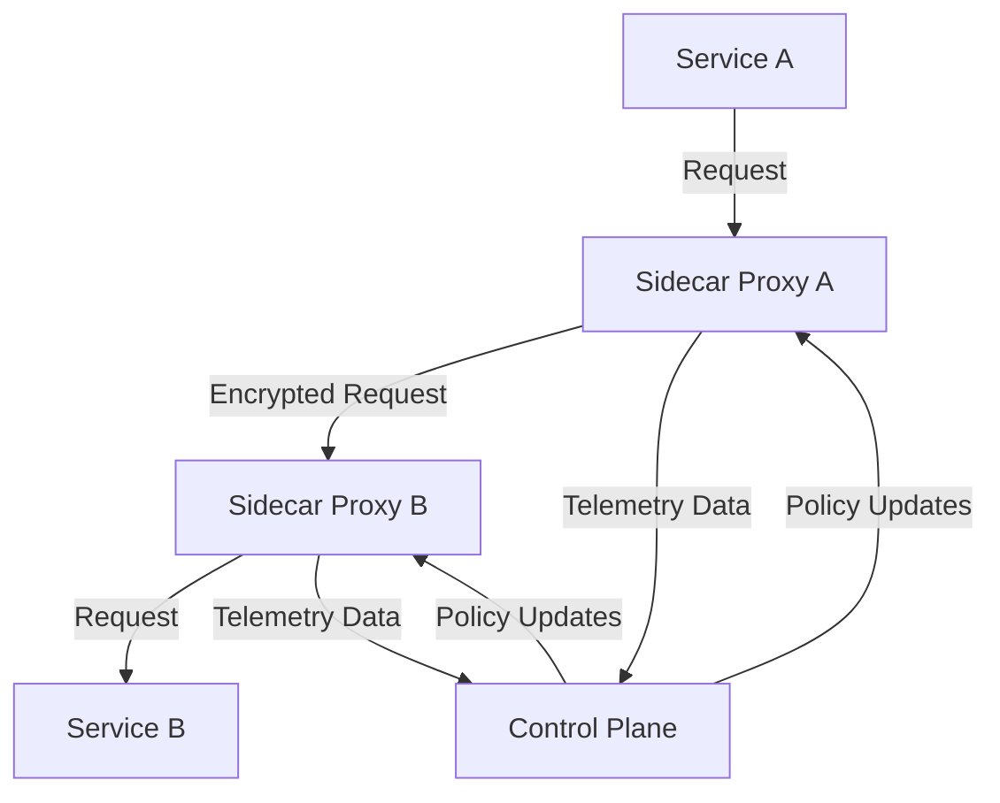

## 11.17 Service Mesh Patterns

In the realm of microservices architecture, managing the communication between services can become complex and challenging. This is where service mesh patterns come into play, offering a robust solution for handling service-to-service communication, security, and observability. In this section, we will delve into the concept of service meshes, their benefits, and how to effectively integrate them with Scala microservices to enhance security and observability.

### Understanding Service Meshes

A **service mesh** is a dedicated infrastructure layer that manages service-to-service communication within a microservices architecture. It provides a range of functionalities such as load balancing, service discovery, failure recovery, metrics, and monitoring. The service mesh abstracts the network communication logic from the application code, allowing developers to focus on business logic.

#### Key Components of a Service Mesh

1. **Data Plane**: This component handles the actual data transfer between services. It consists of lightweight proxies deployed alongside each service instance, intercepting and managing all network traffic.

2. **Control Plane**: This component manages and configures the proxies to route traffic, enforce policies, and collect telemetry data. It provides a centralized interface for managing the service mesh.

#### Benefits of Using a Service Mesh

- **Security**: Service meshes provide built-in security features such as mutual TLS for encrypting service-to-service communication, ensuring data privacy and integrity.

- **Observability**: They offer detailed telemetry data, including metrics, logs, and traces, which are crucial for monitoring and debugging microservices.

- **Traffic Management**: Service meshes enable advanced traffic management capabilities, such as retries, timeouts, and circuit breaking, improving the resilience of microservices.

- **Policy Enforcement**: They allow for the enforcement of policies such as access control and rate limiting, enhancing the security posture of microservices.

### Integrating Scala Microservices with Service Mesh Technologies

Integrating a service mesh into a Scala microservices architecture involves deploying a service mesh solution and configuring it to manage the communication between Scala services. Popular service mesh solutions include Istio, Linkerd, and Consul Connect.

#### Steps to Integrate a Service Mesh with Scala Microservices

1. **Choose a Service Mesh Solution**: Evaluate the features and compatibility of different service mesh solutions with your existing infrastructure and choose the one that best fits your needs.

2. **Deploy the Service Mesh**: Follow the deployment instructions provided by the service mesh solution to set up the control plane and data plane components in your environment.

3. **Configure Service Proxies**: Deploy sidecar proxies alongside your Scala microservices. These proxies will intercept and manage all incoming and outgoing traffic.

4. **Define Traffic Management Policies**: Use the service mesh control plane to define traffic management policies such as load balancing, retries, and circuit breaking.

5. **Implement Security Policies**: Configure mutual TLS and access control policies to secure service-to-service communication.

6. **Enable Observability Features**: Integrate the service mesh with monitoring and logging tools to collect and visualize telemetry data.

#### Code Example: Configuring a Sidecar Proxy

Below is a simplified example of how you might configure a sidecar proxy for a Scala microservice using a service mesh like Istio.

```yaml
apiVersion: v1
kind: Service
metadata:
  name: scala-microservice
spec:
  ports:
  - port: 80
    name: http
  selector:
    app: scala-microservice
---
apiVersion: apps/v1
kind: Deployment
metadata:
  name: scala-microservice
spec:
  replicas: 3
  selector:
    matchLabels:
      app: scala-microservice
  template:
    metadata:
      labels:
        app: scala-microservice
    spec:
      containers:
      - name: scala-microservice
        image: myregistry/scala-microservice:latest
        ports:
        - containerPort: 8080
      # Istio sidecar proxy
      - name: istio-proxy
        image: istio/proxyv2:latest
        args:
        - proxy
        - sidecar
        - --domain
        - $(POD_NAMESPACE).svc.cluster.local
        env:
        - name: POD_NAMESPACE
          valueFrom:
            fieldRef:
              fieldPath: metadata.namespace
```

In this example, the `istio-proxy` container is added as a sidecar to the Scala microservice deployment. It manages all network traffic for the microservice, providing the benefits of a service mesh.

### Implementing Security and Observability with a Service Mesh

#### Security Features

1. **Mutual TLS (mTLS)**: Service meshes can automatically encrypt all service-to-service communication using mutual TLS, ensuring data confidentiality and integrity.

2. **Access Control**: Define fine-grained access control policies to restrict which services can communicate with each other.

3. **Rate Limiting**: Prevent abuse and ensure fair usage of services by implementing rate limiting policies.

#### Observability Features

1. **Metrics Collection**: Service meshes collect detailed metrics about service performance and traffic patterns, which can be visualized using tools like Prometheus and Grafana.

2. **Distributed Tracing**: Trace requests as they propagate through the microservices architecture, helping to identify bottlenecks and optimize performance.

3. **Logging**: Capture logs from the service mesh proxies to gain insights into service interactions and troubleshoot issues.

#### Code Example: Enabling mTLS

Below is an example of how to enable mutual TLS in a service mesh like Istio.

```yaml
apiVersion: security.istio.io/v1beta1
kind: PeerAuthentication
metadata:
  name: default
  namespace: default
spec:
  mtls:
    mode: STRICT
```

This configuration enforces mutual TLS for all services within the `default` namespace, ensuring that all communication is encrypted.

### Visualizing Service Mesh Architecture

To better understand the architecture of a service mesh, let's visualize the components and their interactions using a Mermaid.js diagram.



**Diagram Description**: This diagram illustrates the flow of a request from Service A to Service B through their respective sidecar proxies. The proxies encrypt the request using mutual TLS and send telemetry data to the control plane, which manages policy updates.

### Design Considerations

When integrating a service mesh with Scala microservices, consider the following:

- **Performance Overhead**: The additional layer of proxies can introduce latency. Evaluate the performance impact and optimize configurations as needed.

- **Complexity**: Service meshes add complexity to the architecture. Ensure that your team is equipped to manage and troubleshoot the service mesh.

- **Compatibility**: Verify that the service mesh solution is compatible with your existing infrastructure and tools.

- **Security**: Regularly update the service mesh components to protect against vulnerabilities.

### Differences and Similarities with Other Patterns

Service mesh patterns are often compared with API gateway patterns. While both manage service communication, they serve different purposes:

- **Service Mesh**: Focuses on managing service-to-service communication within a microservices architecture, providing security, observability, and traffic management.

- **API Gateway**: Acts as a single entry point for client requests, handling tasks such as request routing, authentication, and response aggregation.

### Try It Yourself

To experiment with service mesh patterns, try deploying a simple Scala microservice with a service mesh like Istio. Modify the traffic management and security policies to observe their effects on service communication and performance.

### Knowledge Check

- Explain the role of a service mesh in a microservices architecture.
- Describe the benefits of using a service mesh.
- How do service meshes enhance security and observability?
- What are the key components of a service mesh?
- Compare and contrast service mesh patterns with API gateway patterns.

### Embrace the Journey

Remember, integrating a service mesh into your Scala microservices architecture is a journey. As you gain experience, you'll discover new ways to leverage the capabilities of service meshes to enhance your applications. Keep exploring, stay curious, and enjoy the journey!

## Quiz Time!



### What is a service mesh?

- [x] A dedicated infrastructure layer for managing service-to-service communication.
- [ ] A tool for deploying microservices.
- [ ] A database management system.
- [ ] A programming language.

> **Explanation:** A service mesh is a dedicated infrastructure layer that handles service-to-service communication within a microservices architecture.

### Which component of a service mesh handles data transfer?

- [x] Data Plane
- [ ] Control Plane
- [ ] Management Plane
- [ ] Application Layer

> **Explanation:** The data plane handles the actual data transfer between services in a service mesh.

### What is the primary security feature provided by service meshes?

- [x] Mutual TLS (mTLS)
- [ ] Firewall
- [ ] VPN
- [ ] Password Authentication

> **Explanation:** Service meshes provide mutual TLS (mTLS) to encrypt service-to-service communication, ensuring data privacy and integrity.

### Which tool can be used to visualize service mesh metrics?

- [x] Grafana
- [ ] Docker
- [ ] Jenkins
- [ ] Git

> **Explanation:** Grafana is a tool used to visualize metrics collected by service meshes.

### What is the role of the control plane in a service mesh?

- [x] It manages and configures proxies to route traffic and enforce policies.
- [ ] It handles the actual data transfer between services.
- [ ] It stores application data.
- [ ] It compiles Scala code.

> **Explanation:** The control plane manages and configures the proxies in a service mesh to route traffic and enforce policies.

### How do service meshes enhance observability?

- [x] By providing detailed telemetry data, including metrics, logs, and traces.
- [ ] By encrypting data.
- [ ] By storing logs in a database.
- [ ] By compiling code faster.

> **Explanation:** Service meshes enhance observability by providing detailed telemetry data, which includes metrics, logs, and traces.

### What is a sidecar proxy?

- [x] A lightweight proxy deployed alongside each service instance to manage network traffic.
- [ ] A mainframe computer.
- [ ] A database server.
- [ ] A programming framework.

> **Explanation:** A sidecar proxy is a lightweight proxy deployed alongside each service instance to intercept and manage network traffic.

### What is the difference between a service mesh and an API gateway?

- [x] A service mesh manages service-to-service communication, while an API gateway acts as a single entry point for client requests.
- [ ] A service mesh is a database, while an API gateway is a programming language.
- [ ] A service mesh is a programming language, while an API gateway is a database.
- [ ] There is no difference.

> **Explanation:** A service mesh manages service-to-service communication within a microservices architecture, whereas an API gateway acts as a single entry point for client requests.

### Which of the following is NOT a benefit of using a service mesh?

- [ ] Security
- [ ] Observability
- [ ] Traffic Management
- [x] Data Storage

> **Explanation:** Data storage is not a benefit provided by service meshes. They focus on managing communication, security, and observability.

### True or False: Service meshes can introduce latency due to the additional layer of proxies.

- [x] True
- [ ] False

> **Explanation:** True. The additional layer of proxies in a service mesh can introduce latency, which should be evaluated and optimized as needed.


