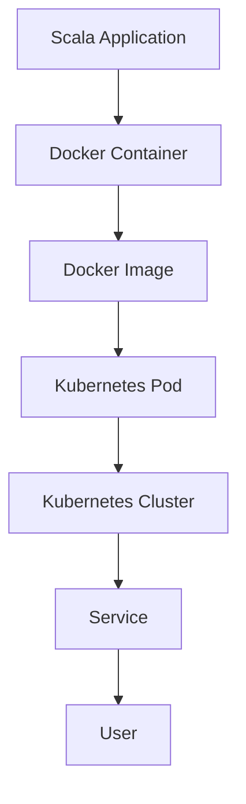

## 11.18 Containerization and Orchestration

In the modern software development landscape, containerization and orchestration have become pivotal in deploying and managing applications efficiently. This section delves into the concepts of containerization using Docker and orchestration with Kubernetes, specifically tailored for Scala applications. We will explore how these technologies can be leveraged to build scalable, maintainable, and robust systems.

### Introduction to Containerization

Containerization is a lightweight form of virtualization that encapsulates an application and its dependencies into a container. This ensures that the application runs consistently across different environments. Docker is the most popular containerization platform, providing tools to create, deploy, and manage containers.

#### Why Containerize Scala Applications?

Scala applications, like any other, benefit from containerization in several ways:

- **Consistency Across Environments**: Containers ensure that the application behaves the same way in development, testing, and production environments.
- **Isolation**: Each container runs in its own isolated environment, reducing conflicts between applications.
- **Scalability**: Containers can be easily scaled up or down to meet demand.
- **Portability**: Containers can run on any system that supports Docker, making them highly portable.

### Building Scala Applications with Docker

Docker provides a platform to build, ship, and run applications in containers. Let's explore how to containerize a Scala application using Docker.

#### Dockerfile for Scala Applications

A Dockerfile is a script that contains a series of instructions on how to build a Docker image. Below is an example Dockerfile for a simple Scala application:

```dockerfile
FROM hseeberger/scala-sbt:11.0.8_1.4.4_2.13.3

WORKDIR /app

COPY . .

RUN sbt compile

CMD ["sbt", "run"]
```

**Explanation:**

- **Base Image**: We use an official Scala image that includes Java, Scala, and SBT (Scala Build Tool).
- **Working Directory**: The `WORKDIR` instruction sets the working directory inside the container.
- **Copy Files**: The `COPY` instruction copies the project files from the host to the container.
- **Compile**: The `RUN` instruction compiles the Scala application using SBT.
- **Run**: The `CMD` instruction specifies the command to run the application.

#### Building and Running the Docker Image

To build and run the Docker image, execute the following commands in your terminal:

```bash
docker build -t scala-app .

docker run -p 8080:8080 scala-app
```

**Key Points:**

- **Build**: The `docker build` command creates a Docker image from the Dockerfile.
- **Run**: The `docker run` command starts a container from the image. The `-p` flag maps the container's port to the host's port.

### Managing Containers with Kubernetes

Kubernetes is an open-source platform designed to automate deploying, scaling, and operating application containers. It provides a robust framework for running distributed systems resiliently.

#### Key Concepts in Kubernetes

Before diving into Kubernetes, it's essential to understand some key concepts:

- **Pod**: The smallest deployable unit in Kubernetes, a pod can contain one or more containers.
- **Node**: A machine (virtual or physical) that runs pods.
- **Cluster**: A set of nodes managed by Kubernetes.
- **Service**: An abstraction that defines a logical set of pods and a policy to access them.
- **Deployment**: A controller that manages the deployment of pods.

#### Deploying Scala Applications on Kubernetes

To deploy a Scala application on Kubernetes, you need to define the application's desired state using YAML configuration files.

##### Example Deployment YAML

```yaml
apiVersion: apps/v1
kind: Deployment
metadata:
  name: scala-app-deployment
spec:
  replicas: 3
  selector:
    matchLabels:
      app: scala-app
  template:
    metadata:
      labels:
        app: scala-app
    spec:
      containers:
      - name: scala-app
        image: scala-app:latest
        ports:
        - containerPort: 8080
```

**Explanation:**

- **apiVersion**: Specifies the API version of the Kubernetes resource.
- **kind**: Defines the type of Kubernetes resource (e.g., Deployment).
- **metadata**: Contains metadata about the resource, such as its name.
- **spec**: Describes the desired state of the resource.
- **replicas**: Specifies the number of pod replicas.
- **selector**: Defines how the deployment finds the pods it manages.
- **template**: Describes the pods that will be created.

##### Applying the Deployment

To apply the deployment, use the `kubectl` command-line tool:

```bash
kubectl apply -f deployment.yaml
```

**Key Points:**

- **Apply**: The `kubectl apply` command applies the configuration to the Kubernetes cluster, creating or updating resources as needed.

### Best Practices for Containerized Scala Applications

When containerizing Scala applications, consider the following best practices to ensure optimal performance and maintainability:

#### Optimize Docker Images

- **Minimize Image Size**: Use multi-stage builds to reduce the final image size. This involves using a builder image to compile the application and a smaller runtime image to run it.
- **Use Official Images**: Start with official base images to ensure security and compatibility.
- **Leverage Caching**: Order Dockerfile instructions to maximize layer caching, reducing build times.

#### Secure Containers

- **Run as Non-Root**: Avoid running containers as the root user to minimize security risks.
- **Scan for Vulnerabilities**: Regularly scan images for vulnerabilities using tools like Clair or Trivy.
- **Limit Resource Usage**: Use Kubernetes resource limits to prevent containers from consuming excessive resources.

#### Monitor and Log

- **Centralized Logging**: Use logging solutions like ELK Stack (Elasticsearch, Logstash, Kibana) or Fluentd to aggregate logs from containers.
- **Health Checks**: Implement health checks to ensure containers are running correctly and restart them if necessary.

#### Scale and Manage Efficiently

- **Horizontal Scaling**: Use Kubernetes to scale applications horizontally by adding more pod replicas.
- **Auto-scaling**: Implement auto-scaling policies to adjust the number of replicas based on demand.
- **Rolling Updates**: Use rolling updates to deploy new versions of applications without downtime.

### Visualizing Containerization and Orchestration

To better understand the relationship between Docker and Kubernetes, let's visualize the process using a Mermaid.js diagram.



**Diagram Explanation:**

- **Scala Application**: The starting point, representing the application code.
- **Docker Container**: Encapsulates the application and its dependencies.
- **Docker Image**: A snapshot of the container used to create instances.
- **Kubernetes Pod**: The smallest deployable unit in Kubernetes, running the container.
- **Kubernetes Cluster**: A collection of nodes running pods.
- **Service**: Provides access to the pods.
- **User**: Interacts with the application through the service.

### Try It Yourself

To solidify your understanding, try modifying the Dockerfile and Kubernetes YAML files:

- **Dockerfile**: Experiment with multi-stage builds to reduce image size.
- **Kubernetes YAML**: Change the number of replicas in the deployment to see how Kubernetes scales the application.

### Knowledge Check

- **Question**: What is the primary benefit of using containers for Scala applications?
- **Question**: How does Kubernetes help in managing containerized applications?

### Conclusion

Containerization and orchestration are powerful tools for deploying and managing Scala applications. By leveraging Docker and Kubernetes, you can ensure your applications are scalable, portable, and resilient. Remember, this is just the beginning. As you progress, you'll build more complex and interactive systems. Keep experimenting, stay curious, and enjoy the journey!

## Quiz Time!



### What is the primary benefit of containerization for Scala applications?

- [x] Consistency across environments
- [ ] Increased code complexity
- [ ] Reduced application performance
- [ ] Dependency on specific hardware

> **Explanation:** Containerization ensures that applications run consistently across different environments, reducing "it works on my machine" issues.

### Which tool is commonly used for container orchestration?

- [x] Kubernetes
- [ ] Docker Compose
- [ ] Jenkins
- [ ] Ansible

> **Explanation:** Kubernetes is a popular tool for orchestrating containers, managing deployment, scaling, and operations.

### What is the smallest deployable unit in Kubernetes?

- [x] Pod
- [ ] Node
- [ ] Service
- [ ] Cluster

> **Explanation:** A Pod is the smallest deployable unit in Kubernetes, which can contain one or more containers.

### What command is used to build a Docker image?

- [x] docker build
- [ ] docker run
- [ ] docker create
- [ ] docker start

> **Explanation:** The `docker build` command is used to create a Docker image from a Dockerfile.

### What is a key advantage of using multi-stage builds in Docker?

- [x] Reducing the final image size
- [ ] Increasing build time
- [ ] Adding more dependencies
- [ ] Running multiple applications

> **Explanation:** Multi-stage builds help reduce the final image size by separating the build environment from the runtime environment.

### How can you scale a Scala application in Kubernetes?

- [x] By increasing the number of pod replicas
- [ ] By adding more nodes to the cluster
- [ ] By using larger Docker images
- [ ] By reducing the number of services

> **Explanation:** Scaling in Kubernetes is typically achieved by increasing the number of pod replicas.

### What is the purpose of a Kubernetes Service?

- [x] To provide a stable endpoint for accessing pods
- [ ] To store application logs
- [ ] To manage container images
- [ ] To define pod resource limits

> **Explanation:** A Kubernetes Service provides a stable endpoint for accessing a set of pods, abstracting their dynamic nature.

### What is a common tool for scanning Docker images for vulnerabilities?

- [x] Trivy
- [ ] Jenkins
- [ ] Git
- [ ] Maven

> **Explanation:** Trivy is a popular tool for scanning Docker images for vulnerabilities.

### What is the role of a Deployment in Kubernetes?

- [x] To manage the deployment and scaling of pods
- [ ] To store application data
- [ ] To define network policies
- [ ] To monitor application performance

> **Explanation:** A Deployment in Kubernetes manages the deployment and scaling of pods, ensuring the desired state is maintained.

### True or False: Docker containers can run on any system that supports Docker.

- [x] True
- [ ] False

> **Explanation:** Docker containers are designed to be portable and can run on any system that supports Docker, making them highly versatile.


