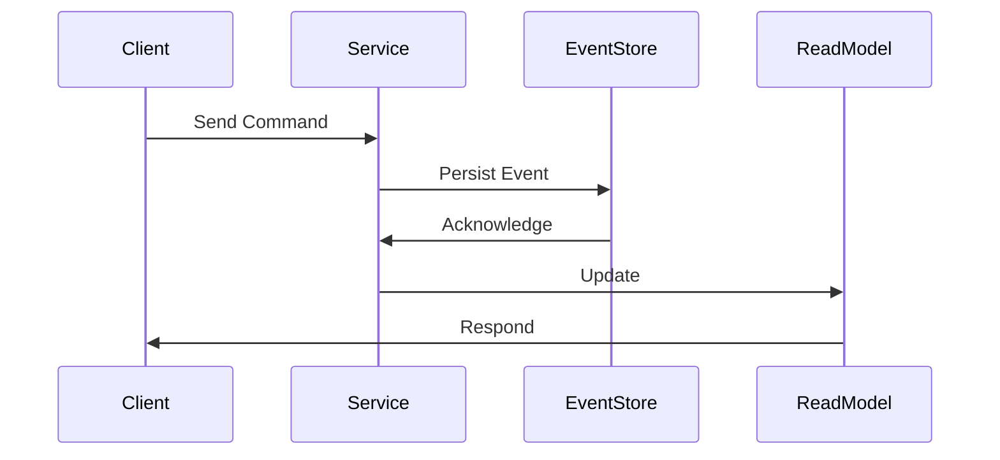

## 11.19 Event Sourcing in Microservices

Event sourcing is a powerful pattern for managing state in microservices architectures. It involves capturing all changes to an application's state as a sequence of events. This approach not only provides a reliable audit trail but also allows for rebuilding state by replaying events. In this section, we will delve into the concept of event sourcing, its benefits, and how to implement it using Akka Persistence in Scala.

### Understanding Event Sourcing

Event sourcing is a design pattern where state changes are logged as a series of events. Instead of storing the current state of an entity, you store a sequence of state-changing events. This approach has several advantages:

- **Auditability**: Every change is recorded, providing a complete history.
- **Reproducibility**: You can recreate the state of the system at any point in time by replaying events.
- **Scalability**: Events can be distributed across systems, making it easier to scale.
- **Flexibility**: New features can be added by processing existing events differently.

### Key Concepts in Event Sourcing

Before we dive into implementation, let's clarify some key concepts:

- **Event**: A record of a state change. Events are immutable and represent facts that have occurred.
- **Event Store**: A database or storage system that holds events. It acts as the source of truth for the system.
- **Command**: An action that triggers an event. Commands are requests to perform operations.
- **Aggregate**: A cluster of domain objects that can be treated as a single unit. Aggregates ensure consistency within their boundaries.

### Benefits of Event Sourcing in Microservices

Event sourcing offers several benefits, especially in microservices architectures:

- **Decoupled Services**: Services can react to events independently, promoting loose coupling.
- **Resilience**: Services can recover from failures by replaying events.
- **Data Consistency**: Eventual consistency can be achieved across distributed systems.
- **Enhanced Analytics**: Historical data can be analyzed for insights and trends.

### Implementing Event Sourcing with Akka Persistence

Akka Persistence is a powerful tool for implementing event sourcing in Scala. It provides a framework for persisting actor state as events, allowing you to build resilient, stateful applications.

#### Setting Up Akka Persistence

To get started with Akka Persistence, you need to add the necessary dependencies to your Scala project. Here's how you can do it using SBT:

```scala
libraryDependencies += "com.typesafe.akka" %% "akka-persistence" % "2.6.20"
libraryDependencies += "com.typesafe.akka" %% "akka-persistence-query" % "2.6.20"
```

#### Defining Events and Commands

In an event-sourced system, you need to define the events and commands that your application will handle. Here's an example for a simple bank account application:

```scala
// Events
sealed trait AccountEvent
case class AccountCreated(accountId: String, initialBalance: Double) extends AccountEvent
case class MoneyDeposited(accountId: String, amount: Double) extends AccountEvent
case class MoneyWithdrawn(accountId: String, amount: Double) extends AccountEvent

// Commands
sealed trait AccountCommand
case class CreateAccount(accountId: String, initialBalance: Double) extends AccountCommand
case class DepositMoney(accountId: String, amount: Double) extends AccountCommand
case class WithdrawMoney(accountId: String, amount: Double) extends AccountCommand
```

#### Creating the Persistent Actor

A persistent actor is responsible for handling commands and persisting events. Here's how you can implement a persistent actor for the bank account example:

```scala
import akka.actor.ActorLogging
import akka.persistence.{PersistentActor, SnapshotOffer}

class BankAccountActor(accountId: String) extends PersistentActor with ActorLogging {
  override def persistenceId: String = s"bank-account-$accountId"

  private var balance: Double = 0.0

  override def receiveCommand: Receive = {
    case CreateAccount(_, initialBalance) =>
      persist(AccountCreated(accountId, initialBalance)) { event =>
        updateState(event)
        log.info(s"Account $accountId created with balance $initialBalance")
      }
    case DepositMoney(_, amount) =>
      persist(MoneyDeposited(accountId, amount)) { event =>
        updateState(event)
        log.info(s"Deposited $amount to account $accountId")
      }
    case WithdrawMoney(_, amount) if balance >= amount =>
      persist(MoneyWithdrawn(accountId, amount)) { event =>
        updateState(event)
        log.info(s"Withdrew $amount from account $accountId")
      }
    case WithdrawMoney(_, amount) =>
      log.warning(s"Insufficient balance to withdraw $amount from account $accountId")
  }

  override def receiveRecover: Receive = {
    case event: AccountEvent => updateState(event)
    case SnapshotOffer(_, snapshot: Double) => balance = snapshot
  }

  private def updateState(event: AccountEvent): Unit = event match {
    case AccountCreated(_, initialBalance) => balance = initialBalance
    case MoneyDeposited(_, amount) => balance += amount
    case MoneyWithdrawn(_, amount) => balance -= amount
  }
}
```

#### Handling Snapshots

Snapshots are used to optimize recovery by storing the state at a certain point in time. Akka Persistence allows you to take snapshots periodically to speed up the recovery process:

```scala
override def receiveCommand: Receive = {
  // ... existing command handling
  case SaveSnapshotSuccess(metadata) =>
    log.info(s"Snapshot saved successfully: $metadata")
  case SaveSnapshotFailure(metadata, reason) =>
    log.error(s"Failed to save snapshot: $metadata, reason: $reason")
}
```

#### Querying Events

Akka Persistence Query provides a way to query events from the event store. This is useful for building read models or integrating with other systems:

```scala
import akka.persistence.query.PersistenceQuery
import akka.persistence.query.scaladsl.ReadJournal
import akka.stream.scaladsl.Sink

val readJournal: ReadJournal = PersistenceQuery(system).readJournalFor[ReadJournal]("akka.persistence.query.journal.leveldb")

readJournal.eventsByPersistenceId("bank-account-123", 0L, Long.MaxValue)
  .runWith(Sink.foreach(event => println(s"Event: $event")))
```

### Visualizing Event Sourcing Architecture

To better understand the flow of event sourcing in a microservices architecture, let's visualize the process using a Mermaid.js sequence diagram:



**Diagram Description**: This sequence diagram illustrates the flow of a command from the client to the service, the persistence of an event in the event store, and the subsequent update of the read model.

### Design Considerations

When implementing event sourcing, consider the following:

- **Event Versioning**: As your application evolves, the structure of events may change. Implement versioning to handle these changes gracefully.
- **Eventual Consistency**: Embrace eventual consistency in your system design. Ensure that services can handle eventual consistency gracefully.
- **Scalability**: Ensure that your event store can handle the volume of events generated by your application.
- **Security**: Protect sensitive data in events, especially if they contain personal or confidential information.

### Differences and Similarities with Other Patterns

Event sourcing is often confused with other patterns like CQRS (Command Query Responsibility Segregation). While they complement each other, they serve different purposes:

- **Event Sourcing**: Focuses on persisting state changes as events.
- **CQRS**: Separates the read and write models for better scalability and performance.

### Try It Yourself

Experiment with the provided code examples by modifying the commands and events. Try adding new features, such as transferring money between accounts, and observe how the system behaves.

### References and Further Reading

- [Akka Persistence Documentation](https://doc.akka.io/docs/akka/current/typed/persistence.html)
- [Event Sourcing on Martin Fowler's Blog](https://martinfowler.com/eaaDev/EventSourcing.html)
- [CQRS Pattern on Microsoft Docs](https://docs.microsoft.com/en-us/azure/architecture/patterns/cqrs)

### Summary

Event sourcing is a powerful pattern for managing state in microservices architectures. By capturing state changes as events, you can build scalable, resilient systems with a complete audit trail. Akka Persistence provides a robust framework for implementing event sourcing in Scala, allowing you to focus on building business logic while handling persistence and recovery seamlessly.

Remember, this is just the beginning. As you progress, you'll build more complex and interactive systems. Keep experimenting, stay curious, and enjoy the journey!

## Quiz Time!



### What is the primary purpose of event sourcing?

- [x] To capture all changes to an application's state as a sequence of events.
- [ ] To store the current state of an entity.
- [ ] To improve the performance of a system.
- [ ] To simplify the architecture of a system.

> **Explanation:** Event sourcing captures all changes to an application's state as a sequence of events, providing a complete history and enabling state reconstruction.

### Which of the following is NOT a benefit of event sourcing?

- [ ] Auditability
- [ ] Reproducibility
- [x] Immediate consistency
- [ ] Enhanced analytics

> **Explanation:** Event sourcing provides auditability, reproducibility, and enhanced analytics, but it typically involves eventual consistency rather than immediate consistency.

### What is the role of an event store in event sourcing?

- [x] It acts as the source of truth for the system by holding events.
- [ ] It executes commands in the system.
- [ ] It manages the user interface.
- [ ] It handles network communication.

> **Explanation:** The event store holds events and acts as the source of truth for the system, enabling state reconstruction and auditability.

### In the context of event sourcing, what is an aggregate?

- [x] A cluster of domain objects that can be treated as a single unit.
- [ ] A single event in the event store.
- [ ] A command that triggers an event.
- [ ] A database table storing the current state.

> **Explanation:** An aggregate is a cluster of domain objects that can be treated as a single unit, ensuring consistency within its boundaries.

### Which library is commonly used for implementing event sourcing in Scala?

- [ ] Play Framework
- [x] Akka Persistence
- [ ] Slick
- [ ] Monix

> **Explanation:** Akka Persistence is commonly used for implementing event sourcing in Scala, providing a framework for persisting actor state as events.

### What is the purpose of snapshots in Akka Persistence?

- [x] To optimize recovery by storing the state at a certain point in time.
- [ ] To execute commands faster.
- [ ] To improve network communication.
- [ ] To simplify the user interface.

> **Explanation:** Snapshots in Akka Persistence optimize recovery by storing the state at a certain point in time, reducing the need to replay all events.

### How does event sourcing enhance analytics?

- [x] By providing historical data that can be analyzed for insights and trends.
- [ ] By simplifying the architecture of the system.
- [ ] By improving the performance of the system.
- [ ] By reducing the amount of data stored.

> **Explanation:** Event sourcing enhances analytics by providing historical data that can be analyzed for insights and trends, offering a complete view of state changes.

### What is a common challenge when implementing event sourcing?

- [x] Handling eventual consistency in the system.
- [ ] Improving the performance of the system.
- [ ] Simplifying the architecture of the system.
- [ ] Reducing the amount of data stored.

> **Explanation:** A common challenge when implementing event sourcing is handling eventual consistency, as events may take time to propagate across the system.

### What is the relationship between event sourcing and CQRS?

- [x] They complement each other but serve different purposes.
- [ ] They are the same pattern.
- [ ] They are unrelated patterns.
- [ ] They conflict with each other.

> **Explanation:** Event sourcing and CQRS complement each other but serve different purposes; event sourcing focuses on persisting state changes as events, while CQRS separates read and write models.

### True or False: Event sourcing can be used to rebuild the state of a system at any point in time.

- [x] True
- [ ] False

> **Explanation:** True. Event sourcing allows for rebuilding the state of a system at any point in time by replaying the sequence of events.


