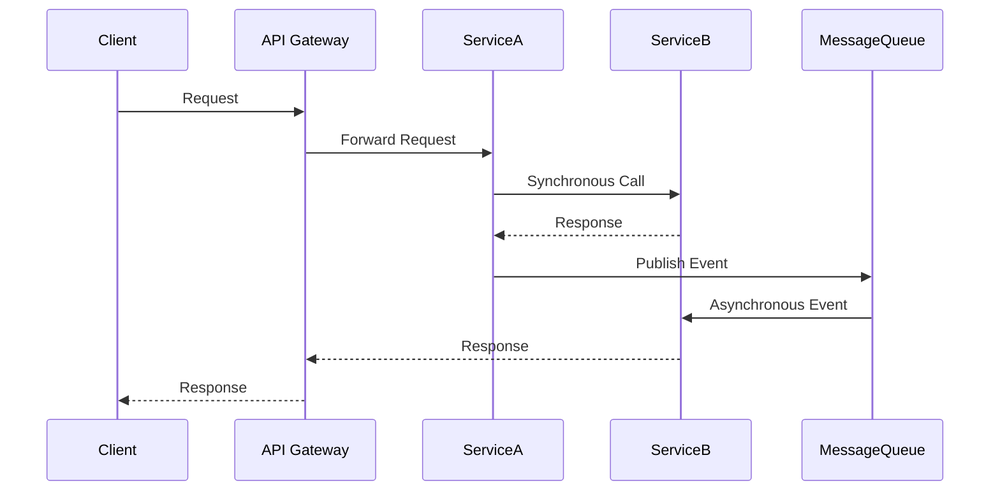

## 11.2 Challenges in Microservices Development

Microservices architecture has revolutionized the way we design and build software systems, offering numerous benefits such as scalability, flexibility, and the ability to deploy services independently. However, this architectural style also introduces a set of challenges that developers and architects must address to ensure successful implementation. In this section, we will delve into three primary challenges in microservices development: complexity, communication, and data consistency. We will explore these challenges in detail, providing insights and solutions tailored for Scala developers.

### Understanding Microservices Complexity

Microservices architecture involves decomposing a monolithic application into a set of smaller, loosely coupled services. Each service is responsible for a specific business capability and can be developed, deployed, and scaled independently. While this approach offers numerous advantages, it also introduces complexity in various aspects of software development.

#### Service Decomposition

**Challenge:** Determining the right boundaries for each service is crucial. Poorly defined boundaries can lead to tightly coupled services, defeating the purpose of microservices.

**Solution:** Use domain-driven design (DDD) principles to identify bounded contexts and define services around them. This approach helps ensure that each service encapsulates a specific business capability.

#### Dependency Management

**Challenge:** Managing dependencies between services can become complex, especially as the number of services grows.

**Solution:** Implement a service registry and discovery mechanism, such as Consul or Eureka, to manage service dependencies dynamically. This allows services to discover each other at runtime, reducing the need for hard-coded dependencies.

#### Deployment and Orchestration

**Challenge:** Deploying and orchestrating multiple services can be challenging, particularly in a distributed environment.

**Solution:** Use containerization tools like Docker and orchestration platforms like Kubernetes to automate deployment and scaling. These tools provide mechanisms for managing service lifecycles and scaling services based on demand.

#### Monitoring and Logging

**Challenge:** Monitoring and logging become more complex in a microservices architecture due to the distributed nature of services.

**Solution:** Implement centralized logging and monitoring solutions, such as ELK Stack (Elasticsearch, Logstash, Kibana) or Prometheus and Grafana. These tools help aggregate logs and metrics from multiple services, providing a unified view of the system's health.

### Communication in Microservices

Communication between services is a critical aspect of microservices architecture. Services need to interact with each other to fulfill business requirements, and this interaction can occur through various communication patterns.

#### Synchronous Communication

**Challenge:** Synchronous communication, typically using HTTP/REST or gRPC, can lead to increased latency and reduced fault tolerance.

**Solution:** Use asynchronous communication patterns, such as message queues or event streaming, to decouple services and improve resilience. Tools like Kafka or RabbitMQ can facilitate asynchronous communication.

#### Service Contracts

**Challenge:** Maintaining service contracts and ensuring backward compatibility can be difficult as services evolve.

**Solution:** Implement versioning strategies and use tools like Swagger/OpenAPI to document service contracts. This approach helps manage changes and ensures that consumers are aware of contract updates.

#### Circuit Breaker Pattern

**Challenge:** A failure in one service can cascade to other services, leading to system-wide outages.

**Solution:** Implement the Circuit Breaker pattern using libraries like Hystrix or Resilience4j. This pattern helps prevent cascading failures by temporarily halting requests to a failing service.

#### Security and Authentication

**Challenge:** Securing communication between services is essential to protect sensitive data and ensure compliance.

**Solution:** Use OAuth2 and OpenID Connect for authentication and authorization. Implement transport layer security (TLS) to encrypt communication between services.

### Data Consistency in Microservices

Data consistency is a significant challenge in microservices architecture due to the distributed nature of services. Each service typically manages its own database, leading to potential inconsistencies.

#### Eventual Consistency

**Challenge:** Ensuring data consistency across services while maintaining high availability can be difficult.

**Solution:** Adopt an eventual consistency model and use event sourcing or CQRS (Command Query Responsibility Segregation) patterns. These patterns help achieve consistency by propagating changes through events.

#### Distributed Transactions

**Challenge:** Implementing distributed transactions across services can be complex and may impact performance.

**Solution:** Use the Saga pattern to manage distributed transactions. This pattern breaks a transaction into a series of smaller, independent operations, with compensation actions to handle failures.

#### Data Synchronization

**Challenge:** Synchronizing data across services can lead to stale or inconsistent data.

**Solution:** Implement data replication and caching strategies to ensure data is up-to-date. Use tools like Redis or Hazelcast for caching and data synchronization.

### Code Example: Implementing a Circuit Breaker in Scala

Let's explore how to implement a Circuit Breaker pattern in Scala using the Resilience4j library. This pattern helps prevent cascading failures by temporarily halting requests to a failing service.

```scala
import io.github.resilience4j.circuitbreaker.{CircuitBreaker, CircuitBreakerConfig}
import io.github.resilience4j.circuitbreaker.CircuitBreakerRegistry
import scala.util.{Failure, Success, Try}

object CircuitBreakerExample {

  def main(args: Array[String]): Unit = {
    // Create a CircuitBreakerConfig with default settings
    val circuitBreakerConfig = CircuitBreakerConfig.custom()
      .failureRateThreshold(50)
      .waitDurationInOpenState(java.time.Duration.ofSeconds(60))
      .build()

    // Create a CircuitBreakerRegistry
    val circuitBreakerRegistry = CircuitBreakerRegistry.of(circuitBreakerConfig)

    // Get or create a CircuitBreaker from the registry
    val circuitBreaker = circuitBreakerRegistry.circuitBreaker("myService")

    // Decorate a function with the CircuitBreaker
    val decoratedFunction = CircuitBreaker.decorateFunction(circuitBreaker, myServiceCall)

    // Execute the decorated function
    Try(decoratedFunction()) match {
      case Success(result) => println(s"Service call succeeded with result: $result")
      case Failure(exception) => println(s"Service call failed with exception: $exception")
    }
  }

  // Simulate a service call
  def myServiceCall(): String = {
    // Simulate a failure
    if (scala.util.Random.nextBoolean()) throw new RuntimeException("Service failure")
    "Service response"
  }
}
```

In this example, we create a CircuitBreaker with a 50% failure rate threshold and a 60-second wait duration in the open state. We then decorate a service call with the CircuitBreaker and execute it, handling success and failure cases.

### Visualizing Microservices Communication

To better understand the communication patterns in microservices, let's visualize a typical architecture using Mermaid.js.



This diagram illustrates a microservices architecture where a client sends a request to an API Gateway. The gateway forwards the request to Service A, which makes a synchronous call to Service B. Service A also publishes an event to a message queue, which Service B consumes asynchronously.

### Knowledge Check

- **Question:** What is the primary benefit of using asynchronous communication in microservices?
  - **Answer:** It decouples services and improves resilience by reducing dependencies on synchronous responses.

- **Question:** How can you ensure data consistency across distributed services?
  - **Answer:** Use event sourcing and CQRS patterns to propagate changes through events.

### Try It Yourself

Experiment with the Circuit Breaker example by modifying the failure rate threshold and wait duration. Observe how these changes impact the behavior of the Circuit Breaker.

### Conclusion

Microservices architecture offers numerous benefits but also presents challenges in complexity, communication, and data consistency. By understanding these challenges and implementing appropriate solutions, Scala developers can build robust and scalable microservices systems. Remember, this is just the beginning. As you progress, you'll encounter more complex scenarios and opportunities to refine your skills. Keep experimenting, stay curious, and enjoy the journey!

## Quiz Time!



### What is a primary challenge in microservices architecture?

- [x] Service decomposition
- [ ] Monolithic design
- [ ] Single database management
- [ ] Lack of scalability

> **Explanation:** Service decomposition is a primary challenge in microservices architecture as it involves determining the right boundaries for each service.

### Which tool can be used for service discovery in microservices?

- [x] Consul
- [ ] Jenkins
- [ ] Docker
- [ ] Git

> **Explanation:** Consul is a tool used for service discovery, allowing services to find each other dynamically.

### What is the benefit of using asynchronous communication in microservices?

- [x] Decouples services and improves resilience
- [ ] Increases latency
- [ ] Reduces fault tolerance
- [ ] Requires more resources

> **Explanation:** Asynchronous communication decouples services and improves resilience by reducing dependencies on synchronous responses.

### How can you ensure data consistency across distributed services?

- [x] Use event sourcing and CQRS patterns
- [ ] Use a single database for all services
- [ ] Implement synchronous communication
- [ ] Avoid using events

> **Explanation:** Event sourcing and CQRS patterns help propagate changes through events, ensuring data consistency across distributed services.

### What is the purpose of the Circuit Breaker pattern?

- [x] Prevent cascading failures
- [ ] Increase system latency
- [ ] Reduce service dependencies
- [ ] Simplify service contracts

> **Explanation:** The Circuit Breaker pattern helps prevent cascading failures by temporarily halting requests to a failing service.

### Which library can be used to implement the Circuit Breaker pattern in Scala?

- [x] Resilience4j
- [ ] Akka
- [ ] Play Framework
- [ ] Spark

> **Explanation:** Resilience4j is a library that provides tools to implement the Circuit Breaker pattern in Scala.

### What is a challenge in securing communication between microservices?

- [x] Ensuring authentication and authorization
- [ ] Managing service dependencies
- [ ] Implementing synchronous communication
- [ ] Using a single database

> **Explanation:** Securing communication between microservices involves ensuring authentication and authorization to protect sensitive data.

### How can you manage distributed transactions in microservices?

- [x] Use the Saga pattern
- [ ] Implement a single transaction manager
- [ ] Use synchronous communication
- [ ] Avoid transactions

> **Explanation:** The Saga pattern helps manage distributed transactions by breaking them into smaller, independent operations with compensation actions.

### What is a solution for monitoring and logging in microservices?

- [x] Use centralized logging and monitoring solutions
- [ ] Implement individual logs for each service
- [ ] Avoid logging to reduce complexity
- [ ] Use only local monitoring tools

> **Explanation:** Centralized logging and monitoring solutions, such as ELK Stack or Prometheus, help aggregate logs and metrics from multiple services, providing a unified view of the system's health.

### True or False: Microservices architecture simplifies deployment and orchestration.

- [ ] True
- [x] False

> **Explanation:** Microservices architecture can complicate deployment and orchestration due to the need to manage multiple services in a distributed environment.


