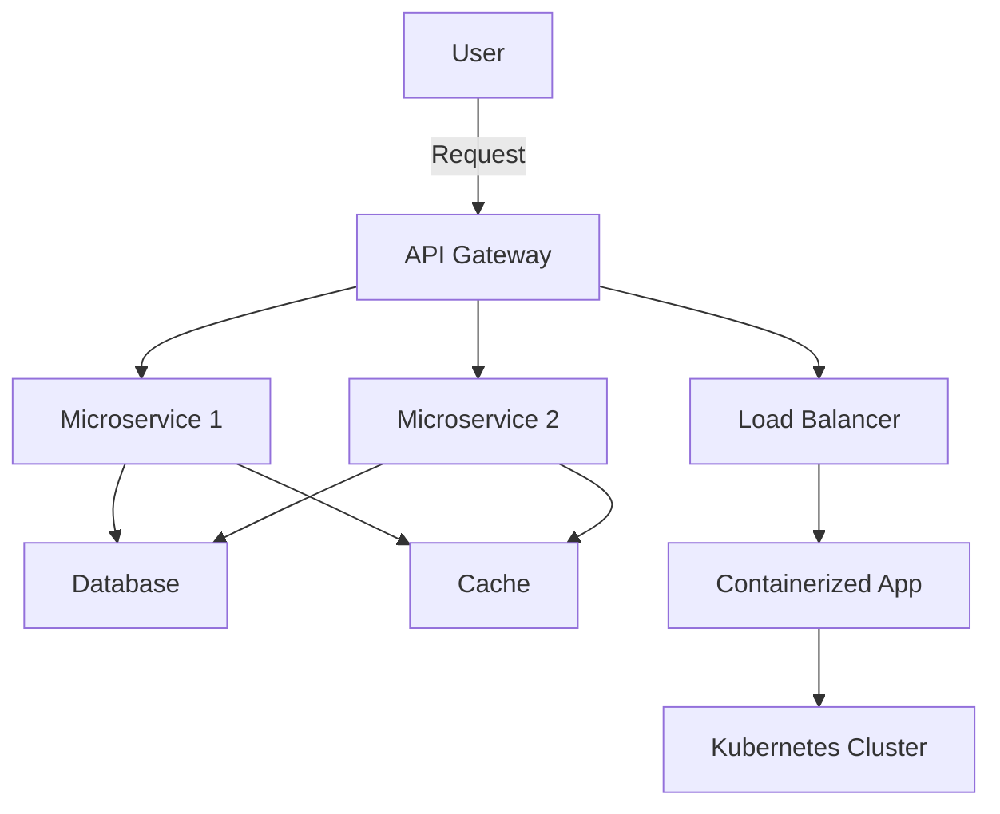
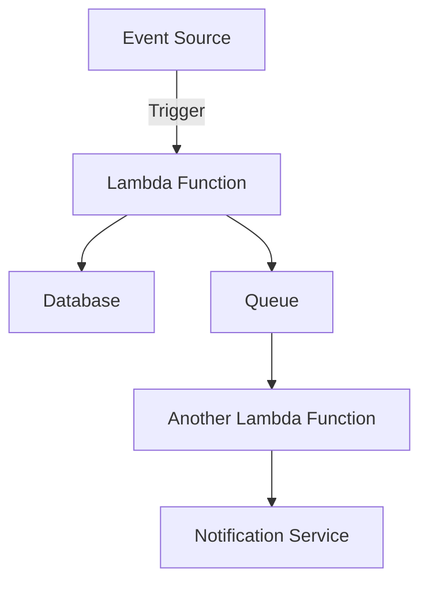

## 11.20 Cloud-Native and Serverless Patterns

In the rapidly evolving landscape of software development, cloud-native and serverless architectures have emerged as pivotal paradigms. These patterns enable developers to build scalable, resilient, and efficient applications. In this section, we will delve into the intricacies of cloud-native and serverless patterns in Scala, exploring how to leverage these modern approaches to enhance your applications. We will cover building serverless applications, containerization strategies using Docker and Kubernetes, and best practices for cloud-native Scala applications.

### Understanding Cloud-Native and Serverless Architectures

Before diving into specific patterns and practices, let's clarify what cloud-native and serverless architectures entail.

**Cloud-Native Architecture** refers to designing applications specifically for cloud environments. These applications are typically built using microservices, are containerized, and leverage continuous integration and delivery (CI/CD) pipelines. They are designed to be resilient, scalable, and manageable in dynamic cloud environments.

**Serverless Architecture**, on the other hand, abstracts away the underlying infrastructure, allowing developers to focus solely on writing code. In a serverless model, the cloud provider manages the server infrastructure, scaling, and maintenance. Functions as a Service (FaaS) is a common serverless model, where code is executed in response to events.

### Building Serverless Applications with Scala

Scala, with its strong type system and functional programming capabilities, is well-suited for building serverless applications. Let's explore how to create serverless applications using Scala.

#### Key Concepts in Serverless Computing

1. **Event-Driven Execution**: Serverless functions are triggered by events, such as HTTP requests, database changes, or message queue updates.

2. **Statelessness**: Functions are inherently stateless, meaning they do not retain data between executions. Any required state must be managed externally, such as in databases or caches.

3. **Auto-Scaling**: Serverless platforms automatically scale functions based on demand, ensuring optimal resource utilization.

4. **Pay-per-Use Pricing**: Costs are incurred only when functions are executed, making serverless a cost-effective solution for variable workloads.

#### Implementing Serverless Functions in Scala

To implement serverless functions in Scala, you can use platforms like AWS Lambda, Google Cloud Functions, or Azure Functions. Let's walk through an example using AWS Lambda.

**Example: AWS Lambda Function in Scala**

```scala
import com.amazonaws.services.lambda.runtime.{Context, RequestHandler}

// Define a case class for the input
case class Input(name: String)

// Define a case class for the output
case class Output(message: String)

// Implement the RequestHandler interface
class HelloWorldHandler extends RequestHandler[Input, Output] {
  override def handleRequest(input: Input, context: Context): Output = {
    // Log the input
    context.getLogger.log(s"Received input: ${input.name}")
    
    // Create a response
    Output(s"Hello, ${input.name}!")
  }
}
```

In this example, we define a simple AWS Lambda function that takes an `Input` object and returns an `Output` object. The function logs the input and returns a greeting message.

**Deploying the Function**

To deploy this function, you need to package it as a JAR file and upload it to AWS Lambda. You can use tools like the AWS CLI or AWS SAM (Serverless Application Model) for deployment.

#### Best Practices for Serverless Scala Applications

1. **Optimize Cold Start Times**: Minimize the size of your deployment package and reduce initialization code to improve cold start times.

2. **Use Environment Variables**: Store configuration data in environment variables to keep your code clean and flexible.

3. **Leverage Managed Services**: Use cloud provider services like managed databases, queues, and storage to handle state and persistence.

4. **Monitor and Log**: Implement robust logging and monitoring to track function performance and troubleshoot issues.

### Containerization Strategies Using Docker and Kubernetes

Containerization is a key component of cloud-native architectures. Docker and Kubernetes are the leading technologies for containerization and orchestration.

#### Docker: Containerization Made Easy

Docker allows you to package applications and their dependencies into containers, ensuring consistency across environments.

**Creating a Docker Image for a Scala Application**

```dockerfile
FROM hseeberger/scala-sbt:11.0.10_1.5.5_2.13.6

WORKDIR /app

COPY . /app

RUN sbt compile

EXPOSE 8080

CMD ["sbt", "run"]
```

This Dockerfile sets up a Scala environment, compiles the application, and runs it. You can build and run the Docker image using the following commands:

```bash
docker build -t scala-app .
docker run -p 8080:8080 scala-app
```

#### Kubernetes: Orchestrating Containers

Kubernetes automates the deployment, scaling, and management of containerized applications. It provides features like load balancing, self-healing, and rolling updates.

**Deploying a Scala Application on Kubernetes**

To deploy a Scala application on Kubernetes, you need to define a deployment and a service.

**Example: Kubernetes Deployment and Service**

```yaml
apiVersion: apps/v1
kind: Deployment
metadata:
  name: scala-app-deployment
spec:
  replicas: 3
  selector:
    matchLabels:
      app: scala-app
  template:
    metadata:
      labels:
        app: scala-app
    spec:
      containers:
      - name: scala-app
        image: scala-app:latest
        ports:
        - containerPort: 8080
---
apiVersion: v1
kind: Service
metadata:
  name: scala-app-service
spec:
  type: LoadBalancer
  selector:
    app: scala-app
  ports:
  - protocol: TCP
    port: 80
    targetPort: 8080
```

This YAML configuration defines a deployment with three replicas of the Scala application and a service to expose it to the internet.

#### Best Practices for Containerized Scala Applications

1. **Use Multi-Stage Builds**: Optimize Docker images by using multi-stage builds to reduce image size.

2. **Implement Health Checks**: Define health checks to ensure containers are running correctly and can recover from failures.

3. **Secure Your Containers**: Use tools like Docker Bench for Security to scan and secure your containers.

4. **Automate Deployments**: Use CI/CD pipelines to automate the build, test, and deployment processes.

### Best Practices for Cloud-Native Scala Applications

Building cloud-native applications involves more than just using containers and serverless functions. It requires a holistic approach to design, development, and operations.

#### Design for Resilience and Scalability

1. **Embrace Microservices**: Break down applications into smaller, independent services that can be developed, deployed, and scaled independently.

2. **Implement Circuit Breakers**: Use circuit breaker patterns to handle failures gracefully and prevent cascading failures.

3. **Design for Failure**: Assume that failures will occur and design systems to be resilient and self-healing.

#### Optimize Performance and Cost

1. **Use Auto-Scaling**: Leverage cloud provider auto-scaling features to adjust resources based on demand.

2. **Monitor Resource Usage**: Implement monitoring to track resource usage and optimize for cost efficiency.

3. **Optimize Data Storage**: Choose the right data storage solutions based on access patterns and performance requirements.

#### Enhance Security and Compliance

1. **Implement Identity and Access Management**: Use IAM policies to control access to resources and ensure least privilege.

2. **Encrypt Data**: Encrypt data at rest and in transit to protect sensitive information.

3. **Ensure Compliance**: Stay informed about compliance requirements and implement necessary controls.

### Visualizing Cloud-Native and Serverless Architectures

To better understand the architecture of cloud-native and serverless applications, let's visualize a typical setup using Mermaid.js diagrams.

#### Cloud-Native Architecture Diagram



**Description**: This diagram illustrates a cloud-native architecture with an API Gateway routing requests to microservices. The microservices interact with a database and cache, and the application is containerized and orchestrated by Kubernetes.

#### Serverless Architecture Diagram



**Description**: This diagram shows a serverless architecture where events trigger Lambda functions. The functions interact with a database, queue, and notification service, demonstrating the event-driven nature of serverless applications.

### Try It Yourself

To deepen your understanding, try modifying the code examples provided. For instance, you can:

- Add additional logic to the AWS Lambda function, such as integrating with a database or external API.
- Customize the Dockerfile to include additional dependencies or configurations.
- Experiment with different Kubernetes configurations, such as changing the number of replicas or adding resource limits.

### Knowledge Check

- What are the key characteristics of cloud-native applications?
- How does serverless architecture differ from traditional server-based architecture?
- What are the benefits of using Docker and Kubernetes for containerization?
- How can you optimize serverless functions for performance and cost?
- What are some best practices for securing cloud-native applications?

### Conclusion

Cloud-native and serverless patterns offer powerful tools for building modern applications. By leveraging Scala's capabilities and following best practices, you can create efficient, scalable, and resilient applications that thrive in the cloud. Remember, this is just the beginning. As you continue to explore these patterns, you'll discover new ways to optimize and enhance your applications. Keep experimenting, stay curious, and enjoy the journey!

## Quiz Time!



### What is a key characteristic of serverless architecture?

- [x] Event-driven execution
- [ ] Stateful functions
- [ ] Manual scaling
- [ ] Fixed pricing

> **Explanation:** Serverless architecture is characterized by event-driven execution, where functions are triggered by events.

### Which tool is commonly used for container orchestration?

- [ ] Docker
- [x] Kubernetes
- [ ] AWS Lambda
- [ ] Azure Functions

> **Explanation:** Kubernetes is a popular tool for container orchestration, managing the deployment, scaling, and operation of application containers.

### What is the primary benefit of using Docker for containerization?

- [x] Consistency across environments
- [ ] Manual scaling
- [ ] Stateful applications
- [ ] Fixed pricing

> **Explanation:** Docker provides consistency across environments by packaging applications and their dependencies into containers.

### How can you optimize serverless functions for performance?

- [x] Minimize cold start times
- [ ] Increase function size
- [ ] Use stateful functions
- [ ] Disable logging

> **Explanation:** Minimizing cold start times is crucial for optimizing serverless functions for performance.

### What is a best practice for securing cloud-native applications?

- [x] Encrypt data at rest and in transit
- [ ] Use hard-coded credentials
- [ ] Disable logging
- [ ] Allow open access to resources

> **Explanation:** Encrypting data at rest and in transit is a best practice for securing cloud-native applications.

### What is a common use case for serverless architecture?

- [x] Event-driven applications
- [ ] Stateful applications
- [ ] Manual scaling
- [ ] Fixed pricing

> **Explanation:** Serverless architecture is well-suited for event-driven applications, where functions are triggered by events.

### Which service is typically used to manage serverless functions on AWS?

- [x] AWS Lambda
- [ ] AWS EC2
- [ ] AWS S3
- [ ] AWS RDS

> **Explanation:** AWS Lambda is the service used to manage serverless functions on AWS.

### What is the role of an API Gateway in cloud-native architecture?

- [x] Routing requests to microservices
- [ ] Storing data
- [ ] Managing serverless functions
- [ ] Orchestrating containers

> **Explanation:** An API Gateway routes requests to microservices in cloud-native architecture.

### What is a benefit of using Kubernetes for container orchestration?

- [x] Automated scaling and management
- [ ] Manual deployment
- [ ] Fixed pricing
- [ ] Stateful applications

> **Explanation:** Kubernetes provides automated scaling and management of containers.

### True or False: Serverless functions are inherently stateful.

- [ ] True
- [x] False

> **Explanation:** Serverless functions are inherently stateless, meaning they do not retain data between executions.


