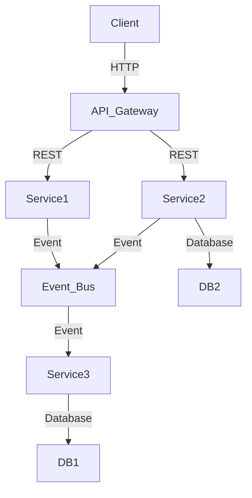

## 11.21 Best Practices for Microservices in Scala

Microservices architecture has become a dominant approach for building scalable and maintainable applications. Scala, with its strong support for functional programming and concurrent processing, is well-suited for developing microservices. In this section, we will explore best practices for building microservices in Scala, focusing on architecture, design patterns, performance optimization, and more.

### Understanding Microservices Architecture

Microservices architecture involves decomposing an application into a set of small, independent services that communicate over a network. This approach offers several benefits, including improved scalability, flexibility, and the ability to deploy services independently. However, it also introduces challenges such as increased complexity in communication and data consistency.

### Key Considerations for Microservices in Scala

#### 1. **Service Design and Decomposition**

- **Define Clear Boundaries**: Each microservice should have a well-defined boundary and responsibility. Use domain-driven design (DDD) principles to identify bounded contexts and aggregate roots.
- **Keep Services Small**: Aim for services that are small enough to be developed and maintained by a single team. This promotes agility and reduces the risk of creating monolithic services.
- **Design for Failure**: Assume that failures will occur and design services to be resilient. Implement retry mechanisms, circuit breakers, and fallback strategies to handle failures gracefully.

#### 2. **Communication Patterns**

- **Use Asynchronous Communication**: Prefer asynchronous communication using message queues or event streams to decouple services and improve scalability.
- **Implement API Gateways**: Use an API gateway to manage requests from clients and route them to the appropriate services. This provides a single entry point and can handle cross-cutting concerns like authentication and rate limiting.
- **Embrace Event-Driven Architecture**: Use event-driven patterns to enable services to react to changes in real-time. This can be achieved using tools like Kafka or Akka Streams.

#### 3. **Data Management**

- **Decentralized Data Management**: Each service should manage its own data to avoid tight coupling. Use databases that are best suited for the service's needs.
- **Implement Event Sourcing**: Capture changes to the application state as a sequence of events. This allows for easy reconstruction of state and supports auditing and traceability.
- **Ensure Data Consistency**: Use eventual consistency models and distributed transactions to manage data consistency across services.

#### 4. **Scalability and Performance**

- **Optimize for Scalability**: Design services to scale independently. Use container orchestration tools like Kubernetes to manage scaling and deployment.
- **Monitor Performance**: Implement monitoring and logging to track service performance and identify bottlenecks. Use tools like Prometheus and Grafana for observability.
- **Use Caching Strategically**: Implement caching to reduce load on services and improve response times. Use distributed caches like Redis or Memcached.

#### 5. **Security and Compliance**

- **Implement Security Best Practices**: Use OAuth2 and OpenID Connect for authentication and authorization. Secure communication between services using TLS.
- **Ensure Compliance**: Adhere to data protection regulations like GDPR. Implement data encryption and anonymization techniques to protect sensitive data.
- **Audit and Logging**: Maintain comprehensive logs for auditing and troubleshooting purposes. Use centralized logging solutions like ELK Stack.

#### 6. **Development and Deployment**

- **Adopt Continuous Integration/Continuous Deployment (CI/CD)**: Automate the build, test, and deployment processes to ensure rapid and reliable delivery of services.
- **Use Infrastructure as Code (IaC)**: Manage infrastructure using code to ensure consistency and repeatability. Tools like Terraform and Ansible can be used for this purpose.
- **Implement Feature Toggles**: Use feature toggles to control the release of new features and reduce the risk of deployment failures.

#### 7. **Testing and Quality Assurance**

- **Implement Automated Testing**: Use unit, integration, and end-to-end tests to ensure service quality. Tools like ScalaTest and Specs2 can be used for testing Scala applications.
- **Use Contract Testing**: Implement contract tests to ensure compatibility between services. This is especially important in microservices architectures where services are developed independently.
- **Conduct Load Testing**: Perform load testing to ensure services can handle expected traffic. Use tools like Gatling for load testing Scala applications.

### Code Examples and Patterns

Let's explore some code examples and design patterns that are commonly used in microservices development with Scala.

#### Circuit Breaker Pattern

The Circuit Breaker pattern is used to prevent a service from repeatedly trying to execute an operation that is likely to fail. This helps to maintain the stability of the system.

```scala
import akka.pattern.CircuitBreaker
import scala.concurrent.duration._
import scala.concurrent.Future
import akka.actor.ActorSystem
import akka.util.Timeout

implicit val system: ActorSystem = ActorSystem("MicroservicesSystem")
implicit val timeout: Timeout = Timeout(5.seconds)
implicit val ec = system.dispatcher

val breaker = new CircuitBreaker(
  system.scheduler,
  maxFailures = 5,
  callTimeout = 10.seconds,
  resetTimeout = 1.minute
)

def riskyOperation(): Future[String] = {
  // Simulate a risky operation
  Future {
    if (scala.util.Random.nextBoolean()) "Success" else throw new RuntimeException("Failure")
  }
}

breaker.withCircuitBreaker(riskyOperation()).recover {
  case _: Exception => "Fallback response"
}
```

In this example, we use Akka's `CircuitBreaker` to wrap a risky operation. If the operation fails more than five times, the circuit breaker opens, and subsequent calls are short-circuited to return a fallback response.

#### Event Sourcing with Akka Persistence

Event sourcing is a pattern where state changes are stored as a sequence of events. Akka Persistence can be used to implement event sourcing in Scala.

```scala
import akka.actor.{Actor, ActorLogging, Props}
import akka.persistence.{PersistentActor, SnapshotOffer}

case class AddItem(item: String)
case class RemoveItem(item: String)
case class GetItems()

case class ItemAdded(item: String)
case class ItemRemoved(item: String)

class ShoppingCart extends PersistentActor with ActorLogging {
  override def persistenceId: String = "shopping-cart"

  var items: List[String] = Nil

  override def receiveCommand: Receive = {
    case AddItem(item) =>
      persist(ItemAdded(item)) { event =>
        items = item :: items
        log.info(s"Item added: $item")
      }
    case RemoveItem(item) =>
      persist(ItemRemoved(item)) { event =>
        items = items.filterNot(_ == item)
        log.info(s"Item removed: $item")
      }
    case GetItems =>
      sender() ! items
  }

  override def receiveRecover: Receive = {
    case ItemAdded(item) => items = item :: items
    case ItemRemoved(item) => items = items.filterNot(_ == item)
    case SnapshotOffer(_, snapshot: List[String]) => items = snapshot
  }
}

object ShoppingCart {
  def props: Props = Props(new ShoppingCart)
}
```

In this example, we define a `ShoppingCart` actor that uses Akka Persistence to store events. The actor persists `ItemAdded` and `ItemRemoved` events, allowing the state to be reconstructed from the event log.

### Visualizing Microservices Architecture

To better understand the architecture of a microservices system, let's visualize the components and their interactions using a Mermaid.js diagram.



This diagram illustrates a typical microservices architecture with an API gateway, multiple services, an event bus for asynchronous communication, and separate databases for each service.

### Try It Yourself

To deepen your understanding, try modifying the code examples provided. For instance, you can:

- Change the `CircuitBreaker` parameters to see how they affect the behavior.
- Add more commands and events to the `ShoppingCart` actor to handle different scenarios.
- Implement a new service that listens to events from the event bus and performs actions based on those events.

### Knowledge Check

Before moving on, let's review some key concepts:

- What are the benefits of using asynchronous communication in microservices?
- How does the Circuit Breaker pattern help maintain system stability?
- Why is it important to decentralize data management in microservices?

### Conclusion

Building microservices in Scala requires careful consideration of architecture, communication patterns, data management, and more. By following the best practices outlined in this section, you can create robust, scalable, and maintainable microservices applications. Remember to continuously monitor and optimize your services to meet the evolving needs of your users.

## Quiz Time!



### What is a key benefit of using microservices architecture?

- [x] Improved scalability and flexibility
- [ ] Simplified communication
- [ ] Reduced complexity
- [ ] Centralized data management

> **Explanation:** Microservices architecture improves scalability and flexibility by allowing independent deployment and scaling of services.

### Why is it important to define clear boundaries for microservices?

- [x] To ensure each service has a well-defined responsibility
- [ ] To increase the size of each service
- [ ] To centralize data management
- [ ] To simplify communication between services

> **Explanation:** Clear boundaries help ensure that each microservice has a specific responsibility, promoting modularity and reducing coupling.

### Which communication pattern is preferred for microservices?

- [x] Asynchronous communication
- [ ] Synchronous communication
- [ ] Direct database access
- [ ] Shared memory communication

> **Explanation:** Asynchronous communication decouples services and improves scalability by using message queues or event streams.

### What is the purpose of an API gateway in microservices?

- [x] To manage requests and route them to appropriate services
- [ ] To store data for all services
- [ ] To directly connect clients to services
- [ ] To simplify service deployment

> **Explanation:** An API gateway manages client requests and routes them to the appropriate microservices, handling cross-cutting concerns.

### How does event sourcing benefit microservices?

- [x] By capturing state changes as events
- [ ] By centralizing data storage
- [ ] By simplifying service communication
- [ ] By reducing the number of services

> **Explanation:** Event sourcing captures state changes as events, allowing easy reconstruction of state and supporting auditing.

### What tool is commonly used for monitoring microservices?

- [x] Prometheus
- [ ] Redis
- [ ] Kafka
- [ ] Akka

> **Explanation:** Prometheus is a popular tool for monitoring microservices, providing metrics and alerting capabilities.

### Which pattern helps maintain system stability by preventing repeated failures?

- [x] Circuit Breaker
- [ ] Event Sourcing
- [ ] API Gateway
- [ ] Load Balancer

> **Explanation:** The Circuit Breaker pattern prevents repeated failures by opening the circuit after a certain number of failures.

### Why is decentralized data management important in microservices?

- [x] To avoid tight coupling between services
- [ ] To centralize data access
- [ ] To simplify data consistency
- [ ] To reduce the number of databases

> **Explanation:** Decentralized data management avoids tight coupling by allowing each service to manage its own data.

### What is a common tool for implementing CI/CD in microservices?

- [x] Jenkins
- [ ] Kafka
- [ ] Redis
- [ ] Akka

> **Explanation:** Jenkins is a widely used tool for implementing CI/CD pipelines, automating build, test, and deployment processes.

### True or False: Microservices should always use synchronous communication to ensure data consistency.

- [ ] True
- [x] False

> **Explanation:** False. Microservices often use asynchronous communication to decouple services and improve scalability, even if it means using eventual consistency models.



Remember, this is just the beginning. As you progress, you'll build more complex and interactive microservices. Keep experimenting, stay curious, and enjoy the journey!
