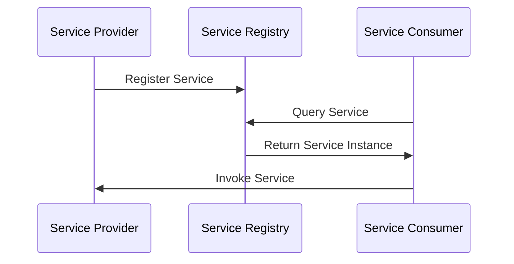

## 11.4 Service Discovery Pattern

In the world of microservices, where applications are composed of numerous small, independent services, the ability to dynamically discover service instances is crucial. This is where the Service Discovery Pattern comes into play. In this section, we will delve into the intricacies of the Service Discovery Pattern, particularly focusing on its implementation in Scala microservices using tools like Consul and etcd.

### Understanding the Service Discovery Pattern

#### Intent

The Service Discovery Pattern is designed to enable services to locate each other dynamically. In a microservices architecture, services often need to communicate with one another. However, due to the dynamic nature of microservices, where instances can be added or removed at any time, hardcoding service locations is impractical. Service discovery provides a mechanism to register and locate service instances at runtime.

#### Key Participants

- **Service Registry**: A centralized database where service instances register themselves. It maintains a list of available service instances and their locations.
- **Service Provider**: A service that registers itself with the service registry.
- **Service Consumer**: A service that queries the service registry to find the location of a service provider.
- **Service Discovery Client**: A component that facilitates communication between the service consumer and the service registry.

### Applicability

The Service Discovery Pattern is applicable in scenarios where:

- Services are distributed across multiple hosts or environments.
- Service instances are dynamic, with instances being added or removed frequently.
- There is a need for load balancing and failover mechanisms.
- Services need to communicate with each other without hardcoding endpoints.

### Implementing Service Discovery with Consul

Consul is a popular tool for service discovery and configuration. It provides a distributed, highly available service registry with built-in health checks.

#### Setting Up Consul

To implement service discovery with Consul in a Scala application, follow these steps:

1. **Install Consul**: Download and install Consul on your system. You can find installation instructions on the [Consul website](https://www.consul.io/docs/install).

2. **Start Consul Agent**: Run the Consul agent in development mode for testing purposes:

   ```bash
   consul agent -dev
   ```

3. **Register a Service**: Create a JSON configuration file to register a service with Consul. For example, create a file named `service.json`:

   ```json
   {
     "service": {
       "name": "my-scala-service",
       "tags": ["scala", "microservice"],
       "port": 8080,
       "check": {
         "http": "http://localhost:8080/health",
         "interval": "10s"
       }
     }
   }
   ```

4. **Register the Service**: Use the following command to register the service with Consul:

   ```bash
   consul services register service.json
   ```

5. **Query the Service**: Use the Consul HTTP API to query the registered service:

   ```bash
   curl http://localhost:8500/v1/catalog/service/my-scala-service
   ```

#### Integrating Consul with Scala

To integrate Consul with a Scala application, you can use libraries like `consul-client` or `consul-api`. Here's an example of how to use the `consul-client` library:

```scala
import com.orbitz.consul.Consul
import com.orbitz.consul.model.health.ServiceHealth

object ConsulServiceDiscovery {
  def main(args: Array[String]): Unit = {
    // Create a Consul client
    val client = Consul.builder().build()

    // Get the health client
    val healthClient = client.healthClient()

    // Query for healthy instances of the service
    val nodes: java.util.List[ServiceHealth] = healthClient.getHealthyServiceInstances("my-scala-service").getResponse

    // Print the service instances
    nodes.forEach { node =>
      println(s"Service ID: ${node.getService.getId}, Address: ${node.getService.getAddress}, Port: ${node.getService.getPort}")
    }
  }
}
```

#### Try It Yourself

Experiment with the code by modifying the service name or adding additional service instances. Observe how Consul updates the service registry dynamically.

### Implementing Service Discovery with etcd

etcd is another popular tool for service discovery, known for its simplicity and reliability. It provides a distributed key-value store that can be used for service registration and discovery.

#### Setting Up etcd

To implement service discovery with etcd in a Scala application, follow these steps:

1. **Install etcd**: Download and install etcd on your system. You can find installation instructions on the [etcd website](https://etcd.io/docs/v3.5/install/).

2. **Start etcd**: Run the etcd server:

   ```bash
   etcd
   ```

3. **Register a Service**: Use the etcdctl command-line tool to register a service:

   ```bash
   etcdctl put /services/my-scala-service/instance1 "http://localhost:8080"
   ```

4. **Query the Service**: Use etcdctl to query the registered service:

   ```bash
   etcdctl get /services/my-scala-service/ --prefix
   ```

#### Integrating etcd with Scala

To integrate etcd with a Scala application, you can use libraries like `etcd4s`. Here's an example of how to use the `etcd4s` library:

```scala
import com.github.ibuildthecloud.gdapi.etcd.EtcdClient

object EtcdServiceDiscovery {
  def main(args: Array[String]): Unit = {
    // Create an etcd client
    val client = new EtcdClient("http://localhost:2379")

    // Register a service
    client.put("/services/my-scala-service/instance1", "http://localhost:8080")

    // Query the service
    val response = client.get("/services/my-scala-service/instance1")
    println(s"Service URL: ${response.getNode.getValue}")
  }
}
```

#### Try It Yourself

Modify the code to register multiple service instances or change the service URL. Observe how etcd manages the service registry.

### Design Considerations

When implementing the Service Discovery Pattern, consider the following:

- **Consistency and Availability**: Choose a service registry that balances consistency and availability based on your application's needs.
- **Health Checks**: Ensure that services are healthy before they are registered. Use health checks to remove unhealthy instances from the registry.
- **Scalability**: Ensure that the service registry can handle the scale of your application.
- **Security**: Protect the service registry with authentication and encryption to prevent unauthorized access.

### Differences and Similarities

The Service Discovery Pattern is often confused with load balancing. While both are used to distribute requests among service instances, service discovery focuses on locating service instances, whereas load balancing focuses on distributing requests.

### Visualizing Service Discovery

Below is a diagram illustrating the Service Discovery Pattern:



### Knowledge Check

- **What is the primary purpose of the Service Discovery Pattern?**
- **How does Consul facilitate service discovery in Scala applications?**
- **What are the key differences between Consul and etcd in terms of service discovery?**

### Conclusion

The Service Discovery Pattern is a fundamental component of microservices architecture, enabling dynamic service instance discovery and communication. By leveraging tools like Consul and etcd, Scala developers can implement robust service discovery mechanisms that enhance the scalability and resilience of their applications. Remember, this is just the beginning. As you progress, you'll build more complex and interactive systems. Keep experimenting, stay curious, and enjoy the journey!

## Quiz Time!



### What is the primary purpose of the Service Discovery Pattern?

- [x] To enable services to locate each other dynamically
- [ ] To balance load among service instances
- [ ] To secure communication between services
- [ ] To manage service configurations

> **Explanation:** The Service Discovery Pattern allows services to find each other dynamically, which is crucial in a microservices architecture where instances can change frequently.

### Which tool is known for providing a distributed, highly available service registry with built-in health checks?

- [x] Consul
- [ ] etcd
- [ ] Zookeeper
- [ ] Kubernetes

> **Explanation:** Consul is known for its distributed service registry and built-in health checks, making it a popular choice for service discovery.

### How can you register a service with Consul?

- [x] By creating a JSON configuration file and using the `consul services register` command
- [ ] By directly modifying the Consul database
- [ ] By using the etcdctl command-line tool
- [ ] By writing a custom Scala script

> **Explanation:** Services can be registered with Consul by creating a JSON configuration file and using the `consul services register` command.

### What is a key feature of etcd in the context of service discovery?

- [x] It provides a distributed key-value store
- [ ] It offers built-in load balancing
- [ ] It automatically scales service instances
- [ ] It integrates with Scala by default

> **Explanation:** etcd provides a distributed key-value store, which can be used for service registration and discovery.

### In the Service Discovery Pattern, what role does the Service Registry play?

- [x] It maintains a list of available service instances and their locations
- [ ] It balances requests among service instances
- [ ] It encrypts communication between services
- [ ] It manages service configurations

> **Explanation:** The Service Registry maintains a list of available service instances and their locations, allowing services to find each other.

### Which library can be used to integrate etcd with a Scala application?

- [x] etcd4s
- [ ] consul-client
- [ ] akka-http
- [ ] play-json

> **Explanation:** The `etcd4s` library can be used to integrate etcd with a Scala application for service discovery.

### What is a key consideration when implementing the Service Discovery Pattern?

- [x] Ensuring that services are healthy before they are registered
- [ ] Hardcoding service endpoints
- [ ] Disabling health checks
- [ ] Using a single service instance

> **Explanation:** Ensuring that services are healthy before they are registered is crucial to maintaining a reliable service discovery mechanism.

### How does the Service Discovery Pattern differ from load balancing?

- [x] Service discovery focuses on locating service instances, while load balancing focuses on distributing requests
- [ ] Service discovery balances requests, while load balancing locates instances
- [ ] Both patterns serve the same purpose
- [ ] Load balancing is a subset of service discovery

> **Explanation:** Service discovery focuses on locating service instances, whereas load balancing focuses on distributing requests among them.

### Which command is used to query a registered service in etcd?

- [x] etcdctl get /services/my-scala-service/ --prefix
- [ ] consul services query my-scala-service
- [ ] etcdctl query /services/my-scala-service/
- [ ] consul query service my-scala-service

> **Explanation:** The `etcdctl get /services/my-scala-service/ --prefix` command is used to query a registered service in etcd.

### True or False: The Service Discovery Pattern is only applicable in microservices architectures.

- [x] True
- [ ] False

> **Explanation:** The Service Discovery Pattern is primarily used in microservices architectures due to the dynamic nature of service instances in such environments.


