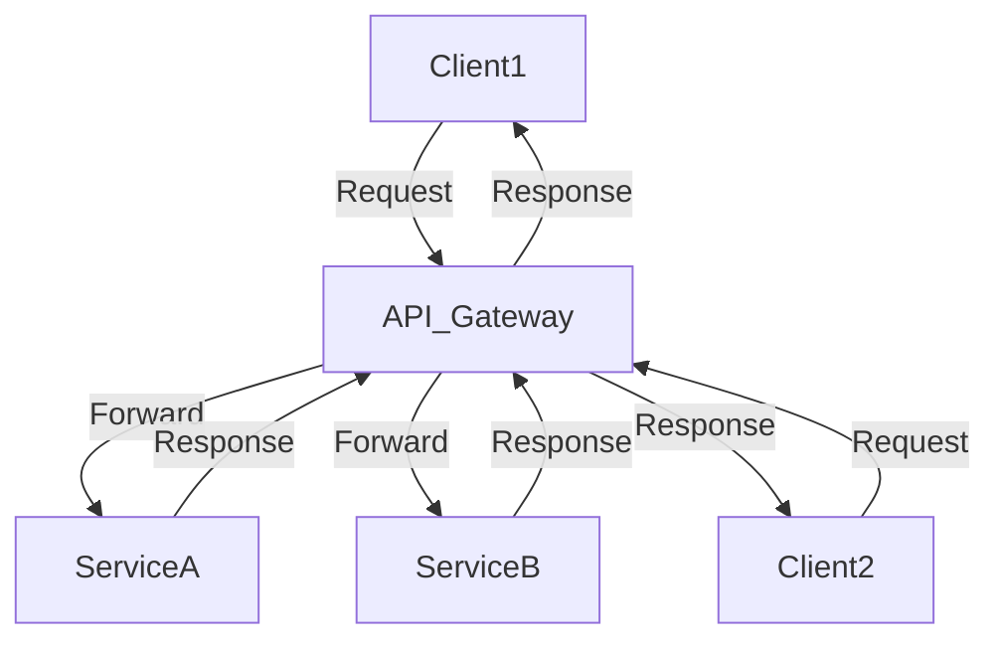

## 11.5 API Gateway Pattern

In the realm of microservices architecture, the API Gateway Pattern emerges as a crucial design pattern that facilitates the consolidation of multiple service APIs into a single entry point. This pattern is particularly beneficial in managing the complexity of microservices, enhancing security, and improving client-side performance. In this guide, we will delve into the intricacies of the API Gateway Pattern, explore its implementation using Scala's Play Framework and Akka HTTP, and provide comprehensive insights for expert software engineers and architects.

### Design Pattern Name

**API Gateway Pattern**

### Category

Microservices Design Patterns

### Intent

The primary intent of the API Gateway Pattern is to provide a unified entry point for clients to interact with a system composed of multiple microservices. This pattern abstracts the complexities of service interactions, offers a centralized point for cross-cutting concerns such as authentication, logging, and rate limiting, and enhances the overall system's scalability and maintainability.

### Key Participants

1. **API Gateway**: Acts as the single entry point for client requests, routing them to the appropriate microservices.
2. **Microservices**: Individual services that provide specific functionalities and interact with the API Gateway.
3. **Clients**: Consumers of the API Gateway, which could be web applications, mobile apps, or other services.

### Applicability

The API Gateway Pattern is applicable in scenarios where:

- There is a need to decouple client applications from the microservices architecture.
- Cross-cutting concerns such as authentication, logging, and rate limiting need to be managed centrally.
- The system requires a single point of entry to simplify client interactions.
- There is a need to transform or aggregate responses from multiple services.

### Sample Code Snippet

Let's explore a basic implementation of an API Gateway using Scala's Play Framework. This example demonstrates how to route requests to different microservices based on the URL path.

```scala
import play.api.mvc._
import play.api.routing.Router
import play.api.routing.sird._

class ApiGatewayController @Inject()(cc: ControllerComponents) extends AbstractController(cc) {

  def routeRequest(path: String): Action[AnyContent] = Action.async { request =>
    path match {
      case "serviceA" => forwardToServiceA(request)
      case "serviceB" => forwardToServiceB(request)
      case _ => Future.successful(NotFound("Service not found"))
    }
  }

  private def forwardToServiceA(request: Request[AnyContent]): Future[Result] = {
    // Logic to forward the request to Service A
  }

  private def forwardToServiceB(request: Request[AnyContent]): Future[Result] = {
    // Logic to forward the request to Service B
  }
}

object ApiGatewayRouter extends Router {
  def routes: Router.Routes = {
    case GET(p"/api/$path*") => apiGatewayController.routeRequest(path)
  }
}
```

### Design Considerations

When implementing the API Gateway Pattern, consider the following:

- **Scalability**: Ensure the API Gateway can handle a large number of concurrent requests. Consider using load balancing and horizontal scaling.
- **Security**: Implement robust authentication and authorization mechanisms to protect the gateway and underlying services.
- **Performance**: Minimize latency by optimizing request routing and response aggregation.
- **Fault Tolerance**: Implement retry mechanisms and circuit breakers to handle service failures gracefully.

### Differences and Similarities

The API Gateway Pattern is often compared with the **Backend for Frontend (BFF) Pattern**. While both patterns provide a single entry point for clients, the BFF Pattern is tailored for specific client needs, whereas the API Gateway Pattern serves as a general-purpose entry point for all clients.

### Building an API Gateway with Play Framework

The Play Framework is a powerful tool for building web applications in Scala. It provides a robust foundation for implementing an API Gateway, thanks to its asynchronous I/O capabilities and flexible routing system.

#### Setting Up a Play Framework Project

To get started with Play Framework, first ensure you have [sbt](https://www.scala-sbt.org/) installed. Create a new Play project using the following command:

```bash
sbt new playframework/play-scala-seed.g8
```

This command will scaffold a new Play project. Navigate to the project directory and open the `build.sbt` file to configure dependencies.

#### Implementing the API Gateway Logic

In a Play Framework application, you can define routes in the `conf/routes` file. Here's an example of how to set up routes for an API Gateway:

```
GET     /api/serviceA          controllers.ApiGatewayController.routeRequest("serviceA")
GET     /api/serviceB          controllers.ApiGatewayController.routeRequest("serviceB")
```

In the `ApiGatewayController`, implement the logic to forward requests to the appropriate microservices. Use Play's `WSClient` to make HTTP requests to the services.

```scala
import play.api.libs.ws._
import play.api.mvc._

class ApiGatewayController @Inject()(ws: WSClient, cc: ControllerComponents) extends AbstractController(cc) {

  def routeRequest(service: String): Action[AnyContent] = Action.async { request =>
    val serviceUrl = service match {
      case "serviceA" => "http://localhost:9001"
      case "serviceB" => "http://localhost:9002"
      case _ => return Future.successful(NotFound("Service not found"))
    }

    ws.url(serviceUrl + request.uri).get().map { response =>
      Ok(response.body).as(response.contentType)
    }
  }
}
```

### Building an API Gateway with Akka HTTP

Akka HTTP is another excellent choice for building an API Gateway in Scala. It provides a low-level, high-performance HTTP server and client, making it ideal for handling large volumes of requests.

#### Setting Up an Akka HTTP Project

To create an Akka HTTP project, add the following dependencies to your `build.sbt` file:

```scala
libraryDependencies ++= Seq(
  "com.typesafe.akka" %% "akka-http" % "10.2.7",
  "com.typesafe.akka" %% "akka-stream" % "2.6.18"
)
```

#### Implementing the API Gateway Logic

In Akka HTTP, you define routes using the `Route` DSL. Here's an example of how to set up an API Gateway:

```scala
import akka.actor.ActorSystem
import akka.http.scaladsl.Http
import akka.http.scaladsl.model._
import akka.http.scaladsl.server.Directives._
import akka.stream.ActorMaterializer

import scala.concurrent.Future

object ApiGateway extends App {
  implicit val system = ActorSystem("api-gateway")
  implicit val materializer = ActorMaterializer()
  implicit val executionContext = system.dispatcher

  val route =
    pathPrefix("api") {
      path("serviceA") {
        complete(forwardToService("http://localhost:9001"))
      } ~
      path("serviceB") {
        complete(forwardToService("http://localhost:9002"))
      }
    }

  def forwardToService(serviceUrl: String): Future[HttpResponse] = {
    Http().singleRequest(HttpRequest(uri = serviceUrl))
  }

  Http().bindAndHandle(route, "localhost", 8080)
}
```

### Visualizing the API Gateway Architecture

To better understand the API Gateway Pattern, let's visualize the architecture using a Mermaid.js diagram:



**Diagram Description**: The diagram illustrates how multiple clients interact with the API Gateway, which routes requests to the appropriate microservices and returns responses to the clients.

### Design Considerations for API Gateways

When designing an API Gateway, consider the following aspects:

- **Routing Logic**: Implement efficient routing logic to direct requests to the correct services.
- **Security**: Use HTTPS, OAuth2, and other security measures to protect the gateway.
- **Caching**: Implement caching strategies to reduce load on backend services.
- **Monitoring and Logging**: Use tools like Prometheus and Grafana to monitor gateway performance and log requests for auditing.

### Differences and Similarities with Other Patterns

The API Gateway Pattern shares similarities with the **Facade Pattern** in that both provide a simplified interface to a complex system. However, the API Gateway Pattern is specifically designed for microservices architectures, whereas the Facade Pattern is more general-purpose.

### Try It Yourself

To gain hands-on experience with the API Gateway Pattern, try modifying the code examples provided:

- **Add a New Service**: Extend the API Gateway to route requests to a new microservice.
- **Implement Authentication**: Add authentication logic to the API Gateway to secure access to services.
- **Optimize Performance**: Implement caching and load balancing to improve the gateway's performance.

### Knowledge Check

Before we conclude, let's reinforce what we've learned:

- What is the primary purpose of the API Gateway Pattern?
- How does the API Gateway Pattern differ from the Backend for Frontend Pattern?
- What are some key considerations when designing an API Gateway?

### Embrace the Journey

Remember, mastering the API Gateway Pattern is just one step in your journey as a software architect. As you continue to explore design patterns and architectures, you'll gain a deeper understanding of how to build scalable, maintainable, and secure systems. Keep experimenting, stay curious, and enjoy the journey!

### Conclusion

The API Gateway Pattern is an essential component of modern microservices architectures. By consolidating multiple service APIs into a single entry point, it simplifies client interactions, centralizes cross-cutting concerns, and enhances the overall system's scalability and maintainability. Whether you choose to implement it using Play Framework or Akka HTTP, the API Gateway Pattern offers a robust solution for managing the complexities of microservices.

## Quiz Time!



### What is the primary purpose of the API Gateway Pattern?

- [x] To provide a unified entry point for clients to interact with a system composed of multiple microservices.
- [ ] To replace all microservices with a single monolithic application.
- [ ] To eliminate the need for authentication and authorization in microservices.
- [ ] To directly connect clients to each microservice without any intermediary.

> **Explanation:** The API Gateway Pattern provides a single entry point for clients, simplifying interactions with multiple microservices.

### Which Scala framework is NOT mentioned for implementing an API Gateway?

- [ ] Play Framework
- [ ] Akka HTTP
- [x] Spring Boot
- [ ] Akka Streams

> **Explanation:** Spring Boot is not mentioned as it is primarily a Java framework, while Play Framework and Akka HTTP are Scala-based.

### What is a key benefit of using an API Gateway?

- [x] Centralized management of cross-cutting concerns like authentication and logging.
- [ ] Direct access to database tables for clients.
- [ ] Elimination of network latency.
- [ ] Automatic scaling of microservices.

> **Explanation:** The API Gateway centralizes cross-cutting concerns, making it easier to manage them.

### How does the API Gateway Pattern differ from the Backend for Frontend Pattern?

- [x] The API Gateway serves as a general-purpose entry point, while the BFF is tailored for specific client needs.
- [ ] The API Gateway is only used for mobile applications.
- [ ] The BFF Pattern eliminates the need for an API Gateway.
- [ ] The API Gateway Pattern is used only in monolithic architectures.

> **Explanation:** The API Gateway is general-purpose, whereas the BFF is designed for specific client requirements.

### Which of the following is NOT a design consideration for an API Gateway?

- [ ] Scalability
- [ ] Security
- [ ] Caching
- [x] Direct database access

> **Explanation:** Direct database access is not a typical consideration for an API Gateway, which focuses on routing and managing requests.

### What tool can be used for monitoring API Gateway performance?

- [x] Prometheus
- [ ] Microsoft Word
- [ ] Adobe Photoshop
- [ ] Google Docs

> **Explanation:** Prometheus is a monitoring tool that can be used to track the performance of an API Gateway.

### What is a common similarity between the API Gateway Pattern and the Facade Pattern?

- [x] Both provide a simplified interface to a complex system.
- [ ] Both are used exclusively for database management.
- [ ] Both eliminate the need for security measures.
- [ ] Both are only applicable in monolithic architectures.

> **Explanation:** Both patterns aim to simplify the interface to a complex system, though they are used in different contexts.

### What is a potential pitfall when implementing an API Gateway?

- [x] Introducing a single point of failure if not designed with redundancy.
- [ ] Eliminating the need for microservices.
- [ ] Automatically resolving all network issues.
- [ ] Replacing all backend services with the gateway.

> **Explanation:** An API Gateway can become a single point of failure if not properly designed with redundancy and fault tolerance.

### What is a key feature of Akka HTTP that makes it suitable for an API Gateway?

- [x] High-performance HTTP server and client capabilities.
- [ ] Built-in database management.
- [ ] Automatic UI generation.
- [ ] Direct integration with Microsoft Excel.

> **Explanation:** Akka HTTP's high-performance server and client capabilities make it suitable for handling large volumes of requests.

### True or False: The API Gateway Pattern can help improve client-side performance by reducing the number of requests needed.

- [x] True
- [ ] False

> **Explanation:** By aggregating responses from multiple services, the API Gateway can reduce the number of requests a client needs to make, thus improving performance.


