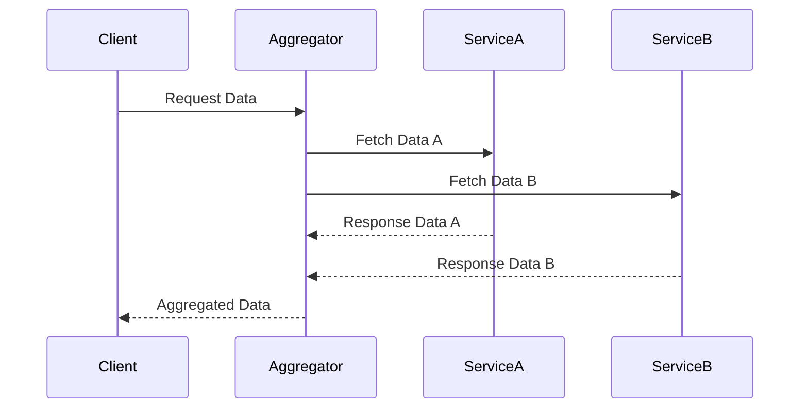

## 11.6 API Composition and Aggregators

In the world of microservices, where applications are broken down into smaller, independent services, the need for efficient API composition and aggregation becomes crucial. This section delves into strategies for composing APIs, implementing composite services in Scala, and best practices along with potential challenges.

### Understanding API Composition and Aggregators

API composition refers to the process of combining multiple API calls into a single, cohesive response. This is particularly important in microservices architectures, where a single user request might require data from multiple services. Aggregators are components or services that handle this composition, acting as intermediaries that gather data from various sources and present it in a unified format.

#### Key Concepts

1. **Microservices Architecture**: A style of architecture that structures an application as a collection of loosely coupled services, each implementing a business capability.

2. **API Gateway**: A server that acts as an API front-end, receiving API requests, enforcing throttling and security policies, passing requests to the back-end service, and then returning the response.

3. **Aggregator Pattern**: A design pattern used to aggregate data from different microservices and return a consolidated response to the client.

### Strategies for API Composition

API composition can be approached in several ways, depending on the complexity and requirements of the system. Here are some common strategies:

#### 1. **Client-Side Composition**

In client-side composition, the client is responsible for making multiple API calls and aggregating the data. This approach is simple and offloads the composition logic to the client, but it can lead to increased latency and complexity on the client side.

**Advantages**:
- Simplicity: The server-side logic remains simple.
- Flexibility: Clients can customize data aggregation.

**Disadvantages**:
- Increased Latency: Multiple network calls can increase response time.
- Complexity: Clients need to handle data aggregation logic.

#### 2. **Server-Side Composition**

In server-side composition, a dedicated service (often called an aggregator service) is responsible for making multiple API calls to other services and aggregating the results. This approach centralizes the composition logic and reduces the burden on the client.

**Advantages**:
- Reduced Latency: Aggregation happens on the server, reducing the number of client-server round trips.
- Centralized Logic: Easier to manage and update aggregation logic.

**Disadvantages**:
- Increased Server Load: The server handles additional processing.
- Potential Bottlenecks: The aggregator service can become a single point of failure.

#### 3. **API Gateway Composition**

An API Gateway can also perform API composition by aggregating responses from multiple services. This approach leverages the existing gateway infrastructure to handle composition, providing a centralized point for managing API requests.

**Advantages**:
- Centralized Management: The gateway can handle routing, security, and composition.
- Simplified Client Logic: Clients interact with a single endpoint.

**Disadvantages**:
- Complexity: The gateway logic can become complex.
- Performance: The gateway can become a bottleneck if not properly managed.

### Implementing Composite Services in Scala

Scala, with its functional programming capabilities and strong type system, provides an excellent platform for implementing composite services. Let's explore how to implement these services effectively.

#### Using Akka HTTP for API Composition

Akka HTTP is a powerful toolkit for building HTTP-based services in Scala. It provides a flexible routing DSL and supports asynchronous processing, making it ideal for API composition.

**Example**: Implementing a simple aggregator service using Akka HTTP.

```scala
import akka.actor.ActorSystem
import akka.http.scaladsl.Http
import akka.http.scaladsl.model._
import akka.http.scaladsl.server.Directives._
import akka.stream.ActorMaterializer
import scala.concurrent.Future
import scala.util.{Failure, Success}

object AggregatorService extends App {
  implicit val system = ActorSystem("aggregator-system")
  implicit val materializer = ActorMaterializer()
  import system.dispatcher

  // Simulated service calls
  def serviceA: Future[String] = Future.successful("Data from Service A")
  def serviceB: Future[String] = Future.successful("Data from Service B")

  val route =
    path("aggregate") {
      get {
        val aggregatedData = for {
          a <- serviceA
          b <- serviceB
        } yield s"Aggregated Data: $a, $b"

        onComplete(aggregatedData) {
          case Success(data) => complete(HttpEntity(ContentTypes.`text/plain(UTF-8)`, data))
          case Failure(ex)   => complete(StatusCodes.InternalServerError, s"An error occurred: ${ex.getMessage}")
        }
      }
    }

  Http().bindAndHandle(route, "localhost", 8080)
}
```

**Explanation**:
- We define two simulated service calls, `serviceA` and `serviceB`, that return data asynchronously.
- The `route` handles GET requests to the `/aggregate` endpoint, composing data from both services.
- The `for` comprehension is used to aggregate data from both services.
- The `onComplete` directive handles the future result, responding with the aggregated data or an error message.

#### Leveraging Futures for Asynchronous Composition

Scala's `Future` provides a powerful abstraction for handling asynchronous computations, which is essential for API composition.

**Example**: Composing multiple API calls using `Future`.

```scala
import scala.concurrent.ExecutionContext.Implicits.global
import scala.concurrent.Future

def fetchDataFromServiceA: Future[String] = Future {
  // Simulate a network call
  Thread.sleep(1000)
  "Data from Service A"
}

def fetchDataFromServiceB: Future[String] = Future {
  // Simulate a network call
  Thread.sleep(1000)
  "Data from Service B"
}

val composedData: Future[String] = for {
  dataA <- fetchDataFromServiceA
  dataB <- fetchDataFromServiceB
} yield s"Composed Data: $dataA, $dataB"

composedData.onComplete {
  case Success(data) => println(s"Received: $data")
  case Failure(ex)   => println(s"Failed with exception: ${ex.getMessage}")
}
```

**Explanation**:
- We define two asynchronous functions, `fetchDataFromServiceA` and `fetchDataFromServiceB`, simulating network calls.
- The `for` comprehension is used to compose data from both services.
- The `onComplete` method processes the result, printing the composed data or an error message.

### Best Practices for API Composition

Implementing API composition effectively requires careful consideration of several factors. Here are some best practices to follow:

#### 1. **Optimize for Performance**

- **Minimize Network Calls**: Reduce the number of API calls by aggregating data efficiently.
- **Use Asynchronous Processing**: Leverage Scala's `Future` or `Akka Streams` for non-blocking operations.
- **Cache Responses**: Implement caching strategies to reduce repeated calls to the same services.

#### 2. **Ensure Fault Tolerance**

- **Handle Failures Gracefully**: Use fallback mechanisms to provide default responses in case of failures.
- **Implement Circuit Breakers**: Protect services from cascading failures using patterns like circuit breakers.

#### 3. **Maintain Scalability**

- **Distribute Load**: Use load balancers to distribute requests across multiple instances of the aggregator service.
- **Monitor Performance**: Continuously monitor and optimize the performance of the aggregator service.

#### 4. **Design for Flexibility**

- **Use Configurable Endpoints**: Allow endpoints to be configured dynamically to adapt to changing requirements.
- **Support Versioning**: Implement API versioning to manage changes and backward compatibility.

### Potential Challenges in API Composition

While API composition offers numerous benefits, it also presents certain challenges that need to be addressed:

#### 1. **Increased Complexity**

- **Complex Logic**: Aggregating data from multiple sources can lead to complex logic that is difficult to maintain.
- **Data Transformation**: Different services may return data in various formats, requiring transformation and normalization.

#### 2. **Latency and Performance**

- **Network Latency**: Multiple API calls can increase latency, affecting the overall response time.
- **Bottlenecks**: The aggregator service can become a bottleneck if not properly optimized.

#### 3. **Error Handling**

- **Partial Failures**: Handling partial failures, where some services succeed while others fail, can be challenging.
- **Consistency**: Ensuring data consistency across multiple services requires careful design.

### Visualizing API Composition

To better understand the flow of data in API composition, let's visualize the process using a sequence diagram.



**Diagram Explanation**:
- The client sends a request to the aggregator service.
- The aggregator makes parallel requests to Service A and Service B.
- Once both services respond, the aggregator composes the data and sends it back to the client.

### Try It Yourself

To get hands-on experience with API composition, try modifying the code examples provided:

- **Experiment with Different Services**: Add more simulated services and see how the composition logic changes.
- **Implement Caching**: Introduce caching to store responses and reduce repeated calls.
- **Handle Partial Failures**: Modify the code to handle scenarios where one service fails while others succeed.

### References and Further Reading

- [Akka HTTP Documentation](https://doc.akka.io/docs/akka-http/current/)
- [Scala Futures](https://docs.scala-lang.org/overviews/core/futures.html)
- [Reactive Microservices Architecture](https://www.oreilly.com/library/view/reactive-microservices-architecture/9781491983606/)

### Knowledge Check

Before moving on, consider these questions to reinforce your understanding:

1. What are the advantages and disadvantages of client-side composition?
2. How does server-side composition differ from API gateway composition?
3. What are some best practices for optimizing API composition performance?

### Conclusion

API composition and aggregators play a vital role in microservices architectures, enabling efficient data aggregation and presentation. By leveraging Scala's powerful features and following best practices, you can implement robust and scalable composite services. Remember, this is just the beginning. As you progress, you'll build more complex and interactive systems. Keep experimenting, stay curious, and enjoy the journey!

## Quiz Time!



### What is the primary role of an API aggregator in microservices?

- [x] To combine data from multiple services into a single response
- [ ] To handle authentication and authorization
- [ ] To manage database transactions
- [ ] To provide a user interface for services

> **Explanation:** An API aggregator's primary role is to combine data from multiple services into a single response, simplifying client interactions.

### Which strategy involves the client making multiple API calls and aggregating the data?

- [x] Client-Side Composition
- [ ] Server-Side Composition
- [ ] API Gateway Composition
- [ ] Middleware Composition

> **Explanation:** In client-side composition, the client is responsible for making multiple API calls and aggregating the data.

### What is a key advantage of server-side composition?

- [x] Reduced latency due to fewer client-server round trips
- [ ] Increased complexity on the client side
- [ ] Decreased server load
- [ ] Simplified client logic

> **Explanation:** Server-side composition reduces latency by aggregating data on the server, minimizing client-server round trips.

### What is a potential disadvantage of using an API Gateway for composition?

- [x] The gateway can become a bottleneck
- [ ] Increased client-side complexity
- [ ] Reduced server load
- [ ] Simplified client logic

> **Explanation:** An API Gateway can become a bottleneck if not properly managed, as it handles multiple responsibilities including composition.

### Which Scala feature is commonly used for asynchronous API composition?

- [x] Future
- [ ] Option
- [ ] List
- [ ] Map

> **Explanation:** Scala's `Future` is commonly used for handling asynchronous computations, making it ideal for API composition.

### What is a best practice for handling failures in API composition?

- [x] Use fallback mechanisms for default responses
- [ ] Ignore failures and proceed
- [ ] Increase the number of API calls
- [ ] Reduce server-side logic

> **Explanation:** Using fallback mechanisms helps provide default responses in case of failures, improving fault tolerance.

### Which diagram type is useful for visualizing API composition?

- [x] Sequence Diagram
- [ ] Class Diagram
- [ ] State Diagram
- [ ] Activity Diagram

> **Explanation:** A sequence diagram is useful for visualizing the flow of data and interactions in API composition.

### What is a common challenge in API composition?

- [x] Handling partial failures
- [ ] Simplifying client logic
- [ ] Reducing server load
- [ ] Increasing latency

> **Explanation:** Handling partial failures, where some services succeed while others fail, is a common challenge in API composition.

### How can caching improve API composition performance?

- [x] By reducing repeated calls to the same services
- [ ] By increasing the number of API calls
- [ ] By simplifying client logic
- [ ] By increasing server load

> **Explanation:** Caching can improve performance by storing responses and reducing the need for repeated calls to the same services.

### True or False: API composition is only relevant in monolithic architectures.

- [ ] True
- [x] False

> **Explanation:** API composition is particularly relevant in microservices architectures, where data from multiple services needs to be aggregated.


