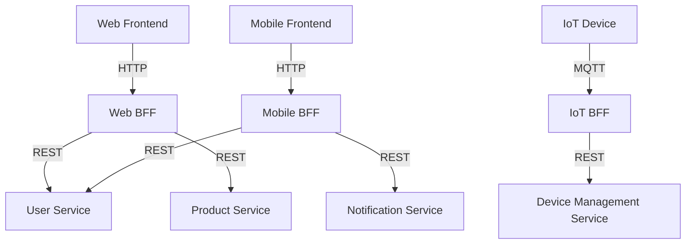

## 11.7 Backend for Frontend (BFF) Pattern

The Backend for Frontend (BFF) pattern is a design pattern that addresses the challenges of serving diverse client applications, such as web, mobile, and IoT devices, from a single backend service. By creating a dedicated backend for each frontend, the BFF pattern allows for optimized communication and tailored data handling, enhancing the overall performance and user experience.

### Benefits of the BFF Approach

The BFF pattern offers several advantages, particularly in a microservices architecture:

- **Optimized Client-Server Communication**: Each BFF can be tailored to the specific needs of its frontend, reducing unnecessary data transfer and processing.
- **Improved Security**: By isolating frontend-specific logic, sensitive operations can be handled securely within the BFF.
- **Enhanced Developer Productivity**: Frontend and backend teams can work independently, reducing dependencies and accelerating development cycles.
- **Scalability and Flexibility**: BFFs can be scaled independently, allowing for better resource allocation and management.

### Designing and Implementing BFF Services in Scala

Implementing a BFF in Scala involves several key steps, from designing the architecture to writing the code. Let's explore these steps in detail.

#### Architecture Design

1. **Identify Frontend Requirements**: Analyze the specific needs of each frontend application. This includes data formats, interaction patterns, and performance requirements.

2. **Define BFF Responsibilities**: Determine what logic and data transformations should be handled by the BFF. This might include aggregating data from multiple microservices, formatting responses, or handling authentication.

3. **Establish Communication Protocols**: Decide on the communication protocols between the BFF and the frontend (e.g., REST, GraphQL) and between the BFF and other backend services (e.g., gRPC, HTTP).

4. **Design for Scalability**: Plan for horizontal scaling of BFF instances to handle varying loads from different frontends.

#### Implementation in Scala

Scala's rich ecosystem and functional programming capabilities make it an excellent choice for implementing BFF services. Here's a step-by-step guide to creating a BFF in Scala:

##### Step 1: Set Up the Project

Start by setting up a new Scala project using a build tool like SBT (Simple Build Tool). Define your dependencies, including libraries for HTTP communication, JSON processing, and any other necessary tools.

```scala
// build.sbt
name := "BFFService"

version := "0.1"

scalaVersion := "2.13.8"

libraryDependencies ++= Seq(
  "com.typesafe.akka" %% "akka-http" % "10.2.7",
  "de.heikoseeberger" %% "akka-http-circe" % "1.39.2",
  "io.circe" %% "circe-generic" % "0.14.1"
)
```

##### Step 2: Define the BFF API

Create routes for the BFF service using Akka HTTP. Define endpoints that correspond to the frontend's needs.

```scala
import akka.http.scaladsl.server.Directives._
import akka.http.scaladsl.server.Route
import io.circe.generic.auto._
import de.heikoseeberger.akkahttpcirce.FailFastCirceSupport._

case class UserData(id: String, name: String, email: String)

val userRoute: Route =
  pathPrefix("user") {
    get {
      path(Segment) { userId =>
        complete(fetchUserData(userId))
      }
    }
  }

def fetchUserData(userId: String): UserData = {
  // Simulate fetching user data
  UserData(userId, "John Doe", "john.doe@example.com")
}
```

##### Step 3: Integrate with Backend Services

Use Akka HTTP or other HTTP clients to communicate with backend microservices. Implement logic to aggregate and transform data as needed.

```scala
import akka.http.scaladsl.Http
import akka.http.scaladsl.model._
import scala.concurrent.Future
import scala.concurrent.ExecutionContext.Implicits.global

def fetchUserDetails(userId: String): Future[UserData] = {
  val responseFuture: Future[HttpResponse] = Http().singleRequest(HttpRequest(uri = s"http://backend-service/user/$userId"))

  responseFuture.flatMap { response =>
    // Process response and extract user data
    // Assume a JSON response that can be decoded into UserData
    Unmarshal(response.entity).to[UserData]
  }
}
```

##### Step 4: Handle Authentication and Authorization

Implement security measures to ensure that only authorized requests are processed. This might involve validating tokens or integrating with an OAuth2 provider.

```scala
import akka.http.scaladsl.server.directives.Credentials

def authenticate(credentials: Credentials): Option[String] = {
  credentials match {
    case p @ Credentials.Provided(id) if p.verify("secret") => Some(id)
    case _ => None
  }
}

val securedRoute: Route =
  path("secure-data") {
    authenticateBasic(realm = "secure site", authenticate) { userId =>
      complete(s"Hello, $userId! Here is your secure data.")
    }
  }
```

##### Step 5: Deploy and Scale

Deploy the BFF service using containerization tools like Docker, and orchestrate using Kubernetes or similar platforms for scalability and resilience.

```dockerfile
FROM openjdk:11-jre-slim
WORKDIR /app
COPY target/scala-2.13/bffservice.jar /app/bffservice.jar
ENTRYPOINT ["java", "-jar", "bffservice.jar"]
```

#### Try It Yourself

Experiment with the BFF implementation by modifying the code to add new endpoints or integrate additional backend services. Consider implementing caching mechanisms to improve performance or adding logging for better monitoring.

### Case Studies and Examples

#### Case Study 1: E-commerce Platform

An e-commerce platform with web and mobile applications implemented a BFF for each frontend. The web BFF handled complex product filtering and sorting, while the mobile BFF optimized for minimal data transfer and battery efficiency. This separation allowed for tailored optimizations and improved user experiences across devices.

#### Case Study 2: Social Media Application

A social media application used a BFF to aggregate data from multiple microservices, including user profiles, posts, and notifications. The BFF handled data transformations and caching, reducing the load on backend services and improving response times for end users.

#### Case Study 3: IoT Device Management

An IoT platform implemented a BFF to manage communication between devices and the cloud. The BFF handled protocol translations and data normalization, allowing for seamless integration with various device types and improved data consistency.

### Visualizing the BFF Pattern

Below is a diagram illustrating the BFF pattern, showing how different frontends interact with their respective BFFs, which in turn communicate with backend microservices.



### Design Considerations

When implementing the BFF pattern, consider the following:

- **Data Consistency**: Ensure that data transformations in the BFF do not lead to inconsistencies.
- **Security**: Implement robust authentication and authorization mechanisms to protect sensitive data.
- **Performance**: Optimize data fetching and processing to minimize latency.
- **Maintainability**: Keep BFF logic simple and focused on frontend-specific needs to ease maintenance.

### Differences and Similarities

The BFF pattern is often compared to the API Gateway pattern. While both serve as intermediaries between clients and backend services, the BFF pattern is more focused on frontend-specific optimizations, whereas an API Gateway typically provides a unified entry point for all clients.

### Conclusion

The Backend for Frontend pattern is a powerful tool for optimizing microservices architectures to meet the diverse needs of modern applications. By tailoring backend services to specific frontends, developers can enhance performance, security, and user experience. As you continue to explore Scala and microservices design patterns, consider how the BFF pattern can be applied to your projects to achieve these benefits.

## Quiz Time!



### What is the primary benefit of using the BFF pattern?

- [x] Optimized client-server communication
- [ ] Reduced server costs
- [ ] Simplified backend architecture
- [ ] Elimination of frontend code

> **Explanation:** The BFF pattern optimizes client-server communication by tailoring backend services to the specific needs of each frontend.

### How does the BFF pattern improve security?

- [x] By isolating frontend-specific logic
- [ ] By encrypting all data
- [ ] By using a single authentication method
- [ ] By reducing the number of services

> **Explanation:** The BFF pattern improves security by isolating frontend-specific logic, allowing sensitive operations to be handled securely within the BFF.

### Which Scala library is commonly used for HTTP communication in BFF services?

- [x] Akka HTTP
- [ ] Play Framework
- [ ] Slick
- [ ] Monix

> **Explanation:** Akka HTTP is a popular library for handling HTTP communication in Scala applications, including BFF services.

### What is a key consideration when designing a BFF service?

- [x] Data consistency
- [ ] Minimizing code size
- [ ] Using a single programming language
- [ ] Avoiding all external libraries

> **Explanation:** Ensuring data consistency is crucial when designing a BFF service to prevent inconsistencies in data transformations.

### How can BFF services be deployed for scalability?

- [x] Using containerization and orchestration tools
- [ ] By running on a single server
- [ ] By avoiding cloud services
- [ ] By minimizing code complexity

> **Explanation:** BFF services can be deployed for scalability using containerization tools like Docker and orchestration platforms like Kubernetes.

### What is a common use case for the BFF pattern?

- [x] Serving diverse client applications
- [ ] Reducing backend service count
- [ ] Simplifying frontend code
- [ ] Eliminating network latency

> **Explanation:** The BFF pattern is commonly used to serve diverse client applications, such as web, mobile, and IoT devices, with tailored backend services.

### Which communication protocol is often used between BFFs and frontends?

- [x] HTTP
- [ ] FTP
- [ ] SMTP
- [ ] SNMP

> **Explanation:** HTTP is a common communication protocol used between BFFs and frontends for web and mobile applications.

### What role does the BFF play in a microservices architecture?

- [x] It acts as an intermediary between frontends and backend services.
- [ ] It replaces all backend services.
- [ ] It eliminates the need for frontend development.
- [ ] It serves as a database.

> **Explanation:** In a microservices architecture, the BFF acts as an intermediary between frontends and backend services, optimizing communication and data handling.

### True or False: The BFF pattern is identical to the API Gateway pattern.

- [ ] True
- [x] False

> **Explanation:** False. The BFF pattern is not identical to the API Gateway pattern. While both serve as intermediaries, the BFF pattern is focused on frontend-specific optimizations, whereas an API Gateway provides a unified entry point for all clients.

### What is a potential drawback of the BFF pattern?

- [x] Increased complexity in managing multiple BFFs
- [ ] Reduced performance
- [ ] Inability to handle multiple frontends
- [ ] Lack of security features

> **Explanation:** A potential drawback of the BFF pattern is the increased complexity in managing multiple BFFs, each tailored to specific frontends.



Remember, the journey to mastering design patterns in Scala is ongoing. Keep exploring, experimenting, and applying these patterns to your projects to build robust, scalable, and efficient applications.
