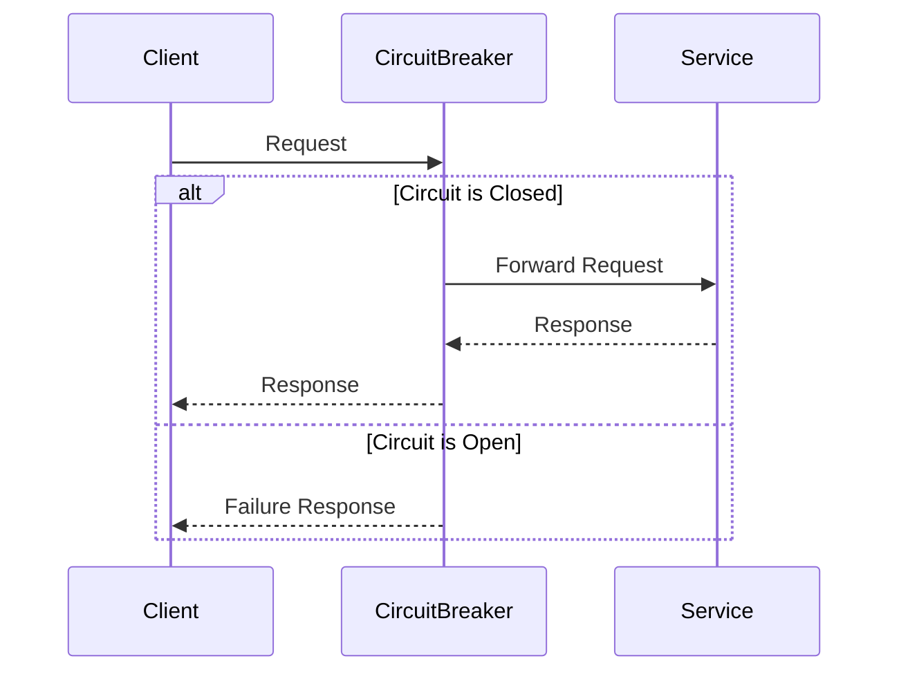
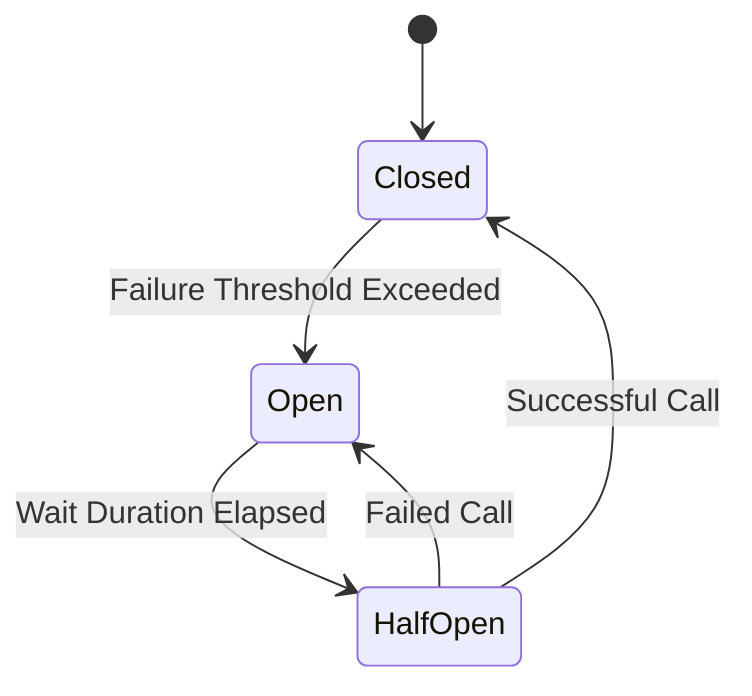

## 11.8 Circuit Breaker Pattern

In the world of microservices, where systems are composed of numerous interdependent services, handling failures gracefully is crucial. The Circuit Breaker Pattern is a design pattern used to detect failures and encapsulate the logic of preventing a failure from constantly recurring, allowing the system to maintain its stability and prevent cascading errors. This pattern is particularly useful in distributed systems where remote calls to services can fail due to various reasons such as network issues, service downtime, or overload.

### Intent

The primary intent of the Circuit Breaker Pattern is to prevent an application from repeatedly trying to execute an operation that is likely to fail, allowing it to fail fast and recover gracefully. It acts as a proxy for operations that might fail, providing a fail-fast mechanism and a way to recover from failures.

### Key Participants

1. **Circuit Breaker**: The core component that monitors the success and failure of operations.
2. **Service**: The external service or resource that the application interacts with.
3. **Client**: The component that makes requests to the service through the circuit breaker.

### Applicability

- Use the Circuit Breaker Pattern when dealing with remote services or resources that can fail.
- Apply this pattern to prevent cascading failures in distributed systems.
- Implement it to improve the resilience and stability of microservices architectures.

### Diagrams

Below is a sequence diagram illustrating the Circuit Breaker Pattern:



**Figure 1:** Sequence diagram showing the interaction between a client, circuit breaker, and service.

### Implementing Circuit Breakers with Akka

Akka is a powerful toolkit for building concurrent, distributed, and fault-tolerant applications on the JVM. It provides a robust actor-based model that makes it a suitable choice for implementing circuit breakers in Scala.

#### Setting Up Akka Circuit Breaker

To implement a circuit breaker using Akka, you need to include the Akka library in your project. You can add the following dependency to your `build.sbt` file:

```scala
libraryDependencies += "com.typesafe.akka" %% "akka-actor" % "2.6.20"
```

#### Example Code

Let's walk through an example of implementing a circuit breaker using Akka:

```scala
import akka.actor.ActorSystem
import akka.pattern.CircuitBreaker
import scala.concurrent.duration._
import scala.concurrent.{ExecutionContext, Future}

object AkkaCircuitBreakerExample extends App {
  implicit val system: ActorSystem = ActorSystem("CircuitBreakerSystem")
  implicit val ec: ExecutionContext = system.dispatcher

  // Define a Circuit Breaker
  val breaker = new CircuitBreaker(
    scheduler = system.scheduler,
    maxFailures = 5,
    callTimeout = 10.seconds,
    resetTimeout = 1.minute
  )

  // Simulate a service call
  def riskyCall(): Future[String] = Future {
    // Simulate a failure
    if (scala.util.Random.nextInt(10) < 8) throw new RuntimeException("Service failure")
    else "Success"
  }

  // Use the Circuit Breaker to protect the risky call
  breaker.withCircuitBreaker(riskyCall()).onComplete {
    case scala.util.Success(value) => println(s"Call succeeded with: $value")
    case scala.util.Failure(exception) => println(s"Call failed with: ${exception.getMessage}")
  }
}
```

**Explanation:**

- **CircuitBreaker**: We create a `CircuitBreaker` instance with a maximum of 5 failures, a call timeout of 10 seconds, and a reset timeout of 1 minute.
- **riskyCall**: This function simulates a service call that has an 80% chance of failing.
- **withCircuitBreaker**: We wrap the `riskyCall` with the circuit breaker to manage its execution and handle failures.

### Implementing Circuit Breakers with Resilience4j

Resilience4j is a lightweight, easy-to-use fault tolerance library inspired by Netflix Hystrix but designed for Java 8 and functional programming. It provides a Circuit Breaker module that can be easily integrated into Scala applications.

#### Setting Up Resilience4j Circuit Breaker

To use Resilience4j, include the following dependency in your `build.sbt` file:

```scala
libraryDependencies += "io.github.resilience4j" % "resilience4j-circuitbreaker" % "1.7.1"
```

#### Example Code

Here's how you can implement a circuit breaker using Resilience4j in Scala:

```scala
import io.github.resilience4j.circuitbreaker.{CircuitBreaker, CircuitBreakerConfig}
import io.github.resilience4j.circuitbreaker.CircuitBreakerRegistry
import scala.concurrent.{ExecutionContext, Future}
import scala.util.{Failure, Success}

object Resilience4jCircuitBreakerExample extends App {
  implicit val ec: ExecutionContext = ExecutionContext.global

  // Create a Circuit Breaker configuration
  val config = CircuitBreakerConfig.custom()
    .failureRateThreshold(50)
    .waitDurationInOpenState(java.time.Duration.ofSeconds(60))
    .build()

  // Create a Circuit Breaker registry
  val registry = CircuitBreakerRegistry.of(config)

  // Create a Circuit Breaker
  val circuitBreaker = registry.circuitBreaker("myCircuitBreaker")

  // Simulate a service call
  def riskyCall(): Future[String] = Future {
    if (scala.util.Random.nextInt(10) < 8) throw new RuntimeException("Service failure")
    else "Success"
  }

  // Use the Circuit Breaker to protect the risky call
  val decoratedCall = CircuitBreaker.decorateFuture(circuitBreaker, () => riskyCall())

  decoratedCall.onComplete {
    case Success(value) => println(s"Call succeeded with: $value")
    case Failure(exception) => println(s"Call failed with: ${exception.getMessage}")
  }
}
```

**Explanation:**

- **CircuitBreakerConfig**: We configure the circuit breaker with a failure rate threshold of 50% and a wait duration of 60 seconds in the open state.
- **CircuitBreakerRegistry**: We create a registry to manage circuit breakers.
- **decorateFuture**: We use Resilience4j's `decorateFuture` method to wrap the `riskyCall` with the circuit breaker.

### Design Considerations

- **Thresholds and Timeouts**: Carefully choose the failure thresholds and timeouts based on the expected behavior of your services.
- **Fallback Mechanisms**: Implement fallback mechanisms to handle failures gracefully when the circuit is open.
- **Monitoring and Logging**: Monitor circuit breaker states and log events for better observability and debugging.

### Differences and Similarities

- **Akka vs. Resilience4j**: Akka provides a more actor-based approach, suitable for systems already using Akka, while Resilience4j offers a more functional programming style, making it easier to integrate with other functional codebases.
- **Configuration**: Both libraries allow for extensive configuration, but Resilience4j provides more granular control over circuit breaker behavior.

### Try It Yourself

To deepen your understanding, try modifying the code examples:

- Change the failure rate threshold and observe how it affects the circuit breaker's behavior.
- Implement a fallback mechanism that returns a default value when the circuit is open.
- Experiment with different call timeouts and reset durations.

### Visualizing Circuit Breaker States

Below is a state diagram illustrating the states of a circuit breaker:



**Figure 2:** State diagram showing the transition between circuit breaker states.

### Knowledge Check

- What is the primary purpose of the Circuit Breaker Pattern?
- How does the Circuit Breaker Pattern prevent cascading failures?
- What are the key differences between Akka and Resilience4j implementations?

### Embrace the Journey

Remember, implementing circuit breakers is just one step towards building resilient microservices. As you progress, you'll explore more patterns and techniques to enhance the robustness of your systems. Keep experimenting, stay curious, and enjoy the journey!

## Quiz Time!



### What is the primary purpose of the Circuit Breaker Pattern?

- [x] To prevent an application from repeatedly trying to execute an operation that is likely to fail.
- [ ] To enhance the performance of a system by caching results.
- [ ] To simplify the codebase by reducing the number of classes.
- [ ] To ensure that all operations are executed in parallel.

> **Explanation:** The Circuit Breaker Pattern aims to prevent repeated execution of failing operations, allowing the system to recover gracefully.

### Which library provides an actor-based approach for implementing circuit breakers in Scala?

- [x] Akka
- [ ] Resilience4j
- [ ] Cats Effect
- [ ] Monix

> **Explanation:** Akka provides an actor-based model suitable for implementing circuit breakers in Scala.

### What is the role of the `CircuitBreaker` in the pattern?

- [x] It monitors the success and failure of operations and manages state transitions.
- [ ] It provides a user interface for interacting with the system.
- [ ] It stores data persistently across sessions.
- [ ] It handles user authentication and authorization.

> **Explanation:** The `CircuitBreaker` is responsible for monitoring operations and managing state transitions to handle failures.

### In Resilience4j, what method is used to wrap a future with a circuit breaker?

- [x] `decorateFuture`
- [ ] `wrapFuture`
- [ ] `protectFuture`
- [ ] `guardFuture`

> **Explanation:** Resilience4j uses the `decorateFuture` method to wrap a future with a circuit breaker.

### What happens when a circuit breaker is in the "Open" state?

- [x] The circuit breaker immediately fails all requests without attempting the operation.
- [ ] The circuit breaker retries the operation until it succeeds.
- [ ] The circuit breaker logs the request and continues execution.
- [ ] The circuit breaker executes the operation with a delay.

> **Explanation:** In the "Open" state, the circuit breaker fails all requests immediately to prevent further failures.

### How can you monitor circuit breaker states for better observability?

- [x] By logging events and monitoring state transitions.
- [ ] By using a debugger to step through the code.
- [ ] By printing messages to the console.
- [ ] By storing state information in a database.

> **Explanation:** Logging events and monitoring state transitions provide better observability and debugging capabilities.

### What is a common fallback mechanism when a circuit is open?

- [x] Returning a default value or cached response.
- [ ] Retrying the operation indefinitely.
- [ ] Redirecting the request to another service.
- [ ] Ignoring the failure and proceeding with execution.

> **Explanation:** A common fallback mechanism is to return a default value or cached response when the circuit is open.

### How does the Circuit Breaker Pattern improve system resilience?

- [x] By preventing cascading failures and allowing systems to recover gracefully.
- [ ] By increasing the speed of operations through parallel execution.
- [ ] By reducing the number of classes in the codebase.
- [ ] By caching results for faster access.

> **Explanation:** The Circuit Breaker Pattern improves resilience by preventing cascading failures and allowing systems to recover gracefully.

### What is the significance of the "Half-Open" state in a circuit breaker?

- [x] It allows a limited number of requests to pass through to test if the underlying issue is resolved.
- [ ] It permanently closes the circuit breaker.
- [ ] It logs all incoming requests without executing them.
- [ ] It redirects requests to a backup service.

> **Explanation:** The "Half-Open" state allows a limited number of requests to test if the issue is resolved before closing the circuit.

### True or False: The Circuit Breaker Pattern is only applicable to microservices architectures.

- [x] False
- [ ] True

> **Explanation:** The Circuit Breaker Pattern is applicable to any system where remote calls can fail, not just microservices architectures.


