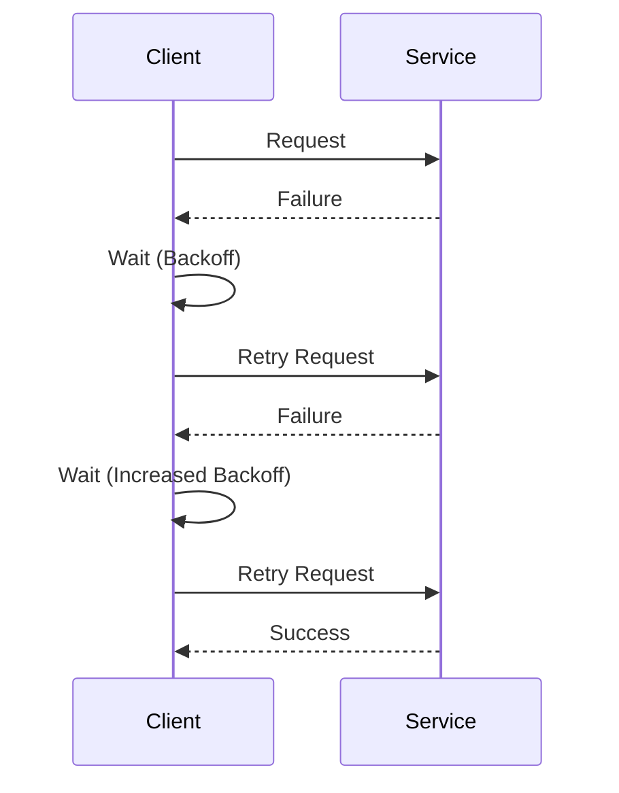

## 11.9 Retry and Backoff Patterns

In the world of distributed systems and microservices, failures are inevitable. Network issues, temporary unavailability of services, and transient errors can disrupt the smooth operation of applications. To build resilient systems, it's crucial to implement strategies that handle such failures gracefully. This is where Retry and Backoff Patterns come into play. In this section, we'll explore these patterns in detail, focusing on their implementation in Scala.

### Introduction to Retry and Backoff Patterns

Retry and Backoff Patterns are essential for enhancing the reliability and robustness of microservices. They provide mechanisms to automatically retry failed operations and manage the timing of these retries to prevent overwhelming the system.

#### Retry Pattern

The Retry Pattern involves reattempting a failed operation a certain number of times before giving up. This pattern is useful for handling transient failures, such as network timeouts or temporary service unavailability.

#### Backoff Strategy

A Backoff Strategy is used in conjunction with the Retry Pattern to control the timing of retries. Instead of retrying immediately, the system waits for a specified period before attempting the operation again. This waiting period can be constant, linear, or exponential, depending on the strategy used.

### Key Concepts and Terminology

Before diving into the implementation, let's clarify some key concepts and terminology:

- **Transient Failures**: Temporary issues that can be resolved by retrying the operation, such as network glitches or brief service downtimes.
- **Idempotency**: The property of an operation that allows it to be performed multiple times without changing the result beyond the initial application.
- **Exponential Backoff**: A strategy where the wait time between retries increases exponentially, reducing the load on the system during failures.
- **Jitter**: A random variation added to the backoff time to prevent synchronized retries across multiple clients.

### Implementing Retry Logic in Scala

Scala, with its functional programming capabilities, provides a robust platform for implementing retry logic. Let's explore how to implement a basic retry mechanism in Scala.

#### Basic Retry Logic

Here's a simple example of retry logic in Scala using a recursive function:

```scala
import scala.util.{Try, Success, Failure}

def retry[T](operation: => T, retries: Int): Try[T] = {
  Try(operation) match {
    case Success(result) => Success(result)
    case Failure(exception) if retries > 0 =>
      println(s"Operation failed, retrying... ($retries retries left)")
      retry(operation, retries - 1)
    case Failure(exception) =>
      println("Operation failed, no more retries left.")
      Failure(exception)
  }
}

// Example usage
val result = retry({
  // Simulate a failing operation
  if (scala.util.Random.nextInt(10) < 8) throw new RuntimeException("Transient error")
  "Success"
}, 3)

println(result)
```

In this example, the `retry` function takes an operation and a number of retries as parameters. It attempts the operation and retries if it fails, up to the specified number of retries.

### Enhancing Retry Logic with Backoff Strategies

To prevent overwhelming the system with retries, we can enhance our retry logic with a backoff strategy. Let's explore different backoff strategies and their implementation in Scala.

#### Constant Backoff

A constant backoff strategy waits for a fixed period between retries. Here's how you can implement it:

```scala
import scala.concurrent.duration._
import scala.util.{Try, Success, Failure}
import scala.concurrent.{Future, blocking}
import scala.concurrent.ExecutionContext.Implicits.global

def retryWithConstantBackoff[T](operation: => T, retries: Int, delay: FiniteDuration): Future[Try[T]] = {
  Future {
    blocking {
      Try(operation)
    }
  }.flatMap {
    case Success(result) => Future.successful(Success(result))
    case Failure(exception) if retries > 0 =>
      println(s"Operation failed, retrying after $delay... ($retries retries left)")
      Thread.sleep(delay.toMillis)
      retryWithConstantBackoff(operation, retries - 1, delay)
    case Failure(exception) =>
      println("Operation failed, no more retries left.")
      Future.successful(Failure(exception))
  }
}

// Example usage
val resultFuture = retryWithConstantBackoff({
  // Simulate a failing operation
  if (scala.util.Random.nextInt(10) < 8) throw new RuntimeException("Transient error")
  "Success"
}, 3, 2.seconds)

resultFuture.foreach(println)
```

In this implementation, we use a constant delay between retries, specified by the `delay` parameter.

#### Exponential Backoff

An exponential backoff strategy increases the wait time exponentially with each retry. This approach is more effective in reducing load during failures. Here's how to implement it:

```scala
def retryWithExponentialBackoff[T](operation: => T, retries: Int, initialDelay: FiniteDuration): Future[Try[T]] = {
  def exponentialDelay(attempt: Int): FiniteDuration = initialDelay * math.pow(2, attempt).toLong

  Future {
    blocking {
      Try(operation)
    }
  }.flatMap {
    case Success(result) => Future.successful(Success(result))
    case Failure(exception) if retries > 0 =>
      val delay = exponentialDelay(retries)
      println(s"Operation failed, retrying after $delay... ($retries retries left)")
      Thread.sleep(delay.toMillis)
      retryWithExponentialBackoff(operation, retries - 1, initialDelay)
    case Failure(exception) =>
      println("Operation failed, no more retries left.")
      Future.successful(Failure(exception))
  }
}

// Example usage
val resultFuture = retryWithExponentialBackoff({
  // Simulate a failing operation
  if (scala.util.Random.nextInt(10) < 8) throw new RuntimeException("Transient error")
  "Success"
}, 3, 1.second)

resultFuture.foreach(println)
```

In this example, the delay doubles with each retry attempt, starting from the `initialDelay`.

#### Adding Jitter

To prevent synchronized retries across multiple clients, we can add jitter to the backoff time. Here's an example:

```scala
import scala.util.Random

def retryWithExponentialBackoffAndJitter[T](operation: => T, retries: Int, initialDelay: FiniteDuration): Future[Try[T]] = {
  def exponentialDelayWithJitter(attempt: Int): FiniteDuration = {
    val delay = initialDelay * math.pow(2, attempt).toLong
    val jitter = Random.nextInt(1000).millis
    delay + jitter
  }

  Future {
    blocking {
      Try(operation)
    }
  }.flatMap {
    case Success(result) => Future.successful(Success(result))
    case Failure(exception) if retries > 0 =>
      val delay = exponentialDelayWithJitter(retries)
      println(s"Operation failed, retrying after $delay... ($retries retries left)")
      Thread.sleep(delay.toMillis)
      retryWithExponentialBackoffAndJitter(operation, retries - 1, initialDelay)
    case Failure(exception) =>
      println("Operation failed, no more retries left.")
      Future.successful(Failure(exception))
  }
}

// Example usage
val resultFuture = retryWithExponentialBackoffAndJitter({
  // Simulate a failing operation
  if (scala.util.Random.nextInt(10) < 8) throw new RuntimeException("Transient error")
  "Success"
}, 3, 1.second)

resultFuture.foreach(println)
```

In this implementation, a random jitter is added to the delay, making the retry intervals less predictable and reducing the risk of synchronized retries.

### Visualizing Retry and Backoff Patterns

To better understand the flow of retry and backoff patterns, let's visualize the process using a sequence diagram:



**Diagram Description:** This sequence diagram illustrates the interaction between a client and a service using retry and backoff patterns. The client sends a request to the service, receives a failure response, waits for a backoff period, and retries the request. This process continues until the request succeeds or the maximum number of retries is reached.

### Design Considerations

When implementing retry and backoff patterns, consider the following design considerations:

- **Idempotency**: Ensure that the operations being retried are idempotent, meaning they can be repeated without causing unintended side effects.
- **Timeouts**: Set appropriate timeouts for operations to prevent indefinite waiting and retrying.
- **Circuit Breaker**: Consider using a circuit breaker pattern to prevent retries when a service is known to be unavailable.
- **Monitoring and Logging**: Implement monitoring and logging to track retry attempts and identify patterns in failures.
- **Configuration**: Allow retry and backoff parameters to be configurable to adapt to different environments and requirements.

### Differences and Similarities with Other Patterns

Retry and Backoff Patterns are often used in conjunction with other patterns, such as:

- **Circuit Breaker Pattern**: While retry patterns focus on reattempting failed operations, circuit breakers prevent retries when a service is known to be down.
- **Bulkhead Pattern**: This pattern isolates components to prevent failures from propagating, complementing retry strategies by limiting the impact of failures.
- **Rate Limiting**: Rate limiting controls the number of requests sent to a service, which can work alongside retry patterns to manage load.

### Try It Yourself

To deepen your understanding of retry and backoff patterns, try modifying the code examples provided:

- **Experiment with Different Backoff Strategies**: Implement a linear backoff strategy and compare its behavior with exponential backoff.
- **Add Jitter to Constant Backoff**: Modify the constant backoff example to include jitter and observe the impact on retry intervals.
- **Integrate with a Circuit Breaker**: Combine retry and backoff patterns with a circuit breaker to handle persistent failures more effectively.

### Knowledge Check

- **What is the primary purpose of the Retry Pattern?**
- **How does exponential backoff differ from constant backoff?**
- **Why is idempotency important when implementing retry logic?**

### Summary

Retry and Backoff Patterns are vital tools for building resilient microservices. By automatically retrying failed operations and managing the timing of retries, these patterns help systems recover from transient failures and maintain stability. In Scala, functional programming techniques and libraries provide powerful mechanisms for implementing these patterns effectively.

Remember, this is just the beginning. As you progress, you'll build more complex and resilient systems. Keep experimenting, stay curious, and enjoy the journey!

## Quiz Time!



### What is the primary purpose of the Retry Pattern?

- [x] To reattempt failed operations
- [ ] To prevent failures from occurring
- [ ] To increase system performance
- [ ] To reduce code complexity

> **Explanation:** The Retry Pattern is used to reattempt failed operations, particularly in the case of transient failures.

### How does exponential backoff differ from constant backoff?

- [x] Exponential backoff increases wait time exponentially
- [ ] Exponential backoff decreases wait time exponentially
- [ ] Constant backoff increases wait time linearly
- [ ] Constant backoff decreases wait time linearly

> **Explanation:** Exponential backoff increases the wait time between retries exponentially, while constant backoff uses a fixed wait time.

### Why is idempotency important when implementing retry logic?

- [x] To ensure repeated operations have no unintended side effects
- [ ] To increase the speed of retries
- [ ] To reduce the number of retries needed
- [ ] To simplify the code implementation

> **Explanation:** Idempotency ensures that repeated operations do not cause unintended side effects, which is crucial when retrying operations.

### What is the role of jitter in backoff strategies?

- [x] To add randomness to retry intervals
- [ ] To decrease retry intervals
- [ ] To increase the number of retries
- [ ] To simplify retry logic

> **Explanation:** Jitter adds randomness to retry intervals, preventing synchronized retries across multiple clients.

### Which pattern complements Retry and Backoff Patterns by preventing retries when a service is down?

- [x] Circuit Breaker Pattern
- [ ] Bulkhead Pattern
- [ ] Rate Limiting
- [ ] Singleton Pattern

> **Explanation:** The Circuit Breaker Pattern prevents retries when a service is known to be down, complementing Retry and Backoff Patterns.

### What should be considered when setting timeouts for operations?

- [x] To prevent indefinite waiting and retrying
- [ ] To increase the number of retries
- [ ] To decrease system performance
- [ ] To simplify code implementation

> **Explanation:** Setting appropriate timeouts prevents indefinite waiting and retrying, ensuring system stability.

### How can monitoring and logging enhance retry logic?

- [x] By tracking retry attempts and identifying failure patterns
- [ ] By increasing the number of retries
- [ ] By reducing code complexity
- [ ] By improving system performance

> **Explanation:** Monitoring and logging help track retry attempts and identify patterns in failures, enhancing retry logic.

### What is a key benefit of using a Backoff Strategy?

- [x] To prevent overwhelming the system with retries
- [ ] To increase the speed of retries
- [ ] To reduce the number of retries needed
- [ ] To simplify the code implementation

> **Explanation:** A Backoff Strategy prevents overwhelming the system with retries by managing the timing of retries.

### How can retry and backoff parameters be adapted to different environments?

- [x] By making them configurable
- [ ] By hardcoding them into the application
- [ ] By removing them entirely
- [ ] By simplifying the code implementation

> **Explanation:** Making retry and backoff parameters configurable allows them to be adapted to different environments and requirements.

### True or False: The Retry Pattern is only useful for handling permanent failures.

- [ ] True
- [x] False

> **Explanation:** The Retry Pattern is primarily used for handling transient failures, not permanent ones.


