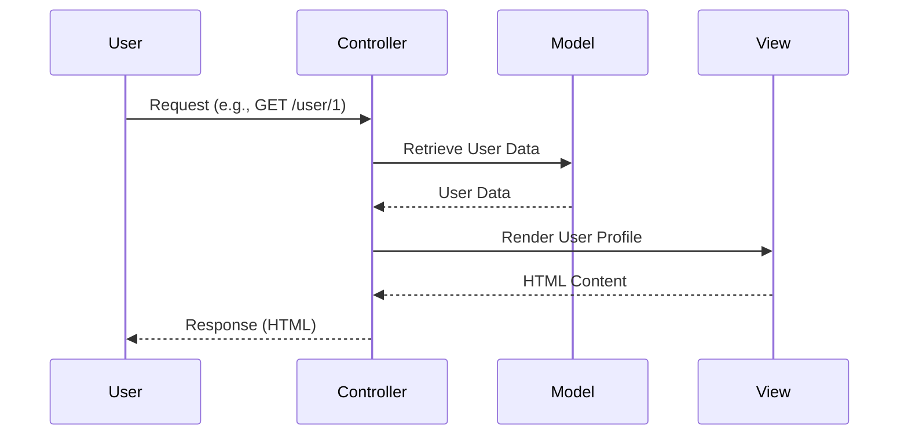

## 12.1 Model-View-Controller (MVC) Pattern

The Model-View-Controller (MVC) pattern is a fundamental architectural pattern used to structure web applications. It separates the application into three interconnected components: the Model, the View, and the Controller. This separation of concerns facilitates modularity, scalability, and maintainability, making MVC a popular choice for web application development. In this section, we will explore the MVC pattern in depth, focusing on its implementation in Scala using the Play Framework.

### Intent

The primary intent of the MVC pattern is to separate the internal representations of information from the ways that information is presented to and accepted from the user. This separation allows for efficient code organization, where changes to the user interface do not affect the data handling logic and vice versa.

### Key Participants

1. **Model**: Represents the data and the business logic of the application. It is responsible for managing the data, logic, and rules of the application.
2. **View**: Displays the data to the user. It is responsible for rendering the user interface and presenting the data in a format that is understandable to the user.
3. **Controller**: Acts as an intermediary between the Model and the View. It processes user input, interacts with the Model, and updates the View accordingly.

### Applicability

The MVC pattern is applicable in scenarios where:

- There is a need to separate the user interface from the business logic.
- The application requires multiple views of the same data.
- There is a need for a modular and scalable architecture.

### Implementing MVC with Play Framework

The Play Framework is a reactive web application framework for Scala and Java. It is built on the Akka toolkit and provides a robust platform for implementing the MVC pattern in Scala. Let's explore how to implement the MVC pattern using the Play Framework.

#### Setting Up a Play Framework Project

To get started with Play Framework, you need to set up a new Play project. You can do this using the Play command line tools. Here is a step-by-step guide:

1. **Install the Play Framework**: Follow the [official installation guide](https://www.playframework.com/documentation/latest/Installing) to set up Play on your system.

2. **Create a New Play Project**: Use the following command to create a new Play project:

   ```bash
   sbt new playframework/play-scala-seed.g8
   ```

3. **Navigate to the Project Directory**: Change to the newly created project directory:

   ```bash
   cd my-play-app
   ```

4. **Run the Play Application**: Start the Play application using the following command:

   ```bash
   sbt run
   ```

   This will start the Play development server, and you can access your application at `http://localhost:9000`.

#### MVC Components in Play Framework

Now that we have set up a Play project, let's delve into the implementation of the MVC components.

##### Model

In Play Framework, the Model represents the application's data and business logic. It is typically implemented using case classes and can interact with databases using libraries like Slick or Anorm.

Here is an example of a simple Model in Scala:

```scala
package models

import play.api.libs.json._

case class User(id: Long, name: String, email: String)

object User {
  implicit val userFormat: OFormat[User] = Json.format[User]
}
```

In this example, we define a `User` case class with three fields: `id`, `name`, and `email`. We also define an implicit JSON format for the `User` class using Play's JSON library, which allows us to easily serialize and deserialize `User` objects to and from JSON.

##### View

The View in Play Framework is responsible for rendering the user interface. Play uses Twirl as its default templating engine, which allows you to create HTML templates with embedded Scala code.

Here is an example of a simple View template in Twirl:

```html
@(user: models.User)

<!DOCTYPE html>
<html>
<head>
    <title>User Profile</title>
</head>
<body>
    <h1>@user.name's Profile</h1>
    <p>Email: @user.email</p>
</body>
</html>
```

In this template, we use the `@(user: models.User)` directive to pass a `User` object to the template. We then use the `@` symbol to embed Scala expressions within the HTML.

##### Controller

The Controller in Play Framework handles user input and interacts with the Model and View. It is responsible for processing requests, invoking business logic, and returning responses.

Here is an example of a simple Controller in Scala:

```scala
package controllers

import javax.inject._
import play.api.mvc._
import models.User

@Singleton
class UserController @Inject()(val controllerComponents: ControllerComponents) extends BaseController {

  def getUser(id: Long): Action[AnyContent] = Action { implicit request: Request[AnyContent] =>
    val user = User(id, "John Doe", "john.doe@example.com")
    Ok(views.html.user(user))
  }
}
```

In this example, we define a `UserController` class with a `getUser` method. This method takes a user ID as a parameter, creates a `User` object, and returns an `Ok` response with the rendered user profile view.

### Diagrams

To better understand the interaction between the MVC components, let's visualize the flow of data and control in an MVC application using a sequence diagram.



**Diagram Description**: This sequence diagram illustrates the flow of data and control in an MVC application. The user sends a request to the Controller, which retrieves data from the Model, renders the View, and returns the response to the user.

### Design Considerations

When implementing the MVC pattern in Scala using the Play Framework, consider the following:

- **Separation of Concerns**: Ensure that the Model, View, and Controller are clearly separated. The Model should not contain any presentation logic, and the View should not contain any business logic.
- **Scalability**: The MVC pattern facilitates scalability by allowing you to add new features or modify existing ones without affecting other components.
- **Testability**: The separation of concerns in the MVC pattern makes it easier to test each component independently.

### Differences and Similarities

The MVC pattern is often compared to other architectural patterns, such as MVVM (Model-View-ViewModel) and MVP (Model-View-Presenter). Here are some key differences and similarities:

- **MVC vs. MVVM**: In MVVM, the ViewModel acts as an intermediary between the View and the Model, providing data binding and command handling. This pattern is commonly used in applications with complex user interfaces.
- **MVC vs. MVP**: In MVP, the Presenter handles the presentation logic and interacts with the View and Model. The View is passive and only updates based on the Presenter's instructions.

### Sample Code Snippet

Let's put together a complete example of an MVC application using the Play Framework. This example will include a Model, View, and Controller for managing a list of users.

#### Model

```scala
package models

import play.api.libs.json._

case class User(id: Long, name: String, email: String)

object User {
  implicit val userFormat: OFormat[User] = Json.format[User]
}
```

#### View

```html
@(users: Seq[models.User])

<!DOCTYPE html>
<html>
<head>
    <title>User List</title>
</head>
<body>
    <h1>User List</h1>
    <ul>
        @for(user <- users) {
            <li>@user.name - @user.email</li>
        }
    </ul>
</body>
</html>
```

#### Controller

```scala
package controllers

import javax.inject._
import play.api.mvc._
import models.User

@Singleton
class UserController @Inject()(val controllerComponents: ControllerComponents) extends BaseController {

  def listUsers: Action[AnyContent] = Action { implicit request: Request[AnyContent] =>
    val users = Seq(
      User(1, "John Doe", "john.doe@example.com"),
      User(2, "Jane Smith", "jane.smith@example.com")
    )
    Ok(views.html.userList(users))
  }
}
```

### Try It Yourself

To experiment with this example, try adding new features or modifying existing ones. For instance, you could:

- Add a form to create new users and update the user list dynamically.
- Implement a search feature to filter users by name or email.
- Use a database to persist user data and update the Model accordingly.

### Knowledge Check

- Explain the role of each component in the MVC pattern.
- Describe how the Play Framework facilitates the implementation of the MVC pattern in Scala.
- Discuss the benefits of separating concerns in an MVC application.

### Embrace the Journey

Remember, mastering the MVC pattern is just the beginning. As you progress, you'll build more complex and interactive web applications. Keep experimenting, stay curious, and enjoy the journey!

### References and Links

- [Play Framework Documentation](https://www.playframework.com/documentation/latest/Home)
- [Twirl Templating Language](https://www.playframework.com/documentation/latest/ScalaTemplates)
- [Scala Documentation](https://docs.scala-lang.org/)

## Quiz Time!



### What is the primary intent of the MVC pattern?

- [x] To separate the internal representations of information from the ways that information is presented to and accepted from the user.
- [ ] To combine the user interface and business logic into a single component.
- [ ] To ensure that the application is only accessible to authorized users.
- [ ] To provide a single entry point for all application requests.

> **Explanation:** The MVC pattern aims to separate the internal representations of information from the ways that information is presented to and accepted from the user, facilitating modularity and maintainability.

### Which component of the MVC pattern is responsible for rendering the user interface?

- [ ] Model
- [x] View
- [ ] Controller
- [ ] Router

> **Explanation:** The View component is responsible for rendering the user interface and presenting the data in a format that is understandable to the user.

### In the Play Framework, which library is commonly used for database interactions in the Model?

- [ ] Twirl
- [x] Slick
- [ ] Akka
- [ ] Monix

> **Explanation:** Slick is a library commonly used in the Play Framework for database interactions in the Model component.

### What is the role of the Controller in the MVC pattern?

- [x] To process user input, interact with the Model, and update the View.
- [ ] To store and manage the application's data and business logic.
- [ ] To render the user interface.
- [ ] To handle database transactions.

> **Explanation:** The Controller processes user input, interacts with the Model, and updates the View accordingly.

### Which templating engine does Play Framework use by default for rendering Views?

- [ ] Mustache
- [ ] Handlebars
- [x] Twirl
- [ ] Thymeleaf

> **Explanation:** Play Framework uses Twirl as its default templating engine for rendering Views.

### How does the MVC pattern facilitate scalability?

- [x] By allowing new features to be added or existing ones to be modified without affecting other components.
- [ ] By combining the user interface and business logic into a single component.
- [ ] By ensuring that the application is only accessible to authorized users.
- [ ] By providing a single entry point for all application requests.

> **Explanation:** The separation of concerns in the MVC pattern allows new features to be added or existing ones to be modified without affecting other components, facilitating scalability.

### What is the difference between MVC and MVVM?

- [x] In MVVM, the ViewModel acts as an intermediary between the View and the Model, providing data binding and command handling.
- [ ] In MVC, the ViewModel acts as an intermediary between the View and the Model.
- [ ] In MVVM, the Controller acts as an intermediary between the View and the Model.
- [ ] In MVC, the ViewModel provides data binding and command handling.

> **Explanation:** In MVVM, the ViewModel acts as an intermediary between the View and the Model, providing data binding and command handling.

### Which component of the MVC pattern should not contain any presentation logic?

- [x] Model
- [ ] View
- [ ] Controller
- [ ] Router

> **Explanation:** The Model should not contain any presentation logic; it is responsible for managing the data, logic, and rules of the application.

### What is the purpose of using implicit JSON format in the Model?

- [x] To easily serialize and deserialize objects to and from JSON.
- [ ] To render the user interface.
- [ ] To handle user input.
- [ ] To manage database transactions.

> **Explanation:** Using implicit JSON format in the Model allows for easy serialization and deserialization of objects to and from JSON.

### True or False: The MVC pattern is only applicable to web applications.

- [ ] True
- [x] False

> **Explanation:** The MVC pattern is not limited to web applications; it can be applied to any application that benefits from separating the user interface from the business logic.


