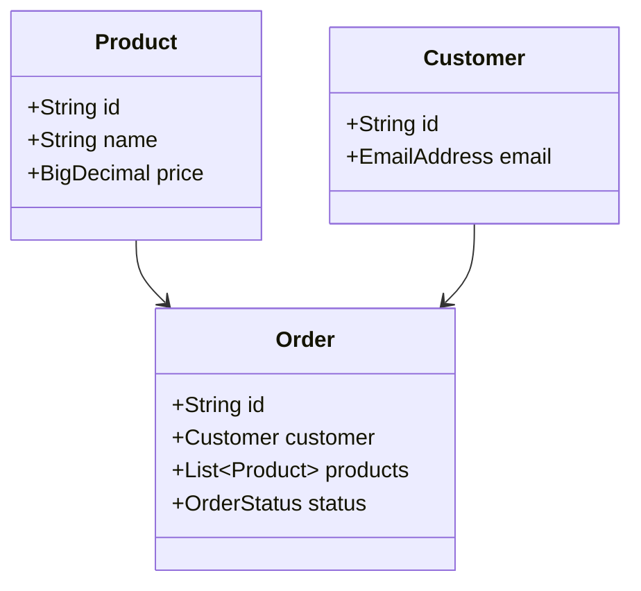
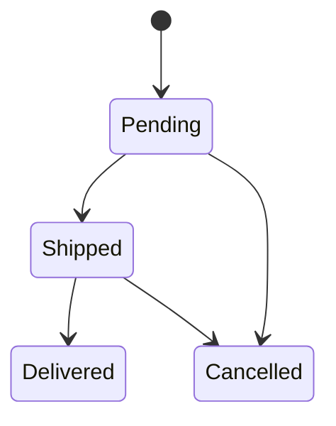

## 12.10 Domain Modeling with Types

In the world of software engineering, domain modeling is a crucial practice that involves representing the essential aspects of a business domain in a software system. In Scala, leveraging the power of types to encode business rules can lead to more robust, maintainable, and error-resistant applications. This section will delve into the principles and practices of domain modeling with types in Scala, emphasizing how to prevent invalid states through type design.

### Introduction to Domain Modeling

Domain modeling is the process of creating a conceptual model of a business domain, capturing the entities, relationships, and rules that define it. In Scala, we can use the type system to enforce these rules at compile time, reducing the likelihood of runtime errors and ensuring that our code aligns closely with the business logic.

#### Key Concepts

- **Entities**: Objects that have a distinct identity and lifecycle.
- **Value Objects**: Immutable objects that are defined by their attributes rather than identity.
- **Aggregates**: Clusters of entities and value objects that are treated as a single unit.
- **Bounded Contexts**: Distinct areas of the application with specific models and rules.

### The Power of Types in Scala

Scala's type system is one of its most powerful features, allowing developers to express complex constraints and invariants directly in the code. By using types effectively, we can encode business rules and prevent invalid states, leading to safer and more reliable software.

#### Benefits of Type-Driven Design

- **Compile-Time Safety**: Catch errors early in the development process.
- **Expressiveness**: Clearly communicate intent and constraints through types.
- **Maintainability**: Simplify code by reducing the need for runtime checks and validations.

### Encoding Business Rules with Types

Let's explore how to use Scala's type system to encode business rules and prevent invalid states.

#### Case Classes for Value Objects

Case classes in Scala are ideal for representing value objects. They are immutable by default and provide built-in support for equality and pattern matching.

```scala
case class EmailAddress(value: String) {
  require(value.contains("@"), "Invalid email address")
}

case class PhoneNumber(value: String) {
  require(value.matches("\\d{10}"), "Invalid phone number")
}
```

In this example, `EmailAddress` and `PhoneNumber` are value objects that enforce basic validation rules through their constructors.

#### Sealed Traits for Algebraic Data Types

Sealed traits allow us to define algebraic data types (ADTs), which are useful for modeling entities with a fixed set of possible states.

```scala
sealed trait PaymentMethod
case class CreditCard(number: String, expiry: String) extends PaymentMethod
case class PayPal(accountEmail: String) extends PaymentMethod
```

By using sealed traits, we ensure that all possible payment methods are explicitly defined, preventing invalid states.

#### Using Smart Constructors

Smart constructors are functions that enforce invariants and constraints when creating instances of a type. They provide a controlled way to construct objects, ensuring that only valid instances are created.

```scala
object EmailAddress {
  def apply(value: String): Option[EmailAddress] = {
    if (value.contains("@")) Some(new EmailAddress(value))
    else None
  }
}
```

In this example, the smart constructor for `EmailAddress` returns an `Option[EmailAddress]`, encapsulating the possibility of failure in the type system.

### Preventing Invalid States

One of the key goals of domain modeling with types is to prevent invalid states from being represented in the system. Let's explore some techniques to achieve this.

#### Using Enums for Finite States

Scala 3 introduces enums, which are a powerful tool for representing finite sets of states.

```scala
enum OrderStatus {
  case Pending, Shipped, Delivered, Cancelled
}
```

Enums ensure that only valid states can be represented, reducing the risk of invalid state transitions.

#### Modeling Invariants with Types

Invariants are conditions that must always hold true for a system to be in a valid state. By modeling invariants with types, we can enforce these conditions at compile time.

```scala
case class NonEmptyList[A](head: A, tail: List[A])

object NonEmptyList {
  def apply[A](list: List[A]): Option[NonEmptyList[A]] = {
    list match {
      case Nil => None
      case h :: t => Some(NonEmptyList(h, t))
    }
  }
}
```

In this example, `NonEmptyList` ensures that a list is never empty, preventing runtime errors related to empty lists.

### Advanced Type Techniques

Scala's type system offers advanced features that can further enhance domain modeling.

#### Phantom Types

Phantom types are types that are used to enforce constraints without affecting the runtime representation of an object. They are useful for encoding additional information in the type system.

```scala
trait Locked
trait Unlocked

case class Door[State](isOpen: Boolean)

def openDoor(door: Door[Unlocked]): Door[Unlocked] = {
  door.copy(isOpen = true)
}
```

In this example, phantom types `Locked` and `Unlocked` are used to enforce that a door can only be opened if it is unlocked.

#### Type Classes for Ad-Hoc Polymorphism

Type classes provide a way to define polymorphic behavior without inheritance. They are useful for extending the functionality of existing types.

```scala
trait JsonSerializable[A] {
  def toJson(value: A): String
}

object JsonSerializable {
  implicit val stringSerializable: JsonSerializable[String] = (value: String) => s""""$value""""
  implicit val intSerializable: JsonSerializable[Int] = (value: Int) => value.toString
}

def serializeToJson[A](value: A)(implicit serializer: JsonSerializable[A]): String = {
  serializer.toJson(value)
}
```

In this example, the `JsonSerializable` type class provides a way to serialize different types to JSON without modifying the original types.

### Practical Examples and Case Studies

Let's explore some practical examples and case studies to see how domain modeling with types can be applied in real-world scenarios.

#### Case Study: E-Commerce System

In an e-commerce system, we can use types to model products, orders, and customers, ensuring that business rules are enforced at compile time.

```scala
case class Product(id: String, name: String, price: BigDecimal)

case class Customer(id: String, email: EmailAddress)

case class Order(id: String, customer: Customer, products: List[Product], status: OrderStatus)
```

By using types to represent entities and value objects, we can ensure that only valid data is stored and processed in the system.

#### Example: Banking Application

In a banking application, we can use types to model accounts, transactions, and balances, preventing invalid operations and ensuring data integrity.

```scala
case class Account(id: String, balance: BigDecimal)

sealed trait Transaction
case class Deposit(amount: BigDecimal) extends Transaction
case class Withdrawal(amount: BigDecimal) extends Transaction

def processTransaction(account: Account, transaction: Transaction): Account = {
  transaction match {
    case Deposit(amount) => account.copy(balance = account.balance + amount)
    case Withdrawal(amount) if amount <= account.balance => account.copy(balance = account.balance - amount)
    case _ => account // Invalid transaction, no change
  }
}
```

In this example, the `processTransaction` function uses pattern matching to ensure that withdrawals do not exceed the account balance, preventing invalid states.

### Visualizing Domain Models

To enhance understanding, let's visualize some of the concepts discussed using diagrams.

#### Class Diagram: E-Commerce System



This class diagram illustrates the relationships between products, customers, and orders in an e-commerce system.

#### State Diagram: Order Status



This state diagram shows the possible transitions between order statuses, ensuring that only valid transitions are allowed.

### Try It Yourself

To deepen your understanding, try modifying the code examples provided. For instance, add a new payment method to the `PaymentMethod` ADT or implement additional validation rules for the `EmailAddress` value object. Experiment with different type constraints and see how they affect the behavior of the system.

### Knowledge Check

Before we wrap up, let's review some key takeaways:

- **Types are powerful tools** for encoding business rules and preventing invalid states.
- **Case classes and sealed traits** are essential for modeling value objects and ADTs.
- **Smart constructors and phantom types** provide additional ways to enforce constraints.
- **Type classes enable ad-hoc polymorphism**, extending functionality without inheritance.

### Conclusion

Domain modeling with types in Scala is a powerful technique that can lead to more robust, maintainable, and error-resistant software. By leveraging Scala's expressive type system, we can encode business rules directly in the code, preventing invalid states and ensuring that our applications align closely with the business domain.

Remember, this is just the beginning. As you continue to explore Scala's type system, you'll discover even more ways to enhance your domain models and build reliable software. Keep experimenting, stay curious, and enjoy the journey!

## Quiz Time!



### What is the primary benefit of using types to encode business rules in Scala?

- [x] Compile-time safety
- [ ] Runtime performance
- [ ] Reduced memory usage
- [ ] Faster execution

> **Explanation:** Encoding business rules in types allows errors to be caught at compile time, enhancing safety.

### Which Scala feature is ideal for representing value objects?

- [x] Case classes
- [ ] Traits
- [ ] Abstract classes
- [ ] Enums

> **Explanation:** Case classes are immutable by default and provide built-in support for equality and pattern matching, making them ideal for value objects.

### What is a smart constructor?

- [x] A function that enforces invariants when creating instances
- [ ] A method that optimizes object creation
- [ ] A constructor that uses reflection
- [ ] A design pattern for object creation

> **Explanation:** Smart constructors are functions that enforce constraints and invariants when creating instances of a type.

### How do sealed traits help in domain modeling?

- [x] They define a fixed set of possible states
- [ ] They improve runtime performance
- [ ] They reduce memory usage
- [ ] They simplify inheritance

> **Explanation:** Sealed traits allow us to define algebraic data types with a fixed set of possible states, preventing invalid states.

### What is the purpose of phantom types?

- [x] To enforce constraints without affecting runtime representation
- [ ] To improve memory efficiency
- [ ] To enable reflection
- [ ] To simplify inheritance

> **Explanation:** Phantom types are used to enforce constraints in the type system without affecting the runtime representation.

### Which Scala feature allows for ad-hoc polymorphism?

- [x] Type classes
- [ ] Abstract classes
- [ ] Traits
- [ ] Enums

> **Explanation:** Type classes provide a way to define polymorphic behavior without inheritance, enabling ad-hoc polymorphism.

### What is an invariant in the context of domain modeling?

- [x] A condition that must always hold true for a valid state
- [ ] A variable that cannot change
- [ ] A method that optimizes performance
- [ ] A design pattern for object creation

> **Explanation:** Invariants are conditions that must always hold true for a system to be in a valid state.

### How can enums in Scala 3 help in domain modeling?

- [x] By representing finite sets of states
- [ ] By improving runtime performance
- [ ] By reducing memory usage
- [ ] By simplifying inheritance

> **Explanation:** Enums in Scala 3 are used to represent finite sets of states, ensuring only valid states are represented.

### What is the role of a bounded context in domain modeling?

- [x] To define distinct areas of the application with specific models and rules
- [ ] To improve runtime performance
- [ ] To reduce memory usage
- [ ] To simplify inheritance

> **Explanation:** Bounded contexts define distinct areas of the application with specific models and rules, ensuring clarity and separation.

### True or False: Domain modeling with types can prevent invalid states at runtime.

- [x] True
- [ ] False

> **Explanation:** By using types to encode business rules, we can prevent invalid states from being represented in the system, reducing runtime errors.


